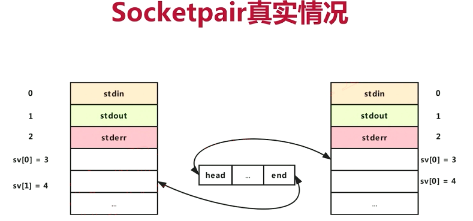

#### <p>原文出处：<a href='http://t.zoukankan.com/ssyfj-p-14851442.html' target='blank'>Mediasoup源码分析之Mediasoup启动过程</a></p>

## 补充：JS部分和C++代码见

### [WebRTC进阶流媒体服务器开发（三）Mediasoup源码分析之应用层（代码组成、Server.js、Room.js）](https://www.cnblogs.com/ssyfj/p/14847097.html)

#### **mediasoup C++**：C++部分，用于处理流媒体传输，包括lib与worker两部分

#### --->lib：一些js文件组成，主要用于对mediasoup的管理工作

#### --->worker：C++核心代码


## 一：Mediasoup启动详解---JS部分

#### 见：[WebRTC进阶流媒体服务器开发（三）Mediasoup源码分析之应用层（代码组成、Server.js、Room.js](https://www.cnblogs.com/ssyfj/p/14847097.html)[）](https://www.cnblogs.com/ssyfj/p/14847097.html)

### （一）启动文件server.js

```js
run();

async function run()
{// Run a mediasoup Worker.
    await runMediasoupWorkers();　　//启动进程

}
```

```js
async function runMediasoupWorkers()
{
    const { numWorkers } = config.mediasoup;

    for (let i = 0; i < numWorkers; ++i)　　//创建进程，按照CPU核数
    {
        const worker = await mediasoup.createWorker(　　//创建进程
            {
                logLevel   : config.mediasoup.workerSettings.logLevel,
                logTags    : config.mediasoup.workerSettings.logTags,
                rtcMinPort : Number(config.mediasoup.workerSettings.rtcMinPort),
                rtcMaxPort : Number(config.mediasoup.workerSettings.rtcMaxPort)
            });

        worker.on('died', () =>
        {
            logger.error(
                'mediasoup Worker died, exiting  in 2 seconds... [pid:%d]', worker.pid);

            setTimeout(() => process.exit(1), 2000);
        });

        mediasoupWorkers.push(worker);　　//放入数组中
　　　　　　// Log worker resource usage every X seconds.
　　　　　　setInterval(async () =>
　　　　　　{
  　　　　　　　const usage = await worker.getResourceUsage();　　//定时去获取worker进程的信息----内部包含通过channel通信过程！！！

　　　　　　　logger.info('mediasoup Worker resource usage [pid:%d]: %o', worker.pid, usage);
　　　　　}, 120000);
    }
}
```

### （二）调用index.js中的createWorker方法创建进程

```js
async function createWorker({ logLevel = 'error', logTags, rtcMinPort = 10000, rtcMaxPort = 59999, dtlsCertificateFile, dtlsPrivateKeyFile, appData = {} } = {}) {
    logger.debug('createWorker()');
    if (appData && typeof appData !== 'object')
        throw new TypeError('if given, appData must be an object');
    const worker = new Worker_1.Worker({
        logLevel,
        logTags,
        rtcMinPort,
        rtcMaxPort,
        dtlsCertificateFile,
        dtlsPrivateKeyFile,
        appData
    });
    return new Promise((resolve, reject) => {
        worker.on('@success', () => {
            // Emit observer event.
            observer.safeEmit('newworker', worker);
            resolve(worker);
        });
        worker.on('@failure', reject);
    });
}
exports.createWorker = createWorker;
```

### （二）调用Worker.js中的Worker类创建进程

该文件存在于：


#### 类方法概括：

```js
class Worker extends EnhancedEventEmitter_1.EnhancedEventEmitter {
    constructor()——构造函数
    get pid()——获得Worker进程的ID
    get closed()——确认Worker是否关闭
    get appData()——返回custom的数据
    set appData()——当设置无效时抛出异常信息
    get observer()——开启观察者模式
    close()——关闭Worker
    async dump()——转存Worker
    async getResourceUsage()——获得worker进程资源使用信息
    async updateSettings()——更新设置
    async createRouter()——创建房间
}
```

#### 类主要方法分析：

```js
const workerBin = process.env.MEDIASOUP_WORKER_BIN　　//判断是否存在环境变量
    ? process.env.MEDIASOUP_WORKER_BIN
    : process.env.MEDIASOUP_BUILDTYPE === 'Debug'　　//是否为debug
        ? path.join(__dirname, '..', 'worker', 'out', 'Debug', 'mediasoup-worker')
        : path.join(__dirname, '..', 'worker', 'out', 'Release', 'mediasoup-worker');　　//查看该目录下的文件，是启动文件！！！
```


```js
class Worker extends EnhancedEventEmitter_1.EnhancedEventEmitter {
    constructor({ logLevel, logTags, rtcMinPort, rtcMaxPort, dtlsCertificateFile, dtlsPrivateKeyFile, appData }) {　　//调用构造函数
        super();
        // Closed flag.
        this._closed = false;
        // Routers set.
        this._routers = new Set();
        // Observer instance.
        this._observer = new EnhancedEventEmitter_1.EnhancedEventEmitter();
        logger.debug('constructor()');
        let spawnBin = workerBin;
        let spawnArgs = [];
        if (process.env.MEDIASOUP_USE_VALGRIND === 'true') {
            spawnBin = process.env.MEDIASOUP_VALGRIND_BIN || 'valgrind';
            if (process.env.MEDIASOUP_VALGRIND_OPTIONS) {
                spawnArgs = spawnArgs.concat(process.env.MEDIASOUP_VALGRIND_OPTIONS.split(/s+/));
            }
            spawnArgs.push(workerBin);
        }
        if (typeof logLevel === 'string' && logLevel)
            spawnArgs.push(`--logLevel=${logLevel}`);
        for (const logTag of (Array.isArray(logTags) ? logTags : [])) {
            if (typeof logTag === 'string' && logTag)
                spawnArgs.push(`--logTag=${logTag}`);
        }
        if (typeof rtcMinPort === 'number' && !Number.isNaN(rtcMinPort))
            spawnArgs.push(`--rtcMinPort=${rtcMinPort}`);
        if (typeof rtcMaxPort === 'number' && !Number.isNaN(rtcMaxPort))
            spawnArgs.push(`--rtcMaxPort=${rtcMaxPort}`);
        if (typeof dtlsCertificateFile === 'string' && dtlsCertificateFile)
            spawnArgs.push(`--dtlsCertificateFile=${dtlsCertificateFile}`);
        if (typeof dtlsPrivateKeyFile === 'string' && dtlsPrivateKeyFile)
            spawnArgs.push(`--dtlsPrivateKeyFile=${dtlsPrivateKeyFile}`);
        logger.debug('spawning worker process: %s %s', spawnBin, spawnArgs.join(' '));
        this._child = child_process_1.spawn(　　//底层由libuv提供，用于启动进程！！！！
        spawnBin, 　　//spawn将启动这个程序
        spawnArgs, 　　//上面配置的其他参数
        // options
        {　　　　　　　　//其他可选参数
            env: {　　　//定义的环境
                MEDIASOUP_VERSION: '3.7.11',　　//版本
                ...process.env
            },
            detached: false,　　//启动的进程，与node是否是分离开的---当关闭node之后，是否关闭其他子进程

　　　　　　  // fd 0 (stdin)   : Just ignore it. 
　　　　　　　// fd 1 (stdout)  : Pipe it for 3rd libraries that log their own stuff. 
　　　　　　　// fd 2 (stderr)  : Same as stdout. 
　　　　　　　// fd 3 (channel) : Producer Channel fd. 
　　　　　　  // fd 4 (channel) : Consumer Channel fd. 
　　　　　　　// fd 5 (channel) : Producer PayloadChannel fd. 
　　　　　　　// fd 6 (channel) : Consumer PayloadChannel fd.
            stdio: ['ignore', 'pipe', 'pipe', 'pipe', 'pipe', 'pipe', 'pipe'],　　//输入输出重定向，主要通过管道通信。用于C++与JS进行通信
            windowsHide: true
        });
        this._pid = this._child.pid;
　　　　　//下面两个Channel与C++进行通信！！！，可以查看后面C++代码，发现两个个数、类型一致！！！
        this._channel = new Channel_1.Channel({
            producerSocket: this._child.stdio[3],
            consumerSocket: this._child.stdio[4],
            pid: this._pid
        });
        this._payloadChannel = new PayloadChannel_1.PayloadChannel({
            // NOTE: TypeScript does not like more than 5 fds.
            // @ts-ignore
            producerSocket: this._child.stdio[5],
            // @ts-ignore
            consumerSocket: this._child.stdio[6]
        });
        this._appData = appData;
        let spawnDone = false;
        // Listen for 'running' notification.
        this._channel.once(String(this._pid), (event) => {
            if (!spawnDone && event === 'running') {
                spawnDone = true;
                logger.debug('worker process running [pid:%s]', this._pid);
                this.emit('@success');
            }
        });
        this._child.on('exit', (code, signal) => {
            this._child = undefined;
            this.close();
            if (!spawnDone) {
                spawnDone = true;
                if (code === 42) {
                    logger.error('worker process failed due to wrong settings [pid:%s]', this._pid);
                    this.emit('@failure', new TypeError('wrong settings'));
                }
                else {
                    logger.error('worker process failed unexpectedly [pid:%s, code:%s, signal:%s]', this._pid, code, signal);
                    this.emit('@failure', new Error(`[pid:${this._pid}, code:${code}, signal:${signal}]`));
                }
            }
            else {
                logger.error('worker process died unexpectedly [pid:%s, code:%s, signal:%s]', this._pid, code, signal);
                this.safeEmit('died', new Error(`[pid:${this._pid}, code:${code}, signal:${signal}]`));
            }
        });
        this._child.on('error', (error) => {
            this._child = undefined;
            this.close();
            if (!spawnDone) {
                spawnDone = true;
                logger.error('worker process failed [pid:%s]: %s', this._pid, error.message);
                this.emit('@failure', error);
            }
            else {
                logger.error('worker process error [pid:%s]: %s', this._pid, error.message);
                this.safeEmit('died', error);
            }
        });
        // Be ready for 3rd party worker libraries logging to stdout.
        this._child.stdout.on('data', (buffer) => {
            for (const line of buffer.toString('utf8').split('
')) {
                if (line)
                    workerLogger.debug(`(stdout) ${line}`);
            }
        });
        // In case of a worker bug, mediasoup will log to stderr.
        this._child.stderr.on('data', (buffer) => {
            for (const line of buffer.toString('utf8').split('
')) {
                if (line)
                    workerLogger.error(`(stderr) ${line}`);
            }
        });
    }
    close() {
        if (this._closed)
            return;
        logger.debug('close()');
        this._closed = true;
        // Kill the worker process.
        if (this._child) {
            // Remove event listeners but leave a fake 'error' hander to avoid
            // propagation.
            this._child.removeAllListeners('exit');
            this._child.removeAllListeners('error');
            this._child.on('error', () => { });
            this._child.kill('SIGTERM');
            this._child = undefined;
        }
        // Close the Channel instance.
        this._channel.close();
        // Close the PayloadChannel instance.
        this._payloadChannel.close();
        // Close every Router.
        for (const router of this._routers) {
            router.workerClosed();
        }
        this._routers.clear();
        // Emit observer event.
        this._observer.safeEmit('close');
    }
    async createRouter({ mediaCodecs, appData = {} } = {}) {
        logger.debug('createRouter()');
        if (appData && typeof appData !== 'object')
            throw new TypeError('if given, appData must be an object');
        // This may throw.
        const rtpCapabilities = ortc.generateRouterRtpCapabilities(mediaCodecs);
        const internal = { routerId: uuid_1.v4() };
        await this._channel.request('worker.createRouter', internal);
        const data = { rtpCapabilities };
        const router = new Router_1.Router({
            internal,
            data,
            channel: this._channel,
            payloadChannel: this._payloadChannel,
            appData
        });
        this._routers.add(router);
        router.on('@close', () => this._routers.delete(router));
        // Emit observer event.
        this._observer.safeEmit('newrouter', router);
        return router;
    }
}
exports.Worker = Worker;
```

至此，在JS部分实现了多进程的启动！！！

## 二：Mediasoup启动详解---C++部分

下面分析进程中实现的主要业务：

### （一）进入C++源文件目录


### （二）分析main方法

```cpp
static constexpr int ConsumerChannelFd{ 3 };
static constexpr int ProducerChannelFd{ 4 };
static constexpr int PayloadConsumerChannelFd{ 5 };
static constexpr int PayloadProducerChannelFd{ 6 };

int main(int argc, char* argv[])
{
    // Ensure we are called by our Node library.
    if (!std::getenv("MEDIASOUP_VERSION"))　　//先检测版本问题，如果为null，则表示不是由nodejs产生的，而是进入目录中使用命令行直接产生的（但是没有设置环境变量是无法启动的）
    {
        MS_ERROR_STD("you don't seem to be my real father!");

        std::_Exit(EXIT_FAILURE);
    }

    std::string version = std::getenv("MEDIASOUP_VERSION");　　//获取版本信息

    auto statusCode = run_worker(　　//开始运行进程
      argc,
      argv,
      version.c_str(),
      ConsumerChannelFd,
      ProducerChannelFd,
      PayloadConsumerChannelFd,
      PayloadProducerChannelFd);

    switch (statusCode)　　//判断返回码
    {
        case 0:
            std::_Exit(EXIT_SUCCESS);
        case 1:
            std::_Exit(EXIT_FAILURE);
        case 42:
            std::_Exit(42);
    }
}
```

### （三）分析run_worker方法，运行worker进程

```cpp
extern "C" int run_worker(
  int argc,
  char* argv[],
  const char* version,
  int consumerChannelFd,
  int producerChannelFd,
  int payloadConsumeChannelFd,
  int payloadProduceChannelFd)
{
    // Initialize libuv stuff (we need it for the Channel).
    DepLibUV::ClassInit();　　//使用libUV，进行全局初始化

    // Channel socket (it will be handled and deleted by the Worker).
    Channel::ChannelSocket* channel{ nullptr };　　//通道socket，与前面的

    // PayloadChannel socket (it will be handled and deleted by the Worker).
    PayloadChannel::PayloadChannelSocket* payloadChannel{ nullptr };　　

    try
    {
        channel = new Channel::ChannelSocket(consumerChannelFd, producerChannelFd);　　//创建数据通道，js与C++进行通信
    }
    catch (const MediaSoupError& error)
    {
        MS_ERROR_STD("error creating the Channel: %s", error.what());

        return 1;
    }

    try
    {
        payloadChannel =
          new PayloadChannel::PayloadChannelSocket(payloadConsumeChannelFd, payloadProduceChannelFd);　　//创建通道
    }
    catch (const MediaSoupError& error)
    {
        MS_ERROR_STD("error creating the RTC Channel: %s", error.what());

        return 1;
    }

    // Initialize the Logger.
    Logger::ClassInit(channel);　　//初始化日志

    try
    {
        Settings::SetConfiguration(argc, argv);
    }
    catch (const MediaSoupTypeError& error)
    {
        MS_ERROR_STD("settings error: %s", error.what());

        // 42 is a custom exit code to notify "settings error" to the Node library.
        return 42;
    }
    catch (const MediaSoupError& error)
    {
        MS_ERROR_STD("unexpected settings error: %s", error.what());

        return 1;
    }

    MS_DEBUG_TAG(info, "starting mediasoup-worker process [version:%s]", version);

#if defined(MS_LITTLE_ENDIAN)
    MS_DEBUG_TAG(info, "little-endian CPU detected");
#elif defined(MS_BIG_ENDIAN)
    MS_DEBUG_TAG(info, "big-endian CPU detected");
#else
    MS_WARN_TAG(info, "cannot determine whether little-endian or big-endian");
#endif

#if defined(INTPTR_MAX) && defined(INT32_MAX) && (INTPTR_MAX == INT32_MAX)
    MS_DEBUG_TAG(info, "32 bits architecture detected");
#elif defined(INTPTR_MAX) && defined(INT64_MAX) && (INTPTR_MAX == INT64_MAX)
    MS_DEBUG_TAG(info, "64 bits architecture detected");
#else
    MS_WARN_TAG(info, "cannot determine 32 or 64 bits architecture");
#endif

    Settings::PrintConfiguration();
    DepLibUV::PrintVersion();

    try
    {
        // Initialize static stuff.　　初始化静态事务
        DepOpenSSL::ClassInit();
        DepLibSRTP::ClassInit();
        DepUsrSCTP::ClassInit();
        DepLibWebRTC::ClassInit();
        Utils::Crypto::ClassInit();
        RTC::DtlsTransport::ClassInit();
        RTC::SrtpSession::ClassInit();
        Channel::ChannelNotifier::ClassInit(channel);
        PayloadChannel::PayloadChannelNotifier::ClassInit(payloadChannel);

#ifdef MS_EXECUTABLE
        {
            // Ignore some signals.
            IgnoreSignals();
        }
#endif

        // Run the Worker.
        Worker worker(channel, payloadChannel);　　//运行具体worker

        // Free static stuff.
        DepLibSRTP::ClassDestroy();
        Utils::Crypto::ClassDestroy();
        DepLibWebRTC::ClassDestroy();
        RTC::DtlsTransport::ClassDestroy();
        DepUsrSCTP::ClassDestroy();
        DepLibUV::ClassDestroy();

        // Wait a bit so pending messages to stdout/Channel arrive to the Node
        // process.
        uv_sleep(200);

        return 0;
    }
    catch (const MediaSoupError& error)
    {
        MS_ERROR_STD("failure exit: %s", error.what());

        return 1;
    }
}
```

## 三：进程间通信

### （一）常见通信方法


* 管道：匿名管道进程之间必须是父子关系，有名管道可以应用于非父子关系的进程之间通信（比如socket.XX）
* socket：远端和本地通信可以通过socket通信，那么必然进程之间可以通讯。
* 共享内存和信号：对应数据和事件
* ...

### （二）匿名管道（半双工）

#### 管道创建（含两个文件描述符，用于读、写）时机，在创建子进程之前创建管道：


#### 创建子进程：会拷贝文件描述符，3读，4写，两个进程同时写入、读取混乱！，所以需要关闭部分不想要的操作（锁


#### 关闭部分描述符，实现半双工，父子进程通信


### （三）socket（全双工）--注意箭头

#### 对于socket，由于是全双工，所以进程通信之间的缓冲区与进程之间通信使用双向箭头：


#### 同上面匿名管道所说，依旧混乱，所以我们依旧需要关闭部分描述符：



#### 父进程通过描述符4发送、接受数据，子进程通过描述符3发送、接收数据！父子皆可读写，mediasoup使用socket通信！！

## 四：mediasoup下的channel创建详细过程

### （一）接：一（二）worker类构造函数

```cpp
this._child = child_process_1.spawn(　　//js线程调用，底层由libuv提供，用于启动进程！！！！
spawnBin, 　　//spawn将启动这个程序
spawnArgs, 　　//上面配置的其他参数
// options
{　　　　　　　　//其他可选参数
    env: {　　　//定义的环境
        MEDIASOUP_VERSION: '3.7.11',　　//版本
        ...process.env
    },
    detached: false,　　//启动的进程，与node是否是分离开的---当关闭node之后，是否关闭其他子进程

    // fd 0 (stdin)   : Just ignore it. 
    // fd 1 (stdout)  : Pipe it for 3rd libraries that log their own stuff. 
    // fd 2 (stderr)  : Same as stdout. 
    // fd 3 (channel) : Producer Channel fd. 
    // fd 4 (channel) : Consumer Channel fd. 
    // fd 5 (channel) : Producer PayloadChannel fd. 
    // fd 6 (channel) : Consumer PayloadChannel fd.
    stdio: ['ignore', 'pipe', 'pipe', 'pipe', 'pipe', 'pipe', 'pipe'],　　//输入输出重定向，主要通过管道通信。用于C++与JS进行通信---根据这个创建文件描述符
    windowsHide: true
});
this._pid = this._child.pid;

//下面两个Channel与C++进行通信！！！，可以查看后面C++代码，发现两个个数、类型一致！！！
this._channel = new Channel_1.Channel({　　　　// 创建的管道交给channel处理
    producerSocket: this._child.stdio[3],　　//存放创建完成的文件描述符号 stdio[3] 用来发送数据给子进程，stdio[4] 用来接收数据。 最后管道处理都交给了Channel 类来处理了。
    consumerSocket: this._child.stdio[4],
    pid: this._pid　　//进程ID
});

this._payloadChannel = new PayloadChannel_1.PayloadChannel({
    // NOTE: TypeScript does not like more than 5 fds.
    // @ts-ignore
    producerSocket: this._child.stdio[5],
    // @ts-ignore
    consumerSocket: this._child.stdio[6]
});
```

### 补充：[child_process.spawn方法](http://nodejs.cn/api/child_process.html#child_process_child_process_spawn_command_args_options)


#### [其中`options.stdio` 选项](http://nodejs.cn/api/child_process.html#child_process_options_stdio)：用于配置在父进程和子进程之间建立的管道。

默认情况下，子进程的 stdin、stdout 和 stderr 会被重定向到 [ChildProcess](http://nodejs.cn/api/child_process.html#child_process_child_process) 对象上相应的 [subprocess.stdin](http://nodejs.cn/api/child_process.html#child_process_subprocess_stdin)、[subprocess.stdout](http://nodejs.cn/api/child_process.html#child_process_subprocess_stdout) 和 [subprocess.stderr](http://nodejs.cn/api/child_process.html#child_process_subprocess_stderr) 流。 这相当于将 `options.stdio` 设置为 `['pipe', 'pipe', 'pipe']`。

当在父进程和子进程之间建立 IPC 通道，并且子进程是 Node.js 进程时，则子进程启动时不会指向 IPC 通道（使用 `unref()`），直到子进程为['disconnect'](http://nodejs.cn/api/process.html#process_event_disconnect)事件或 ['message'](http://nodejs.cn/api/process.html#process_event_message)事件注册了事件句柄。 这使得子进程可以正常退出而不需要通过开放的 IPC 通道保持打开该进程。


#### worker类中的getResourceUsage方法，获取资源情况，会去调用channel与C++进程通信！！

```js
async getResourceUsage() {
    logger.debug('getResourceUsage()');
    **return this._channel.request('worker.getResourceUsage'****);　　//这里可以查看与C++的通信过程！！！**
}
```
`
### （二）分析channel.js构造函数---NodeJs和 C++ 管道通信的过程

#### 根据上述管道了解知道，producerSocket stdio[3] 用来发送数据给子进程，consumerSocket stdio[4] 用来接收数据。传入了Channel类构造函数作为参数！

#### 下面考虑两个方法，分别是构造函数和runMediasoupWorkers worker.getResourceUsage();对应的Channel类中request方法

```cpp
class Channel extends EnhancedEventEmitter_1.EnhancedEventEmitter {
    /**
     * @private
     */
    constructor({ producerSocket, consumerSocket, pid }) {　　//构造函数，设置事件监听
        super();
        // Closed flag.
        this._closed = false;
        // Next id for messages sent to the worker process.
        this._nextId = 0;
        // Map of pending sent requests.
        this._sents = new Map();
        logger.debug('constructor()');
        this._producerSocket = producerSocket;
        this._consumerSocket = consumerSocket;
        // Read Channel responses/notifications from the worker.　　//处理data事件：用于接受底层C++发来的信令数据
        this._consumerSocket.on('data', (buffer) => {　　//监听事件，回调函数里监听或者接受数据，真正的处理有效数据其实在 this._processMessage(JSON.parse(nsPayload)); 函数中。
            if (!this._recvBuffer) {
                this._recvBuffer = buffer;
            }
            else {
                this._recvBuffer = Buffer.concat([this._recvBuffer, buffer], this._recvBuffer.length + buffer.length);
            }
            if (this._recvBuffer.length > NS_PAYLOAD_MAX_LEN) {
                logger.error('receiving buffer is full, discarding all data into it');
                // Reset the buffer and exit.
                this._recvBuffer = undefined;
                return;
            }
            while (true) // eslint-disable-line no-constant-condition
             {
                let nsPayload;
                try {
                    nsPayload = netstring.nsPayload(this._recvBuffer);
                }
                catch (error) {
                    logger.error('invalid netstring data received from the worker process: %s', String(error));
                    // Reset the buffer and exit.
                    this._recvBuffer = undefined;
                    return;
                }
                // Incomplete netstring message.
                if (nsPayload === -1)
                    return;
                try {
                    // We can receive JSON messages (Channel messages) or log strings.
                    switch (nsPayload[0]) {
                        // 123 = '{' (a Channel JSON messsage).
                        case 123:　　//处理真正有效的数据！！！！！！！！
                            this._processMessage(JSON.parse(nsPayload.toString('utf8')));　　//字符串解析为JSON数据
                            break;
                        // 68 = 'D' (a debug log).
                        case 68:
                            logger.debug(`[pid:${pid}] ${nsPayload.toString('utf8', 1)}`);
                            break;
                        // 87 = 'W' (a warn log).
                        case 87:
                            logger.warn(`[pid:${pid}] ${nsPayload.toString('utf8', 1)}`);
                            break;
                        // 69 = 'E' (an error log).
                        case 69:
                            logger.error(`[pid:${pid} ${nsPayload.toString('utf8', 1)}`);
                            break;
                        // 88 = 'X' (a dump log).
                        case 88:
                            // eslint-disable-next-line no-console
                            console.log(nsPayload.toString('utf8', 1));
                            break;
                        default:
                            // eslint-disable-next-line no-console
                            console.warn(`worker[pid:${pid}] unexpected data: %s`, nsPayload.toString('utf8', 1));
                    }
                }
                catch (error) {
                    logger.error('received invalid message from the worker process: %s', String(error));
                }
                // Remove the read payload from the buffer.
                this._recvBuffer =
                    this._recvBuffer.slice(netstring.nsLength(this._recvBuffer));
                if (!this._recvBuffer.length) {
                    this._recvBuffer = undefined;
                    return;
                }
            }
        });
        this._consumerSocket.on('end', () => (logger.debug('Consumer Channel ended by the worker process')));
        this._consumerSocket.on('error', (error) => (logger.error('Consumer Channel error: %s', String(error))));
        this._producerSocket.on('end', () => (logger.debug('Producer Channel ended by the worker process')));
        this._producerSocket.on('error', (error) => (logger.error('Producer Channel error: %s', String(error))));
    }
    async request(method, internal, data) {　　//通过channel与C++进程进行通信！！！！
        this._nextId < 4294967295 ? ++this._nextId : (this._nextId = 1);
        const id = this._nextId;
        logger.debug('request() [method:%s, id:%s]', method, id);
        if (this._closed)
            throw new errors_1.InvalidStateError('Channel closed');
        const request = { id, method, internal, data };　　//JSON数据
        const ns = netstring.nsWrite(JSON.stringify(request));　　//将JSON数据转字符串传输！！！
        if (Buffer.byteLength(ns) > NS_MESSAGE_MAX_LEN)
            throw new Error('Channel request too big');
        // This may throw if closed or remote side ended.
        this._producerSocket.write(ns);　　将数据写入管道 这里真正的是进行管道写入
        return new Promise((pResolve, pReject) => {　　//异步
            const timeout = 1000 * (15 + (0.1 * this._sents.size));
            const sent = {
                id: id,
                method: method,
                resolve: (data2) => {
                    if (!this._sents.delete(id))
                        return;
                    clearTimeout(sent.timer);
                    pResolve(data2);
                },
                reject: (error) => {
                    if (!this._sents.delete(id))
                        return;
                    clearTimeout(sent.timer);
                    pReject(error);
                },
                timer: setTimeout(() => {
                    if (!this._sents.delete(id))
                        return;
                    pReject(new Error('Channel request timeout'));
                }, timeout),
                close: () => {
                    clearTimeout(sent.timer);
                    pReject(new errors_1.InvalidStateError('Channel closed'));
                }
            };
　　　　　　　//注意_sents是一个Map数据类型！！！
            this._sents.set(id, sent);　　//用异步方式去监听底层是否接受并处理信息，这里的确认结果和接收中的逻辑相匹配 会通过this._sents.set(id, sent); sent的里的resolve 或者 pReject 返回。发送之后会保存在一个Map对象里，等待后续消息确认回来根据对应的id进行处理。
        });
    }
    //从下面哪段代码中可以看出，其中处理信令又种方式一种msg带id 一种不带 其原因是一种是  消息确认 和 事件通知 区别。 
　　 //其中上层发送信令给底层会暂时保存起来消息确认需要携带id，上层才能通过id来确定是哪条信令完成。 
　　 //如果是不带id，那么属于事件通知，最终会调用 this.emit(msg.targetId, msg.event, msg.data);  发送出去。
    _processMessage(msg) {　　//是JSON数据
        if (msg.id) {
            const sent = this._sents.get(msg.id);　　//去处理_sents全局字典数据
            if (!sent) {
                logger.error('received response does not match any sent request [id:%s]', msg.id);
                return;
            }
            if (msg.accepted) {
                logger.debug('request succeeded [method:%s, id:%s]', sent.method, sent.id);
                sent.resolve(msg.data);　　//去调用异步方法，request请求成功后去调用
            }
            else if (msg.error) {
                logger.warn('request failed [method:%s, id:%s]: %s', sent.method, sent.id, msg.reason);
                switch (msg.error) {
                    case 'TypeError':
                        sent.reject(new TypeError(msg.reason));
                        break;
                    default:
                        sent.reject(new Error(msg.reason));
                }
            }
            else {
                logger.error('received response is not accepted nor rejected [method:%s, id:%s]', sent.method, sent.id);
            }
        }
        else if (msg.targetId && msg.event) {
            setImmediate(() => this.emit(msg.targetId, msg.event, msg.data));
        }
        else {
            logger.error('received message is not a response nor a notification');
        }
    }
}
exports.Channel = Channel;
```

### （三）C++端---接二（三）run_worker

#### JS首先组成JSON格式的命令最后将它转成字符串通过channel通道传给C++端，C++有个接收管道接收到数据之后，再转成JSON，最后再解析成Request（c++类）中的一些字段，根据Methodid去处理相对应的信令。处理完消息后再生成字符串的发送给上层去确认。 通知事件是由底层主动发起的通知。

```cpp
extern "C" int run_worker(
  int argc,
  char* argv[],
  const char* version,
  int consumerChannelFd,
  int producerChannelFd,
  int payloadConsumeChannelFd,
  int payloadProduceChannelFd)
{
    // Initialize libuv stuff (we need it for the Channel).
    DepLibUV::ClassInit();

    // Channel socket (it will be handled and deleted by the Worker).
    Channel::ChannelSocket* channel{ nullptr };

    // PayloadChannel socket (it will be handled and deleted by the Worker).
    PayloadChannel::PayloadChannelSocket* payloadChannel{ nullptr };

    try
    {
        channel = new Channel::ChannelSocket(consumerChannelFd, producerChannelFd);
    }
    catch (const MediaSoupError& error)
    {
        MS_ERROR_STD("error creating the Channel: %s", error.what());

        return 1;
    }

    try
    {
        payloadChannel =
          new PayloadChannel::PayloadChannelSocket(payloadConsumeChannelFd, payloadProduceChannelFd);
    }
```

#### 1.channelSocket.cpp分析，消费者、生产者通道继承自UnixStreamSocket，通过write写入数据到socket，上传到JS层（最后面消息确认分析）！！通过read从JS层读取数据到C++层（这里分析）

```cpp
namespace Channel
{
    /* Static. */

    // netstring length for a 4194304 bytes payload.
    static constexpr size_t NsMessageMaxLen{ 4194313 };
    static constexpr size_t NsPayloadMaxLen{ 4194304 };

    /* Instance methods. */
    ChannelSocket::ChannelSocket(int consumerFd, int producerFd)
      : consumerSocket(consumerFd, NsMessageMaxLen, this), producerSocket(producerFd, NsMessageMaxLen)
    {
        MS_TRACE_STD();

        this->writeBuffer = static_cast<uint8_t*>(std::malloc(NsMessageMaxLen));
    }
    ConsumerSocket::ConsumerSocket(int fd, size_t bufferSize, Listener* listener)
      : ::UnixStreamSocket(fd, bufferSize, ::UnixStreamSocket::Role::CONSUMER), listener(listener)
    {
        MS_TRACE_STD();
    }
```

```cpp
UnixStreamSocket::UnixStreamSocket(int fd, size_t bufferSize, UnixStreamSocket::Role role)
  : bufferSize(bufferSize), role(role)
{
    MS_TRACE_STD();

    int err;

    this->uvHandle       = new uv_pipe_t;　　　　//调用libUV库中对象
    this->uvHandle->data = static_cast<void*>(this);

    err = uv_pipe_init(DepLibUV::GetLoop(), this->uvHandle, 0);　　//初始化

    if (err != 0)
    {
        delete this->uvHandle;
        this->uvHandle = nullptr;

        MS_THROW_ERROR_STD("uv_pipe_init() failed: %s", uv_strerror(err));
    }

    err = uv_pipe_open(this->uvHandle, fd);　　//打开pipe，关联fd

    if (err != 0)
    {
        uv_close(reinterpret_cast<uv_handle_t*>(this->uvHandle), static_cast<uv_close_cb>(onClose));

        MS_THROW_ERROR_STD("uv_pipe_open() failed: %s", uv_strerror(err));
    }

    if (this->role == UnixStreamSocket::Role::CONSUMER)
    {
        // Start reading.
        err = uv_read_start(　　//开始读数据
          reinterpret_cast<uv_stream_t*>(this->uvHandle),　　//pipe
          static_cast<uv_alloc_cb>(onAlloc),　　//分配空间
          static_cast<uv_read_cb>(onRead));　　//接收数据

        if (err != 0)
        {
            uv_close(reinterpret_cast<uv_handle_t*>(this->uvHandle), static_cast<uv_close_cb>(onClose));

            MS_THROW_ERROR_STD("uv_read_start() failed: %s", uv_strerror(err));
        }
    }

    // NOTE: Don't allocate the buffer here. Instead wait for the first uv_alloc_cb().
}

inline static void onRead(uv_stream_t* handle, ssize_t nread, const uv_buf_t* buf)　　//buf是存放空间，nread是要读取数据大小
{
    auto* socket = static_cast<UnixStreamSocket*>(handle->data);　　//类型转换，获取UnixStreamSocket

    if (socket)
        socket->OnUvRead(nread, buf);　　//真正从buf中读取数据
}

inline void UnixStreamSocket::OnUvRead(ssize_t nread, const uv_buf_t* /*buf*/)
{
    MS_TRACE_STD();

    if (nread == 0)
        return;

    // Data received.
    if (nread > 0)
    {
        // Update the buffer data length.
        this->bufferDataLen += static_cast<size_t>(nread);

        // Notify the subclass.
        UserOnUnixStreamRead();　　//通知子类
    }
    // Peer disconnected.
    else if (nread == UV_EOF || nread == UV_ECONNRESET)
    {
        this->isClosedByPeer = true;

        // Close local side of the pipe.
        Close();

        // Notify the subclass.
        UserOnUnixStreamSocketClosed();
    }
    // Some error.
    else
    {
        MS_ERROR_STD("read error, closing the pipe: %s", uv_strerror(nread));

        this->hasError = true;

        // Close the socket.
        Close();

        // Notify the subclass.
        UserOnUnixStreamSocketClosed();
    }
}
```

```cpp
void ConsumerSocket::UserOnUnixStreamRead()
{
    MS_TRACE_STD();

    // Be ready to parse more than a single message in a single chunk.
    while (true)
    {
        if (IsClosed())
            return;

        size_t readLen = this->bufferDataLen - this->msgStart;
        char* msgStart = nullptr;
        size_t msgLen;
        int nsRet = netstring_read(　　//读取数据
          reinterpret_cast<char*>(this->buffer + this->msgStart), readLen, &msgStart, &msgLen);

        if (nsRet != 0)　　//出错，判断原因
        {
            switch (nsRet)
            {
            
            }

            // Error, so reset and exit the parsing loop.
            this->msgStart      = 0;
            this->bufferDataLen = 0;

            return;
        }

        // If here it means that msgStart points to the beginning of a message
        // with msgLen bytes length, so recalculate readLen.
        readLen =　　
          reinterpret_cast<const uint8_t*>(msgStart) - (this->buffer + this->msgStart) + msgLen + 1;　　//真正的数据读取

        this->listener->OnConsumerSocketMessage(this, msgStart, msgLen);　　//机械数据为JSON数据

        // If there is no more space available in the buffer and that is because
        // the latest parsed message filled it, then empty the full buffer.
        if ((this->msgStart + readLen) == this->bufferSize)
        {
            this->msgStart      = 0;
            this->bufferDataLen = 0;
        }
        // If there is still space in the buffer, set the beginning of the next
        // parsing to the next position after the parsed message.
        else
        {
            this->msgStart += readLen;
        }

        // If there is more data in the buffer after the parsed message
        // then parse again. Otherwise break here and wait for more data.
        if (this->bufferDataLen > this->msgStart)
        {
            continue;
        }

        break;
    }
}
```

#### 解析Json为字符串

```cpp
void ChannelSocket::OnConsumerSocketMessage(ConsumerSocket* /*consumerSocket*/, char* msg, size_t msgLen)
{
    MS_TRACE_STD();

    try
    {
        json jsonMessage = json::parse(msg, msg + msgLen);　　//解析为Json数据
        auto* request    = new Channel::ChannelRequest(this, jsonMessage);　　　　//将JSon数据转换为5元组，存放在类成员变量中

        // Notify the listener.
        try
        {
            this->listener->OnChannelRequest(this, request);　　//listener是worker，将上面获取的5元组，传入其OnChannelRequest方法中去！！！！
        }
        catch (const MediaSoupTypeError& error)
        {
            request->TypeError(error.what());
        }
        catch (const MediaSoupError& error)
        {
            request->Error(error.what());
        }

        // Delete the Request.
        delete request;
    }
    catch (const json::parse_error& error)
    {
        MS_ERROR_STD("JSON parsing error: %s", error.what());
    }
    catch (const MediaSoupError& error)
    {
        MS_ERROR_STD("discarding wrong Channel request");
    }
}
```

#### 2.channelRequest.cpp

```cpp
ChannelRequest::ChannelRequest(Channel::ChannelSocket* channel, json& jsonRequest)　　//元组解析
      : channel(channel)
{
    MS_TRACE();

    auto jsonIdIt = jsonRequest.find("id");　　//Id胡获取

    if (jsonIdIt == jsonRequest.end() || !Utils::Json::IsPositiveInteger(*jsonIdIt))
        MS_THROW_ERROR("missing id");

    this->id = jsonIdIt->get<uint32_t>();

    auto jsonMethodIt = jsonRequest.find("method");　　//方法获取

    if (jsonMethodIt == jsonRequest.end() || !jsonMethodIt->is_string())
        MS_THROW_ERROR("missing method");

    this->method = jsonMethodIt->get<std::string>();

    auto methodIdIt = ChannelRequest::string2MethodId.find(this->method);

    if (methodIdIt == ChannelRequest::string2MethodId.end())
    {
        Error("unknown method");

        MS_THROW_ERROR("unknown method '%s'", this->method.c_str());
    }

    this->methodId = methodIdIt->second;

    auto jsonInternalIt = jsonRequest.find("internal");　　//internal获取

    if (jsonInternalIt != jsonRequest.end() && jsonInternalIt->is_object())
        this->internal = *jsonInternalIt;
    else
        this->internal = json::object();

    auto jsonDataIt = jsonRequest.find("data");　　//信令数据

    if (jsonDataIt != jsonRequest.end() && jsonDataIt->is_object())
        this->data = *jsonDataIt;
    else
        this->data = json::object();
} 
```

#### 3.worker.cpp中**OnChannelRequest**方法

```cpp
inline void Worker::OnChannelRequest(Channel::ChannelSocket* /*channel*/, Channel::ChannelRequest* request)
{
    MS_TRACE();

    MS_DEBUG_DEV(
      "Channel request received [method:%s, id:%" PRIu32 "]", request->method.c_str(), request->id);

    switch (request->methodId)　　//根据methodId进行相关处理！！！
    {
        case Channel::ChannelRequest::MethodId::WORKER_CLOSE:
        {
            if (this->closed)
                return;
            MS_DEBUG_DEV("Worker close request, stopping");
            Close();
            break;
        }

        case Channel::ChannelRequest::MethodId::WORKER_DUMP:
        {
            json data = json::object();
            FillJson(data);
            request->Accept(data);
            break;
        }

        case Channel::ChannelRequest::MethodId::WORKER_GET_RESOURCE_USAGE:
        {
            json data = json::object();
            FillJsonResourceUsage(data);
            request->Accept(data);
            break;
        }

        case Channel::ChannelRequest::MethodId::WORKER_UPDATE_SETTINGS:
        {
            Settings::HandleRequest(request);
            break;
        }

        case Channel::ChannelRequest::MethodId::WORKER_CREATE_ROUTER:
        {
            std::string routerId;
            // This may throw.
            SetNewRouterIdFromInternal(request->internal, routerId);
            auto* router = new RTC::Router(routerId);
            this->mapRouters[routerId] = router;
            MS_DEBUG_DEV("Router created [routerId:%s]", routerId.c_str());
            request->Accept();
            break;
        }

        case Channel::ChannelRequest::MethodId::ROUTER_CLOSE:
        {
            // This may throw.
            RTC::Router* router = GetRouterFromInternal(request->internal);
            // Remove it from the map and delete it.
            this->mapRouters.erase(router->id);
            delete router;
            MS_DEBUG_DEV("Router closed [id:%s]", router->id.c_str());
            request->Accept();

            break;
        }

        // Any other request must be delivered to the corresponding Router.
        default:
        {
            // This may throw.
            RTC::Router* router = GetRouterFromInternal(request->internal);
            router->HandleRequest(request);
            break;
        }
    }
}
```

#### 以上方法解析流程，实现了worker进程从启动，到处理信令消息的过程！！

## 五：MediaSoup 消息确认与事件通知

#### 消息的确认是指上层给mediasoup底层发送消息时，底层处理完要发送消息确认给上层处理结果。

#### 事件通知是底层的一些操作导致状态变化要通知到到上层进行操作同步。简单初步的看下C++是如何执行消息确认与事件通知的。

### （一）返回信令确认消息给上层

#### 见worker.cpp中OnChannelRequest方法，处理请求之后，使用Request->Accept(data);返回确认消息

```cpp
inline void Worker::OnChannelRequest(Channel::ChannelSocket* /*channel*/, Channel::ChannelRequest* request)
{
    MS_TRACE();

    MS_DEBUG_DEV(
      "Channel request received [method:%s, id:%" PRIu32 "]", request->method.c_str(), request->id);

    switch (request->methodId)　　//根据methodId进行相关处理！！！
    {
        case Channel::ChannelRequest::MethodId::WORKER_CLOSE:
        {
            if (this->closed)
                return;
            MS_DEBUG_DEV("Worker close request, stopping");
            Close();
            break;
        }

        case Channel::ChannelRequest::MethodId::WORKER_DUMP:
        {
            json data = json::object();
            FillJson(data);
            request->Accept(data);
            break;
        }

        case Channel::ChannelRequest::MethodId::WORKER_GET_RESOURCE_USAGE:
        {
            json data = json::object();
            FillJsonResourceUsage(data);
            request->Accept(data);
            break;
        }

        case Channel::ChannelRequest::MethodId::WORKER_UPDATE_SETTINGS:
        {
            Settings::HandleRequest(request);
            break;
        }

        case Channel::ChannelRequest::MethodId::WORKER_CREATE_ROUTER:
        {
            std::string routerId;
            // This may throw.
            SetNewRouterIdFromInternal(request->internal, routerId);
            auto* router = new RTC::Router(routerId);
            this->mapRouters[routerId] = router;
            MS_DEBUG_DEV("Router created [routerId:%s]", routerId.c_str());
            request->Accept();
            break;
        }

        case Channel::ChannelRequest::MethodId::ROUTER_CLOSE:
        {
            // This may throw.
            RTC::Router* router = GetRouterFromInternal(request->internal);
            // Remove it from the map and delete it.
            this->mapRouters.erase(router->id);
            delete router;
            MS_DEBUG_DEV("Router closed [id:%s]", router->id.c_str());
            request->Accept();
            break;
        }

        // Any other request must be delivered to the corresponding Router.
        default:
        {
            // This may throw.
            RTC::Router* router = GetRouterFromInternal(request->internal);
            router->HandleRequest(request);
            break;
        }
    }
}
```

#### 2.查看ChannelRequest.cpp中的Accept方法

```cpp
void ChannelRequest::Accept()
{
    MS_TRACE();

    MS_ASSERT(!this->replied, "request already replied");

    this->replied = true;

    json jsonResponse = json::object();

    jsonResponse["id"]       = this->id;
    jsonResponse["accepted"] = true;

    this->channel->Send(jsonResponse);
}

void ChannelRequest::Accept(json& data)
{
    MS_TRACE();

    MS_ASSERT(!this->replied, "request already replied");

    this->replied = true;

    json jsonResponse = json::object();　　

    jsonResponse["id"]       = this->id;　　//request id
    jsonResponse["accepted"] = true;　　　　//状态

    if (data.is_structured())
        jsonResponse["data"] = data;

    this->channel->Send(jsonResponse);　　//发送确认消息给上层
}
```

#### 3.查看ChannelSocket.cpp中send方法，向管道中写入数据

```cpp
void ChannelSocket::Send(json& jsonMessage)
{
    MS_TRACE_STD();

    if (this->producerSocket.IsClosed())
        return;

    std::string message = jsonMessage.dump();　　//json数据转string

    if (message.length() > NsPayloadMaxLen)
    {
        MS_ERROR_STD("mesage too big");

        return;
    }

    SendImpl(message.c_str(), message.length());
}

inline void ChannelSocket::SendImpl(const void* nsPayload, size_t nsPayloadLen)
{
    MS_TRACE_STD();

    size_t nsNumLen;

    if (nsPayloadLen == 0)
    {
        nsNumLen             = 1;
        this->writeBuffer[0] = '0';
        this->writeBuffer[1] = ':';
        this->writeBuffer[2] = ',';
    }
    else　　//对数据进行判断，将数据写入writeBuffer中去，一会写入管道中去！！（实际是socket）
    {
        nsNumLen = static_cast<size_t>(std::ceil(std::log10(static_cast<double>(nsPayloadLen) + 1)));
        std::sprintf(reinterpret_cast<char*>(this->writeBuffer), "%zu:", nsPayloadLen);
        std::memcpy(this->writeBuffer + nsNumLen + 1, nsPayload, nsPayloadLen);
        this->writeBuffer[nsNumLen + nsPayloadLen + 1] = ',';
    }

    size_t nsLen = nsNumLen + nsPayloadLen + 2;

    this->producerSocket.Write(this->writeBuffer, nsLen);　　//向管道中写入数据，从而JS层可以收到数据
}
```

#### 4.由前面可以知道，是从消费者socket读取数据，返回确认消息通过生产者socket写入即可上传给JS层！！！

```cpp
ProducerSocket::ProducerSocket(int fd, size_t bufferSize)
      : ::UnixStreamSocket(fd, bufferSize, ::UnixStreamSocket::Role::PRODUCER)　　//生产者socket父类为UnixStreamSocket
{
    MS_TRACE_STD();
}
```

#### 5.查看UnixStreamSocket.cpp文件，写入write方法，向socket写入数据！！！重点

```cpp
void UnixStreamSocket::Write(const uint8_t* data, size_t len)
{
    MS_TRACE_STD();

    if (this->closed)
        return;

    if (len == 0)
        return;

    // First try uv_try_write(). In case it can not directly send all the given data
    // then build a uv_req_t and use uv_write().

    uv_buf_t buffer = uv_buf_init(reinterpret_cast<char*>(const_cast<uint8_t*>(data)), len);　　//数据写入buffer中去！！！
    int written     = uv_try_write(reinterpret_cast<uv_stream_t*>(this->uvHandle), &buffer, 1);　　//初始化this->uvHandle

    // All the data was written. Done.
    if (written == static_cast<int>(len))
    {
        return;
    }
    // Cannot write any data at first time. Use uv_write().
    else if (written == UV_EAGAIN || written == UV_ENOSYS)
    {
        // Set written to 0 so pendingLen can be properly calculated.
        written = 0;
    }
    // Any other error.
    else if (written < 0)
    {
        MS_ERROR_STD("uv_try_write() failed, trying uv_write(): %s", uv_strerror(written));

        // Set written to 0 so pendingLen can be properly calculated.
        written = 0;
    }

    size_t pendingLen = len - written;
    auto* writeData   = new UvWriteData(pendingLen);

    writeData->req.data = static_cast<void*>(writeData);
    std::memcpy(writeData->store, data + written, pendingLen);

    buffer = uv_buf_init(reinterpret_cast<char*>(writeData->store), pendingLen);

    int err = uv_write(　　//libUV中写入数据
      &writeData->req,
      reinterpret_cast<uv_stream_t*>(this->uvHandle),　　//this->ubHandle被初始化了，写入到这个数据pipe中去！！！！向JS层写入数据
      &buffer,　　//数据自爱buffer中！！！
      1,
      static_cast<uv_write_cb>(onWrite));　　//回调，处理写入结果！！！

    if (err != 0)
    {
        MS_ERROR_STD("uv_write() failed: %s", uv_strerror(err));

        // Delete the UvSendData struct.
        delete writeData;
    }
}
```

####  下面处理写入后的结果！

```cpp
inline static void onWrite(uv_write_t* req, int status)
{
    auto* writeData = static_cast<UnixStreamSocket::UvWriteData*>(req->data);
    auto* handle    = req->handle;
    auto* socket    = static_cast<UnixStreamSocket*>(handle->data);

    // Just notify the UnixStreamSocket when error.
    if (socket && status != 0)
        socket->OnUvWriteError(status);　　

    // Delete the UvWriteData struct.
    delete writeData;
}
```

### （二）给上层发送通知：使用Notifier类

#### 1.Notifier类在run_worker函数里初始化

```cpp
extern "C" int run_worker(
  int argc,
  char* argv[],
  const char* version,
  int consumerChannelFd,
  int producerChannelFd,
  int payloadConsumeChannelFd,
  int payloadProduceChannelFd)
{
// Initialize static stuff.
        DepOpenSSL::ClassInit();
        DepLibSRTP::ClassInit();
        DepUsrSCTP::ClassInit();
        DepLibWebRTC::ClassInit();
        Utils::Crypto::ClassInit();
        RTC::DtlsTransport::ClassInit();
        RTC::SrtpSession::ClassInit();
        Channel::ChannelNotifier::ClassInit(channel);
        PayloadChannel::PayloadChannelNotifier::ClassInit(payloadChannel);

}
```

#### 2.在ChannelNotifier.cpp中查看通知事件：

```cpp
namespace Channel
{
    /* Class variables. */

    thread_local Channel::ChannelSocket* ChannelNotifier::channel{ nullptr };

    /* Static methods. */

    void ChannelNotifier::ClassInit(Channel::ChannelSocket* channel)
    {
        MS_TRACE();

        ChannelNotifier::channel = channel;
    }

    void ChannelNotifier::Emit(const std::string& targetId, const char* event)　　//和下面区别就在于是否有数据，与Accept响应相似
    {
        MS_TRACE();

        MS_ASSERT(ChannelNotifier::channel, "channel unset");

        json jsonNotification = json::object();

        jsonNotification["targetId"] = targetId;
        jsonNotification["event"]    = event;

        ChannelNotifier::channel->Send(jsonNotification);
    }

    void ChannelNotifier::Emit(const std::string& targetId, const char* event, json& data)
    {
        MS_TRACE();

        MS_ASSERT(ChannelNotifier::channel, "channel unset");

        json jsonNotification = json::object();

        jsonNotification["targetId"] = targetId;
        jsonNotification["event"]    = event;
        jsonNotification["data"]     = data;

        ChannelNotifier::channel->Send(jsonNotification);　　//向pipe中写入数据，将JSON变为字符串之后写入！！！
    }
} // namespace Channel
```

#### 3.举例，在哪使用Emit方法，向JS层发送数据？WebRtcTransport.cpp文件,不止下面这一个会向上通知，这里只举这一种！

```cpp
inline void WebRtcTransport::OnIceServerCompleted(const RTC::IceServer* /*iceServer*/)　　//状态发生变化,回調使用
{
    MS_TRACE();

    MS_DEBUG_TAG(ice, "ICE completed");

    // Notify the Node WebRtcTransport.
    json data = json::object();

    data["iceState"] = "completed";　　//设置Json数据

    Channel::ChannelNotifier::Emit(this->id, "icestatechange", data);　　//状态发送变化，上传通知到JS层

    // If ready, run the DTLS handler.
    MayRunDtlsTransport();

    // If DTLS was already connected, notify the parent class.
    if (this->dtlsTransport->GetState() == RTC::DtlsTransport::DtlsState::CONNECTED)
    {
        RTC::Transport::Connected();
    }
}
```

无论是事件通知上层或者返回消息，两者都是通过管道传给上层，最终都调用channel->send()！！！回到了（一）3.中去了

