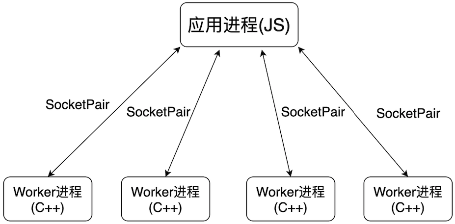
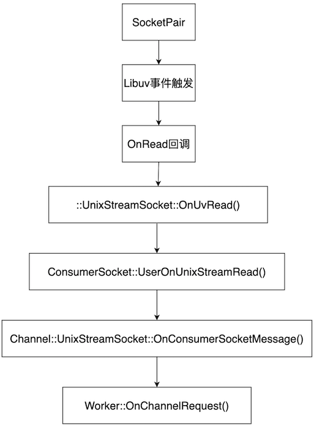
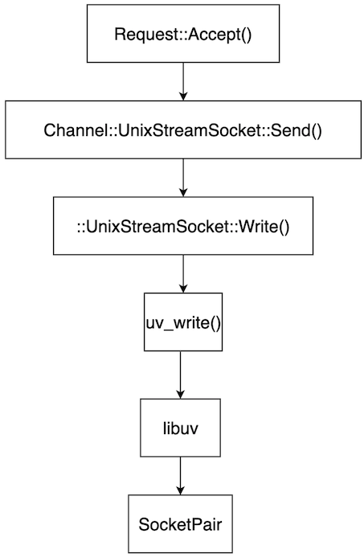
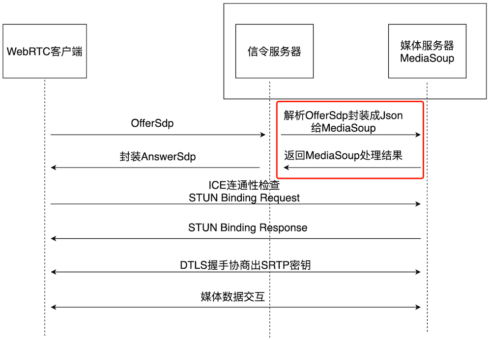

 
<!--BEGIN_DATA
{
    "create_date": "2022-03-02 20:00", 
    "modify_date": "2022-03-02 20:00", 
    "is_top": "0", 
    "summary": "", 
    "tags": "", 
    "file_name": ""
}
END_DATA-->

#### <p>原文出处：<a href='https://blog.csdn.net/weixin_45267035/article/details/120738610' target='blank'>Mediasoup整体流程</a></p>

目前基于WebRTC的低延时直播很火热，相比较WebRTC对客户端做的标准，服务端的信令媒体并没有严格规范，现在主流的媒体服务器有Licode、Janus、MediaSoup等。Mediasoup作为一个高性能的SFU媒体服务器，代码结构清晰，上手容易，可定制化较强。我接触MediaSoup有挺长一段时间，基于MediaSoup v3.0做过一定的开发优化，计划写个专题，大家可以参考一下。

### 1. 基本概念

网上关于Mediasoup基础概念的介绍一大堆，这里不再展开写了，给个链接。  
https://blog.csdn.net/Dreamandpassion/article/details/107799915

### 2. MediaSoup框架介绍

**原生的MediaSoup分为JS和C++两部分，JS部分属于MediaSoup业务部分，可以根据项目需要进行修改，我对JS理解有限，项目中剔除掉JS部分代码，只保留C++核心代码，根据项目需求用C++重写了JS的部分功能。所以这个专题主要介绍MediaSoup C++部分相关处理。**

  

MediaSoup使用多进程模型，有一个主应用进程(JS)，主要做媒体流的状态管理、Worker进程的管理(包括Worker进程的创建、通信、销毁等)等，Worker进程创建的个数依赖于服务器的CPU核数，有多个少CPU核，就启动多少个Worker进程；Worker进程做流的处理，包括RTP包的收发、带宽评估、丢包重传等，这部分是MediaSoup的核心功能。

这里主要分析下Worker进程收发数据的过程，包括两类：一类是收发应用进程的数据；另一类是收发网络数据。

#### 2.1 收发应用进程数据

##### 2.1.1 初始化过程

应用进程与Worker进程通过SocketPair管道进行通信。每个Worker进程都是基于libuv来做的，是单线程的事件触发机制。当有数据到达时，就会触发libuv的事件，调用预先注册好的回调函数进行处理。初始化流程如下：

1.在Worker进程的main函数中(mediasoup/worker/src/main.cpp)，创建Channel::UnixStreamSocket
对象，它是libuv对管道的封装。

```cpp
int main(int argc, char* argv[])
{
	// Ensure we are called by our Node library.
	if (!std::getenv("MEDIASOUP_VERSION"))
	{
		MS_ERROR_STD("you don't seem to be my real father!");
		std::_Exit(EXIT_FAILURE);
	}
	std::string version = std::getenv("MEDIASOUP_VERSION");
	// Initialize libuv stuff (we need it for the Channel).
	DepLibUV::ClassInit();
	// Channel socket (it will be handled and deleted by the Worker).
	Channel::UnixStreamSocket* channel{ nullptr };
	// PayloadChannel socket (it will be handled and deleted by the Worker).
	PayloadChannel::UnixStreamSocket* payloadChannel{ nullptr };
	try
	{
		channel = new Channel::UnixStreamSocket(ConsumerChannelFd, ProducerChannelFd);
	}
	catch (const MediaSoupError& error)
	{
		MS_ERROR_STD("error creating the Channel: %s", error.what());
		std::_Exit(EXIT_FAILURE);
	}
	// ...
}
```

2.初始化consumerSocket对象和producerSocket对象分别用于与应用进程的数据收发，注意它们的基类是::UnixStreamSocket，它位于全局空间内，与上述Channel::UnixStreamSocket对象是两个对象。

```cpp
UnixStreamSocket::UnixStreamSocket(int consumerFd, int producerFd)
		: consumerSocket(consumerFd, NsMessageMaxLen, this), producerSocket(producerFd, NsMessageMaxLen)
{
	MS_TRACE_STD();
}

// 只列出consumerSocket初始化，producerSocket初始化类似
ConsumerSocket::ConsumerSocket(int fd, size_t bufferSize, Listener* listener)
		: ::UnixStreamSocket(fd, bufferSize, ::UnixStreamSocket::Role::CONSUMER), listener(listener)
{
	MS_TRACE_STD();
}

UnixStreamSocket::UnixStreamSocket(uv_pipe_t *uvHandle, size_t bufferSize, UnixStreamSocket::Role role)
	: bufferSize(bufferSize), role(role)
{
	MS_TRACE_STD();
	this->uvHandle = uvHandle;
	int err;
//	this->uvHandle       = new uv_pipe_t;
	uvHandle->data = static_cast<void*>(this);
	if (this->role == UnixStreamSocket::Role::CONSUMER)
	{
		// Start reading.
		err = uv_read_start(
			reinterpret_cast<uv_stream_t*>(uvHandle),
			static_cast<uv_alloc_cb>(onAlloc),
			static_cast<uv_read_cb>(onRead));
		if (err != 0)
		{
			uv_close(reinterpret_cast<uv_handle_t*>(uvHandle), static_cast<uv_close_cb>(onClose));
			MS_THROW_ERROR_STD("uv_read_start() failed: %s", uv_strerror(err));
		}
	}
}
```

从上面代码可以看出，当类型为ConsumerSocket时，会注册onRead回调，用于接收应用进程发来的数据。

##### 2.1.2 接收数据流程

当接收到应用层进程发来的数据时，libuv会回调到onRead函数中：

```cpp
inline static void onRead(uv_stream_t* handle, ssize_t nread, const uv_buf_t* buf)
{
	auto* socket = static_cast<UnixStreamSocket*>(handle->data);
	if (socket)
		socket->OnUvRead(nread, buf);
}

// 注意是全局的UnixStreamSocket
inline void UnixStreamSocket::OnUvRead(ssize_t nread, const uv_buf_t* /*buf*/)
{
	MS_TRACE_STD();
	if (nread == 0)
		return;
	// Data received.
	if (nread > 0)
	{
		// Update the buffer data length.
		this->bufferDataLen += static_cast<size_t>(nread);
		// Notify the subclass.
		UserOnUnixStreamRead();
	}
	// ...
}

void ConsumerSocket::UserOnUnixStreamRead()
{
	MS_TRACE_STD();
	// Be ready to parse more than a single message in a single chunk.
	while (true)
	{
		if (IsClosed())
			return;
		size_t readLen = this->bufferDataLen - this->msgStart;
		char* msgStart = nullptr;
		size_t msgLen;
		int nsRet = netstring_read(
			reinterpret_cast<char*>(this->buffer + this->msgStart), readLen, &msgStart, &msgLen);
		// ...
		readLen =
			reinterpret_cast<const uint8_t*>(msgStart) - (this->buffer + this->msgStart) + msgLen + 1;
		this->listener->OnConsumerSocketMessage(this, msgStart, msgLen);
		if ((this->msgStart + readLen) == this->bufferSize)
		{
			this->msgStart      = 0;
			this->bufferDataLen = 0;
		}
		else
		{
			this->msgStart += readLen;
		}
		if (this->bufferDataLen > this->msgStart)
		{
			continue;
		}
		break;
	}
}

// Channel::UnixStreamSocket，处理收到的数据
void UnixStreamSocket::OnConsumerSocketMessage(
		ConsumerSocket* /*consumerSocket*/, char* msg, size_t msgLen)
{
	MS_TRACE_STD();
	try
	{
		// 数据交互是以json格式进行的
		json jsonMessage = json::parse(msg, msg + msgLen);
		auto* request    = new Channel::Request(this, jsonMessage);
		// Notify the listener.
		try
		{
			this->listener->OnChannelRequest(this, request);
		}
		catch (const MediaSoupTypeError& error)
		{
			request->TypeError(error.what());
		}
		// ...
	}
}

// 回调到worker，根据不同的消息格式调用不同的处理逻辑
inline void Worker::OnChannelRequest(Channel::UnixStreamSocket* /*channel*/, Channel::Request* request)
{
	MS_TRACE();
	switch (request->methodId)
	{
		case Channel::Request::MethodId::WORKER_DUMP:
		{
			json data = json::object();
			FillJson(data);
			request->Accept(data);
			break;
		}
		case Channel::Request::MethodId::WORKER_GET_RESOURCE_USAGE:
		{
			json data = json::object();
			FillJsonResourceUsage(data);
			request->Accept(data);
			break;
		}
		case Channel::Request::MethodId::WORKER_UPDATE_SETTINGS:
		{
			Settings::HandleRequest(request);
			break;
		}
		case Channel::Request::MethodId::WORKER_CREATE_ROUTER:
		{
			std::string routerId;
			// This may throw.
			SetNewRouterIdFromInternal(request->internal, routerId);
			auto* router = new RTC::Router(routerId);
			this->mapRouters[routerId] = router;
			MS_DEBUG_DEV("Router created [routerId:%s]", routerId.c_str());
			request->Accept();
			break;
		}
		case Channel::Request::MethodId::ROUTER_CLOSE:
		{
			// This may throw.
			RTC::Router* router = GetRouterFromInternal(request->internal);
			// Remove it from the map and delete it.
			this->mapRouters.erase(router->id);
			delete router;
			MS_DEBUG_DEV("Router closed [id:%s]", router->id.c_str());
			request->Accept();
			break;
		}
		// Any other request must be delivered to the corresponding Router.
		default:
		{
			// This may throw.
			RTC::Router* router = GetRouterFromInternal(request->internal);
			router->HandleRequest(request);
			break;
		}
	}
}
```

上面流程其实就是从底层libuv接收到数据开始，一层一层的向上回调，一直回调到worker对象中，由worker对象进行处理。  



##### 2.1.3 发送数据流程

当收到应用层进程发来的数据并处理完成之后，需要回复一个消息，回复消息的流程如下(以上述Worker对象收到Channel::Request::MethodId::WORKER_DUMP消息为例)：

```cpp
inline void Worker::OnChannelRequest(Channel::UnixStreamSocket* /*channel*/, Channel::Request* request)
{
	MS_TRACE();
	switch (request->methodId)
	{
		case Channel::Request::MethodId::WORKER_DUMP:
		{
			json data = json::object();
			FillJson(data);
			request->Accept(data);
			break;
		}
		// ...
	}
}

void Request::Accept(json& data)
{
	MS_TRACE();
	MS_ASSERT(!this->replied, "request already replied");
	this->replied = true;
	json jsonResponse = json::object();
	jsonResponse["id"]       = this->id;
	jsonResponse["accepted"] = true;
	if (data.is_structured())
		jsonResponse["data"] = data;
	this->channel->Send(jsonResponse);
}

void UnixStreamSocket::Send(json& jsonMessage)
{
	MS_TRACE_STD();
	if (this->producerSocket.IsClosed())
		return;
	std::string message = jsonMessage.dump();
	if (message.length() > NsPayloadMaxLen)
	{
		MS_ERROR_STD("mesage too big");
		return;
	}
	SendImpl(message.c_str(), message.length());
}

inline void UnixStreamSocket::SendImpl(const void* nsPayload, size_t nsPayloadLen)
{
	MS_TRACE_STD();
	size_t nsNumLen;
	if (nsPayloadLen == 0)
	{
		nsNumLen       = 1;
		WriteBuffer[0] = '0';
		WriteBuffer[1] = ':';
		WriteBuffer[2] = ',';
	}
	else
	{
		nsNumLen = static_cast<size_t>(std::ceil(std::log10(static_cast<double>(nsPayloadLen) + 1)));
		std::sprintf(reinterpret_cast<char*>(WriteBuffer), "%zu:", nsPayloadLen);
		std::memcpy(WriteBuffer + nsNumLen + 1, nsPayload, nsPayloadLen);
		WriteBuffer[nsNumLen + nsPayloadLen + 1] = ',';
	}
	size_t nsLen = nsNumLen + nsPayloadLen + 2;
	this->producerSocket.Write(WriteBuffer, nsLen);
}

void UnixStreamSocket::Write(const uint8_t* data, size_t len)
{
	MS_TRACE_STD();
	if (this->closed)
		return;
	if (len == 0)
		return;
	// First try uv_try_write(). In case it can not directly send all the given data
	// then build a uv_req_t and use uv_write().
	uv_buf_t buffer = uv_buf_init(reinterpret_cast<char*>(const_cast<uint8_t*>(data)), len);
	int written     = uv_try_write(reinterpret_cast<uv_stream_t*>(this->uvHandle), &buffer, 1);
	// All the data was written. Done.
	if (written == static_cast<int>(len))
	{
		return;
	}
	// Cannot write any data at first time. Use uv_write().
	else if (written == UV_EAGAIN || written == UV_ENOSYS)
	{
		// Set written to 0 so pendingLen can be properly calculated.
		written = 0;
	}
	// Any other error.
	else if (written < 0)
	{
		MS_ERROR_STD("uv_try_write() failed, trying uv_write(): %s", uv_strerror(written));
		// Set written to 0 so pendingLen can be properly calculated.
		written = 0;
	}
	size_t pendingLen = len - written;
	auto* writeData   = new UvWriteData(pendingLen);
	writeData->req.data = static_cast<void*>(writeData);
	std::memcpy(writeData->store, data + written, pendingLen);
	buffer = uv_buf_init(reinterpret_cast<char*>(writeData->store), pendingLen);
	int err = uv_write(
		&writeData->req,
		reinterpret_cast<uv_stream_t*>(this->uvHandle),
		&buffer,
		1,
		static_cast<uv_write_cb>(onWrite));
	if (err != 0)
	{
		MS_ERROR_STD("uv_write() failed: %s", uv_strerror(err));
		// Delete the UvSendData struct.
		delete writeData;
	}
}
```



#### 2.2 收发网络数据

收发网络数据涉及到MediaSoup对音视频流数据的处理，这部分放到后面具体分析MediaSoup流程时再做梳理。

<hr>
 
#### <p>原文出处：<a href='https://blog.csdn.net/weixin_45267035/article/details/120822469' target='blank'>MediaSoup的SDP协商</a></p>

媒体服务器与WebRTC客户端进行交互时，也可以把它看成是WebRTC的一个“客户端”，因此它也要遵循WebRTC的交互规则。服务端作为被动接收者，接收客户端发送的OfferSdp，当信令服务器接收到OfferSdp时，会将其转换成MediaSoup需要的Json格式，然后通过管道传给媒体服务器，媒体服务器处理相应的Json格式，然后返回给信令服务器相应的处理结果，信令服务器将处理结果封装成AnswerSdp返回给客户端，从而完成SDP的协商。  

**注意：这里的信令服务器相当于是原生MediaSoup的JS部分代码，这部分代码可以根据业务需要进行重写，媒体服务器则是MediaSoup的C++部分代码。**  

  

由上面分析可知，MediaSoup的SDP协商包括解析OfferSdp、封装MediaSoup消息、封装AnswerSdp。这里分别说明。

### 1. OfferSdp

举一个例子，这里列出测试生成的OfferSdp：

```
v=0
o=- 2769202419187616652 2 IN IP4 127.0.0.1
s=-
t=0 0
a=group:BUNDLE audio video
a=extmap-allow-mixed
a=msid-semantic: WMS 6jWPL5zVxadwFUv3czcxk6OuMJhxwepXrnFt
m=audio 9 UDP/TLS/RTP/SAVPF 111 103 104 9 0 8 106 105 13 110 112 113 126
c=IN IP4 0.0.0.0
a=rtcp:9 IN IP4 0.0.0.0
a=ice-ufrag:V27U
a=ice-pwd:j8YGds5JpiHzbkd7Wwdxl5rq
a=ice-options:trickle
a=fingerprint:sha-256 97:23:44:6B:EC:52:D6:64:D6:02:42:69:EA:9C:99:F8:F3:F3:F4:1B:F3:74:D6:CF:4E:60:5D:89:97:9F:D6:3C
a=setup:actpass
a=mid:audio
a=extmap:1 urn:ietf:params:rtp-hdrext:ssrc-audio-level
a=extmap:2 http://www.webrtc.org/experiments/rtp-hdrext/abs-send-time
a=extmap:3 http://www.ietf.org/id/draft-holmer-rmcat-transport-wide-cc-extensions-01
a=sendrecv
a=rtcp-mux
a=rtpmap:111 opus/48000/2
a=rtcp-fb:111 transport-cc
a=fmtp:111 minptime=10;useinbandfec=1
a=rtpmap:103 ISAC/16000
a=rtpmap:104 ISAC/32000
a=rtpmap:9 G722/8000
a=rtpmap:0 PCMU/8000
a=rtpmap:8 PCMA/8000
a=rtpmap:106 CN/32000
a=rtpmap:105 CN/16000
a=rtpmap:13 CN/8000
a=rtpmap:110 telephone-event/48000
a=rtpmap:112 telephone-event/32000
a=rtpmap:113 telephone-event/16000
a=rtpmap:126 telephone-event/8000
a=ssrc:2096589939 cname:PK+nWUKVj/eH7KG7
a=ssrc:2096589939 msid:6jWPL5zVxadwFUv3czcxk6OuMJhxwepXrnFt ef3670e9-615c-4e0b-aa2f-a2b21d1b0b5d
a=ssrc:2096589939 mslabel:6jWPL5zVxadwFUv3czcxk6OuMJhxwepXrnFt
a=ssrc:2096589939 label:ef3670e9-615c-4e0b-aa2f-a2b21d1b0b5d
m=video 9 UDP/TLS/RTP/SAVPF 96 97 98 99 100 101 102 121 127 120 125 107 108 109 35 36 124 119 123 118 114 115 116
c=IN IP4 0.0.0.0
a=rtcp:9 IN IP4 0.0.0.0
a=ice-ufrag:V27U
a=ice-pwd:j8YGds5JpiHzbkd7Wwdxl5rq
a=ice-options:trickle
a=fingerprint:sha-256 97:23:44:6B:EC:52:D6:64:D6:02:42:69:EA:9C:99:F8:F3:F3:F4:1B:F3:74:D6:CF:4E:60:5D:89:97:9F:D6:3C
a=setup:actpass
a=mid:video
a=extmap:14 urn:ietf:params:rtp-hdrext:toffset
a=extmap:2 http://www.webrtc.org/experiments/rtp-hdrext/abs-send-time
a=extmap:13 urn:3gpp:video-orientation
a=extmap:3 http://www.ietf.org/id/draft-holmer-rmcat-transport-wide-cc-extensions-01
a=extmap:5 http://www.webrtc.org/experiments/rtp-hdrext/playout-delay
a=extmap:6 http://www.webrtc.org/experiments/rtp-hdrext/video-content-type
a=extmap:7 http://www.webrtc.org/experiments/rtp-hdrext/video-timing
a=extmap:8 http://www.webrtc.org/experiments/rtp-hdrext/color-space
a=sendrecv
a=rtcp-mux
a=rtcp-rsize
a=rtpmap:96 VP8/90000
a=rtcp-fb:96 goog-remb
a=rtcp-fb:96 transport-cc
a=rtcp-fb:96 ccm fir
a=rtcp-fb:96 nack
a=rtcp-fb:96 nack pli
a=rtpmap:97 rtx/90000
a=fmtp:97 apt=96
a=rtpmap:98 VP9/90000
a=rtcp-fb:98 goog-remb
a=rtcp-fb:98 transport-cc
a=rtcp-fb:98 ccm fir
a=rtcp-fb:98 nack
a=rtcp-fb:98 nack pli
a=fmtp:98 profile-id=0
a=rtpmap:99 rtx/90000
a=fmtp:99 apt=98
a=rtpmap:100 VP9/90000
a=rtcp-fb:100 goog-remb
a=rtcp-fb:100 transport-cc
a=rtcp-fb:100 ccm fir
a=rtcp-fb:100 nack
a=rtcp-fb:100 nack pli
a=fmtp:100 profile-id=2
a=rtpmap:101 rtx/90000
a=fmtp:101 apt=100
a=rtpmap:102 H264/90000
a=rtcp-fb:102 goog-remb
a=rtcp-fb:102 transport-cc
a=rtcp-fb:102 ccm fir
a=rtcp-fb:102 nack
a=rtcp-fb:102 nack pli
a=fmtp:102 level-asymmetry-allowed=1;packetization-mode=1;profile-level-id=42001f
a=rtpmap:121 rtx/90000
a=fmtp:121 apt=102
a=rtpmap:127 H264/90000
a=rtcp-fb:127 goog-remb
a=rtcp-fb:127 transport-cc
a=rtcp-fb:127 ccm fir
a=rtcp-fb:127 nack
a=rtcp-fb:127 nack pli
a=fmtp:127 level-asymmetry-allowed=1;packetization-mode=0;profile-level-id=42001f
a=rtpmap:120 rtx/90000
a=fmtp:120 apt=127
a=rtpmap:125 H264/90000
a=rtcp-fb:125 goog-remb
a=rtcp-fb:125 transport-cc
a=rtcp-fb:125 ccm fir
a=rtcp-fb:125 nack
a=rtcp-fb:125 nack pli
a=fmtp:125 level-asymmetry-allowed=1;packetization-mode=1;profile-level-id=42e01f
a=rtpmap:107 rtx/90000
a=fmtp:107 apt=125
a=rtpmap:108 H264/90000
a=rtcp-fb:108 goog-remb
a=rtcp-fb:108 transport-cc
a=rtcp-fb:108 ccm fir
a=rtcp-fb:108 nack
a=rtcp-fb:108 nack pli
a=fmtp:108 level-asymmetry-allowed=1;packetization-mode=0;profile-level-id=42e01f
a=rtpmap:109 rtx/90000
a=fmtp:109 apt=108
a=rtpmap:35 AV1X/90000
a=rtcp-fb:35 goog-remb
a=rtcp-fb:35 transport-cc
a=rtcp-fb:35 ccm fir
a=rtcp-fb:35 nack
a=rtcp-fb:35 nack pli
a=rtpmap:36 rtx/90000
a=fmtp:36 apt=35
a=rtpmap:124 H264/90000
a=rtcp-fb:124 goog-remb
a=rtcp-fb:124 transport-cc
a=rtcp-fb:124 ccm fir
a=rtcp-fb:124 nack
a=rtcp-fb:124 nack pli
a=fmtp:124 level-asymmetry-allowed=1;packetization-mode=1;profile-level-id=4d0032
a=rtpmap:119 rtx/90000
a=fmtp:119 apt=124
a=rtpmap:123 H264/90000
a=rtcp-fb:123 goog-remb
a=rtcp-fb:123 transport-cc
a=rtcp-fb:123 ccm fir
a=rtcp-fb:123 nack
a=rtcp-fb:123 nack pli
a=fmtp:123 level-asymmetry-allowed=1;packetization-mode=1;profile-level-id=640032
a=rtpmap:118 rtx/90000
a=fmtp:118 apt=123
a=rtpmap:114 red/90000
a=rtpmap:115 rtx/90000
a=fmtp:115 apt=114
a=rtpmap:116 ulpfec/90000
a=ssrc-group:FID 3606269878 2056516636
a=ssrc:3606269878 cname:PK+nWUKVj/eH7KG7
a=ssrc:3606269878 msid:6jWPL5zVxadwFUv3czcxk6OuMJhxwepXrnFt 9e5ca158-57c2-4900-9cd4-edc08d0cd3cd
a=ssrc:3606269878 mslabel:6jWPL5zVxadwFUv3czcxk6OuMJhxwepXrnFt
a=ssrc:3606269878 label:9e5ca158-57c2-4900-9cd4-edc08d0cd3cd
a=ssrc:2056516636 cname:PK+nWUKVj/eH7KG7
a=ssrc:2056516636 msid:6jWPL5zVxadwFUv3czcxk6OuMJhxwepXrnFt 9e5ca158-57c2-4900-9cd4-edc08d0cd3cd
a=ssrc:2056516636 mslabel:6jWPL5zVxadwFUv3czcxk6OuMJhxwepXrnFt
a=ssrc:2056516636 label:9e5ca158-57c2-4900-9cd4-edc08d0cd3cd
```

### 2. MediaSoup消息

当收到OfferSdp时，将其解析出来，封装成MediaSoup需要的Json格式，MediaSoup消息类型有很多种，这里选择最主要的几种类型。

#### 2.1 创建Router

Router是MediaSoup封装出的概念，用于管理Transport，和SDP协商无关。  

**请求：**

```json
{
    "data":{},
    "id":0,	#id:信令的编号是0
    "internal":{
        "routerId":"123456"	#指定Router的id
    },
    "method":"worker.createRouter"
}
```

**回复：**

```json
{
    "accepted": true,
    "id": 0     #指明是对哪条信令的回复
}
```

**注意：MediaSoup的请求与回复是通过id字段进行关联的。**

WebRTC的SDP协商其实包括两种，连接信息的协商和媒体信息的协商。《2.2 创建WebRtcTransport》与《2.3连接WebRtcTransport》两小节其实就是完成SDP的连接信息的协商，包括ICE连接信息和DTLS信息。《2.4 创建音频Producer》与《2.5 创建视频Producer》表示MediaSoup作为接收端的时候与客户端进行的媒体信息协商。《2.6 创建音频Consumer》与《2.7 创建视频Consumer》表示MediaSoup作为发送端的时候与客户端进行的媒体信息协商。

#### 2.2 创建WebRtcTransport

做音视频传输的时候，传输层一般使用UDP协议，因此创建WebRtcTransport其实就是创建与客户端传输音视频流的UdpSocket，因此需要告诉MediaSoup创建的IP地址是什么，MediaSoup内部有端口管理器，我们不需要将端口信息写入请求Json中。

**请求：**

```json
{
    "data":{
        "enableSctp":false,
        "enableTcp":false,  #不使用TCP
        "enableUdp":true,	#使用UDP
        "initialAvailableOutgoingBitrate":1000000,
        "isDataChannel":false,
        "listenIps":[
            {
                "announcedIp":"192.168.190.140",	#WebRtcTransport监听的ip地址
                "ip":"192.168.190.140"	#公网地址
            }
        ],
        "maxSctpMessageSize":0,
        "numSctpStreams":{
            "MIS":0,
            "OS":0
        },
        "preferTcp":false,		#穿墙时是否优先使用TCP
        "preferUdp":false,		#穿墙时是否优先使用UDP
        "sctpSendBufferSize":0
    },
    "id":1,
    "internal":{
        "routerId":"123456",	 #WebRtcTransport对应router的id
        "transportId":"123456&&1634535081191_0"	#WebRtcTransport的id
    },
    "method":"router.createWebRtcTransport"
}
```

**回复：**  

返回的信息包括主要包括ICE信息和DTLS信息两部分，其中ICE信息包括：

```
a. ice role : controlled  MediaSoup中ice角色固定为controlled
b. iceParameters : UserName / Password	返回MediaSoup生成的UserName和Password用于校验ice
c. iceLite : true	使用iceLite，不使用fullIce
d. ice candidate
            foundation : "udpcandidate" or "tcpcandidate"
            priority : 创建udpsocket时的优先级;
            ip ：监听的ip
            port : 通过mediasoup自己的端口管理器生成
            protocol : "udp" or "tcp"
            type : "host"       固定为host，表示candidate类型是真实的ip
            tcptype : "passive" 如果protocol是tcp，表示tcp的类型(server)
e. ice state : new
```

DTLS信息包括：

```json
a. fingerprints : 指明使用的哈希算法以及证书的哈希值
b. role : Auto dtls角色
c. dtlsState : new
{
    "accepted":true,
    "data":{
        ## dtls信息
        "dtlsParameters":{
            "fingerprints":[
                {
                    "algorithm":"sha-1",
                    "value":"D4:94:A7:AF:CA:5A:7C:4A:B2:4A:73:E3:46:5A:7C:FE:0B:A3:D9:25"
                },
                {
                    "algorithm":"sha-224",
                    "value":"85:9A:23:4C:B5:A2:A3:67:1D:85:BD:DC:FE:CC:02:D9:8F:D4:88:FA:A0:55:59:2C:4E:89:0F:CB"
                },
                {
                    "algorithm":"sha-256",
                    "value":"2D:D6:29:29:99:2A:E1:95:59:9D:C2:E9:FE:F1:B2:25:94:80:2A:47:FB:2E:D4:51:58:2E:4A:90:F1:78:F6:97"
                },
                {
                    "algorithm":"sha-384",
                    "value":"A6:8E:DE:3C:16:A1:CB:11:AC:1E:F0:D6:42:07:E8:9F:98:6A:02:9F:A1:FB:38:FB:12:DF:80:A7:3F:F1:2D:D8:20:07:E5:BF:45:49:D2:BC:77:7A:AD:27:32:D9:D7:EE"
                },
                {
                    "algorithm":"sha-512",
                    "value":"7C:E4:E8:1C:42:DF:03:E5:A2:EF:14:D6:10:D3:E4:B1:EA:42:DF:4B:EF:6C:B1:EE:E1:F3:F3:8A:C3:C5:16:BC:87:E2:C4:9D:DC:61:8B:0C:E5:EA:1B:DB:96:1E:FD:4B:97:70:E1:1C:9F:B8:B3:2C:D8:2F:D6:01:57:AD:82:EC"
                }
            ],
            "role":"auto"
        },
        "dtlsState":"new",
        ## ice信息
        "iceCandidates":[
            {
                "foundation":"udpcandidate",
                "ip":"192.168.190.140",
                "port":42153,
                "priority":1076302079,
                "protocol":"udp",
                "type":"host"
            }
        ],
        "iceParameters":{
            "iceLite":true,
            "password":"cztysmgjc1ahth0u1kyntn1k12vyy61f",
            "usernameFragment":"ve4lr5fqvwdg0wzt"
        },
        "iceRole":"controlled",
        "iceState":"new",
        ## 其他
        "id":"123456&&1634535081191_0",
        "mapRtxSsrcConsumerId":{},
        "mapSsrcConsumerId":{},
        "maxMessageSize":262144,
        "producerIds":[],
        "recvRtpHeaderExtensions":{},
        "rtpListener":{
            "midTable":{},
            "ridTable":{},
            "ssrcTable":{}
        },
        "consumerIds":[],
        "dataConsumerIds":[],
        "dataProducerIds":[],
        "direct":false,
        "traceEventTypes":""
    },
    "id":1
}
```

#### 2.3 连接WebRtcTransport

连接WebRtcTransport的主要工作就是根据客户端的DTLS角色来设置服务端的DTLS角色。

这里会将OfferSdp中的关于DTLS的参数解析出来，主要包括两个：DTLS角色和fingerprint。  

DTLS角色一般是auto，表示客户端不决定dtls角色，交给对方决定，对应的sdp为：

```
a=setup:actpass
```

fingerprint是客户端的指纹信息，服务端收到这个指纹之后保存下来(如果sdp中有多个fingerprint，只取第一个)，后续在dtls握手时会再去校验这个指纹信息。指纹信息对应的sdp为：

```
a=fingerprint:sha-256 7E:27:BF:16:30:FC:E3:BE:2F:2C:D3:4A:13:24:E9:09:EF:B1:72:D9:10:C4:8A:F7:E0:42:3A:E3:F1:77:89:DA
```

**请求：**

```json
{
    "data":{
        "dtlsParameters":{
            "fingerprints":[
                {
                    "algorithm":"sha-256",
                    "value":"F6:E0:D1:EC:0F:9F:8F:00:81:34:5C:5E:99:1C:CF:3A:5C:5D:6C:C8:A5:3A:26:32:0E:93:F4:83:AC:A5:A7:E3"
                }
            ],
            "role":"auto"
        }
    },
    "id":2,
    "internal":{
        "routerId":"123456",
        "transportId":"123456&&1634535081191_0"
    },
    "method":"transport.connect"
}
```

回复的内容主要就是服务端的DTLS角色，一般是client。  

**回复：**

```json
{
    "accepted":true,
    "data":{
        "dtlsLocalRole":"client"
    },
    "id":2
}
```

总结：通过《2.2 创建WebRtcTransport》和《2.3 连接WebRtcTransport》之后，服务端和客户端SDP连接信息部分交互已经完成了。服务端把自己的ICE信息和DTLS角色信息返回给客户端。

#### 2.4 创建音频Producer

MediaSoup在Transport上封装了Producer和Consumer，用于区分生产者和消费者。音频视频有独立的Producer、Consumer。这里音频Producer用于推流上来的音频RtpPacket。上面提到，Producer其实是协商SDP媒体信息的。Producer请求中主要包括两个结构，一个是rtpMapping，做了PayloadType和SSRC的映射，MediaSoup内部做数据转发时会用到相应的逻辑；另一个是rtpParameters，用于封装协商的媒体信息，主要包括Codec信息，SSRC信息，扩展头信息以及RTCP信息；下面主要说一下这些信息的作用。

1.Codec信息  

其实就是两端的媒体Codec类型的协商，客户端OfferSdp会将自己支持的Codec类型带过来，服务端根据自己支持的类型协商出一个公共的类型，然后将这个类型填给rtpParameters -> codecs参数中。对应的SDP为：

```
## 定义了Payload Type为111的RTP用来传输opus格式的媒体，媒体采样频率为48khz，双通道
a=rtpmap:111 opus/48000/2
## 描述opus支持的RTCP Feedback的类型为TCC 
a=rtcp-fb:111 transport-cc
#描述了opus媒体编码参数
a=fmtp:111 minptime=10;useinbandfec=1
```

2.SSRC信息  

SSRC信息用于对RTP流的标识，不同的RTP流不能有相同的SSRC，因此如果一个会话中同时存在音频和视频，那么会有不同的音视频SSRC。对应的SDP为：

```
a=ssrc:2096589939 cname:PK+nWUKVj/eH7KG7
a=ssrc:2096589939 msid:6jWPL5zVxadwFUv3czcxk6OuMJhxwepXrnFt ef3670e9-615c-4e0b-aa2f-a2b21d1b0b5d
a=ssrc:2096589939 mslabel:6jWPL5zVxadwFUv3czcxk6OuMJhxwepXrnFt
a=ssrc:2096589939 label:ef3670e9-615c-4e0b-aa2f-a2b21d1b0b5d
```

3.扩展头信息  

描述了拓展头部 ID 与实际传输的 RTP 头部拓展内容的映射关系，对应的SDP为：

```
a=extmap:1 urn:ietf:params:rtp-hdrext:ssrc-audio-level
a=extmap:2 http://www.webrtc.org/experiments/rtp-hdrext/abs-send-time
a=extmap:3 http://www.ietf.org/id/draft-holmer-rmcat-transport-wide-cc-extensions-01
```

4.RTCP信息  

对RTCP信息做的协商，对应的SDP为：

```
## a=rtcp-mux 在RFC 5761中定义，用于标识当前会话将 RTP 和 RTCP 绑定在同一连接地址和端口中
a=rtcp-mux
## a=rtcp-rsize 在 RFC 5506 中定义，用于标识当前会话支持 reduced-size RTCP packets (所谓的复合RTCP包)。
a=rtcp-rsize
```

**请求：**

```json
{
    "data":{
        "kind":"audio",	## 类型是audio
        "paused":false,	## 是否暂停接收audio
        "rtpMapping":{
            "codecs":[
                {
                    "mappedPayloadType":111,
                    "payloadType":111
                }
            ],
            "encodings":[
                {
                    "mappedSsrc":123,
                    "ssrc":879445687
                }
            ]
        },
        ## SDP协商中的信息会写到rtpParameters对象中
        "rtpParameters":{
            "codecs":[
                {
                    "clockRate":48000,
                    "mimeType":"audio/opus",
                    "parameters":{
                        "minptime":10,
                        "useinbandfec":1
                    },
                    "payloadType":111,
                    "rtcpFeedback":[
                        {
                            "type":"transport-cc"
                        }
                    ]
                }
            ],
            "encodings":[
                {
                    "active":true,
                    "ssrc":879445687
                }
            ],
            "headerExtensions":[
                {
                    "id":1,
                    "uri":"urn:ietf:params:rtp-hdrext:ssrc-audio-level"
                },
                {
                    "id":2,
                    "uri":"http://www.webrtc.org/experiments/rtp-hdrext/abs-send-time"
                },
                {
                    "id":3,
                    "uri":"http://www.ietf.org/id/draft-holmer-rmcat-transport-wide-cc-extensions-01"
                }
            ],
            "mid":"audio",
            "rtcp":{
                "cname":"RJaQXo8/KlfMQ/r6",
                "mux":true,
                "reduceSize":true
            }
        }
    },
    "id":3,
    "internal":{
        "producerId":"123456&&1634535081191_0**audio",
        "routerId":"123456",
        "transportId":"123456&&1634535081191_0"
    },
    "method":"transport.produce"
}
```

**回复：**

```json
{
    "accepted":true,
    "data":{
        "id":"123456&&1634628364953_0**audio",
        "type":"simple"
    },
    "id":3
}
```

#### 2.5 创建视频Producer

字段含义和上面创建音频Producer一致，这里多了一个RTX类型(音频一般不会开启RTX)，RTX有自己的SSRC，当在SDP中标识开启RTX时，那么此时重传包都通过RTX来传输，而不是通过RTP来传输，这样可以避免没有使能RTX时，发送端只是简单的重发原来的RTP包，这种模式会影响接收端的RTCP统计，比如会出现负的丢包率。但要注意，**RTX传输的不一定是重传包，也有可能是Padding包。**  

RTX对应的SDP为：

```
## rtx的payloadtype为97
a=rtpmap:97 rtx/90000
## 用来重传payloadtype为96的包
a=fmtp:97 apt=96
```

**请求：**

```json
{
    "data":{
        "kind":"video",
        "paused":false,
        "rtpMapping":{
            "codecs":[
                {
                    "mappedPayloadType":96,
                    "payloadType":96
                },
                {
                    "mappedPayloadType":97,
                    "payloadType":97
                }
            ],
            "encodings":[
                {
                    "mappedSsrc":456,
                    "ssrc":372799700
                }
            ]
        },
        "rtpParameters":{
            "codecs":[
                {
                    "clockRate":90000,
                    "mimeType":"video/VP8",
                    "parameters":{
                    },
                    "payloadType":96,
                    "rtcpFeedback":[
                        {
                            "type":"goog-remb"
                        },
                        {
                            "type":"transport-cc"
                        },
                        {
                            "parameter":"fir",
                            "type":"ccm"
                        },
                        {
                            "type":"nack"
                        },
                        {
                            "parameter":"pli",
                            "type":"nack"
                        }
                    ]
                },
                {
                    "clockRate":90000,
                    "mimeType":"video/rtx",
                    "parameters":{
                        "apt":96
                    },
                    "payloadType":97,
                    "rtcpFeedback":[
                    ]
                }
            ],
            "encodings":[
                {
                    "active":true,
                    "rtx":{
                        "ssrc":681460002
                    },
                    "ssrc":372799700
                }
            ],
            "headerExtensions":[
                {
                    "id":2,
                    "uri":"http://www.webrtc.org/experiments/rtp-hdrext/abs-send-time"
                },
                {
                    "id":3,
                    "uri":"http://www.ietf.org/id/draft-holmer-rmcat-transport-wide-cc-extensions-01"
                },
                {
                    "id":13,
                    "uri":"urn:3gpp:video-orientation"
                },
                {
                    "id":14,
                    "uri":"urn:ietf:params:rtp-hdrext:toffset"
                }
            ],
            "mid":"video",
            "rtcp":{
                "cname":"RD6qXr/tsQyoK0bx",
                "mux":true,
                "reduceSize":true
            }
        }
    },
    "id":4,
    "internal":{
        "producerId":"123456&&1634628364953_0**video",
        "routerId":"123456",
        "transportId":"123456&&1634628364953_0"
    },
    "method":"transport.produce"
}
```

**回复：**

```json
{
    "accepted":true,
    "data":{
        "id":"123456&&1634629360309_0**video",
        "type":"simple"
    },
    "id":4
}
```

#### 2.6 创建音频Consumer

创建音视频Consumer是MediaSoup作为发送端时与客户端进行的SDP媒体协商。他也包括两部分，一部分是rtpParameters，用于封装协商的媒体信息，主要包括Codec信息，SSRC信息，扩展头信息以及RTCP信息，这部分和创建Producer时完全一致，**但要注意做Codec协商时，需要将Codec类型协商为Producer的实际类型（通过携带ProducerId用来表明订阅在某一个Producer上）；**另一部分是consumableRtpEncodings，这里传的SSRC标识的是订阅的Producer的SSRC。

**请求：**

```json
{
    "data":{
        "consumableRtpEncodings":[
            {
                "ssrc":123
            }
        ],
        "kind":"audio",
        "paused":false,
        "rtpParameters":{
            "codecs":[
                {
                    "clockRate":48000,
                    "mimeType":"audio/opus",
                    "parameters":{
                        "minptime":10,
                        "useinbandfec":1
                    },
                    "payloadType":111,
                    "rtcpFeedback":[
                        {
                            "type":"transport-cc"
                        }
                    ]
                }
            ],
            "encodings":[
                {
                    "active":true,
                    "ssrc":123
                }
            ],
            "headerExtensions":[
                {
                    "id":1,
                    "uri":"urn:ietf:params:rtp-hdrext:ssrc-audio-level"
                },
                {
                    "id":2,
                    "uri":"http://www.webrtc.org/experiments/rtp-hdrext/abs-send-time"
                },
                {
                    "id":3,
                    "uri":"http://www.ietf.org/id/draft-holmer-rmcat-transport-wide-cc-extensions-01"
                }
            ],
            "mid":"audio",
            "rtcp":{
                "cname":"audio",
                "mux":true,
                "reduceSize":true
            }
        },
        "type":"simple"
    },
    "id":11,
    "internal":{
        "consumerId":"123456&&1634629366108_1**audio",
        "producerId":"123456&&1634629360309_0**audio",
        "routerId":"123456",
        "transportId":"123456&&1634629366108_1"
    },
    "method":"transport.consume"
}
```

**回复：**

```json
{
    "accepted":true,
    "data":{
        "id":"123456&&1634629366108_1**audio",
        "paused":false,
        "producerPaused":false,
        "score":{
            "producerScore":10,
            "producerScores":[
                10
            ],
            "score":10
        }
    },
    "id":11
}
```

#### 2.7 创建视频Consumer

**请求：**

```json
{
    "data":{
        "consumableRtpEncodings":[
            {
                "ssrc":456
            }
        ],
        "kind":"video",
        "paused":false,
        "rtpParameters":{
            "codecs":[
                {
                    "clockRate":90000,
                    "mimeType":"video/VP8",
                    "parameters":{
                    },
                    "payloadType":96,
                    "rtcpFeedback":[
                        {
                            "type":"goog-remb"
                        },
                        {
                            "type":"transport-cc"
                        },
                        {
                            "parameter":"fir",
                            "type":"ccm"
                        },
                        {
                            "type":"nack"
                        },
                        {
                            "parameter":"pli",
                            "type":"nack"
                        }
                    ]
                }
            ],
            "encodings":[
                {
                    "active":true,
                    "ssrc":456
                }
            ],
            "headerExtensions":[
                {
                    "id":2,
                    "uri":"http://www.webrtc.org/experiments/rtp-hdrext/abs-send-time"
                },
                {
                    "id":3,
                    "uri":"http://www.ietf.org/id/draft-holmer-rmcat-transport-wide-cc-extensions-01"
                },
                {
                    "id":13,
                    "uri":"urn:3gpp:video-orientation"
                },
                {
                    "id":14,
                    "uri":"urn:ietf:params:rtp-hdrext:toffset"
                }
            ],
            "mid":"video",
            "rtcp":{
                "cname":"video",
                "mux":true,
                "reduceSize":true
            }
        },
        "type":"simple"
    },
    "id":12,
    "internal":{
        "consumerId":"123456&&1634629366108_1**video",
        "producerId":"123456&&1634629360309_0**video",
        "routerId":"123456",
        "transportId":"123456&&1634629366108_1"
    },
    "method":"transport.consume"
}
```

**回复：**

```json
{
    "accepted":true,
    "data":{
        "id":"123456&&1634629366108_1**video",
        "paused":false,
        "producerPaused":false,
        "score":{
            "producerScore":10,
            "producerScores":[
                10
            ],
            "score":10
        }
    },
    "id":12
}
```

### 3. AnswerSdp

根据上面MediaSoup的处理结果，我们可以封装处AnswerSdp发回给客户端，主要包括媒体信息和连接信息，从而完成SDP的协商。媒体服务器作为接收端和作为发送端，生成的AnswerSdp有一些区别。主要在于：  

a. 服务端作为接收端的时候表示媒体流的方向是客户端到服务端，用a=recvonly标识如果服务端作为发送端，这里就是a=sendonly；  

b. 服务端作为接收端的时候SSRC是客户端发送OfferSdp时带过来的，所以回复的AnswerSdp就不需要再把SSRC带回去；如果服务端作为发送端，那么必须要把SSRC信息通过AnsWerSdp告诉客户端。

**作为接收端**：

```
v=0
o=- 12345678 2 IN IP4 127.0.0.1
s=-
t=0 0
a=group:BUNDLE audio video
a=msid-semantic: WMS *
m=audio 9 UDP/TLS/RTP/SAVPF 111	
c=IN IP4 0.0.0.0
a=rtcp:9 IN IP4 0.0.0.0
a=rtpmap:111 opus/48000/2		## 协商出的音频Codec
a=fmtp:111 minptime=10;useinbandfec=1
a=rtcp-fb:111 transport-cc
a=extmap:1 urn:ietf:params:rtp-hdrext:ssrc-audio-level
a=extmap:2 http://www.webrtc.org/experiments/rtp-hdrext/abs-send-time
a=extmap:3 http://www.ietf.org/id/draft-holmer-rmcat-transport-wide-cc-extensions-01
a=setup:active		## 服务端作为DTLS客户端
a=mid:audio
a=recvonly		## 这里是服务端作为接收端的时候表示媒体流的方向是客户端到服务端，如果服务端作为发送端，这里就是a=sendonly
a=ice-lite		## 使用icelite而不是fullice
## 下面两行标识ice ufrag/pwd，用作ice校验
a=ice-ufrag:jqkxbdjer0hwgwzx
a=ice-pwd:kb9ecuk7khmdd98uxgqjpf949m3iualz
#证书指纹信息
a=fingerprint:sha-256 4A:C0:C4:DD:76:7A:B5:1D:CA:73:9F:AB:4A:7C:B8:7C:18:C3:22:A9:B3:41:B9:17:75:AF:E7:4F:91:62:51:3C
a=rtcp-mux		#rtp与rtcp使用同一个端口
a=rtcp-rsize	#支持复合rtcp
a=candidate:udpcandidate 1 udp 1076302079 192.168.190.140 40649 typ host #描述服务端的icecandidate信息
a=end-of-candidates
a=ice-options:renomination
m=video 9 UDP/TLS/RTP/SAVPF 96 97
c=IN IP4 0.0.0.0
a=rtcp:9 IN IP4 0.0.0.0
a=rtpmap:96 VP8/90000
a=rtcp-fb:96 goog-remb
a=rtcp-fb:96 transport-cc
a=rtcp-fb:96 ccm fir
a=rtcp-fb:96 nack
a=rtcp-fb:96 nack pli
a=rtpmap:97 rtx/90000
a=fmtp:97 apt=96
a=extmap:2 http://www.webrtc.org/experiments/rtp-hdrext/abs-send-time
a=extmap:3 http://www.ietf.org/id/draft-holmer-rmcat-transport-wide-cc-extensions-01
a=extmap:13 urn:3gpp:video-orientation
a=extmap:14 urn:ietf:params:rtp-hdrext:toffset
a=setup:active
a=mid:video
a=recvonly
a=ice-lite
a=ice-ufrag:jqkxbdjer0hwgwzx
a=ice-pwd:kb9ecuk7khmdd98uxgqjpf949m3iualz
a=fingerprint:sha-256 4A:C0:C4:DD:76:7A:B5:1D:CA:73:9F:AB:4A:7C:B8:7C:18:C3:22:A9:B3:41:B9:17:75:AF:E7:4F:91:62:51:3C
a=rtcp-mux
a=rtcp-rsize
a=candidate:udpcandidate 1 udp 1076302079 192.168.190.140 40649 typ host
a=end-of-candidates
a=ice-options:renomination
```

**作为发送端：**

```
v=0
o=- 12345678 2 IN IP4 127.0.0.1
s=-
t=0 0
a=group:BUNDLE audio video
a=msid-semantic: WMS *
m=audio 9 UDP/TLS/RTP/SAVPF 111
c=IN IP4 0.0.0.0
a=rtcp:9 IN IP4 0.0.0.0
a=rtpmap:111 opus/48000/2		## 协商出的音频Codec
a=fmtp:111 minptime=10;useinbandfec=1
a=rtcp-fb:111 transport-cc
a=extmap:1 urn:ietf:params:rtp-hdrext:ssrc-audio-level
a=extmap:2 http://www.webrtc.org/experiments/rtp-hdrext/abs-send-time
a=extmap:3 http://www.ietf.org/id/draft-holmer-rmcat-transport-wide-cc-extensions-01
a=setup:active		## 服务端作为DTLS客户端
a=mid:audio
## 这里是服务端作为发送端的时候表示媒体流的方向是从服务端下发到客户端，如果服务端作为接收端，这里就是a=recvonly
a=sendonly			
a=ice-lite		## 使用icelite而不是fullice
## 下面两行标识ice ufrag/pwd，用作ice校验
a=ice-ufrag:2923wzjbycr24lj1
a=ice-pwd:vy3g9ww4zx4f1qcq4rg5mthh8ud4ezh7
#证书指纹信息
a=fingerprint:sha-256 4A:C0:C4:DD:76:7A:B5:1D:CA:73:9F:AB:4A:7C:B8:7C:18:C3:22:A9:B3:41:B9:17:75:AF:E7:4F:91:62:51:3C
a=rtcp-mux		#rtp与rtcp使用同一个端口
a=rtcp-rsize	#支持复合rtcp
a=candidate:udpcandidate 1 udp 1076302079 192.168.190.140 45745 typ host #描述服务端的icecandidate信息
a=end-of-candidates
a=ice-options:renomination
a=msid:2idIZOcnbN7nSMW31bkxGmSAv6F4rGp61Sz3 0c05e5ce-4716-47cd-b3eb-5837ccbe3c9d
a=ssrc:123 cname:audio #媒体服务器下发流的ssrc
a=ssrc:123 msid:2idIZOcnbN7nSMW31bkxGmSAv6F4rGp61Sz3 0c05e5ce-4716-47cd-b3eb-5837ccbe3c9d
a=ssrc:123 mslabel:2idIZOcnbN7nSMW31bkxGmSAv6F4rGp61Sz3
a=ssrc:123 label:0c05e5ce-4716-47cd-b3eb-5837ccbe3c9d
m=video 9 UDP/TLS/RTP/SAVPF 96
c=IN IP4 0.0.0.0
a=rtcp:9 IN IP4 0.0.0.0
a=rtpmap:96 VP8/90000
a=rtcp-fb:96 goog-remb
a=rtcp-fb:96 transport-cc
a=rtcp-fb:96 ccm fir
a=rtcp-fb:96 nack
a=rtcp-fb:96 nack pli
a=extmap:2 http://www.webrtc.org/experiments/rtp-hdrext/abs-send-time
a=extmap:3 http://www.ietf.org/id/draft-holmer-rmcat-transport-wide-cc-extensions-01
a=extmap:13 urn:3gpp:video-orientation
a=extmap:14 urn:ietf:params:rtp-hdrext:toffset
a=setup:active
a=mid:video
a=sendonly
a=ice-lite
a=ice-ufrag:2923wzjbycr24lj1
a=ice-pwd:vy3g9ww4zx4f1qcq4rg5mthh8ud4ezh7
a=fingerprint:sha-256 4A:C0:C4:DD:76:7A:B5:1D:CA:73:9F:AB:4A:7C:B8:7C:18:C3:22:A9:B3:41:B9:17:75:AF:E7:4F:91:62:51:3C
a=rtcp-mux
a=rtcp-rsize
a=candidate:udpcandidate 1 udp 1076302079 192.168.190.140 45745 typ host
a=end-of-candidates
a=ice-options:renomination
a=msid:2idIZOcnbN7nSMW31bkxGmSAv6F4rGp61Sz3 17922525-f0fc-4be0-886c-766b8b78ad46
a=ssrc:456 cname:video
a=ssrc:456 msid:2idIZOcnbN7nSMW31bkxGmSAv6F4rGp61Sz3 17922525-f0fc-4be0-886c-766b8b78ad46
a=ssrc:456 mslabel:2idIZOcnbN7nSMW31bkxGmSAv6F4rGp61Sz3
a=ssrc:456 label:17922525-f0fc-4be0-886c-766b8b78ad46
```

下一篇写写MediaSoup的建连过程。

<hr>

#### <p>原文出处：<a href='https://blog.csdn.net/weixin_45267035/article/details/120867638' target='blank'>MediaSoup建连过程</a></p>

本篇梳理下MediaSoup与WebRtc交互时建连流程，主要包括SDP协商(参考之前《MediaSoup的SDP协商》)、ICE处理、DTLS处理流程。

### 1.SDP协商

参考《MediaSoup的SDP协商》。

### 2.ICE处理

客户端收到AnswerSdp之后，将其中的ice-ufrag和ice-pwd取出来，发送Stun包的Binding Request请求，服务端接收之后：

#### 2.1 封装TransportTuple对象

MediaSoup使用TransportTuple来管理一组UdpSocket，这里记录下本地UdpSocket和远端UdpSocket的映射。

```cpp
inline void WebRtcTransport::OnUdpSocketPacketReceived(
        RTC::UdpSocket* socket, const uint8_t* data, size_t len, const struct sockaddr* remoteAddr)
{
    MS_TRACE();
    // 将连接封装成一个tuple对象
    RTC::TransportTuple tuple(socket, remoteAddr);
    OnPacketReceived(&tuple, data, len);
}

// tuple构造函数：
TransportTuple(RTC::UdpSocket* udpSocket, const struct sockaddr* udpRemoteAddr) 
    : udpSocket(udpSocket), udpRemoteAddr((struct sockaddr*)udpRemoteAddr), 
        protocol(Protocol::UDP)
{
}
```

#### 2.2 封装Stun包格式

```cpp
inline void WebRtcTransport::OnPacketReceived(
        RTC::TransportTuple* tuple, const uint8_t* data, size_t len)
{
    MS_TRACE();
    // Increase receive transmission.
    RTC::Transport::DataReceived(len);
    // Check if it's STUN.
    if (RTC::StunPacket::IsStun(data, len))
    {
        // 如果是STUN包
        OnStunDataReceived(tuple, data, len);
    }
    // ...
    else
    {
        MS_WARN_DEV("ignoring received packet of unknown type");
    }
}

// 将数据封装成STUN包格式
inline void WebRtcTransport::OnStunDataReceived(
        RTC::TransportTuple* tuple, const uint8_t* data, size_t len)
{
    MS_TRACE();
    // 解析成stun包格式
    RTC::StunPacket* packet = RTC::StunPacket::Parse(data, len);
    if (!packet)
    {
        MS_WARN_DEV("ignoring wrong STUN packet received");
        return;
    }
    // Pass it to the IceServer.
    this->iceServer->ProcessStunPacket(packet, tuple);
    delete packet;
}
```

#### 2.3 校验ICE参数

通过ice-ufrag和ice-pwd参数来校验本次请求是否有效：

```cpp
void IceServer::ProcessStunPacket(RTC::StunPacket* packet, RTC::TransportTuple* tuple)
{
    // ...
    switch (packet->GetClass())
    {
        case RTC::StunPacket::Class::REQUEST:
        {
            // ...
            // 校验ice-ufrag和ice-pwd是否有效
            switch (packet->CheckAuthentication(this->usernameFragment, this->password))
            {
                case RTC::StunPacket::Authentication::OK:
                {
                    if (!this->oldPassword.empty())
                    {
                        MS_DEBUG_TAG(ice, "new ICE credentials applied");
                        this->oldUsernameFragment.clear();
                        this->oldPassword.clear();
                    }
                    break;
                }
                // ...
            }
            // ice角色，远端必须是ice controlling
            if (packet->GetIceControlled())
            {
                // Reply 487 (Role Conflict).
                RTC::StunPacket* response = packet->CreateErrorResponse(487);
                response->Serialize(StunSerializeBuffer);
                this->listener->OnIceServerSendStunPacket(this, response, tuple);
                delete response;
                return;
            }
            // 生成一个成功的回复.
            RTC::StunPacket* response = packet->CreateSuccessResponse();
            // Add XOR-MAPPED-ADDRESS.
            response->SetXorMappedAddress(tuple->GetRemoteAddress());
            // Authenticate the response.
            if (this->oldPassword.empty())
                response->Authenticate(this->password);
            else
                response->Authenticate(this->oldPassword);
            // Send back.
            response->Serialize(StunSerializeBuffer);
            delete response;
            // 处理这次请求
            HandleTuple(tuple, packet->HasUseCandidate());
            break;
        }
        // ...
    }
}
```

#### 2.4 处理Stun请求

```cpp
void IceServer::HandleTuple(RTC::TransportTuple* tuple, bool hasUseCandidate)
{
    MS_TRACE();
    switch (this->state)
    {
        case IceState::NEW:
        {
            // ...
            MS_DEBUG_TAG(ice, "transition from state 'new' to 'completed'");
            // 将这个tuple保存下来，也就是说，客户端只要带有ice-ufrag和ice-pwd
            // 校验通过后，都认为他是一个有效的tuple
            auto* storedTuple = AddTuple(tuple);
            // 将该tuple设置为当前使用的tuple
            SetSelectedTuple(storedTuple);
            // 设置Ice状态为completed
            this->state = IceState::COMPLETED;
            // dtls相关处理
            this->listener->OnIceServerCompleted(this);
            break;
        }
        // ...
        }
    }
}
```

##### 2.4.1 添加/选定Tuple信息

原则上说，只要通过ice-ufrag和ice-pwd校验，都认为他是有效的，都会封装成TransportTuple，会保存下所有的有效的TransportTuple。

```cpp
inline RTC::TransportTuple* IceServer::AddTuple(RTC::TransportTuple* tuple)
{
    MS_TRACE();
    // Add the new tuple at the beginning of the list.
    this->tuples.push_front(*tuple);
    auto* storedTuple = std::addressof(*this->tuples.begin());
    // If it is UDP then we must store the remote address (until now it is
    // just a pointer that will be freed soon).
    if (storedTuple->GetProtocol() == TransportTuple::Protocol::UDP)
        storedTuple->StoreUdpRemoteAddress();
    // Return the address of the inserted tuple.
    return storedTuple;
}

inline void IceServer::SetSelectedTuple(RTC::TransportTuple* storedTuple)
{
    MS_TRACE();
    // If already the selected tuple do nothing.
    if (storedTuple == this->selectedTuple)
        return;
    this->selectedTuple = storedTuple;
    // 通知应用层现在使用的tuple信息，包括本地ip/port，远端ip/port，使用的协议udp/tcp
    this->listener->OnIceServerSelectedTuple(this, this->selectedTuple);
}
```

**至此，ICE的校验流程完成了。**

### 3. DTLS处理

DTLS 适用于加密 UDP 通信过程，SSL/TLS 适用于加密 TCP 通信过程。在WebRTC中需要注意一点，DTLS只用在SRTP密钥交换过程中，密钥交换完成后收发SRTP过程中就不需要DTLS了。  

**注意：DTLS处理比较麻烦，这里分了三块来写，《3.1 初始化本地DTLS相关信息》是在MediaSoup启动时就去做的；《3.2 SDP协商》是SDP协商阶段来做的，参考《Mediasoup的SDP协商》；《3.3 DTLS握手处理》是在ICE校验完成之后做的。**

#### 3.1 初始化本地DTLS相关信息

首先要初始化本地的DTLS信息，包括加载或创建证书和私钥、创建的证书和密钥与SSL关联、生成Fingerprint信息。

```cpp
void DtlsTransport::ClassInit()
{
    MS_TRACE();
    // Generate a X509 certificate and private key (unless PEM files are provided).
    if (
        Settings::configuration.dtlsCertificateFile.empty() ||
        Settings::configuration.dtlsPrivateKeyFile.empty())
    {
        // 创建证书、私钥
        GenerateCertificateAndPrivateKey();
    }
    else
    {
        // 加载证书、私钥
        ReadCertificateAndPrivateKeyFromFiles();
    }
    // 创建的证书和密钥与SSL关联
    CreateSslCtx();
    // 生成Fingerprint信息
    GenerateFingerprints();
}
```

##### 3.1.1 加载或创建证书、私钥

证书可以动态生成，也可以提前生成保存在文件中，直接读取。  
主要过程：  

A. 创建椭圆曲线算法的密钥；  

B. 把密钥保存在DtlsTransport::privateKey(即EVP_PKEY)中；  

C. 创建一个X509格式的证书，保存在DtlsTransport::certificate中；  

D. 将证书和密钥关联起来；  

E. 对证书签名；

```cpp
void DtlsTransport::GenerateCertificateAndPrivateKey()
{
    MS_TRACE();
    int ret{ 0 };
    EC_KEY* ecKey{ nullptr };
    X509_NAME* certName{ nullptr };
    std::string subject =
        std::string("mediasoup") + std::to_string(Utils::Crypto::GetRandomUInt(100000, 999999));
    // Create key with curve.
    ecKey = EC_KEY_new_by_curve_name(NID_X9_62_prime256v1);
    EC_KEY_set_asn1_flag(ecKey, OPENSSL_EC_NAMED_CURVE);
    // 创建椭圆曲线算法的密钥
    ret = EC_KEY_generate_key(ecKey);
    // 创建EVP_PKEY结构体，EVP_PKEY中存储的数据是与算法无关的
    // RSA和ECC的私钥都可以存储在EVP_PKEY中
    DtlsTransport::privateKey = EVP_PKEY_new();
    // 把密钥存储在EVP_PKEY中
    ret = EVP_PKEY_assign_EC_KEY(DtlsTransport::privateKey, ecKey);
    // 创建证书 X.509是密码学里公钥证书的格式标准
    DtlsTransport::certificate = X509_new();
    // Set version 3 (note that 0 means version 1).
    X509_set_version(DtlsTransport::certificate, 2);
    // Set serial number (avoid default 0).
    ASN1_INTEGER_set(
        X509_get_serialNumber(DtlsTransport::certificate),
        static_cast<uint64_t>(Utils::Crypto::GetRandomUInt(1000000, 9999999)));
    // Set valid period.
    X509_gmtime_adj(X509_get_notBefore(DtlsTransport::certificate), -315360000); // -10 years.
    X509_gmtime_adj(X509_get_notAfter(DtlsTransport::certificate), 315360000);   // 10 years.
    // 关联证书和刚才创建的密钥
    ret = X509_set_pubkey(DtlsTransport::certificate, DtlsTransport::privateKey);
    // Set certificate fields.
    certName = X509_get_subject_name(DtlsTransport::certificate);
    X509_NAME_add_entry_by_txt(
        certName, "O", MBSTRING_ASC, reinterpret_cast<const uint8_t*>(subject.c_str()), -1, -1, 0);
    X509_NAME_add_entry_by_txt(
        certName, "CN", MBSTRING_ASC, reinterpret_cast<const uint8_t*>(subject.c_str()), -1, -1, 0);
    // It is self-signed so set the issuer name to be the same as the subject.
    ret = X509_set_issuer_name(DtlsTransport::certificate, certName);
    // Sign the certificate with its own private key.
    // 对证书进行签名，就是对证书数据进行哈希算法生成哈希串
    ret = X509_sign(DtlsTransport::certificate, DtlsTransport::privateKey, EVP_sha1());
    return;
}
```

##### 3.1.2 创建的证书和密钥与SSL关联

将创建的证书和密钥传给SSL的上下文，并设置自己支持的加密套件，还会设置证书的属性信息，比如有效时间、所在国家、省市等信息；

```cpp
void DtlsTransport::CreateSslCtx()
{
    MS_TRACE();
    std::string dtlsSrtpCryptoSuites;
    int ret;
    // Both DTLS 1.0 and 1.2 (requires OpenSSL >= 1.1.0).
    DtlsTransport::sslCtx = SSL_CTX_new(DTLS_method());
    if (!DtlsTransport::sslCtx)
    {
        LOG_OPENSSL_ERROR("SSL_CTX_new() failed");
        goto error;
    }
    // 关联SSL与证书
    ret = SSL_CTX_use_certificate(DtlsTransport::sslCtx, DtlsTransport::certificate);
    // 关联SSL与密钥
    ret = SSL_CTX_use_PrivateKey(DtlsTransport::sslCtx, DtlsTransport::privateKey);
    ret = SSL_CTX_check_private_key(DtlsTransport::sslCtx);
    // ...
    // 根据SSL/TLS规范,在ClientHello中,客户端会提交一份自己能够支持的加密方法的列表,
    // 由服务端选择一种方法后在ServerHello中通知服务端, 从而完成加密算法的协商
    ret = SSL_CTX_set_cipher_list(
        DtlsTransport::sslCtx, "DEFAULT:!NULL:!aNULL:!SHA256:!SHA384:!aECDH:!AESGCM+AES256:!aPSK");
    // ... 
    // dtls本身是有encode层，默认加解密都是encode层去做，标识use_srtp表示dtls握手之后使用加解密都是SRTP，把SRTC支持的加密算法名称写进去
    for (auto it = DtlsTransport::srtpCryptoSuites.begin();
            it != DtlsTransport::srtpCryptoSuites.end();
            ++it)
    {
        if (it != DtlsTransport::srtpCryptoSuites.begin())
            dtlsSrtpCryptoSuites += ":";
        SrtpCryptoSuiteMapEntry* cryptoSuiteEntry = std::addressof(*it);
        dtlsSrtpCryptoSuites += cryptoSuiteEntry->name;
    }
    ret = SSL_CTX_set_tlsext_use_srtp(DtlsTransport::sslCtx, dtlsSrtpCryptoSuites.c_str());
    return;
}
```

##### 3.1.3 生成Fingerprint信息

**指纹就是对证书进行哈希运算得到的一个字符串，存储在sdp中的a=fingerprint中。**  

具体做法：  

1. 遍历获取到服务端支持的所有的哈希算法；  
2. 对证书做一个哈希运算；  
3. 将指纹转成16进制；  
4. 封装fingerprint结构：哈希算法 + 指纹信息；  
5. 保存生成的fingerprint信息

```cpp
 void DtlsTransport::GenerateFingerprints()
 {
     MS_TRACE();
 	// 遍历获取到服务端支持的所有的哈希算法
     for (auto& kv : DtlsTransport::string2FingerprintAlgorithm)
     {
         const std::string& algorithmString = kv.first;
         FingerprintAlgorithm algorithm     = kv.second;
         uint8_t binaryFingerprint[EVP_MAX_MD_SIZE];
         unsigned int size{ 0 };
         char hexFingerprint[(EVP_MAX_MD_SIZE * 3) + 1];
         const EVP_MD* hashFunction;
         int ret;
         switch (algorithm)
         {
             case FingerprintAlgorithm::SHA1:
                 hashFunction = EVP_sha1();
                 break;
             case FingerprintAlgorithm::SHA224:
                 hashFunction = EVP_sha224();
                 break;
             case FingerprintAlgorithm::SHA256:
                 hashFunction = EVP_sha256();
                 break;
             case FingerprintAlgorithm::SHA384:
                 hashFunction = EVP_sha384();
                 break;
             case FingerprintAlgorithm::SHA512:
                 hashFunction = EVP_sha512();
                 break;
             default:
                 MS_THROW_ERROR("unknown algorithm");
         }
 		// 对证书做一个哈希运算
         ret = X509_digest(DtlsTransport::certificate, hashFunction, binaryFingerprint, &size);
         if (ret == 0)
         {
             MS_ERROR("X509_digest() failed");
             MS_THROW_ERROR("Fingerprints generation failed");
         }
         // 将指纹转成16进制
         for (unsigned int i{ 0 }; i < size; ++i)
         {
             std::sprintf(hexFingerprint + (i * 3), "%.2X:", binaryFingerprint[i]);
         }
         hexFingerprint[(size * 3) - 1] = '\0';
         // Store it in the vector.
         DtlsTransport::Fingerprint fingerprint;
 		// 封装fingerprint结构：哈希算法 + 指纹信息
         fingerprint.algorithm = DtlsTransport::GetFingerprintAlgorithm(algorithmString);
         fingerprint.value     = hexFingerprint;
 		// 保存生成的fingerprint信息
         DtlsTransport::localFingerprints.push_back(fingerprint);
     }
 }
```

#### 3.2 SDP协商

将本端支持的ICE信息和DTLS信息封装成AnswerSdp发送给对端，该流程参考《Mediasoup的SDP协商》中的创建WebrtcTransport和连接WebRtcTransport小节。

#### 3.3 DTLS握手处理

当ICE处理完成之后，会触发DTLS流程，回调进入到OnIceServerConnected中。

```cpp
 inline void WebRtcTransport::OnIceServerConnected(const RTC::IceServer* /*iceServer*/)
 {
     MS_TRACE();
     MS_DEBUG_TAG(ice, "ICE connected");
     // Notify the Node WebRtcTransport.
     json data = json::object();
     data["iceState"] = "connected";
     Channel::Notifier::Emit(this->id, "icestatechange", data);
     // 触发DTLS握手
     MayRunDtlsTransport();
     // ...
 }
```

##### 3.3.1 DTLS握手请求

当DTLS已经握手过，如果DTLS角色不改变的话，不会再进行握手，因此先判断是否需要握手，如果需要然后根据DTLS角色判断是主动发起握手还是被动等待握手。

```cpp
void WebRtcTransport::MayRunDtlsTransport()
{
  MS_TRACE();
  // dtls的角色没有改变是不会重新进行握手的
  if (this->dtlsTransport->GetLocalRole() == this->dtlsRole)
      return;
  switch (this->dtlsRole)
  {
      // ...
// 在SDP协商中，就确定了DTLS角色，这里是作为DTLS Client        
      case RTC::DtlsTransport::Role::CLIENT:
      {
          // clang-format off
          if (
              this->iceServer->GetState() == RTC::IceServer::IceState::CONNECTED ||
              this->iceServer->GetState() == RTC::IceServer::IceState::COMPLETED
          )
          // clang-format on
          {
              // 服务端主动触发dtls握手
              this->dtlsTransport->Run(RTC::DtlsTransport::Role::CLIENT);
          }
          break;
      }
      // ...
  }
}
```
触发到真正的握手流程：

```cpp
void DtlsTransport::Run(Role localRole)
{
  MS_TRACE();
  MS_ASSERT(
    localRole == Role::CLIENT || localRole == Role::SERVER,
    "local DTLS role must be 'client' or 'server'");
  Role previousLocalRole = this->localRole;
  if (localRole == previousLocalRole)
  {
      MS_ERROR("same local DTLS role provided, doing nothing");
      return;
  }
  // 和之前dtls角色不一样重新握手，只有这一种情况会重新握手，底层tuple变了也不会重新握手
  if (previousLocalRole == Role::CLIENT || previousLocalRole == Role::SERVER)
  {
      MS_DEBUG_TAG(dtls, "resetting DTLS due to local role change");
      Reset();
  }
  // Update local role.
  this->localRole = localRole;
  // Set state and notify the listener.
  this->state = DtlsState::CONNECTING;
  this->listener->OnDtlsTransportConnecting(this);
  switch (this->localRole)
  {
      // 主动触发握手
      case Role::CLIENT:
      {
          MS_DEBUG_TAG(dtls, "running [role:client]");
          SSL_set_connect_state(this->ssl);
          SSL_do_handshake(this->ssl);
          SendPendingOutgoingDtlsData();
          SetTimeout();
          break;
      }
      case Role::SERVER:
      {
          MS_DEBUG_TAG(dtls, "running [role:server]");
          SSL_set_accept_state(this->ssl);
          SSL_do_handshake(this->ssl);
          break;
      }
      default:
      {
          MS_ABORT("invalid local DTLS role");
      }
  }
}
```

##### 3.3.2 DTLS握手接收

```cpp
 inline void WebRtcTransport::OnPacketReceived(
       RTC::TransportTuple* tuple, const uint8_t* data, size_t len)
 {
     MS_TRACE();
     // Increase receive transmission.
     RTC::Transport::DataReceived(len);
     // ...
     // Check if it's DTLS.
     if (RTC::DtlsTransport::IsDtls(data, len))
     {
         OnDtlsDataReceived(tuple, data, len);
     }
     else
     {
         MS_WARN_DEV("ignoring received packet of unknown type");
     }
 }
```

###### 3.3.2.1 判断远端Tuple是否有效

```cpp
 inline void WebRtcTransport::OnDtlsDataReceived(
       const RTC::TransportTuple* tuple, const uint8_t* data, size_t len)
 {
     MS_TRACE();
     // 要先校验，远端的tuple是不是一个有效的tuple
     if (!this->iceServer->IsValidTuple(tuple))
     {
         MS_WARN_TAG(dtls, "ignoring DTLS data coming from an invalid tuple");
         return;
     }
     // Trick for clients performing aggressive ICE regardless we are ICE-Lite.
     this->iceServer->ForceSelectedTuple(tuple);
     if (
       this->dtlsTransport->GetState() == RTC::DtlsTransport::DtlsState::CONNECTING ||
       this->dtlsTransport->GetState() == RTC::DtlsTransport::DtlsState::CONNECTED)
     {
         MS_DEBUG_DEV("DTLS data received, passing it to the DTLS transport");
         // 处理dtls数据
         this->dtlsTransport->ProcessDtlsData(data, len);
     }
     else
     {
         MS_WARN_TAG(dtls, "Transport is not 'connecting' or 'connected', ignoring received DTLS data");
         return;
     }
 }

 bool IceServer::IsValidTuple(const RTC::TransportTuple* tuple) const
 {
     MS_TRACE();
     return HasTuple(tuple) != nullptr;
 }

 inline RTC::TransportTuple* IceServer::HasTuple(const RTC::TransportTuple* tuple) const
 {
     MS_TRACE();
     // If there is no selected tuple yet then we know that the tuples list
     // is empty.
     if (!this->selectedTuple)
         return nullptr;
     // 如果这个tuple就是selectedTuple，直接返回
     if (this->selectedTuple->Compare(tuple))
         return this->selectedTuple;
     // 遍历所有的tuple，看能不能找得到
     for (const auto& it : this->tuples)
     {
         auto* storedTuple = const_cast<RTC::TransportTuple*>(std::addressof(it));
         if (storedTuple->Compare(tuple))
             return storedTuple;
     }
     return nullptr;
 }
```

###### 3.3.2.2 处理DTLS数据

```cpp
 void DtlsTransport::ProcessDtlsData(const uint8_t* data, size_t len)
 {
     MS_TRACE();
     int written;
     int read;
     // 判断dtls的状态，必须是connected或者connecting
     if (!IsRunning())
     {
         MS_ERROR("cannot process data while not running");
         return;
     }
     // Write the received DTLS data into the sslBioFromNetwork.
     written =
       BIO_write(this->sslBioFromNetwork, static_cast<const void*>(data), static_cast<int>(len));
     // Must call SSL_read() to process received DTLS data.
     read = SSL_read(this->ssl, static_cast<void*>(DtlsTransport::sslReadBuffer), SslReadBufferSize);
     // Check SSL status and return if it is bad/closed.
     if (!CheckStatus(read))
         return;
     // ...
 }

 inline bool DtlsTransport::CheckStatus(int returnCode)
 {
     MS_TRACE();
     int err;
     bool wasHandshakeDone = this->handshakeDone;
     // ...
     // Check if the handshake (or re-handshake) has been done right now.
     if (this->handshakeDoneNow)
     {
         this->handshakeDoneNow = false;
         this->handshakeDone    = true;
         // Stop the timer.
         this->timer->Stop();
         // Process the handshake just once (ignore if DTLS renegotiation).
         if (!wasHandshakeDone && this->remoteFingerprint.algorithm != FingerprintAlgorithm::NONE)
             return ProcessHandshake();
         return true;
     }
     // ...
 }

 inline bool DtlsTransport::ProcessHandshake()
 {
     MS_TRACE();
     MS_ASSERT(this->handshakeDone, "handshake not done yet");
     MS_ASSERT(
       this->remoteFingerprint.algorithm != FingerprintAlgorithm::NONE, "remote fingerprint not set");
     // 确定远端的fingerprint是否有效
     if (!CheckRemoteFingerprint())
     {
         Reset();
         // Set state and notify the listener.
         this->state = DtlsState::FAILED;
         this->listener->OnDtlsTransportFailed(this);
         return false;
     }
     // 获取到srtp的密钥套件，并且判断使用的密钥算法是否在Mediasoup中已经声明了
     RTC::SrtpSession::CryptoSuite srtpCryptoSuite = GetNegotiatedSrtpCryptoSuite();
     if (srtpCryptoSuite != RTC::SrtpSession::CryptoSuite::NONE)
     {
         // 使用协商好的密钥套件获取SRTP的key
         ExtractSrtpKeys(srtpCryptoSuite);
         return true;
     }
     // NOTE: We assume that "use_srtp" DTLS extension is required even if
     // there is no audio/video.
     MS_WARN_2TAGS(dtls, srtp, "SRTP crypto suite not negotiated");
     Reset();
     // Set state and notify the listener.
     this->state = DtlsState::FAILED;
     this->listener->OnDtlsTransportFailed(this);
     return false;
 }
```
####### 3.2.2.2.1 校验证书

DTLS握手会交换两端的证书，拿到对方证书之后，根据SDP交换时获取到的Fingerprint信息就可以进行证书校验了。具体做法是：使用SDP交换时获取到的哈希算法，对证书在做一次哈希，如果获取到的Fingerprint信息与SDP交互时得到的Fingerprint信息一致，那么就认为证书没有被窜改。

```cpp
inline bool DtlsTransport::CheckRemoteFingerprint()
{
  MS_TRACE();
  MS_ASSERT(
    this->remoteFingerprint.algorithm != FingerprintAlgorithm::NONE, "remote fingerprint not set");
  X509* certificate;
  uint8_t binaryFingerprint[EVP_MAX_MD_SIZE];
  unsigned int size{ 0 };
  char hexFingerprint[(EVP_MAX_MD_SIZE * 3) + 1];
  const EVP_MD* hashFunction;
  int ret;
  // 通过SSL获取远端的证书
  certificate = SSL_get_peer_certificate(this->ssl);
  if (!certificate)
  {
      MS_WARN_TAG(dtls, "no certificate was provided by the peer");
      return false;
  }
  // SDP协商时记录了证书用的hash算法
  switch (this->remoteFingerprint.algorithm)
  {
      case FingerprintAlgorithm::SHA1:
          hashFunction = EVP_sha1();
          break;
      case FingerprintAlgorithm::SHA224:
          hashFunction = EVP_sha224();
          break;
      case FingerprintAlgorithm::SHA256:
          hashFunction = EVP_sha256();
          break;
      case FingerprintAlgorithm::SHA384:
          hashFunction = EVP_sha384();
          break;
      case FingerprintAlgorithm::SHA512:
          hashFunction = EVP_sha512();
          break;
      default:
          MS_ABORT("unknown algorithm");
  }
  // 对证书再做一次hash
  ret = X509_digest(certificate, hashFunction, binaryFingerprint, &size);
  if (ret == 0)
  {
      MS_ERROR("X509_digest() failed");
      X509_free(certificate);
      return false;
  }
  // 转16进制
  for (unsigned int i{ 0 }; i < size; ++i)
  {
      std::sprintf(hexFingerprint + (i * 3), "%.2X:", binaryFingerprint[i]);
  }
  hexFingerprint[(size * 3) - 1] = '\0';
  // 判断指纹和SDP协商的时候带来的指纹是否一样
  if (this->remoteFingerprint.value != hexFingerprint)
  {
      MS_WARN_TAG(
        dtls,
        "fingerprint in the remote certificate (%s) does not match the announced one (%s)",
        hexFingerprint,
        this->remoteFingerprint.value.c_str());
      X509_free(certificate);
      return false;
  }
  MS_DEBUG_TAG(dtls, "valid remote fingerprint");
  // Get the remote certificate in PEM format.
  BIO* bio = BIO_new(BIO_s_mem());
  // Ensure the underlying BUF_MEM structure is also freed.
  // NOTE: Avoid stupid "warning: value computed is not used [-Wunused-value]" since
  // BIO_set_close() always returns 1.
  (void)BIO_set_close(bio, BIO_CLOSE);
  ret = PEM_write_bio_X509(bio, certificate);
  if (ret != 1)
  {
      LOG_OPENSSL_ERROR("PEM_write_bio_X509() failed");
      X509_free(certificate);
      BIO_free(bio);
      return false;
  }
  BUF_MEM* mem;
  BIO_get_mem_ptr(bio, &mem); // NOLINT[cppcoreguidelines-pro-type-cstyle-cast]
  if (!mem || !mem->data || mem->length == 0u)
  {
      LOG_OPENSSL_ERROR("BIO_get_mem_ptr() failed");
      X509_free(certificate);
      BIO_free(bio);
      return false;
  }
  // 记录下证书
  this->remoteCert = std::string(mem->data, mem->length);
  X509_free(certificate);
  BIO_free(bio);
  return true;
}
```

####### 3.2.2.2.2 获取SRTP的密钥套件

DTLS握手同样会把对端的使用的加密算法交换过来：

```cpp
inline RTC::SrtpSession::CryptoSuite DtlsTransport::GetNegotiatedSrtpCryptoSuite()
{
  MS_TRACE();
  RTC::SrtpSession::CryptoSuite negotiatedSrtpCryptoSuite = RTC::SrtpSession::CryptoSuite::NONE;
  // 通过SSL获取远端带来的SRTP密钥套件
  SRTP_PROTECTION_PROFILE* sslSrtpCryptoSuite = SSL_get_selected_srtp_profile(this->ssl);
  if (!sslSrtpCryptoSuite)
      return negotiatedSrtpCryptoSuite;
  // 遍历Mediasoup支持的套件组，获取匹配的那个
  for (auto& srtpCryptoSuite : DtlsTransport::srtpCryptoSuites)
  {
      SrtpCryptoSuiteMapEntry* cryptoSuiteEntry = std::addressof(srtpCryptoSuite);
      if (std::strcmp(sslSrtpCryptoSuite->name, cryptoSuiteEntry->name) == 0)
      {
          MS_DEBUG_2TAGS(dtls, srtp, "chosen SRTP crypto suite: %s", cryptoSuiteEntry->name);
          negotiatedSrtpCryptoSuite = cryptoSuiteEntry->cryptoSuite;
      }
  }
  MS_ASSERT(
    negotiatedSrtpCryptoSuite != RTC::SrtpSession::CryptoSuite::NONE,
    "chosen SRTP crypto suite is not an available one");
  return negotiatedSrtpCryptoSuite;
}
```
####### 3.2.2.2.3 获取SRTP的key

协商出两端支持的SRTP的加解密密钥信息。

```cpp
inline void DtlsTransport::ExtractSrtpKeys(RTC::SrtpSession::CryptoSuite srtpCryptoSuite)
{
  MS_TRACE();
  size_t srtpKeyLength{ 0 };
  size_t srtpSaltLength{ 0 };
  size_t srtpMasterLength{ 0 };
  switch (srtpCryptoSuite)
  {
      case RTC::SrtpSession::CryptoSuite::AES_CM_128_HMAC_SHA1_80:
      case RTC::SrtpSession::CryptoSuite::AES_CM_128_HMAC_SHA1_32:
      {
          srtpKeyLength    = SrtpMasterKeyLength;
          srtpSaltLength   = SrtpMasterSaltLength;
          srtpMasterLength = SrtpMasterLength;
          break;
      }
      case RTC::SrtpSession::CryptoSuite::AEAD_AES_256_GCM:
      {
          srtpKeyLength    = SrtpAesGcm256MasterKeyLength;
          srtpSaltLength   = SrtpAesGcm256MasterSaltLength;
          srtpMasterLength = SrtpAesGcm256MasterLength;
          break;
      }
      case RTC::SrtpSession::CryptoSuite::AEAD_AES_128_GCM:
      {
          srtpKeyLength    = SrtpAesGcm128MasterKeyLength;
          srtpSaltLength   = SrtpAesGcm128MasterSaltLength;
          srtpMasterLength = SrtpAesGcm128MasterLength;
          break;
      }
      default:
      {
          MS_ABORT("unknown SRTP crypto suite");
      }
  }
  auto* srtpMaterial = new uint8_t[srtpMasterLength * 2];
  uint8_t* srtpLocalKey{ nullptr };
  uint8_t* srtpLocalSalt{ nullptr };
  uint8_t* srtpRemoteKey{ nullptr };
  uint8_t* srtpRemoteSalt{ nullptr };
  auto* srtpLocalMasterKey  = new uint8_t[srtpMasterLength];
  auto* srtpRemoteMasterKey = new uint8_t[srtpMasterLength];
  int ret;
  ret = SSL_export_keying_material(
    this->ssl, srtpMaterial, srtpMasterLength * 2, "EXTRACTOR-dtls_srtp", 19, nullptr, 0, 0);
  MS_ASSERT(ret != 0, "SSL_export_keying_material() failed");
  switch (this->localRole)
  {
      case Role::SERVER:
      {
          srtpRemoteKey  = srtpMaterial;
          srtpLocalKey   = srtpRemoteKey + srtpKeyLength;
          srtpRemoteSalt = srtpLocalKey + srtpKeyLength;
          srtpLocalSalt  = srtpRemoteSalt + srtpSaltLength;
          break;
      }
      case Role::CLIENT:
      {
          srtpLocalKey   = srtpMaterial;
          srtpRemoteKey  = srtpLocalKey + srtpKeyLength;
          srtpLocalSalt  = srtpRemoteKey + srtpKeyLength;
          srtpRemoteSalt = srtpLocalSalt + srtpSaltLength;
          break;
      }
      default:
      {
          MS_ABORT("no DTLS role set");
      }
  }
  // Create the SRTP local master key.
  std::memcpy(srtpLocalMasterKey, srtpLocalKey, srtpKeyLength);
  std::memcpy(srtpLocalMasterKey + srtpKeyLength, srtpLocalSalt, srtpSaltLength);
  // Create the SRTP remote master key.
  std::memcpy(srtpRemoteMasterKey, srtpRemoteKey, srtpKeyLength);
  std::memcpy(srtpRemoteMasterKey + srtpKeyLength, srtpRemoteSalt, srtpSaltLength);
  // Set state and notify the listener.
  this->state = DtlsState::CONNECTED;
  this->listener->OnDtlsTransportConnected(
    this,
    srtpCryptoSuite,
    srtpLocalMasterKey,
    srtpMasterLength,
    srtpRemoteMasterKey,
    srtpMasterLength,
    this->remoteCert);
  delete[] srtpMaterial;
  delete[] srtpLocalMasterKey;
  delete[] srtpRemoteMasterKey;
}
```

####### 3.2.2.2.4 创建SRtpSession

会创建srtpRecvSession和srtpSendSession两个SrtpSession，分别用于收发包时进行加解密。  

创建SrtpSession的参数：密钥套件、key、key长度。

```cpp
inline void WebRtcTransport::OnDtlsTransportConnected(
    const RTC::DtlsTransport* /*dtlsTransport*/,
    RTC::SrtpSession::CryptoSuite srtpCryptoSuite,
    uint8_t* srtpLocalKey,
    size_t srtpLocalKeyLen,
    uint8_t* srtpRemoteKey,
    size_t srtpRemoteKeyLen,
    std::string& remoteCert)
{
  MS_TRACE();
  MS_DEBUG_TAG(dtls, "DTLS connected");
  // Close it if it was already set and update it.
  delete this->srtpSendSession;
  this->srtpSendSession = nullptr;
  delete this->srtpRecvSession;
  this->srtpRecvSession = nullptr;
  try
  {
      this->srtpSendSession = new RTC::SrtpSession(
        RTC::SrtpSession::Type::OUTBOUND, srtpCryptoSuite, srtpLocalKey, srtpLocalKeyLen);
  }
  catch (const MediaSoupError& error)
  {
      MS_ERROR("error creating SRTP sending session: %s", error.what());
  }
  try
  {
      this->srtpRecvSession = new RTC::SrtpSession(
        RTC::SrtpSession::Type::INBOUND, srtpCryptoSuite, srtpRemoteKey, srtpRemoteKeyLen);
      // Notify the Node WebRtcTransport.
      json data = json::object();
      data["dtlsState"]      = "connected";
      data["dtlsRemoteCert"] = remoteCert;
      Channel::Notifier::Emit(this->id, "dtlsstatechange", data);
      // 通知Transport各个模块，DTLS流程处理完毕
      RTC::Transport::Connected();
  }
  catch (const MediaSoupError& error)
  {
      MS_ERROR("error creating SRTP receiving session: %s", error.what());
      delete this->srtpSendSession;
      this->srtpSendSession = nullptr;
  }
}
```

####### 3.2.2.2.5 唤醒Transport各个模块

这里主要就是当DTLS处理完成之后通知上层做一些逻辑，比如请求关键帧、开启tcc等。

```cpp
void Transport::Connected()
{
  MS_TRACE();
  // 遍历transport上所有的consumer，让consumer请求一次关键帧
  for (auto& kv : this->mapConsumers)
  {
      auto* consumer = kv.second;
      consumer->TransportConnected();
  }
  // Tell all DataConsumers.
  for (auto& kv : this->mapDataConsumers)
  {
      auto* dataConsumer = kv.second;
      dataConsumer->TransportConnected();
  }
  // Tell the SctpAssociation.
  if (this->sctpAssociation)
      this->sctpAssociation->TransportConnected();
  // Start the RTCP timer.
  this->rtcpTimer->Start(static_cast<uint64_t>(RTC::RTCP::MaxVideoIntervalMs / 2));
  // Tell the TransportCongestionControlClient.
  if (this->tccClient)
      this->tccClient->TransportConnected();
  // Tell the TransportCongestionControlServer.
  if (this->tccServer)
      this->tccServer->TransportConnected();
#ifdef ENABLE_RTC_SENDER_BANDWIDTH_ESTIMATOR
  // Tell the SenderBandwidthEstimator.
  if (this->senderBwe)
      this->senderBwe->TransportConnected();
#endif
}
```

至此，完成了MediaSoup与客户端的建联，下一篇写一下MediaSoup收发RTP包流程，这也是MediaSoup的核心。
