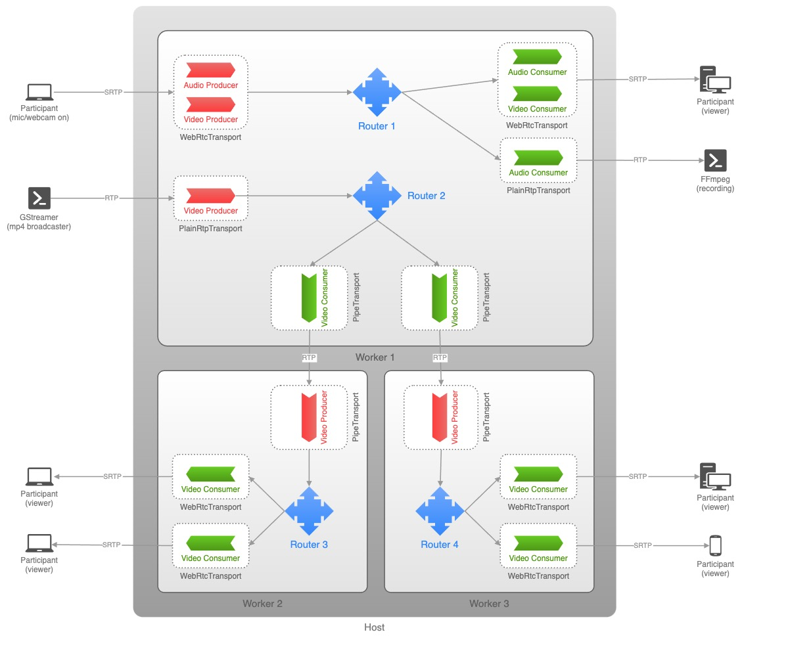

#### <p>原文出处：<a href='https://www.csdn.net/tags/NtTaggysODA1NzktYmxvZwO0O0OO0O0O.html' target='blank'>mediasoup 传递信令</a></p>

mediasoup 是一个 SFU，先来看一下 mediasoup 的架构，看一下 mediasoup 的主要概念和抽象，如Transport，Producer，Consumer，DataProducer，DataConsumer 在 mediasoup的媒体数据转发系统中的位置和作用：



一般来说，这些抽象在 mediasoup SFU 中有实体对象与之对应。这些抽象在 libmediasoupclient 中对应 C++ 类的含义可以参考[API 文档](https://mediasoup.org/documentation/v3/mediasoup-client/api/)。这些抽象的名称是以 mediasoup SFU 服务器端为中心建立的，如 Producer，指的是可以给 mediasoup SFU 服务器提供媒体数据的实体，是 mediasoup SFU 服务器的媒体数据生产者，对应到 libmediasoupclient 中的 C++ 类 Producer，它是音频源/音频采集模块或视频源/视频采集模块的代理。

对于 mediasoup 来说，信令协议所要完成的功能就是在适当的时候协调 mediasoup SFU 服务器完成媒体转发所需要的这些服务端对象的创建，资源的分配，和链路的打通，并协调客户端与服务端的连接建立，及数据的发送、接收和控制，协调客户端和服务器之间交换 mediasoup相关的参数、请求/响应和通知。

mediasoup 本身不提供任何信令协议来帮助客户端和服务器进行通信。信令的传递取决于应用程序，它们可以使用 WebSocket、HTTP或其它通信方式进行通信，并在客户端和服务器之间交换 mediasoup 相关的参数、请求/响应和通知。在大多数情况下，服务端可能需要主动向客户端递送消息或事件通知等，则这种通信必须是双向的，因此通常需要全双工通道。但是，应用程序可以重用相同的通道来进行非 mediasoup 相关的消息交换 (例如身份验证过程、聊天消息、文件传输和任何应用程序希望实现的内容)。

更准确地说，在 mediasoup v2 的时候，还有信令协议，具体内容如 [mediasoup protocol](https://mediasoup.org/documentation/v2/mediasoup-protocol/) 和[MEDIASOUP_PROTOCOL.md](https://github.com/versatica/mediasoup-client/blob/v2/MEDIASOUP_PROTOCOL.md) 的说明。但在最新的 v3版中，已经没有这部分了。信令协议需要服务端应用自己实现。

信令协议协议实现的示例可以参考 [mediasoup-demo](https://github.com/versatica/mediasoup-demo)的 server 的 `mediasoup-demo/server/server.js`。

让我们假设我们的 JavaScript 或 C++ 客户端应用程序初始化了一个 mediasoup-client[Device](https://mediasoup.org/documentation/v3/mediasoup-client/api/#Device)
或一个 libmediasoupclient [Device](https://mediasoup.org/documentation/v3/libmediasoupclient/api/#Device) 对象，连接一个 mediasoup[Router](https://mediasoup.org/documentation/v3/mediasoup/api/#Router)（已经在服务器中创建）并基于 WebRTC 发送和接收媒体数据。

这里 mediasoup[Router](https://mediasoup.org/documentation/v3/mediasoup/api/#Router)创建的服务端应用接口，如 [mediasoup-demo](https://github.com/versatica/mediasoup-demo) 的server 的 `mediasoup-demo/server/server.js` 所实现的 websocket 接口：

```js
async function runProtooWebSocketServer()
{
	logger.info('running protoo WebSocketServer...');
	// Create the protoo WebSocket server.
	protooWebSocketServer = new protoo.WebSocketServer(httpsServer,
	{
		maxReceivedFrameSize     : 960000, // 960 KBytes.
		maxReceivedMessageSize   : 960000,
		fragmentOutgoingMessages : true,
		fragmentationThreshold   : 960000
	});

	// Handle connections from clients.
	protooWebSocketServer.on('connectionrequest', (info, accept, reject) =>
	{
		// The client indicates the roomId and peerId in the URL query.
		const u = url.parse(info.request.url, true);
		const roomId = u.query['roomId'];
		const peerId = u.query['peerId'];
		if (!roomId || !peerId)
		{
			reject(400, 'Connection request without roomId and/or peerId');
			return;
		}
		logger.info(
			'protoo connection request [roomId:%s, peerId:%s, address:%s, origin:%s]',
			roomId, peerId, info.socket.remoteAddress, info.origin);
		// Serialize this code into the queue to avoid that two peers connecting at
		// the same time with the same roomId create two separate rooms with same
		// roomId.
		queue.push(async () =>
		{
			const room = await getOrCreateRoom({ roomId });
			// Accept the protoo WebSocket connection.
			const protooWebSocketTransport = accept();
			room.handleProtooConnection({ peerId, protooWebSocketTransport });
		}).catch((error) =>
			{
				logger.error('room creation or room joining failed:%o', error);
				reject(error);
			});
	});
}
```

mediasoup-client (客户端 JavaScript 库) 和 libmediasoupclient (基于 libwebrtc 的 C++ 库) 都生成适用于 mediasoup 的 [RTP
参数](https://mediasoup.org/documentation/v3/mediasoup/rtp-parameters-and-capabilities/)，这简化了客户端应用程序的开发。

### 信令和 Peers

应用程序可以使用 WebSocket，并将每个经过认证的 WebSocket 连接与一个 “peer” 关联。

注意 mediasoup 中本身并没有 “peers”。然而，应用程序可能希望定义 “peers”，这可以标识并关联一个特定的用户账号，WebSocket 连接，metadata，及一系列 mediasoup transports，producers，consumers，data producers 和 data consumers。

### 设备加载

客户端应用程序通过给 device 提供服务端 mediasoup router 的 RTP capabilities 加载它的 mediasoup device。参考 [device.load()](https://mediasoup.org/documentation/v3/mediasoup-client/api/#device-load)。

这里的服务端 mediasoup router 的 RTP capabilities 需要通过信令协议从 mediasoup 服务器端获取。如对于[mediasoup-demo](https://github.com/versatica/mediasoup-demo) 的 server 应用，向服务器端发送 GET 请求，服务器端返回 JSON 格式的 RTP capabilities 的响应。HTTP url path 为`/rooms/:roomId`，如对于房间名为 `broadcaster` 的房间，为 `/rooms/broadcaster`：

```js
auto r = cpr::GetAsync(cpr::Url{baseUrl}, cpr::VerifySsl{verifySsl}).get();

if (r.status_code != 200) {
    std::cerr << "[ERROR] unable to retrieve room info"
              << " [status code:" << r.status_code << ", body:\"" << r.text
              << "\"]" << std::endl;
    return 1;
} else {
    std::cout << "[INFO] found room " << envRoomId << std::endl;
}

auto response = nlohmann::json::parse(r.text);
```

响应为一个常常的 JSON 字符串。

### 创建 Transports

mediasoup-client 和 libmediasoupclient 都需要将 WebRTC 传输的发送和接收分开。通常客户端应用程序会提前创建这些transports，甚至在想要发送或接收媒体数据之前。

对于发送媒体数据：

    * WebRTC transport 必须首先在 mediasoup router 中创建： [router.createWebRtcTransport()](https://mediasoup.org/documentation/v3/mediasoup/api/#router-createWebRtcTransport)。
    * 然后重复地在客户端应用程序中创建：[device.createSendTransport()](https://mediasoup.org/documentation/v3/mediasoup-client/api/#device-createSendTransport)。
    * 客户端应用程序必须订阅本地 transport 中的 “connect” 和 “produce” 事件。

对于 [mediasoup-demo](https://github.com/versatica/mediasoup-demo) 的 server 的 `mediasoup-demo/server/server.js`，在创建 transport 之前，还需要先在服务器中创建Broadcaster，POST 请求为：

```js
json body =
{
	{ "id",          this->id          },
	{ "displayName", "broadcaster"     },
	{ "device",
		{
			{ "name",    "libmediasoupclient"       },
			{ "version", mediasoupclient::Version() }
		}
	},
	{ "rtpCapabilities", this->device.GetRtpCapabilities() }
};

/* clang-format on */
auto url = baseUrl + "/broadcasters";
auto r = cpr::PostAsync(cpr::Url{url}, cpr::Body{body.dump()},
                      cpr::Header{{"Content-Type", "application/json"}},
                      cpr::VerifySsl{verifySsl})
           .get();
```

其中 id 为本地生成的一个随机字符串。

响应为：

```js
{
"peers":[
    {
        "id":"ej8ogujz",
        "displayName":"Elgyem",
        "device":{
            "flag":"safari",
            "name":"Safari",
            "version":"14.1"
        },
        "producers":[
            {
                "id":"87230aeb-027e-4204-99eb-080cd4972bb0",
                "kind":"audio"
            },
            {
                "id":"66c62c26-7101-43b2-b82c-cdf537b8d9ed",
                "kind":"video"
            }
        ]
    }
]
}
```

响应中主要包含了相同房间内，其它 peer 的信息。

在 mediasoup router 中创建 WebRTC transport 通过如下 HTTP 请求完成：

```js
json sctpCapabilities = this->device.GetSctpCapabilities();
/* clang-format off */
json body =
{
	{ "type",    "webrtc" },
	{ "rtcpMux", true     },
	{ "sctpCapabilities", sctpCapabilities }
};
/* clang-format on */
auto url = baseUrl + "/broadcasters/" + id + "/transports";
auto r = cpr::PostAsync(cpr::Url{url}, cpr::Body{body.dump()},
                      cpr::Header{{"Content-Type", "application/json"}},
                      cpr::VerifySsl{verifySsl})
           .get();
```

这个请求的响应为：

```js
{
    "id":"6eae5aae-3ae9-4545-a146-466b28e05da7",
    "iceParameters":{
        "iceLite":true,
        "password":"g08jh0b528i0fshqld1cmdgijhzhstuz",
        "usernameFragment":"v77q4zq05bhni7c1"
    },
    "iceCandidates":[
        {
            "foundation":"udpcandidate",
            "ip":"192.168.217.129",
            "port":40065,
            "priority":1076302079,
            "protocol":"udp",
            "type":"host"
        }
    ],
    "dtlsParameters":{
        "fingerprints":[
            {
                "algorithm":"sha-1",
                "value":"5F:2D:8A:74:CD:95:65:3C:4B:10:27:1A:01:BA:CE:F7:0B:23:B9:AE"
            },
            {
                "algorithm":"sha-224",
                "value":"9C:19:4F:40:43:A9:AE:DD:01:00:7A:98:0C:5D:26:99:BD:9E:FB:A0:4F:EA:FB:0C:39:D2:2B:BD"
            },
            {
                "algorithm":"sha-256",
                "value":"D8:FD:D9:5B:9C:37:2A:4C:F7:99:D4:35:F2:90:7C:9E:D8:1A:74:10:B3:33:B4:71:B7:22:8F:C5:A5:59:FF:BD"
            },
            {
                "algorithm":"sha-384",
                "value":"B9:2B:D5:6C:60:0F:B0:A0:E3:6E:57:7D:02:91:52:AE:75:D7:3F:E1:34:83:45:39:DA:53:93:09:ED:53:6C:A9:01:1E:20:16:06:C3:48:40:07:9B:A5:6C:B3:E1:81:A9"
            },
            {
                "algorithm":"sha-512",
                "value":"46:F6:77:11:ED:ED:80:EA:97:EA:36:FF:CD:4B:E1:C0:36:09:ED:F4:E0:B8:56:F0:8D:FB:9C:12:AF:A3:86:05:82:C0:F8:B9:CA:E6:7D:62:5C:72:5F:10:23:F5:66:27:04:A5:BA:F4:63:D9:F5:42:D6:22:0C:86:51:43:1D:B4"
            }
        ],
        "role":"auto"
    },
    "sctpParameters":{
        "MIS":1024,
        "OS":1024,
        "isDataChannel":true,
        "maxMessageSize":262144,
        "port":5000,
        "sctpBufferedAmount":0,
        "sendBufferSize":262144
    }
}
```

对于接收媒体数据：

    * WebRTC transport 必须首先在 mediasoup router 中创建： [router.createWebRtcTransport()](https://mediasoup.org/documentation/v3/mediasoup/api/#router-createWebRtcTransport)。
    * 然后重复地在客户端应用程序中创建：[device.createRecvTransport()](https://mediasoup.org/documentation/v3/mediasoup-client/api/#device-createRecvTransport)。
    * 客户端应用程序必须订阅本地 transport 中的 “connect” 和 “produce” 事件。

如果在这些 transports 中需要使用 SCTP (即 WebRTC 中的 DataChannel)，必须在其中启用 **enableSctp**(使用适当的 [numSctpStreams](https://mediasoup.org/documentation/v3/mediasoup/sctp-parameters/#NumSctpStreams)) 和其他 SCTP 相关设置。

### 生产媒体数据

一旦创建了 send transport，客户端应用程序就可以在其上生成多个音频和视频 tracks。

    * 应用程序获得一个 [track](https://www.w3.org/TR/mediacapture-streams/#mediastreamtrack) (例如，通过使用 **navigator.mediaDevices.getUserMedia()** API)。
    * 它在本地 send transport 中调用 [transport.produce()](https://mediasoup.org/documentation/v3/mediasoup-client/api/#transport-produce)。 
      * 如果这是对 **transport.produce()** 的第一次调用，则 transport 将发出 “connect” 事件。
      * transport 将发出“produce” 事件，因此应用程序将把事件参数传递给服务器，并在服务器端创建一个 [Producer](https://mediasoup.org/documentation/v3/mediasoup/api/#Producer) 实例。
    * 最后，**transport.produce()** 将在客户端使用 [Producer](https://mediasoup.org/documentation/v3/mediasoup-client/api/#Producer) 实例进行解析。

这里的把事件参数传递给服务器，对应于 [mediasoup-demo](https://github.com/versatica/mediasoup-demo) 的 server 的 `mediasoup-demo/server/server.js` 的连接 send transport 请求：

```js
/* clang-format off */
json body =
{
	{ "dtlsParameters", dtlsParameters }
};
/* clang-format on */
auto url = baseUrl + "/broadcasters/" + this->id + "/transports/" +
         sendTransport->GetId() + "/connect";
std::cout << "Connect send transport url: " << url << std::endl;
auto r = cpr::PostAsync(cpr::Url{url}, cpr::Body{body.dump()},
                      cpr::Header{{"Content-Type", "application/json"}},
                      cpr::VerifySsl{verifySsl})
           .get();
```

在本地 send transport 中调用[transport.produce()](https://mediasoup.org/documentation/v3/mediasoup-client/api/#transport-produce) 时发出请求：

```js
#0  Broadcaster::OnConnectSendTransport (this=0x3d440000c280, dtlsParameters=...) at ~/mediasoup-broadcaster-demo/src/Broadcaster.cpp:58
#1  0x0000555555655e86 in Broadcaster::OnConnect (this=0x7fffffffdbd0, transport=0x3d4400031180, dtlsParameters=...)
    at ~/mediasoup-broadcaster-demo/src/Broadcaster.cpp:44
#2  0x00005555576d7d91 in mediasoupclient::Transport::OnConnect (this=0x3d4400031180, dtlsParameters=...)
    at ~/mediasoup-broadcaster-demo/build/_deps/mediasoupclient-src/src/Transport.cpp:106
#3  0x00005555576bab97 in mediasoupclient::Handler::SetupTransport (this=0x3d44000bd280, localDtlsRole="server", localSdpObject=...)
    at ~/mediasoup-broadcaster-demo/build/_deps/mediasoupclient-src/src/Handler.cpp:145
#4  0x00005555576bb6b0 in mediasoupclient::SendHandler::Send (this=0x3d44000bd280, track=0x3d4400085fc0, encodings=0x7fffffffcff0, codecOptions=0x7fffffffd1e0, 
    codec=0x0) at ~/mediasoup-broadcaster-demo/build/_deps/mediasoupclient-src/src/Handler.cpp:232
#5  0x00005555576d8f70 in mediasoupclient::SendTransport::Produce (this=0x3d4400031180, producerListener=0x7fffffffdbe0, track=0x3d4400085fc0, encodings=0x0, 
    codecOptions=0x7fffffffd1e0, codec=0x0, appData=...)
    at ~/mediasoup-broadcaster-demo/build/_deps/mediasoupclient-src/src/Transport.cpp:220
#6  0x000055555565ae46 in Broadcaster::CreateSendTransport (this=0x7fffffffdbd0, enableAudio=true, useSimulcast=true)
    at ~/mediasoup-broadcaster-demo/src/Broadcaster.cpp:420
#7  0x000055555565901e in Broadcaster::Start (this=0x7fffffffdbd0, baseUrl="https://192.168.217.129:4443/rooms/broadcaster", enableAudio=true, useSimulcast=true, 
    routerRtpCapabilities=..., verifySsl=false) at ~/mediasoup-broadcaster-demo/src/Broadcaster.cpp:296
#8  0x000055555569f309 in main () at ~/mediasoup-broadcaster-demo/src/main.cpp:103
```

这个请求没有响应。

此外，还会向服务端发送两个请求，分别在 mediasoup 服务器中为音频和视频创建 Producer：

```js
#0  Broadcaster::OnProduce (this=0x7fffffffcc80, kind="", rtpParameters=...) at ~/mediasoup-broadcaster-demo/src/Broadcaster.cpp:147
#1  0x00005555576d9019 in mediasoupclient::SendTransport::Produce (this=0x3d4400031180, producerListener=0x7fffffffdbe0, track=0x3d440009d690, 
    encodings=0x7fffffffd200, codecOptions=0x0, codec=0x0, appData=...)
    at ~/mediasoup-broadcaster-demo/build/_deps/mediasoupclient-src/src/Transport.cpp:229
#2  0x000055555565b0ad in Broadcaster::CreateSendTransport (this=0x7fffffffdbd0, enableAudio=true, useSimulcast=true)
    at ~/mediasoup-broadcaster-demo/src/Broadcaster.cpp:438
#3  0x000055555565901e in Broadcaster::Start (this=0x7fffffffdbd0, baseUrl="https://192.168.217.129:4443/rooms/broadcaster", enableAudio=true, useSimulcast=true, 
    routerRtpCapabilities=..., verifySsl=false) at ~/mediasoup-broadcaster-demo/src/Broadcaster.cpp:296
#4  0x000055555569f309 in main () at ~/mediasoup-broadcaster-demo/src/main.cpp:103
```

请求格式如下：

```js
json body =
{
	{ "kind",          kind          },
	{ "rtpParameters", rtpParameters }
};
/* clang-format on */
auto url = baseUrl + "/broadcasters/" + id + "/transports/" +
         sendTransport->GetId() + "/producers";
std::cout << "Produce url: " << url << std::endl;
auto r = cpr::PostAsync(cpr::Url{url}, cpr::Body{body.dump()},
                      cpr::Header{{"Content-Type", "application/json"}},
                      cpr::VerifySsl{verifySsl})
           .get();
```

响应格式如下：

```js
{
    "id":"8624d454-9519-436b-8da9-56755c1bd2b6"
}
```

返回一个 id。

### 消费媒体数据

一旦创建了 receive transport，客户端应用程序就可以使用它上的多个音频和视频 tracks。但是顺序是相反的(这里消费者必须首先在服务器中创建)。

    * 客户端应用程序向服务器发送它的 [device.rtpCapabilities](https://mediasoup.org/documentation/v3/mediasoup-client/api/#device-rtpCapabilities) (它可能已经提前完成了)。
    * 服务器应用程序应该检查远端设备是否可以使用特定的生产者 (也就是说，它是否支持生产者媒体编解码器)。它可以通过使用 [router.canConsume()](https://mediasoup.org/documentation/v3/mediasoup/api/#router-canConsume) 方法来实现。
    * 然后服务器应用程序在客户端为接收媒体数据而创建的 WebRTC transport 中调用 [transport.consume()](https://mediasoup.org/documentation/v3/mediasoup/api/#transport-consume) ，从而生成一个服务器端的 [Consumer](https://mediasoup.org/documentation/v3/mediasoup-client/api/#Consumer)。 
      * 正如 [transport.consume()](https://mediasoup.org/documentation/v3/mediasoup/api/#transport-consume) 文档中所解释的，强烈建议使用 **paused: true** 创建服务器端 consumer，并在远程端点中创建 consumer 后恢复它。
    * 服务器应用程序将 consumer 信息和参数传输到远程客户端应用程序，远程客户端应用程序在本地 receive transport 中调用 [transport.consume()](https://mediasoup.org/documentation/v3/mediasoup-client/api/#transport-consume)。 
      * 如果这是对 **transport.consume()** 的第一次调用，transport 将发出 [“connect”](https://mediasoup.org/documentation/v3/mediasoup-client/api/#transport-on-connect) 事件。
    * 最后，在客户端将以一个 [Consumer](https://mediasoup.org/documentation/v3/mediasoup-client/api/#Consumer) 实例解析 **transport.consume()**。

### 生产数据 (DataChannels)

一旦创建了 send transport，客户端应用程序就可以在其上生成多个[DataChannels](https://www.w3.org/TR/webrtc/#rtcdatachannel)。

    * 应用程序在本地 send transport 中调用 [transport.produceData()](https://mediasoup.org/documentation/v3/mediasoup-client/api/#transport-producedata)。 
      * 如果这是对 **transport.produceData()** 的第一次调用，则 transport 将发出 [“connect”](https://mediasoup.org/documentation/v3/mediasoup-client/api/#transport-on-connect) 事件。
      * transport 将发出[“producedata”](https://mediasoup.org/documentation/v3/mediasoup-client/api/#transport-on-producedata) 事件，因此应用程序将把事件参数传递给服务器，并在服务器端创建一个 [DataProducer](https://mediasoup.org/documentation/v3/mediasoup/api/#DataProducer) 实例。
    * 最后，**transport.produceData()** 将在客户端使用 [DataProducer](https://mediasoup.org/documentation/v3/mediasoup-client/api/#DataProducer) 实例进行解析。

### 消费数据 (DataChannels)

一旦创建了 receive transport，客户端应用程序就可以使用它上的多个[DataChannels](https://www.w3.org/TR/webrtc/#rtcdatachannel) 了。但是顺序是相反的(这里消费者必须首先在服务器中创建)。

    * 服务器应用程序在客户端为接收数据而创建的 WebRTC transport 中调用 [transport.consumeData()](https://mediasoup.org/documentation/v3/mediasoup/api/#transport-consumedata)，从而生成一个服务器端的 [DataConsumer](https://mediasoup.org/documentation/v3/mediasoup-client/api/#DataConsumer)。
    * 服务器应用程序将 consumer 信息和参数传输到客户端应用程序，客户端应用程序在本地 receive transport 中调用 [transport.consumeData()](https://mediasoup.org/documentation/v3/mediasoup-client/api/#transport-consumedata)。 
      * 如果这是对 **transport.consumeData()** 的第一次调用，transport 将发出 [“connect”](https://mediasoup.org/documentation/v3/mediasoup-client/api/#transport-on-connect) 事件。
    * 最后，在客户端将以一个 [DataConsumer](https://mediasoup.org/documentation/v3/mediasoup-client/api/#Consumer) 实例解析 **transport.consumeData()**。

### 通信行为和事件

作为核心原则，调用 mediasoup 实例中的方法不会在该实例中生成直接事件。总之，这意味着在路router、transport、producer、consumer、data producer 或 data consumer 上调用**close()** 不会触发任何事件。

当一个 transport、producer、consumer、data producer 或 data consumer 在客户端或服务器端被关闭时(例如通过在它上调用 **close()**)，应用程序应该向另一端发出它的关闭信号，另一端也应该在相应的实体上调用**close()**。另外，服务器端应用程序应该监听以下关闭事件并通知客户端：

    * Transport [“routerclose”](https://mediasoup.org/documentation/v3/mediasoup/api/#transport-on-routerclose)。客户端应该在对应的本地 transport 中调用 `close()`。
    * Producer [“transportclose”](https://mediasoup.org/documentation/v3/mediasoup/api/#producer-on-transportclose)。客户端应该在对应的本地 producer 中调用 `close()`。
    * Consumer [“transportclose”](https://mediasoup.org/documentation/v3/mediasoup/api/#consumer-on-transportclose)。客户端应该在对应的本地 consumer 中调用 `close()`。
    * Consumer [“producerclose”](https://mediasoup.org/documentation/v3/mediasoup/api/#consumer-on-producerclose)。客户端应该在对应的本地 consumer 中调用 `close()`。
    * DataProducer [“transportclose”](https://mediasoup.org/documentation/v3/mediasoup/api/#dataProducer-on-transportclose)。客户端应该在对应的本地 data producer 中调用 `close()`。
    * DataConsumer [“transportclose”](https://mediasoup.org/documentation/v3/mediasoup/api/#dataConsumer-on-transportclose)。客户端应该在对应的本地 data consumer 中调用 `close()`。
    * DataConsumer [“dataproducerclose”](https://mediasoup.org/documentation/v3/mediasoup/api/#dataConsumer-on-dataproducerclose)。客户端应该在对应的本地 data consumer 中调用 `close()`。

在客户端或服务器端暂停 RTP 生产者或消费者时也会发生同样的情况。行为必须向对方发出信号。另外，服务器端应用程序应该监听以下事件并通知客户端：

    * Consumer [“producerpause”](https://mediasoup.org/documentation/v3/mediasoup/api/#consumer-on-producerpause)。客户端应该在对应的本地 transport 中调用 `pause()`。
    * Consumer [“producerresume”](https://mediasoup.org/documentation/v3/mediasoup/api/#consumer-on-producerresume)。客户端应该在对应的本地 transport 中调用 `resume()`(除非 consumer 本身也被故意暂停)。

当使用 simulcast 或 SVC 时，应用程序可能会对客户端和服务器端消费者之间的首选层和有效层感兴趣。

    * 服务器端应用程序通过 [consumer.setPreferredLayers()](https://mediasoup.org/documentation/v3/mediasoup/api/#consumer-setPreferredLayers) 设置 consumer 首选层。
    * 服务器端 consumer 订阅 [“layerschange”](https://mediasoup.org/documentation/v3/mediasoup/api/#consumer-on-layerschange) 事件，并通知客户端应用程序正在传输的有效层。

### 参考文档：  

* [Communication Between Client andServer](https://mediasoup.org/documentation/v3/communication-between-client-and-server/)  
* [Mediao Soup Demo协议分析](https://www.jianshu.com/p/36078f46a001)  
* [mediasoup protocol](https://mediasoup.org/documentation/v2/mediasoup-protocol/)

<hr>

#### <p>原文出处：<a href='https://www.jianshu.com/p/36078f46a001' target='blank'>Mediao Soup Demo协议分析</a></p>

* 启动server服务执行
* 在mediasoup-demo/server目录下执行如下命令
* DEBUG="<em>mediasoup</em> <em>ERROR</em> <em>WARN</em>" INTERACTIVE="true" node server.js

```js
response:
{"event":"running","targetId":"20795"}
{"event":"running","targetId":"20797"}
{"event":"running","targetId":"20799"}
{"event":"running","targetId":"20801"}
```

* 由于测试设备的CPU为4核心所以启动4个worker

* targetId表示worker进程对应的pid

* 在mediasoup-demo/app目录下通过

* gulp live命令启动应用demo服务,首先会使用如下命令创建

* 创建路由(房间)createRouter会通过信令服务向C++多媒体服务发送如下指令

```js
request:
{
 "id":1,
    "internal" :{
        "routerId":"aaa232b6-f113-4a07-bfb3-8e344936a43b"
    },
 "method":"worker.createRouter"
}

response: 
{"accepted":true,"id":1}
```

* 通过路由createAudioLevelObserver请求

```js
request:
{
    "data":{
        "interval":800,
        "maxEntries":1,
        "threshold":-80
    },
    "id":2,
    "internal":{
        "routerId":"aaa232b6-f113-4a07-bfb3-8e344936a43b",
        "rtpObserverId":"b4291ace-712e-433f-89b6-637531aa3c86"
    },
    "method":"router.createAudioLevelObserver"
}
{"accepted":true,"id":2}
```

* 通过路由发送createPlainTransport请求

```js
request:
{
    "data":{
    "comedia":false,
    "enableSctp":true,
    "enableSrtp":false,
    "isDataChannel":false,
    "listenIp":{
        "ip":"127.0.0.1"
    },
    "maxSctpMessageSize":262144,
    "numSctpStreams":{"MIS":256,"OS":256},
    "rtcpMux":true,
    "srtpCryptoSuite":"AES_CM_128_HMAC_SHA1_80"
    },
    "id":3,
    "internal":{
        "routerId":"aaa232b6-f113-4a07-bfb3-8e344936a43b",
        "transportId":"5fe4b2ca-58a7-4c41-9ead-978bed1952ab"
    },
    "method":"router.createPlainTransport"
}
response:
{
    "accepted":true,
    "data":{
        "comedia":false,
        "consumerIds":[],
        "dataConsumerIds":[],
        "dataProducerIds":[],
        "id":"5fe4b2ca-58a7-4c41-9ead-978bed1952ab","mapRtxSsrcConsumerId":{},
        "mapSsrcConsumerId":{},
        "producerIds":[],
        "recvRtpHeaderExtensions":{},
        "rtcpMux":true,
        "rtpListener":{
            "midTable":{},
            "ridTable":{},
            "ssrcTable":{}},
        "sctpListener":{
            "streamIdTable":{}
        },
        "sctpParameters":{
            "MIS":256,
            "OS":256,
            "isDataChannel":false,
            "maxMessageSize":262144,
            "port":5000
        },
        "sctpState":"new",
        "traceEventTypes":"",
        "tuple":{"localIp":"127.0.0.1","localPort":44223,"protocol":"udp"}
    },
    "id":3
}
```

* 发送transport.connect请求

```js
request:
{
    "data":{
        "ip":"127.0.0.1","port":34397
    },
    "id":4,
    "internal":{
        "routerId":"aaa232b6-f113-4a07-bfb3-8e344936a43b",
        "transportId":"5fe4b2ca-58a7-4c41-9ead-978bed1952ab"
    },
    "method":"transport.connect"
}
response:
{
    "accepted":true,
    "data":{
        "tuple":{
            "localIp":"127.0.0.1",
            "localPort":44223,
            "protocol":"udp",
            "remoteIp":"127.0.0.1",
            "remotePort":34397
        }
    },
    "id":4
}
response:
{
    "data":{
        "sctpState":"connecting"
    },
    "event":"sctpstatechange",
    "targetId":"5fe4b2ca-58a7-4c41-9ead-978bed1952ab"
}
```

* 发送transport.produceData请求

```js
request:
{
    "data":{
        "label":"bot",
        "protocol":"",
        "sctpStreamParameters":{
            "ordered":true,
            "streamId":1
        }
    },
    "id":5,
    "internal":{
        "dataProducerId":"464334d5-6d77-404f-b4e0-3e9dc2708a2f",
        "routerId":"aaa232b6-f113-4a07-bfb3-8e344936a43b",
        "transportId":"5fe4b2ca-58a7-4c41-9ead-978bed1952ab"
    },
    "method":"transport.produceData"
}
response:
{
    "accepted":true,
    "data":{
        "id":"464334d5-6d77-404f-b4e0-3e9dc2708a2f",
        "label":"bot",
        "protocol":"",
        "sctpStreamParameters":{
            "ordered":true,
            "streamId":1
        }
    },
    "id":5
}
response:
{
    "data":{
        "sctpState":"connected"
    },
    "event":"sctpstatechange",
    "targetId":"5fe4b2ca-58a7-4c41-9ead-978bed1952ab"
}
```

* 通过路由发送createWebRtcTransport

```js
request:
{
    "data":{
        "enableSctp":true,
        "enableTcp":false,
        "enableUdp":true,
        "initialAvailableOutgoingBitrate":1000000,
        "isDataChannel":true,
        "listenIps":[{"ip":"127.0.0.1"}],
        "maxSctpMessageSize":262144,
        "numSctpStreams":{
            "MIS":1024,"OS":1024
        },
        "preferTcp":false,
        "preferUdp":false
    },
    "id":6,
    "internal":{
        "routerId":"aaa232b6-f113-4a07-bfb3-8e344936a43b",
        "transportId":"c640b33b-ced9-4fcb-ba22-956b5079f158"
    },
    "method":"router.createWebRtcTransport"
}
response:
{
    "accepted":true,
    "data":{
        "consumerIds":[],
        "dataConsumerIds":[],
        "dataProducerIds":[],
        "dtlsParameters":{
            "fingerprints":[{
                "algorithm":"sha-1","value":"xxxx"},{
                "algorithm":"sha-224","value":"xxss"},{
                "algorithm":"sha-256","value":"ddd"},{
                "algorithm":"sha-384","value":"fff"},{
                "algorithm":"sha-512","value":"cccc"}],
            "role":"auto"
        },
        "dtlsState":"new",
        "iceCandidates":[{
            "foundation":"udpcandidate",
            "ip":"127.0.0.1",
            "port":46482,
            "priority":1076302079,
            "protocol":"udp",
            "type":"host"
        }],
        "iceParameters":{
            "iceLite":true,
            "password":"1fs2cmda3czbfe4juktrtjqjc1kw8bdk",
            "usernameFragment":"gajtb1cdube6ql76"
        },
        "iceRole":"controlled",
        "iceState":"new",
        "id":"c640b33b-ced9-4fcb-ba22-956b5079f158",
        "mapRtxSsrcConsumerId":{},
        "mapSsrcConsumerId":{},
        "producerIds":[],
        "recvRtpHeaderExtensions":{},
        "rtpListener":{
            "midTable":{},
            "ridTable":{},
            "ssrcTable":{}
        },
        "sctpListener":{
            "streamIdTable":{}
        },
        "sctpParameters":{
            "MIS":1024,
            "OS":1024,
            "isDataChannel":true,
            "maxMessageSize":262144,
            "port":5000
        },
        "sctpState":"new",
        "traceEventTypes":""
    },
    "id":6
}
```

* 发送transport.enableTraceEvent

```js
request:
{
    "data":{
        "types":["bwe"]
    },
    "id":7,
    "internal":{
        "routerId":"aaa232b6-f113-4a07-bfb3-8e344936a43b",
        "transportId":"c640b33b-ced9-4fcb-ba22-956b5079f158"},
    "method":"transport.enableTraceEvent"
}
response:
{"accepted":true,"id":7}

* 发送transport.setMaxIncomingBitrate
request:
{
    "data":{
        "bitrate":1500000
    },
    "id":8,
    "internal":{
        "routerId":"aaa232b6-f113-4a07-bfb3-8e344936a43b",
        "transportId":"c640b33b-ced9-4fcb-ba22-956b5079f158"
    },
    "method":"transport.setMaxIncomingBitrate"
}
response:
{"accepted":true,"id":8}

* 通过路由发送createWebRtcTransport
{
    "data":{
        "enableSctp":true,
        "enableTcp":false,
        "enableUdp":true,
        "initialAvailableOutgoingBitrate":1000000,
        "isDataChannel":true,
        "listenIps":[{"ip":"127.0.0.1"}],
        "maxSctpMessageSize":262144,
        "numSctpStreams":{
            "MIS":1024,"OS":1024
        },
        "preferTcp":false,
        "preferUdp":false
    },
    "id":9,
    "internal":{
        "routerId":"aaa232b6-f113-4a07-bfb3-8e344936a43b",
        "transportId":"5194e86d-5243-4f95-b881-f0e2f9cf1bac"
    },
    "method":"router.createWebRtcTransport"
}
response:
{
    "accepted":true,
    "data":{
        "consumerIds":[],
        "dataConsumerIds":[],
        "dataProducerIds":[],
        "dtlsParameters":{
            "fingerprints":[{
                "algorithm":"sha-1","value":"@@@"},{
                "algorithm":"sha-224","value":"ddd"},{
                "algorithm":"sha-256","value":"fff"},{
                "algorithm":"sha-384","value":"vvv"},{
                "algorithm":"sha-512","value":"bbb"}],
            "role":"auto"
        },
        "dtlsState":"new",
        "iceCandidates":[{
            "foundation":"udpcandidate",              
            "ip":"127.0.0.1",
            "port":45096,
            "priority":1076302079,
            "protocol":"udp",
            "type":"host"
        }],
        "iceParameters":{
            "iceLite":true,
            "password":"m7pvh81ufyu2dz2pbku4ydercbnbygnq",
            "usernameFragment":"lu8a8bc1m1998uhc"
        },
        "iceRole":"controlled",
        "iceState":"new",
        "id":"5194e86d-5243-4f95-b881-f0e2f9cf1bac",
        "mapRtxSsrcConsumerId":{},
        "mapSsrcConsumerId":{},
        "producerIds":[],
        "recvRtpHeaderExtensions":{},
        "rtpListener":{
            "midTable":{},
            "ridTable":{},
            "ssrcTable":{}
        },
        "sctpListener":{
            "streamIdTable":{}
        },
        "sctpParameters":{
            "MIS":1024,
            "OS":1024,
            "isDataChannel":true,
            "maxMessageSize":262144,
            "port":5000
        },
        "sctpState":"new",
        "traceEventTypes":""
    },
    "id":9
}
```

* 发送transport.enableTraceEvent

```js
request:
{
    "data":{
        "types":["bwe"]
    },
    "id":10,
    "internal":{
        "routerId":"aaa232b6-f113-4a07-bfb3-8e344936a43b",
        "transportId":"5194e86d-5243-4f95-b881-f0e2f9cf1bac"},
    "method":"transport.enableTraceEvent"
}
response:
{"accepted":true,"id":10}

* 发送transport.setMaxIncomingBitrate
request:
{
    "data":{"bitrate":1500000},
    "id":11,
    "internal":{
        "routerId":"aaa232b6-f113-4a07-bfb3-8e344936a43b",
        "transportId":"5194e86d-5243-4f95-b881-f0e2f9cf1bac"
    },
    "method":"transport.setMaxIncomingBitrate"
}
response:
{"accepted":true,"id":11}

* 发送transport.consumeData
request:
{
    "data":{
        "label":"bot",
        "protocol":"",
        "sctpStreamParameters":{
            "ordered":true,"streamId":0
        }
    },
    "id":12,
    "internal":{
        "dataConsumerId":"64574b7e-1aa5-40b4-816a-16747f2491e1",
        "dataProducerId":"464334d5-6d77-404f-b4e0-3e9dc2708a2f",
        "routerId":"aaa232b6-f113-4a07-bfb3-8e344936a43b",
        "transportId":"5194e86d-5243-4f95-b881-f0e2f9cf1bac"
    },
    "method":"transport.consumeData"
}
response:
{
    "accepted":true,
    "data":{
        "dataProducerId":"464334d5-6d77-404f-b4e0-3e9dc2708a2f",
        "id":"64574b7e-1aa5-40b4-816a-16747f2491e1",
        "label":"bot",
        "protocol":"",
        "sctpStreamParameters":{
            "ordered":true,"streamId":0
        }
    },
    "id":12
}
```

* 发送transport.connect

```js
request:
{
    "data":{
        "dtlsParameters":{
            "fingerprints":[{
                "algorithm":"sha-256","value":"dd"
            }],
            "role":"server"}
    },
    "id":13,
    "internal":{
        "routerId":"aaa232b6-f113-4a07-bfb3-8e344936a43b",
        "transportId":"c640b33b-ced9-4fcb-ba22-956b5079f158"},
    "method":"transport.connect"
}
response:
{"accepted":true,"data":{"dtlsLocalRole":"client"}
```

* 发送transport.connect

```js
request:
{
    "data":{
        "dtlsParameters":{
            "fingerprints":[{
                "algorithm":"sha-256","value":"7bbb"
            }],
            "role":"client"
        }
    },
    "id":14,
    "internal":{
        "routerId":"aaa232b6-f113-4a07-bfb3-8e344936a43b",
        "transportId":"5194e86d-5243-4f95-b881-f0e2f9cf1bac"
    },
    "method":"transport.connect"
}
response:
{"accepted":true,"data":{"dtlsLocalRole":"server"},"id":14}

* C++层返回信息
{
    "data":{
        "iceSelectedTuple":{
            "localIp":"127.0.0.1",
            "localPort":46482,
            "protocol":"udp",
            "remoteIp":"192.168.2.229",
            "remotePort":60972
        }
    },
    "event":"iceselectedtuplechange",
    "targetId":"c640b33b-ced9-4fcb-ba22-956b5079f158"
}
{
    "data":{
        "iceState":"connected"
    },
    "event":"icestatechange",
    "targetId":"c640b33b-ced9-4fcb-ba22-956b5079f158"
}
{
    "data":{
        "dtlsState":"connecting"
    },
    "event":"dtlsstatechange",
    "targetId":"c640b33b-ced9-4fcb-ba22-956b5079f158"
}
{
    "data":{
        "dtlsRemoteCert":"xx",
        "dtlsState":"connected"
    },
    "event":"dtlsstatechange",
    "targetId":"c640b33b-ced9-4fcb-ba22-956b5079f158"
} 
{
    "data":{
        "sctpState":"connecting"
    },
    "event":"sctpstatechange",
    "targetId":"c640b33b-ced9-4fcb-ba22-956b5079f158"
}
{
    "data":{
        "iceSelectedTuple":{
            "localIp":"127.0.0.1",
            "localPort":45096,
            "protocol":"udp",
            "remoteIp":"192.168.2.229",
            "remotePort":39930
        }
    },
    "event":"iceselectedtuplechange",
    "targetId":"5194e86d-5243-4f95-b881-f0e2f9cf1bac"
}
{
    "data":{
        "iceState":"connected"
    },
    "event":"icestatechange",
    "targetId":"5194e86d-5243-4f95-b881-f0e2f9cf1bac"
}
{
    "data":{
        "dtlsState":"connecting"
    },
    "event":"dtlsstatechange",
    "targetId":"5194e86d-5243-4f95-b881-f0e2f9cf1bac"
}
```

* 发送transport.produce

```js
request:
{
    "data":{
        "kind":"audio",
        "paused":false,
        "rtpMapping":{
            "codecs":[{"mappedPayloadType":100,"payloadType":111}],
            "encodings":[{"mappedSsrc":384600302,"ssrc":2068361228}]},
        "rtpParameters":{
            "codecs":[{
                "channels":2,
                "clockRate":48000,
                "mimeType":"audio/opus",
                "parameters":{
                    "minptime":10,
                    "sprop-stereo":1,
                    "usedtx":1,
                    "useinbandfec":1
                },
                "payloadType":111,
                "rtcpFeedback":[{
                    "parameter":"",
                    "type":"transport-cc"}]
            }],
            "encodings":[{"dtx":false,"ssrc":2068361228}],
            "headerExtensions":[{
                "encrypt":false,
                "id":4,"parameters":{},
                "uri":"urn:ietf:params:rtp-hdrext:sdes:mid"
            },{"encrypt":false,"id":2,
               "parameters":{},
               "uri":"http://www.webrtc.org/experiments/rtp-hdrext/abs-send-time"},{
                "encrypt":false,"id":3,"parameters":{},
                "uri":"http://www.ietf.org/id/draft-holmer-rmcat-transport-wide-cc-extensions-01"},{
                "encrypt":false,
                "id":1,
                "parameters":{},
                "uri":"urn:ietf:params:rtp-hdrext:ssrc-audio-level"}],
            "mid":"0",
            "rtcp":{
                "cname":"O1GLW6lUbD+xDQfd","reducedSize":true
            }
        }
    },
    "id":15,"internal":{
        "producerId":"0175199b-9ffd-464f-ad3d-0117702e8b33",
        "routerId":"aaa232b6-f113-4a07-bfb3-8e344936a43b",
        "transportId":"c640b33b-ced9-4fcb-ba22-956b5079f158"
    },
    "method":"transport.produce"
}
response:
{"accepted":true,"data":{"type":"simple"},"id":15}
```

* 发送rtpObserver.addProducer

```js
request:
{
    "id":16,
    "internal":{
        "producerId":"0175199b-9ffd-464f-ad3d-0117702e8b33",
        "routerId":"aaa232b6-f113-4a07-bfb3-8e344936a43b",
        "rtpObserverId":"b4291ace-712e-433f-89b6-637531aa3c86"
    },
    "method":"rtpObserver.addProducer"
} 
response:
{"accepted":true,"id":16}
```

* C++层返回信息

```js
response:
{"data":{
    "dtlsRemoteCert":"nn",
    "dtlsState":"connected"
  },
 "event":"dtlsstatechange",
 "targetId":"5194e86d-5243-4f95-b881-f0e2f9cf1bac"
}
{
    "data":{
        "sctpState":"connecting"
    },
    "event":"sctpstatechange",
    "targetId":"5194e86d-5243-4f95-b881-f0e2f9cf1bac"
}
{
    "data":[{"score":10,"ssrc":2068361228}],
    "event":"score",
    "targetId":"0175199b-9ffd-464f-ad3d-0117702e8b33"
}
{
    "data":{
        "iceState":"completed"
    },
    "event":"icestatechange",
    "targetId":"c640b33b-ced9-4fcb-ba22-956b5079f158"
}
{
    "data":{
        "iceState":"completed"
    },
    "event":"icestatechange",
    "targetId":"5194e86d-5243-4f95-b881-f0e2f9cf1bac"
}
{
    "data":{
        "sctpState":"connected"
    },
    "event":"sctpstatechange",
    "targetId":"5194e86d-5243-4f95-b881-f0e2f9cf1bac"
}
{
    "data":{
        "sctpState":"connected"
    },
    "event":"sctpstatechange",
    "targetId":"c640b33b-ced9-4fcb-ba22-956b5079f158"
}
```

* 发送transport.getStats

```js
request:
{
    "id":17,"internal":{
        "routerId":"aaa232b6-f113-4a07-bfb3-8e344936a43b",
        "transportId":"c640b33b-ced9-4fcb-ba22-956b5079f158"
    },
    "method":"transport.getStats"
}
response:
{
    "accepted":true,"data":[{
        "bytesReceived":1930,
        "bytesSent":1605,
        "dtlsState":"connected",
        "iceRole":"controlled",
        "iceSelectedTuple":{
            "localIp":"127.0.0.1",
            "localPort":46482,
            "protocol":"udp",
            "remoteIp":"192.168.2.229",
            "remotePort":60972
        },
        "iceState":"completed",
        "maxIncomingBitrate":1500000,
        "probationBytesSent":0,
        "probationSendBitrate":0,
        "recvBitrate":15440,
        "rtpBytesReceived":339,
        "rtpBytesSent":0,
        "rtpRecvBitrate":1085,
        "rtpSendBitrate":0,
        "rtxBytesReceived":0,
        "rtxBytesSent":0,
        "rtxRecvBitrate":0,
        "rtxSendBitrate":0,
        "sctpState":"connected",
        "sendBitrate":12840,
        "timestamp":3762455,
        "transportId":"c640b33b-ced9-4fcb-ba22-956b5079f158",
        "type":"webrtc-transport"
    }],
    "id":17
}
```

* 发送transport.produceData

```js
request:
{
    "data":{
        "label":"chat",
        "protocol":"",
        "sctpStreamParameters":{
            "maxRetransmits":1,
            "ordered":false,
            "streamId":0
        }
    },
    "id":18,
    "internal":{
        "dataProducerId":"a16fa5b1-e824-45e8-a573-88e4cc801de7",
        "routerId":"aaa232b6-f113-4a07-bfb3-8e344936a43b",
        "transportId":"c640b33b-ced9-4fcb-ba22-956b5079f158"},
    "method":"transport.produceData"
}
response:
{
    "accepted":true,
    "data":{
        "id":"a16fa5b1-e824-45e8-a573-88e4cc801de7",
        "label":"chat",
        "protocol":"",
        "sctpStreamParameters":{
            "maxRetransmits":1,
            "ordered":false,
            "streamId":0
        }
    },
    "id":18
}
```

* 发送transport.getStats

```js
request:
{
    "id":19,
    "internal":{
        "routerId":"aaa232b6-f113-4a07-bfb3-8e344936a43b",
        "transportId":"5194e86d-5243-4f95-b881-f0e2f9cf1bac"
    },
    "method":"transport.getStats"
} 
response:
{
    "accepted":true,"data":[{
        "bytesReceived":1994,
        "bytesSent":1932,
        "dtlsState":"connected",
        "iceRole":"controlled",
        "iceSelectedTuple":{
            "localIp":"127.0.0.1",
            "localPort":45096,
            "protocol":"udp",
            "remoteIp":"192.168.2.229",
            "remotePort":39930
        },
        "iceState":"completed",
        "maxIncomingBitrate":1500000,
        "probationBytesSent":0,
        "probationSendBitrate":0,
        "recvBitrate":15952,
        "rtpBytesReceived":0,
        "rtpBytesSent":0,
        "rtpRecvBitrate":0,
        "rtpSendBitrate":0,
        "rtxBytesReceived":0,
        "rtxBytesSent":0,
        "rtxRecvBitrate":0,
        "rtxSendBitrate":0,
        "sctpState":"connected",
        "sendBitrate":15456,
        "timestamp":3762473,
        "transportId":"5194e86d-5243-4f95-b881-f0e2f9cf1bac",
        "type":"webrtc-transport"
    }],
    "id":19
}
```

* 发送transport.produceData

```js
request:
{
    "data":{
        "label":"bot",
        "protocol":"",
        "sctpStreamParameters":{
            "maxPacketLifeTime":2000,
            "ordered":false,
            "streamId":1
        }
    },
    "id":20,
    "internal":{
        "dataProducerId":"4c3592b8-4348-459a-9a5f-2814d9caddcf",
        "routerId":"aaa232b6-f113-4a07-bfb3-8e344936a43b",
        "transportId":"c640b33b-ced9-4fcb-ba22-956b5079f158"
    },
    "method":"transport.produceData"
}
response:
{
    "accepted":true,
    "data":{
        "id":"4c3592b8-4348-459a-9a5f-2814d9caddcf",
        "label":"bot",
        "protocol":"",
        "sctpStreamParameters":{
            "maxPacketLifeTime":2000,
            "ordered":false,
            "streamId":1
        }
    },
    "id":20
}
```

* 发送transport.consumeData

```js
request:
{
    "data":{
        "label":"bot",
        "protocol":"",
        "sctpStreamParameters":{
            "maxPacketLifeTime":2000,
            "ordered":false,
            "streamId":0
        }
    },
    "id":21,
    "internal":{
        "dataConsumerId":"96e0961c-fee3-4b20-b6c2-16db1013012b",
        "dataProducerId":"4c3592b8-4348-459a-9a5f-2814d9caddcf",
        "routerId":"aaa232b6-f113-4a07-bfb3-8e344936a43b",
        "transportId":"5fe4b2ca-58a7-4c41-9ead-978bed1952ab"
    },
    "method":"transport.consumeData"
}
response:
{
    "accepted":true,"data":{
        "dataProducerId":"4c3592b8-4348-459a-9a5f-2814d9caddcf",
        "id":"96e0961c-fee3-4b20-b6c2-16db1013012b",
        "label":"bot",
        "protocol":"",
        "sctpStreamParameters":{
            "maxPacketLifeTime":2000,
            "ordered":false,
            "streamId":0
        }
    },
    "id":21
}
```

* 发送transport.getStats

```js
request:
{
    "id":22,"internal":{
        "producerId":"0175199b-9ffd-464f-ad3d-0117702e8b33",
        "routerId":"aaa232b6-f113-4a07-bfb3-8e344936a43b",
        "transportId":"c640b33b-ced9-4fcb-ba22-956b5079f158"
    },
    "method":"producer.getStats"
}
response:
{
    "accepted":true,
    "data":[{
        "bitrate":944,
        "byteCount":295,
        "firCount":0,
        "fractionLost":0,
        "jitter":122141,
        "kind":"audio",
        "mimeType":"audio/opus",
        "nackCount":0,
        "nackPacketCount":0,
        "packetCount":11,
        "packetsDiscarded":0,
        "packetsLost":0,
        "packetsRepaired":0,
        "packetsRetransmitted":0,
        "pliCount":0,
        "score":10,
        "ssrc":2068361228,
        "timestamp":3762482,
        "type":"inbound-rtp"
    }],
    "id":22
}
```

* 发送dataProducer.getStats

```js
request:
{
    "id":23,
    "internal":{
        "dataProducerId":"a16fa5b1-e824-45e8-a573-88e4cc801de7",
        "routerId":"aaa232b6-f113-4a07-bfb3-8e344936a43b",
        "transportId":"c640b33b-ced9-4fcb-ba22-956b5079f158"
    },
    "method":"dataProducer.getStats"
}
response:
{
    "accepted":true,"data":[{
        "bytesReceived":0,
        "label":"chat",
        "messagesReceived":0,
        "protocol":"",
        "timestamp":3762526,
        "type":"data-producer"
    }],
    "id":23
}
```

* 发送dataProducer.getStats

```js
request:
{
    "id":24,
    "internal":{
        "dataProducerId":"4c3592b8-4348-459a-9a5f-2814d9caddcf",
        "routerId":"aaa232b6-f113-4a07-bfb3-8e344936a43b",
        "transportId":"c640b33b-ced9-4fcb-ba22-956b5079f158"
    },
    "method":"dataProducer.getStats"
}
response:
{
    "accepted":true,"data":[{
        "bytesReceived":0,
        "label":"bot",
        "messagesReceived":0,
        "protocol":"",
        "timestamp":3762530,
        "type":"data-producer"
    }],
    "id":24
}
```

* 发送dataConsumer.getStats

```js
request:
{
    "id":25,"internal":{
        "dataConsumerId":"64574b7e-1aa5-40b4-816a-16747f2491e1",
        "dataProducerId":"464334d5-6d77-404f-b4e0-3e9dc2708a2f",
        "routerId":"aaa232b6-f113-4a07-bfb3-8e344936a43b",
        "transportId":"5194e86d-5243-4f95-b881-f0e2f9cf1bac"
    },
    "method":"dataConsumer.getStats"
}
response:
{"accepted":true,
 "data":[{
    "bytesSent":0,
    "label":"bot",
    "messagesSent":0,
    "protocol":"",
    "timestamp":3762533,
    "type":"data-consumer"
 }],
 "id":25
}
```

* 发送transport.produce

```js
request:
{
    "data":{
        "kind":"video",
        "paused":false,
        "rtpMapping":{
            "codecs":[{
                "mappedPayloadType":101,
                "payloadType":96},{
                "mappedPayloadType":102,
                "payloadType":97
            }],
            "encodings":[
            {
                "mappedSsrc":314619191,
                "rid":"r0","scalabilityMode":"S1T3"
            },{ "mappedSsrc":314619192,
               "rid":"r1",
               "scalabilityMode":"S1T3"
              },{
                "mappedSsrc":314619193,
                "rid":"r2",
                "scalabilityMode":"S1T3"
             }
            ]
        },
        "rtpParameters":{
            "codecs":[{
                "clockRate":90000,
                "mimeType":"video/VP8",
                "parameters":{},
                "payloadType":96,
                "rtcpFeedback":[{
                    "parameter":"",
                    "type":"goog-remb"
                },{"parameter":"",
                   "type":
                   "transport-cc"
                  },{
                    "parameter":"fir",
                    "type":"ccm"
                },{"parameter":"",
                   "type":"nack"
                  },{"parameter":"pli",
                     "type":"nack"
                    }]
            },{"clockRate":90000,
               "mimeType":"video/rtx",
               "parameters":{"apt":96},
               "payloadType":97,
               "rtcpFeedback":[]
              }],
            "encodings":[{
                "active":true,
                "dtx":false,
                "rid":"r0",
                "scalabilityMode":"S1T3",
                "scaleResolutionDownBy":4
            },{
                "active":true,
                "dtx":false,
                "rid":"r1",
                "scalabilityMode":"S1T3",
                "scaleResolutionDownBy":2
            },{
                "active":true,
                "dtx":false,
                "rid":"r2",
                "scalabilityMode":"S1T3",
                "scaleResolutionDownBy":1
            }],
            "headerExtensions":[{
                "encrypt":false,
                "id":4,
                "parameters":{},
                "uri":"urn:ietf:params:rtp-hdrext:sdes:mid"
            },{"encrypt":false,
               "id":5,"parameters":{},
               "uri":"urn:ietf:params:rtp-hdrext:sdes:rtp-stream-id"
              },{"encrypt":false,
                 "id":6,
                 "parameters":{},
                 "uri":"urn:ietf:params:rtp-hdrext:sdes:repaired-rtp-stream-id"
                },{"encrypt":false,
                   "id":2,
                   "parameters":{},
                   "uri":"http://www.webrtc.org/experiments/rtp-hdrext/abs-send-time"
                  },{"encrypt":false,
                     "id":3,
                     "parameters":{},
                     "uri":"http://www.ietf.org/id/draft-holmer-rmcat-transport-wide-cc-extensions-01"},{"encrypt":false,                                                                           "id":8,                                                                                  "parameters":{},                                                                         "uri":"http://tools.ietf.org/html/draft-ietf-avtext-framemarking-07"},{
                "encrypt":false,
                "id":13,
                "parameters":{},
                "uri":"urn:3gpp:video-orientation"
            },{
                "encrypt":false,
                "id":14,
                "parameters":{},
                "uri":"urn:ietf:params:rtp-hdrext:toffset"
            }],
            "mid":"2",
            "rtcp":{
                "cname":"O1GLW6lUbD+xDQfd",
                "reducedSize":true
            }
        }
    },
    "id":26,
    "internal":{
        "producerId":"ec53243b-4684-4c48-9b46-5d813178623b",
        "routerId":"aaa232b6-f113-4a07-bfb3-8e344936a43b",
        "transportId":"c640b33b-ced9-4fcb-ba22-956b5079f158"
    },
    "method":"transport.produce"
}
response:
{"accepted":true,"data":{"type":"simulcast"},"id":26}
```


