#### <p>原文出处：<a href='https://blog.csdn.net/qq_22658119/article/details/118611823' target='blank'>webrtc客户端与mediasoup服务器连接过程(服务器接收流媒体数据之前的工作)</a></p>

在[mediasoup服务器框架简单介绍](https://blog.csdn.net/qq_22658119/article/details/118611800)文中大致介绍了一下webrtc服务器mediasoup的结构框架，但是作为webrtc客户端如何与服务器建立连接，客户端该怎么做以及服务端如何响应客户端的请求，在这里详细介绍。 

## 一、客户端行为

之前的一年到现在做的一个互动会议的项目，是使用c++ webrtc库编写客户端，webrtc版本为M84。服务器使用了原mediasoup，由于还处于开发阶段，暂时没有做任何二次开发。客户端与mediasoup中的node.js模块建立websocket连接，websocket使用了websocketpp-0.8.1库，嵌入到客户端代码中，主要作用就是与node.js进行信令交互，node.js负责房间的管理以及信令接收与发送处理。客户端是对mediasoup服务器模块的worker进程不可见的，worker进程只与其他worker进程和node.js进行进程间通讯。  

客户端大致流程如下图：

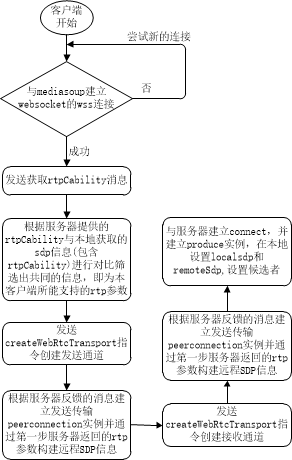

客户端代码启动后，首先建立websocket实例，并与服务器建立连接，连接地址为`wss://127.0.0.1:4443+/?roomId=1&peerId=adbd25k1`, 其中在mediasoup中wss端口固定4443，roomid自选，peerid为随机的，位数不定。连接如果成功，则代表我们客户端后续可以与之进行信令的交互，连接成功是系统正常运行的必要条件。  

正常的P2P情况是我本地生成SDP信息，然后设置本地SDP信息，再发送至远端，远端处理后获取远端的SDP信息发送至本端，然后设置远程SDP信息的。多人互动mediasoup服务器与本端连接过程也会进行这一步，只不过在一开始我们就需要先获取到服务器所能支持的**rtp参数**(参数包括服务器支持的音频编码格式，视频编码格式，rtp扩展头等信息)。因此websocket连接成功的第一件事便是发送获取rtpcability信息的指令，指令为json格式字符串：

```
客户端请求服务端rtp参数
{
    "data": {},
    "id": 1185,
    "method": "getRouterRtpCapabilities",
    "request": true
}

收到请求后服务器node.js返回的rtp参数
{
    "response": true,
    "id": 41,
    "ok": true,
    "data": {
        "codecs": [
            {
                "kind": "audio",
                "mimeType": "audio/opus",
                "clockRate": 48000,
                "channels": 2,
                "rtcpFeedback": [
                    {
                        "type": "transport-cc",
                        "parameter": ""
                    }
                ],
                "parameters": {},
                "preferredPayloadType": 100
            },
            {
                "kind": "video",
                "mimeType": "video/VP8",
                "clockRate": 90000,
                "rtcpFeedback": [
                    {
                        "type": "nack",
                        "parameter": ""
                    },
                    {
                        "type": "nack",
                        "parameter": "pli"
                    },
                    {
                        "type": "ccm",
                        "parameter": "fir"
                    },
                    {
                        "type": "goog-remb",
                        "parameter": ""
                    },
                    {
                        "type": "transport-cc",
                        "parameter": ""
                    }
                ],
                "parameters": {
                    "x-google-start-bitrate": 1000
                },
                "preferredPayloadType": 101
            },
            {
                "kind": "video",
                "mimeType": "video/rtx",
                "preferredPayloadType": 102,
                "clockRate": 90000,
                "parameters": {
                    "apt": 101
                },
                "rtcpFeedback": []
            },
            {
                "kind": "video",
                "mimeType": "video/VP9",
                "clockRate": 90000,
                "rtcpFeedback": [
                    {
                        "type": "nack",
                        "parameter": ""
                    },
                    {
                        "type": "nack",
                        "parameter": "pli"
                    },
                    {
                        "type": "ccm",
                        "parameter": "fir"
                    },
                    {
                        "type": "goog-remb",
                        "parameter": ""
                    },
                    {
                        "type": "transport-cc",
                        "parameter": ""
                    }
                ],
                "parameters": {
                    "profile-id": 2,
                    "x-google-start-bitrate": 1000
                },
                "preferredPayloadType": 103
            },
            {
                "kind": "video",
                "mimeType": "video/rtx",
                "preferredPayloadType": 104,
                "clockRate": 90000,
                "parameters": {
                    "apt": 103
                },
                "rtcpFeedback": []
            },
            {
                "kind": "video",
                "mimeType": "video/H264",
                "clockRate": 90000,
                "parameters": {
                    "packetization-mode": 1,
                    "level-asymmetry-allowed": 1,
                    "profile-level-id": "4d0032",
                    "x-google-start-bitrate": 1000
                },
                "rtcpFeedback": [
                    {
                        "type": "nack",
                        "parameter": ""
                    },
                    {
                        "type": "nack",
                        "parameter": "pli"
                    },
                    {
                        "type": "ccm",
                        "parameter": "fir"
                    },
                    {
                        "type": "goog-remb",
                        "parameter": ""
                    },
                    {
                        "type": "transport-cc",
                        "parameter": ""
                    }
                ],
                "preferredPayloadType": 105
            },
            {
                "kind": "video",
                "mimeType": "video/rtx",
                "preferredPayloadType": 106,
                "clockRate": 90000,
                "parameters": {
                    "apt": 105
                },
                "rtcpFeedback": []
            },
            {
                "kind": "video",
                "mimeType": "video/H264",
                "clockRate": 90000,
                "parameters": {
                    "packetization-mode": 1,
                    "level-asymmetry-allowed": 1,
                    "profile-level-id": "42e01f",
                    "x-google-start-bitrate": 1000
                },
                "rtcpFeedback": [
                    {
                        "type": "nack",
                        "parameter": ""
                    },
                    {
                        "type": "nack",
                        "parameter": "pli"
                    },
                    {
                        "type": "ccm",
                        "parameter": "fir"
                    },
                    {
                        "type": "goog-remb",
                        "parameter": ""
                    },
                    {
                        "type": "transport-cc",
                        "parameter": ""
                    }
                ],
                "preferredPayloadType": 107
            },
            {
                "kind": "video",
                "mimeType": "video/rtx",
                "preferredPayloadType": 108,
                "clockRate": 90000,
                "parameters": {
                    "apt": 107
                },
                "rtcpFeedback": []
            }
        ],
        "headerExtensions": [
            {
                "kind": "audio",
                "uri": "urn:ietf:params:rtp-hdrext:sdes:mid",
                "preferredId": 1,
                "preferredEncrypt": false,
                "direction": "sendrecv"
            },
            {
                "kind": "video",
                "uri": "urn:ietf:params:rtp-hdrext:sdes:mid",
                "preferredId": 1,
                "preferredEncrypt": false,
                "direction": "sendrecv"
            },
            {
                "kind": "video",
                "uri": "urn:ietf:params:rtp-hdrext:sdes:rtp-stream-id",
                "preferredId": 2,
                "preferredEncrypt": false,
                "direction": "recvonly"
            },
            {
                "kind": "video",
                "uri": "urn:ietf:params:rtp-hdrext:sdes:repaired-rtp-stream-id",
                "preferredId": 3,
                "preferredEncrypt": false,
                "direction": "recvonly"
            },
            {
                "kind": "audio",
                "uri": "http://www.webrtc.org/experiments/rtp-hdrext/abs-send-time",
                "preferredId": 4,
                "preferredEncrypt": false,
                "direction": "sendrecv"
            },
            {
                "kind": "video",
                "uri": "http://www.webrtc.org/experiments/rtp-hdrext/abs-send-time",
                "preferredId": 4,
                "preferredEncrypt": false,
                "direction": "sendrecv"
            },
            {
                "kind": "audio",
                "uri": "http://www.ietf.org/id/draft-holmer-rmcat-transport-wide-cc-extensions-01",
                "preferredId": 5,
                "preferredEncrypt": false,
                "direction": "recvonly"
            },
            {
                "kind": "video",
                "uri": "http://www.ietf.org/id/draft-holmer-rmcat-transport-wide-cc-extensions-01",
                "preferredId": 5,
                "preferredEncrypt": false,
                "direction": "sendrecv"
            },
            {
                "kind": "video",
                "uri": "http://tools.ietf.org/html/draft-ietf-avtext-framemarking-07",
                "preferredId": 6,
                "preferredEncrypt": false,
                "direction": "sendrecv"
            },
            {
                "kind": "video",
                "uri": "urn:ietf:params:rtp-hdrext:framemarking",
                "preferredId": 7,
                "preferredEncrypt": false,
                "direction": "sendrecv"
            },
            {
                "kind": "audio",
                "uri": "urn:ietf:params:rtp-hdrext:ssrc-audio-level",
                "preferredId": 10,
                "preferredEncrypt": false,
                "direction": "sendrecv"
            },
            {
                "kind": "video",
                "uri": "urn:3gpp:video-orientation",
                "preferredId": 11,
                "preferredEncrypt": false,
                "direction": "sendrecv"
            },
            {
                "kind": "video",
                "uri": "urn:ietf:params:rtp-hdrext:toffset",
                "preferredId": 12,
                "preferredEncrypt": false,
                "direction": "sendrecv"
            }
        ]
    }
}
```

id是随机random()生成的，method固定，request=true;服务器返回给本端的将是服务器所能支持的音视频**rtp参数**。本端拿到这个参数后，获取本地所能支持的rtp参数(即sdp信息)，与服务器的参数对比，筛选出两者共同，共同的rtp参数即我本端和服务器端都可以编解码音视频的参数，如果服务器发送的音视频编码器不在这个共同的rtp参数范围，则无法正确解码。到此，我们通过服务器返回的rtp参数能够筛选出客户端可支持解码的rtp参数，但是服务器还无法知道我这个客户端到底支持哪些，所以之后我们会将本地客户端的rtp参数发送给服务器。  

接下来获取服务器的ICE、ICE候选者、DTLS参数并创建本地发送传输，通过发送服务器创建createWebrtcTransport命令使得服务器worker进程创建对应的传输通道。

```
{
    "data": {
        "consuming": false,
        "forceTcp": false,
        "producing": true,
        "sctpCapabilities": ""
    },
    "id": 13416,
    "method": "createWebRtcTransport",
    "request": true
}
```

由于我们是创建了发送传输实例，目的是发送本端音视频媒体流到服务器，属于产生媒体流的一端(produce)，因此命令中consuming=false，producing=true，forceTcp=false表是不支持TCP候选者。id=随机rondom产生，method固定，request=true属于请求命令，这个请求命令的目的是通知服务器端为接收我本端的媒体流创建相应的实例，该创建的UDP连接的创建，该创建的TCP连接创建，该创建的DTLS传输实例创建好等，这些实例在服务器端通称webrtcTransport实例。  

服务器收到指令后，会返回服务器的ICE参数iceParameters、ICE候选者iceCandidates、DTLS参数dtlsParameters：

```
{
    "response": true,
    "id": 4004,
    "ok": true,
    "data": {
        "id": "7353c883-a852-431c-8c83-089885cbb10a",
        "iceParameters": {
            "iceLite": true,
            "password": "wmczw9u1xhw6xkab5f5stuzm2ulvq5zo",
            "usernameFragment": "rpr6vopks8vh0rxq"
        },
        "iceCandidates": [
            {
                "foundation": "udpcandidate",
                "ip": "172.16.52.185",
                "port": 47274,
                "priority": 1076302079,
                "protocol": "udp",
                "type": "host"
            }
        ],
        "dtlsParameters": {
            "fingerprints": [
                {
                    "algorithm": "sha-1",
                    "value": "81:D0:09:6A:81:54:50:CE:68:34:92:28:42:AD:B6:CE:C6:CD:2C:AE"
                },
                {
                    "algorithm": "sha-224",
                    "value": "04:F3:C6:F4:02:A3:D0:F7:EB:E2:83:F3:64:5C:95:FE:74:0E:91:CB:91:1E:E5:AD:06:67:BC:76"
                },
                {
                    "algorithm": "sha-256",
                    "value": "60:3D:22:F5:F6:42:15:0D:AF:F4:39:C1:DB:49:6A:48:9A:61:D5:FF:A3:06:4E:37:D5:E0:5B:E9:9D:09:81:09"
                },
                {
                    "algorithm": "sha-384",
                    "value": "6D:E8:47:FA:D6:BC:44:CC:29:7D:7F:DB:64:7B:E9:0B:F7:2F:A3:E6:50:DE:D3:74:85:DD:A0:4A:D6:AB:E8:CA:07:01:D4:46:1A:CA:7B:1D:A7:90:BF:5B:01:50:4B:8D"
                },
                {
                    "algorithm": "sha-512",
                    "value": "C7:ED:F5:4F:4D:3D:0E:8B:53:A5:CE:E5:58:54:7F:C6:60:3B:78:47:46:2D:24:35:46:F4:E7:69:6B:FB:C4:C0:EE:E0:7E:14:F6:6A:CF:F4:82:45:F5:D4:B5:EC:8C:35:62:74:9F:C8:70:DD:AB:55:F4:4D:51:FD:F0:C8:2F:3F"
                }
            ],
            "role": "auto"
        }
    }
}
```

其中iceLite=true表明服务器的iceLITE实现(当做为服务器时，有公网IP的情况下，申明我是LITE，就不需要connectivity check，由客户端来check)。根据服务器返回的参数我们在客户端也需要创建连接实例(就如webrtc中的P2P，首先需要创建peerconnection实例，在这个实例中同时实现音视频的发送与接收，但在基于mediasoup服务器的互动会议中，我们将接收和发送实现分离，即在同一个客户端，发送音视频会建立一个peerconnection实例，接收音视频也会建立一个peerconnection实例，两个实例之间没有交叉点)。  

发送和接收的peerconnection实例都创建好后，对于发送音视频媒体流端需要创建音视频轨并添加音视频轨，然后通过api获取本地sdp，提取出dtls参数，本端dtls是作为服务器端的，mediasoup端的dtls作为客户端，创建信令命令发送服务区创建connectWebRtcTransport，主要目的是将本端的dtls参数发往服务器，具体服务器如何操作，看后面的服务器行为：

```
{
    "data": {
        "dtlsParameters": {
            "fingerprints": [
                {
                    "algorithm": "sha-256",
                    "value": "83:3A:AC:24:6B:DD:DF:68:14:FE:1A:F7:85:45:E7:62:A4:DD:12:E8:75:7A:33:19:3A:4E:B5:A7:32:3F:8F:28"
                }
            ],
            "role": "server"
        },
        "transportId": "2726b1d9-bafb-49f6-a418-885bb84ce762"
    },
    "id": 32164,
    "method": "connectWebRtcTransport",
    "request": true
}
```

信令消息发送后设置本地SDP信息和远程SDP信息，然后将本端的rtp参数发送到服务器让服务器知道我这一端支持什么音视频编解码，rtp扩展头，拥塞控制策略等等。收到此信令消息服务器会创建produce实例用于媒体流接收，服务器收到本地参数后的处理看后面的服务器行为。信令消息：

```
{
    "data": {
        "appData": {},
        "kind": "audio",
        "rtpParameters": {
            "codecs": [
                {
                    "channels": 2,
                    "clockRate": 48000,
                    "mimeType": "audio/opus",
                    "parameters": {
                        "minptime": 10,
                        "sprop-stereo": 1,
                        "usedtx": 1,
                        "useinbandfec": 1
                    },
                    "payloadType": 111,
                    "rtcpFeedback": [
                        {
                            "parameter": "",
                            "type": "transport-cc"
                        }
                    ]
                }
            ],
            "encodings": [
                {
                    "dtx": false,
                    "ssrc": 1561096710
                }
            ],
            "headerExtensions": [
                {
                    "encrypt": false,
                    "id": 4,
                    "parameters": {},
                    "uri": "urn:ietf:params:rtp-hdrext:sdes:mid"
                },
                {
                    "encrypt": false,
                    "id": 2,
                    "parameters": {},
                    "uri": "http://www.webrtc.org/experiments/rtp-hdrext/abs-send-time"
                },
                {
                    "encrypt": false,
                    "id": 3,
                    "parameters": {},
                    "uri": "http://www.ietf.org/id/draft-holmer-rmcat-transport-wide-cc-extensions-01"
                },
                {
                    "encrypt": false,
                    "id": 1,
                    "parameters": {},
                    "uri": "urn:ietf:params:rtp-hdrext:ssrc-audio-level"
                }
            ],
            "mid": "0",
            "rtcp": {
                "cname": "",
                "reducedSize": true
            }
        },
        "transportId": "0edfa440-1263-47c9-bd98-656b35cb43da"
    },
    "id": 30561,
    "method": "produce",
    "request": true
}
```

至此客户端与服务器交互流程已经完成，客户端与服务器进行流媒体的相互传输前提已经建立，此时客户端的媒体流数据就可以发送到服务器了，后续就是服务器处理音视频拥塞和转发。

可能有人会很疑惑，我看webrtc中的P2P传输的例程peerconnectionclient源码，发现这里少了一步，没有收集本端候选者以及获取远端候选者并设置远端候选者。这里解析一下，mediasoup服务器是ice-lite模式，服务器本身不需要收集候选者，而是拿现成的，是通过外部获取映射后的公网IP或局域网ip，然后在在config.js中设置即可，我们使用的是webRtcTransport，因此在该标签下设置如下

```
webRtcTransportOptions :
        {
            listenIps :
            [
                {
                    ip          : '**.**.**.**',//服务器本地映射ip
                    announcedIp : null  //映射ip
                }
            ],
            initialAvailableOutgoingBitrate : 1000000,
            minimumAvailableOutgoingBitrate : 600000,
            maxSctpMessageSize              : 262144,
            // Additional options that are not part of WebRtcTransportOptions.
            maxIncomingBitrate              : 1500000
        },
```

在我们创建发送传输通道时，服务器返回给我们ice，ice参数和dtls参数，这些参数都用来生成远程sdp信息的，因此远程sdp中多了一项ICE候选者，正常来说ice候选者也是sdp格式发送，只是和本地sdp信息分开，但是这里是放在一起的。发送通道设置远程sdp时同时应用了ICE候选者，接收通道设置本地SDP时同时应用了ICE候选者。远程SDP如下：

```
v=0
o=libmediasoupclient 10000 1 IN IP4 0.0.0.0
s=-
t=0 0
a=ice-lite
a=fingerprint:sha-512 6B:0C:C8:5B:C1:E2:E5:03:9F:BD:28:DB:B8:DC:DE:EC:52:CC:52:64:57:5F:4E:5F:04:39:DF:9B:C4:93:0D:71:5A:36:1F:FA:38:69:DD:13:A5:5C:12:EF:71:7F:D7:49:4C:FF:5C:E7:05:DD:FA:A3:B7:EC:C1:4A:E7:C9:63:B3
a=msid-semantic: WMS *
a=group:BUNDLE 0
m=audio 7 UDP/TLS/RTP/SAVPF 111
c=IN IP4 127.0.0.1
a=rtpmap:111 opus/48000/2
a=fmtp:111 stereo=1;usedtx=1
a=rtcp-fb:111 transport-cc
a=extmap:4 urn:ietf:params:rtp-hdrext:sdes:mid
a=extmap:2 http://www.webrtc.org/experiments/rtp-hdrext/abs-send-time
a=extmap:3 http://www.ietf.org/id/draft-holmer-rmcat-transport-wide-cc-extensions-01
a=extmap:1 urn:ietf:params:rtp-hdrext:ssrc-audio-level
a=setup:active
a=mid:0
a=recvonly
a=ice-ufrag:14ijdfdwdmj66i9r
a=ice-pwd:2db8mc212ng7jjuw7201zpnuvslo0gfh
a=candidate:udpcandidate 1 udp 1076302079 172.16.52.185 40223 typ host
a=end-of-candidates
a=ice-options:renomination
a=rtcp-mux
a=rtcp-rsize
```

本端拿到ICE候选者后，与候选者ip地址创建UDP连接并开始发送ping(ping消息是一个stun请求)检测连通性，收到stun回应表明互通条件满足，然后等待服务器建立DTLS传输通道(因为此时服务器的dtls是作为客户端角色的)，DTLS交换双方密钥(在webrtc中媒体流加密的密钥是对rtp流加密)后，将客户端支持的密钥发送到服务端，服务器支持的密钥发送到客户端，这样双方都可以正确的解密了，至此连接通道打通，音视频流可以正常互通。  

## 二、服务器worker进程行为

服务器有两部分构成，node.js和c++ worker，node.js主要实现信令交互(相当于p2p中的信令服务器)，房间管理。worker主要实现媒体流的处理。先从最外层说起，一个worker模块中主要包含两大块：管道通信模块和Router模块，管道通信模块是实现node.js和worker之间的消息交互，和worker与worker之间的信息交互；Router为一个房间中所有参会者媒体流的处理，一个房间对应一个Router，一个worker中可创建多个router。  

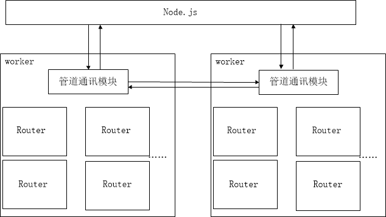

客户端-node.js-worker之间的交互过程可以按照如下流程图：

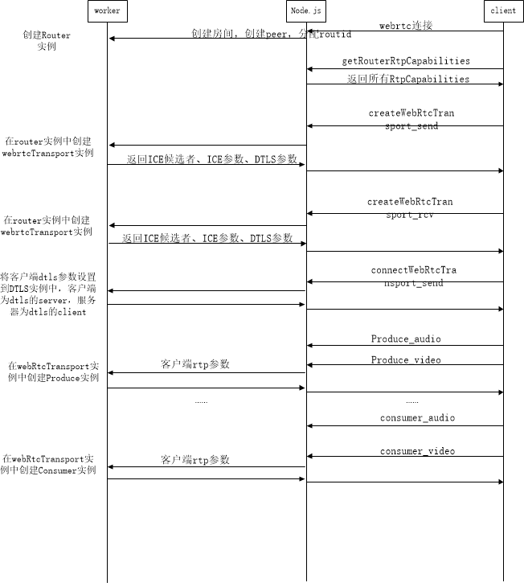

在客户端与服务器创建websocket连接时会带入房间号roomid和peerid参数，如：`wss://127.0.0.1:4443+/?roomId=1&peerId=adbd25k1` 。node.js会创建room，并为Router分配随机32位RouteId，标识room与router对应关系，并告知worker创建Router实例，此时一个房间的外层结构框架已经完成。  

连接成功后客户端会要求服务器返回支持的所有rtp参数，node.js会结合配置文件config.js整理一份rtp参数发送到客户端，这一步只在node.js中完成。接着客户端发送创建webrtcTransport通道，包括发送和接收两个。node.js接收后整理一下发送worker信令消息，如下：

```
{
    "id":5,//随机ID，用于接收端识别正确的发送回应
    "method":"router.createWebRtcTransport",//告知worker在router实例下创建webrtctransport实例
    "internal":{
        "routerId":"5ce4b1bd-7714-4a95-a09a-38c34e08945c",//webrtctransport实例所在的router实例下，根据对应id查找router
        "transportId":"d0ac44ba-1e4e-4ca4-a3a4-d69ccec15a32"//node.js为webrtctransport实例分配的随机ID唯一标识
    },
    "data":{
        "listenIps":[
            {
                "ip":"172.16.52.46"//ICE 候选者IP，端口由服务器分配然后返回给客户端，注意这个ip是在mediasoup的配置文件中配置
            }
        ],
        "enableUdp":true,//是否使用UDP候选者
        "enableTcp":false,//是否使用TCP候选者
        "preferUdp":false,//是否优先考虑UDP，对候选者优先级别有所以体现
        "preferTcp":false,//是否优先考虑TCP，对候选者优先级别有所以体现
        "initialAvailableOutgoingBitrate":1000000,//初始化服务器输出码率
        "enableSctp":false,//是否支持SCTP数据通道
        "numSctpStreams":{//如果支持SCTP数据通道，将应用这个参数
            "OS":1024,
            "MIS":1024
        },
        "maxSctpMessageSize":262144,//如果支持SCTP数据通道，将应用这个参数，如果支持，表示每个SCTP消息最大字节数
        "sctpSendBufferSize":262144,//表示每个SCTP发送最大字节数
        "isDataChannel":true //是否支持数据通道
    }
}
```

在webrtcTransport实例创建过程，会进行一些实例的创建，可以看下图，根据配置创建候选者，并创建其UDP或TCP的socket服务端，用与监听客户端的联通检查、ping消息、音视频媒体数据流RTP、音视频媒体控制流RTCP，DTLS消息。同时也创建ICE服务和DTLS传输实例。最后将创建好的ICE参数、ICE候选者和DTLS参数返回给客户端。  

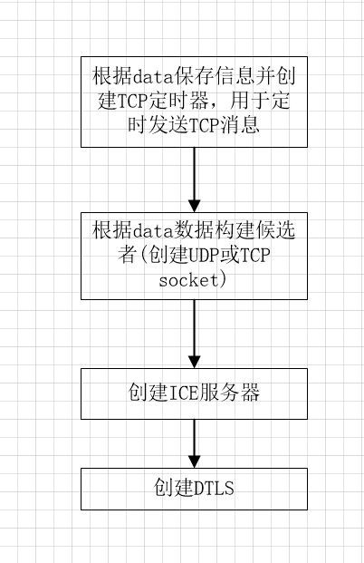

客户端接着希望与服务端worker的webrtcTransport建立连接通道，发送客户但的dlts到服务器，服务器接收到connectWebRtcTransport后提取客户端的dtls参数，并将其设置到dtls实例中，至此C-S双方都获取到了互相的dtls参数。对于客户端发送媒体流时，其dtls的角色为`dtls_server`，mediasoup作为媒体流接收端来说dtls角色为`dtls_client`；对于客户端接收媒体流时，其dtls的角色为`dtls_client`，mediasoup作为媒体流发送端来说dtls角色为`dtls_server`。`dtls_client`总是主动发起连接的。此时服务器的dtls还会尝试去dtls握手，但是肯定是失败的，因为客户端还没有走到设置远程sdp的那一步，无法获悉服务端的候选者对，无法与服务器建立传输通道，因此服务器端的ice服务还是处于断开状态，只有ICE服务状态变为连接状态，才可以尝试dtls握手，dtls也是建立在ice通道上的。

Route实例的框架如下图所示：

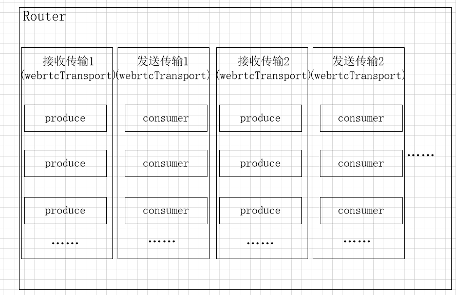

上文提到过一个Route对应一个房间，每个房间可能有很多的参会者，每个参会者都会建立发送传输和接收传输，即图中的webRtcTransport实例，对于发送传输，每个参会者都会将音视频媒体流发送到服务器，服务器为每个流创建一个produce用于接收数据，如音频流会创建produce，视频也会创建produce，两者分开；每个参会者都会接收来自服务器的音视频媒体流，服务器为每个流创建一个consumer用于转发数据，如音频流会创建consumer，视频也会创建consumer，两者分开。所以在Route里面会有多个发送和接收实例，每个发送实例中有至少一个consumer实例，每个接收实例中至少一个produce实例。  

客户端发送完connectWebRtcTransport后，告知服务器产生produce实例，用于准备接收客户端流媒体数据。服务器收到的信令消息如下。服务器获取到rtp参数后，创建produce实例，并保存客户端的rtp参数，需要根据客户端rtp参数中rtcpFeedback中type指定的拥塞控制策略建立拥塞控制服务器实例(对于接收媒体流端为拥塞控制server)来控制rtp流，如下消息中为transport-cc，因此创建tcc，如果为remb，则创建goog-remb，接收端的拥塞控制主要是向发送端发送RTPFB的RTCP报文，具体如何实现，在[mediasoup服务器转发流媒体数据及发送拥塞控制](https://blog.csdn.net/qq_22658119/article/details/118611861)中详细分析。

```
{
    "id":12,
    "method":"transport.produce",
    "internal":{
        "routerId":"2342606c-de05-4354-a822-edb55f8e2345",//produce实例所在的router实例ID
        "transportId":"73fcd90d-1086-4244-aacd-84211da7f775",//produce实例所在的transport实例ID
        "producerId":"1b5b2f10-2d71-4cc4-918e-348fe9ac4c8a"//node.js为worker分配的随机produce实例ID
    },
    "data":{
        "kind":"audio",//音频类型
        "rtpParameters":{//客户端rtp参数
            "codecs":[
                {
                    "channels":2,
                    "clockRate":48000,
                    "mimeType":"audio/opus",
                    "parameters":{
                        "minptime":10,
                        "sprop-stereo":1,
                        "usedtx":1,
                        "useinbandfec":1
                    },
                    "payloadType":111,
                    "rtcpFeedback":[
                        {
                            "parameter":"",
                            "type":"transport-cc"
                        }
                    ]
                }
            ],
            "encodings":[
                {
                    "dtx":false,
                    "ssrc":1593891542
                }
            ],
            "headerExtensions":[
                {
                    "encrypt":false,
                    "id":4,
                    "parameters":{
                    },
                    "uri":"urn:ietf:params:rtp-hdrext:sdes:mid"
                },
                {
                    "encrypt":false,
                    "id":2,
                    "parameters":{
                    },
                    "uri":"http://www.webrtc.org/experiments/rtp-hdrext/abs-send-time"
                },
                {
                    "encrypt":false,
                    "id":3,
                    "parameters":{
                    },
                    "uri":"http://www.ietf.org/id/draft-holmer-rmcat-transport-wide-cc-extensions-01"
                },
                {
                    "encrypt":false,
                    "id":1,
                    "parameters":{
                    },
                    "uri":"urn:ietf:params:rtp-hdrext:ssrc-audio-level"
                }
            ],
            "mid":"0",
            "rtcp":{
                "cname":"6daec41b",
                "reducedSize":true
            }
        },
        "rtpMapping":{
            "codecs":[
                {
                    "payloadType":111,
                    "mappedPayloadType":100
                }
            ],
            "encodings":[
                {
                    "mappedSsrc":859353967,
                    "ssrc":1593891542
                }
            ]
        },
        "paused":false
    }
}
```

至此，客户端与服务器端建立连接的信令交互已经完成，但是这里没有体现出来数据怎么能够到服务器。在客户端希望服务器创建接收我的媒体流时，会发送produce消息给服务器，同时设置本地SDP，和远程SDP，其中远程SDP中包含了服务器返回的ICE候选者IP和端口对。客户端在设置远程SDP信息后，应用其中的ICE候选者，对候选者Ping进行连通性检测，这个Ping消息就是STUN请求消息，服务器收到STUN请求，正确且可以解析后，发送stun成功回应，ICE服务状态变为connected，然后再一次进行DTLS握手，握手成功后，DTLS交换密钥，DTLS状态变为connected，一旦DTLS状态变为connected，客户端和服务器的传输通道彻底打通，客户端的数据就可以无阻碍到达服务器，数据到达服务器后，转发到所有的consumer，具体细节在[mediasoup服务器接收流媒体数据及接收拥塞控制](https://blog.csdn.net/qq_22658119/article/details/118611843)和[mediasoup服务器转发流媒体数据及发送拥塞控制](https://blog.csdn.net/qq_22658119/article/details/118611861)中已详细介绍。

<hr>

#### <p>原文出处：<a href='https://blog.csdn.net/qq_22658119/article/details/118611843' target='blank'>mediasoup服务器接收流媒体数据及接收拥塞控制</a></p>

webrtc服务器mediasoup即是媒体流的接收方也是媒体流的发送方，还是控制消息的转发方，作为接收方要接收音视频数据，码率统计，接收发送方发来的RTCP(SR,SDES等)包，给发送方发送RTPFB包及时反馈接收情况；作为发送方，要给接收方发送RTCP报告，处理接收方发来的RTPFB包，发送拥塞控制；作为控制拥塞消息转发方，需要流媒体数据的接收方发来的消息请求（如PSFB反馈请求I帧）然后处理转发给流媒体数据的发送方。这里讨论mediasoup作为接收方如何处理。

## 一、接收音视频数据

接收到的音视频数据是SRTP，因此需要先解密成RTP，解密密钥就是在DTLS相互交换的密钥。  

### 1.1、发送RTPFB反馈包(TRANSPORT_CC)

将RTP包先输入到传输拥塞控制服务模块处理，mediasoup拥塞控制有两种BweType类型：TRANSPORT_CC和REMB，根据客户端rtp参数种rtcpfeedback参数对应。RTFB包结构示意图如下图所示

```
0               1               2               3
0 1 2 3 4 5 6 7 0 1 2 3 4 5 6 7 0 1 2 3 4 5 6 7 0 1 2 3 4 5 6 7
+-+-+-+-+-+-+-+-+-+-+-+-+-+-+-+-+-+-+-+-+-+-+-+-+-+-+-+-+-+-+-+-+
|V=2|P|  FMT=15 |    PT=205     |           length              |
+-+-+-+-+-+-+-+-+-+-+-+-+-+-+-+-+-+-+-+-+-+-+-+-+-+-+-+-+-+-+-+-+
|                     SSRC of packet sender                     |
+-+-+-+-+-+-+-+-+-+-+-+-+-+-+-+-+-+-+-+-+-+-+-+-+-+-+-+-+-+-+-+-+
|                      SSRC of media source                     |
+-+-+-+-+-+-+-+-+-+-+-+-+-+-+-+-+-+-+-+-+-+-+-+-+-+-+-+-+-+-+-+-+
|      base sequence number     |      packet status count      |
+-+-+-+-+-+-+-+-+-+-+-+-+-+-+-+-+-+-+-+-+-+-+-+-+-+-+-+-+-+-+-+-+
|                 reference time                | fb pkt. count |
+-+-+-+-+-+-+-+-+-+-+-+-+-+-+-+-+-+-+-+-+-+-+-+-+-+-+-+-+-+-+-+-+
|          packet chunk         |         packet chunk          |
+-+-+-+-+-+-+-+-+-+-+-+-+-+-+-+-+-+-+-+-+-+-+-+-+-+-+-+-+-+-+-+-+
.                                                               .
.                                                               .
+-+-+-+-+-+-+-+-+-+-+-+-+-+-+-+-+-+-+-+-+-+-+-+-+-+-+-+-+-+-+-+-+
|         packet chunk          |  recv delta   |  recv delta   |
+-+-+-+-+-+-+-+-+-+-+-+-+-+-+-+-+-+-+-+-+-+-+-+-+-+-+-+-+-+-+-+-+
.                                                               .
.                                                               .
+-+-+-+-+-+-+-+-+-+-+-+-+-+-+-+-+-+-+-+-+-+-+-+-+-+-+-+-+-+-+-+-+
|           recv delta          |  recv delta   | zero padding  |
+-+-+-+-+-+-+-+-+-+-+-+-+-+-+-+-+-+-+-+-+-+-+-+-+-+-+-+-+-+-+-+-+
*/
```

**FMT**对应值如下：  

```
NACK = 1,  
TMMBR = 3,  
TMMBN = 4,  
SR_REQ = 5,  
RAMS = 6,  
TLLEI = 7,  
ECN = 8,  
PS = 9,  
TCC = 15,  
EXT = 31  
```

**SSRC of packet sender** : 表示RTFB发送包所在所对应的流ssrc，ssrc=0，不单独创建一个会话来发送RTFB。  

**SSRC of media source** ：表示RTFB接收方对应的流ssrc，不是所有的流都可以用这个RTFB的，音频1是音频1接收，音频2是音频2接收，视频是视频接收，互不影响 

**base sequence number**：基础序列号，上一个RTPFB包发送后接收的第一个包的序列号+1，作为下一个RTPFB包中的基础序列号；

**packet status count** ：拥塞控制方对于接收数据包状态产生的状态包计数，后面讨论什么是状态包；  

**reference time** ：参考时间，为构造当前rtfp时第一个数据包的到达时间；  

**fb pkt. count**：已经发送到指定发送方的RTPFB个数；  

**packet chunk**：状态包；  

**recv delta**：接收相邻包的时间间隔；  

**zero padding**：填充0，确保4字节对齐；

首先提取RTP包中的wideSequnencNumer(由rtp扩展头中携带)和ssrc，ssrc设置到SSRC of media source

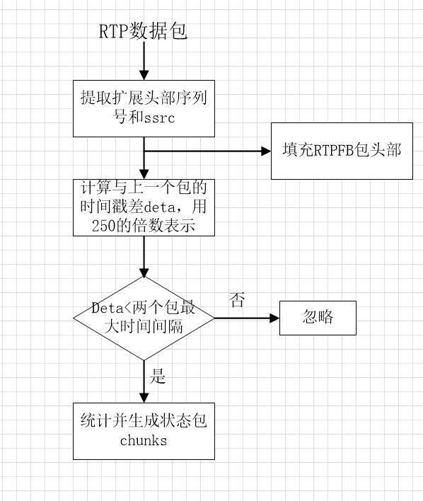  

**生成RTPFB状态包chunks**

状态包即每收到一个数据包，都会将包分配一个状态status，状态取决于本次收到的包与上一次收到的包的时间戳差值delta和本次包序列号与上一次接收包的序列号的差值+1，判断丢包；状态有5种：NotReceived = 0表示丢失的包,SmallDelta=1表示时间差值delta范围为(0,255),LargeDelta=2表示时间差值delta大于255范围,Reserved=3保留,None=4表示初始状态；  

包状态和时间戳差值均保存到队列，只要队列中超过7个包状态就创建一个chunks；  

有两种chunks：  

RunLenghtChunk：表示收到的连续7个包的状态是一致  

TwoBitVectorChunks：表示包的状态不一样时创建。  

创建chunk后包状态队列清除，且当前状态初始化None，继续下一组。代码如下：

```cpp
void FeedbackRtpTransportPacket::FillChunk(//根据包来统计并创建状态包chunks
	uint16_t previousSequenceNumber, uint16_t sequenceNumber, int16_t delta)
{
	MS_TRACE();
	auto missingPackets = static_cast<uint16_t>(sequenceNumber - (previousSequenceNumber + 1));//根据序列号连续性判断丢包数
	if (missingPackets > 0)
	{
		// Create a long run chunk before processing this packet, if needed.
		if (this->context.statuses.size() >= 7 && this->context.allSameStatus)
		{
			CreateRunLengthChunk(this->context.currentStatus, this->context.statuses.size());
			this->context.statuses.clear();
			this->context.currentStatus = Status::None;
		}
		this->context.currentStatus = Status::NotReceived;
		size_t representedPackets{ 0u };
		// Fill statuses vector.
		for (uint8_t i{ 0u }; i < missingPackets && this->context.statuses.size() < 7; ++i)
		{
			this->context.statuses.emplace_back(Status::NotReceived);
			representedPackets++;
		}
		// Create a two bit vector if needed.
		if (this->context.statuses.size() == 7)
		{
			// Fill a vector chunk.
			CreateTwoBitVectorChunk(this->context.statuses);
			this->context.statuses.clear();
			this->context.currentStatus = Status::None;
		}
		missingPackets -= representedPackets;
		// Not all missing packets have been represented.
		if (missingPackets != 0)
		{
			// Fill a run length chunk with the remaining missing packets.
			CreateRunLengthChunk(Status::NotReceived, missingPackets);
			this->context.statuses.clear();
			this->context.currentStatus = Status::None;
		}
	}
	Status status;
	if (delta >= 0 && delta <= 255)
		status = Status::SmallDelta;//
	else
		status = Status::LargeDelta;
	// Create a long run chunk before processing this packet, if needed.
	// clang-format off
	if (
		this->context.statuses.size() >= 7 &&
		this->context.allSameStatus &&
		status != this->context.currentStatus
	)
	// clang-format on
	{
		CreateRunLengthChunk(this->context.currentStatus, this->context.statuses.size());
		this->context.statuses.clear();
	}
	this->context.statuses.emplace_back(status);
	this->deltas.push_back(delta);
	this->deltasAndChunksSize += (status == Status::SmallDelta) ? 1u : 2u;
	// Update context info.
	// clang-format off
	if (
		this->context.currentStatus == Status::None ||
		(this->context.allSameStatus && this->context.currentStatus == status)
	)
	// clang-format on
	{
		this->context.allSameStatus = true;
	}
	else
	{
		this->context.allSameStatus = false;
	}
	this->context.currentStatus = status;
	// Not enough packet infos for creating a chunk.
	if (this->context.statuses.size() < 7)
	{
		return;
	}
	// 7 packet infos with heterogeneous status, create the chunk.
	else if (this->context.statuses.size() == 7 && !this->context.allSameStatus)
	{
		// Reset current status.
		this->context.currentStatus = Status::None;
		// Fill a vector chunk and return.
		CreateTwoBitVectorChunk(this->context.statuses);
		this->context.statuses.clear();
	}
}
```

接收拥塞控制模块会按固定时间间隔向发送方发送反馈包，固定时间为100毫秒，超时时间100毫秒，按照RTPFB报文格式填充并发送。  

### 1.2、发送RTPFB反馈包(REMB)
还研究，后续会补上

### 1.3、数据包码率与丢包统计

包统计计算流程如下：  

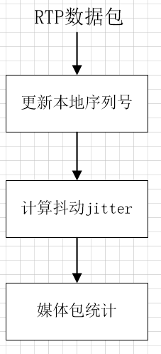  

计算抖动方法：

```cpp
void RtpStreamRecv::CalculateJitter(uint32_t rtpTimestamp)//rtpTimestamp包的时间戳
{
	MS_TRACE();
	if (this->params.clockRate == 0u)
		return;
	auto transit =//包发送的时间与包接收时间的差
		static_cast<int>(DepLibUV::GetTimeMs() - (rtpTimestamp * 1000 / this->params.clockRate));
	int d = transit - this->transit;//本次包的延时接收时间与上一个包的延时接收时间差
	// First transit calculation, save and return.
	if (this->transit == 0)
	{
		this->transit = transit;
		return;
	}
	this->transit = transit;
	if (d < 0)
		d = -d;
	this->jitter += (1. / 16.) * (static_cast<double>(d) - this->jitter);
}
```

媒体包统计：统计接受的数据包码率和包计数。

```cpp
void RtpDataCounter::Update(RTC::RtpPacket* packet)
{
	uint64_t nowMs = DepLibUV::GetTimeMs();
	this->packets++;//统计接收的数据包个数
	this->rate.Update(packet->GetSize(), nowMs);//统计接收数据包的码率
}
```

### 1.3、数据包转发到其他消费者

包转发时mediasoup是作为媒体流发送方角色的，[mediasoup服务器转发流媒体数据及发送拥塞控制](https://blog.csdn.net/qq_22658119/article/details/118611861)

## 三、向发送方发送RTCP控制包
  
### 3.1 RTCP发送间隔

服务器与客户端进行DTLS握手，交换密钥之后，两者之间的媒体通道标志着打通，客户端的流媒体数据包可以到达服务器，此时开启服务器端rtcp发送定时器，定时向发送端发送RR或RTX报告包。

RTP的设计目的是允许应用程序自动从几个参与者到数千人的会话规模的扩展。例如，在音频会议上，音频数据流量本质上是自我限制的，因为一次只有一两个人说话，通过多播分布，任何给定链路上的数据速率都相对不变，不依赖于参与者的数量，但是，控制(RTCP消息)流量并不是自我限制的。如果每个参与者的接收报告以固定的速度发送，在同一时间所有参与者同时发送控制消息，则控制流量将与参与者的数量呈线性增长，会导致网络严重拥塞，那么会议就无法正常进行，因此，必须通过动态计算RTCP数据包传输之间的间隔来降低控制消息发送速率。

webrtc代码对于计算RTCP间隔的算法如下：  

```
interval = 360 / (rate/1000)=360000/rate;  
interval = random(0.5,1.5)*interval ; 
```

rtcp带宽计算为360kbit/s除以发送码率rate，这个rate是指mediasoup服务器作为发送方向所有消费者发送所有数据(包括rtcp包)的码率，rate单位为bit/s，然后乘以0.5~1.5范围随机生成的因子，乘以随机因子的目的是避免对所有参与者的意外同步。对于音频发送rtcp间隔最大为5秒，对于视频发送rtcp间隔为1秒。  

### 3.2 构造并发送RTCP包

这里只讨论mediasoup作为媒体流的接收方角色，因此主要的RTCP处理就是接收来自发送方的SR以及给发送方发送RR包。对于接收的SR，SDES和BYE，服务器不做其他处理，只是更新下媒体流的分数，分数表明流接收的质量评估。  
通过前一个发送RR包和本次发送RR包之间的时间间隔内接收到的数据包来构造RR包，RR包结构如下：  

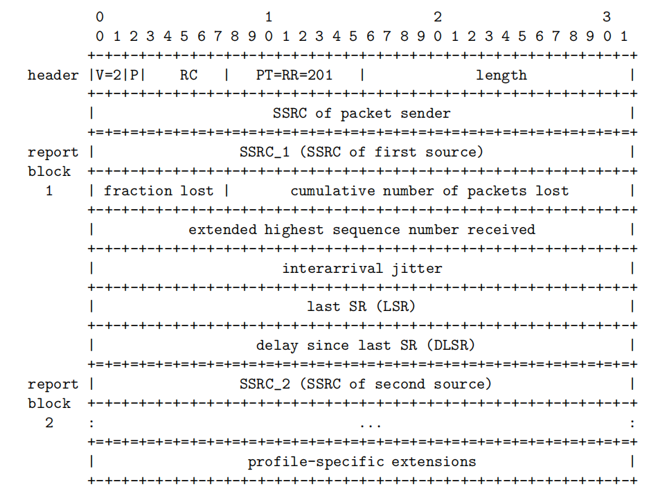

**SSRC of packet sender**：发送RR包的源，为0，不会为RTCP单独创建源发送  

**SSRC_1 (SSRC of first source)和SSRC_1 (SSRC of first source)**：RR包发送的目的源，即我对这个SSRC媒体源发送的RR，其他媒体源忽略。  

**fraction lost**：丢包率  

**cumulative number of packets lost**：总丢包个数  

**interarrival jitter**：包的抖动  

**last SR (LSR)**：上一个SR包中的ntp时间  

**delay since last SR (DLSR)**：从接收上一个SR到发送RR之间的时间间隔  

构造RR包的代码如下，带有注释，

```cpp
RTC::RTCP::ReceiverReport* RtpStreamRecv::GetRtcpReceiverReport()
{
	MS_TRACE();
	uint8_t worstRemoteFractionLost{ 0 };
	if (this->params.useInBandFec)
	{
		// Notify the listener so we'll get the worst remote fraction lost.
		static_cast<RTC::RtpStreamRecv::Listener*>(this->listener)
			->OnRtpStreamNeedWorstRemoteFractionLost(this, worstRemoteFractionLost);
		if (worstRemoteFractionLost > 0)
			MS_DEBUG_TAG(rtcp, "using worst remote fraction lost:%" PRIu8, worstRemoteFractionLost);
	}
	auto* report = new RTC::RTCP::ReceiverReport();//创建RR包
	report->SetSsrc(GetSsrc());
	uint32_t prevPacketsLost = this->packetsLost;//记录前一个RR包丢包个数
	// Calculate Packets Expected and Lost.
	auto expected = GetExpectedPackets();//从发包开始到当前发送RR包的时间内期望收到的总包个数(根据序列号判断，因为序列号
	//是连续的，如果收到序列号1，2，3，8，10，则期望收到的包个数为10-1+1=10个包，其实序列号为4，5，6，7，9的包都丢失了)
	if (expected > this->mediaTransmissionCounter.GetPacketCount())//mediaTransmissionCounter记录的是实际收到的包个数
		this->packetsLost = expected - this->mediaTransmissionCounter.GetPacketCount();//packetsLost 为实际丢包的个数，注意这是从发包开始到目前为止总丢包个数，
	else
		this->packetsLost = 0u;
	// Calculate Fraction Lost.
	uint32_t expectedInterval = expected - this->expectedPrior;//在上一个发送RR包到当前发送RR包时间间隔内，期望收到的包个数
	this->expectedPrior = expected;
	uint32_t receivedInterval = this->mediaTransmissionCounter.GetPacketCount() - this->receivedPrior;//在上一个发送RR包到当前发送RR包时间间隔内，实际收到的包个数
	this->receivedPrior = this->mediaTransmissionCounter.GetPacketCount();
	int32_t lostInterval = expectedInterval - receivedInterval;//在上一个发送RR包到当前发送RR包时间间隔内，实际丢包个数
	if (expectedInterval == 0 || lostInterval <= 0)
		this->fractionLost = 0;
	else
		this->fractionLost = std::round((static_cast<double>(lostInterval << 8) / expectedInterval));//fractionLost ：在上一个发送RR包到当前发送RR包时间间隔内丢包率
	// Worst remote fraction lost is not worse than local one.
	if (worstRemoteFractionLost <= this->fractionLost)
	{
		this->reportedPacketLost += (this->packetsLost - prevPacketsLost);
		report->SetTotalLost(this->reportedPacketLost);
		report->SetFractionLost(this->fractionLost);
	}
	else
	{
		// Recalculate packetsLost.
		uint32_t newLostInterval     = (worstRemoteFractionLost * expectedInterval) >> 8;
		uint32_t newReceivedInterval = expectedInterval - newLostInterval;
		this->reportedPacketLost += (receivedInterval - newReceivedInterval);
		report->SetTotalLost(this->reportedPacketLost);
		report->SetFractionLost(worstRemoteFractionLost);
	}
	// Fill the rest of the report.
	report->SetLastSeq(static_cast<uint32_t>(this->maxSeq) + this->cycles);
	report->SetJitter(this->jitter);
	if (this->lastSrReceived != 0)
	{
		// Get delay in milliseconds.
		auto delayMs = static_cast<uint32_t>(DepLibUV::GetTimeMs() - this->lastSrReceived);
		// Express delay in units of 1/65536 seconds.
		uint32_t dlsr = (delayMs / 1000) << 16;
		dlsr |= uint32_t{ (delayMs % 1000) * 65536 / 1000 };
		report->SetDelaySinceLastSenderReport(dlsr);//设置上一次sr到本次发送RR的间隔时间
		report->SetLastSenderReport(this->lastSrTimestamp);
	}
	else
	{
		report->SetDelaySinceLastSenderReport(0);
		report->SetLastSenderReport(0);
	}
	return report;
}
```

## 三、NACK策略

丢包重传(NACK)是抵抗网络丢包的重要手段。NACK在接收端检测到数据丢包后，发送NACK报文到发送端；发送端根据NACK报文中的序列号，在发送缓冲区找到对应的数据包，重新发送到接收端。NACK需要发送端，发送缓冲区的支持。  

WebRTC中支持音频和视频的NACK重传，我们这里只分析nack机制。接收RTP数据包后，需要传入到重传nack模块处理检测丢包情况，流程如下：  

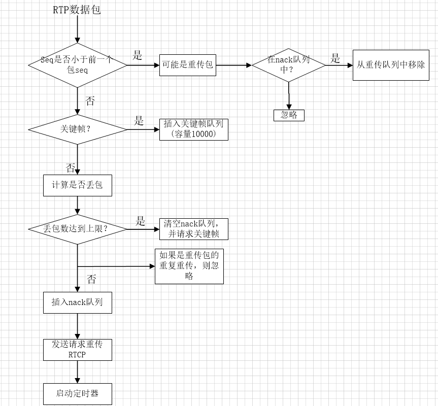

代码如下：

```cpp
bool NackGenerator::ReceivePacket(RTC::RtpPacket* packet, bool isRecovered)
{
	MS_TRACE();
	uint16_t seq    = packet->GetSequenceNumber();
	bool isKeyFrame = packet->IsKeyFrame();
	if (!this->started)
	{
		this->started = true;
		this->lastSeq = seq;
		if (isKeyFrame)
			this->keyFrameList.insert(seq);
		return false;
	}
	// Obviously never nacked, so ignore.
	if (seq == this->lastSeq)
		return false;
	// 判断是否当前包序列号小于上一次收到的序列号，如果是，判断是否是重传包,
	if (SeqManager<uint16_t>::IsSeqLowerThan(seq, this->lastSeq))
	{
		auto it = this->nackList.find(seq);
		// It was a nacked packet.
		if (it != this->nackList.end())
		{//重传包处理
			MS_DEBUG_DEV(
				"NACKed packet received [ssrc:%" PRIu32 ", seq:%" PRIu16 ", recovered:%s]",
				packet->GetSsrc(),
				packet->GetSequenceNumber(),
				isRecovered ? "true" : "false");
			this->nackList.erase(it);
			return true;
		}
		// Out of order packet or already handled NACKed packet.
		if (!isRecovered)
		{
			MS_WARN_DEV(
				"ignoring older packet not present in the NACK list [ssrc:%" PRIu32 ", seq:%" PRIu16 "]",
				packet->GetSsrc(),
				packet->GetSequenceNumber());
		}
		return false;
	}
	if (isKeyFrame)//如果是关键帧，插入到关键帧队列
		this->keyFrameList.insert(seq);
	{
		auto it = this->keyFrameList.lower_bound(seq - MaxPacketAge);//移除队列中最老的包，以至于维持队列10000包的条件
		if (it != this->keyFrameList.begin())
			this->keyFrameList.erase(this->keyFrameList.begin(), it);
	}
	if (isRecovered)
	{//如果包是恢复包，则插入到恢复队列中
		this->recoveredList.insert(seq);
		// Remove old ones so we don't accumulate recovered packets.
		auto it = this->recoveredList.lower_bound(seq - MaxPacketAge);
		if (it != this->recoveredList.begin())
			this->recoveredList.erase(this->recoveredList.begin(), it);
		// Do not let a packet pass if it's newer than last seen seq and came via
		// RTX.
		return false;
	}
	AddPacketsToNackList(this->lastSeq + 1, seq);//插入到nack队列
	this->lastSeq = seq;
	// Check if there are any nacks that are waiting for this seq number.
	std::vector<uint16_t> nackBatch = GetNackBatch(NackFilter::SEQ);//nacklist不为空是发送一次请求重传，并记录重传请求发起次数
	if (!nackBatch.empty())
		this->listener->OnNackGeneratorNackRequired(nackBatch);//发送请求重传包
	// This is important. Otherwise the running timer (filter:TIME) would be
	// interrupted and NACKs would never been sent more than once for each seq.
	if (!this->timer->IsActive())
		MayRunTimer();//启动定时器
	return false;
}
```

nack模块会维护三个队列，重传队列nackList(容量10000包)，恢复队列recoveList(容量10000包)和关键帧队列keyFrameList(容量10000包)，队列满之后，每收到一个包都需要更新队列，移除最老的包，。如果收到的包序列号比上一个收到的包序列号小，判定为可能是重传包，如果是重传包，则必然之前会存储在重传队列中，如果重传队列中不存在，表明不是重传包，忽略，如果存在，是重传包，并从队列中移除掉。

```cpp
void NackGenerator::AddPacketsToNackList(uint16_t seqStart, uint16_t seqEnd)
{
	MS_TRACE();
	// 队列数量满10000包后，移除收到的最老的包，就是移除队列头部包.
	auto it = this->nackList.lower_bound(seqEnd - MaxPacketAge);
	this->nackList.erase(this->nackList.begin(), it);
	// 如果重传队列中包数量到达MaxNackPackets=1000时，清楚关键帧队列，并请求关键帧.
	uint16_t numNewNacks = seqEnd - seqStart;
	if (this->nackList.size() + numNewNacks > MaxNackPackets)
	{
		// clang-format off
		while (
			RemoveNackItemsUntilKeyFrame() &&
			this->nackList.size() + numNewNacks > MaxNackPackets
		)
		// clang-format on
		{
		}
		if (this->nackList.size() + numNewNacks > MaxNackPackets)
		{
			MS_WARN_TAG(
				rtx, "NACK list full, clearing it and requesting a key frame [seqEnd:%" PRIu16 "]", seqEnd);
			this->nackList.clear();
			this->listener->OnNackGeneratorKeyFrameRequired();//发送请求关键帧
			return;
		}
	}
	for (uint16_t seq = seqStart; seq != seqEnd; ++seq)
	{
		MS_ASSERT(this->nackList.find(seq) == this->nackList.end(), "packet already in the NACK list");
		// Do not send NACK for packets that are already recovered by RTX.
		if (this->recoveredList.find(seq) != this->recoveredList.end())//判断收到的包是否之前需要重传的包，且之前已经收到过发送方
		//发送的重传包了，如果是直接忽略，如果还没有收到重传后的包，则插入重传队列
			continue;
		this->nackList.emplace(std::make_pair(seq, NackInfo{ seq, seq }));
	}
}
```

只要发现有丢包，nacklisg不为空，则发送一个nack包并记录请求重传一次，当请求重传次数达到一定数量(根据服务器类型决定，mediasoup设定为请求重传最大次数为10次)，且还没有收到重传包，则不在请求重传直接放弃。代码如下：

```cpp
std::vector<uint16_t> NackGenerator::GetNackBatch(NackFilter filter)
{
	MS_TRACE();
	uint64_t nowMs = DepLibUV::GetTimeMs();
	std::vector<uint16_t> nackBatch;
	auto it = this->nackList.begin();
	while (it != this->nackList.end())
	{
		NackInfo& nackInfo = it->second;
		uint16_t seq       = nackInfo.seq;
		// clang-format off
		if (//有重传包时，就发起一次请求重传
			filter == NackFilter::SEQ &&
			nackInfo.sentAtMs == 0 &&
			(
				nackInfo.sendAtSeq == this->lastSeq ||
				SeqManager<uint16_t>::IsSeqHigherThan(this->lastSeq, nackInfo.sendAtSeq)
			)
		)
		// clang-format on
		{
			nackBatch.emplace_back(seq);
			nackInfo.retries++;//重传次数叠加
			nackInfo.sentAtMs = nowMs;
			if (nackInfo.retries >= MaxNackRetries)//达到重传最大次数MaxNackRetries=10后，不在请求发送重传
			{
				MS_WARN_TAG(
					rtx,
					"sequence number removed from the NACK list due to max retries [filter:seq, seq:%" PRIu16
					"]",
					seq);
				it = this->nackList.erase(it);
			}
			else
			{
				++it;
			}
			continue;
		}
		if (filter == NackFilter::TIME && nowMs - nackInfo.sentAtMs >= this->rtt)
		{
			nackBatch.emplace_back(seq);
			nackInfo.retries++;
			nackInfo.sentAtMs = nowMs;
			if (nackInfo.retries >= MaxNackRetries)
			{
				MS_WARN_TAG(
					rtx,
					"sequence number removed from the NACK list due to max retries [filter:time, seq:%" PRIu16
					"]",
					seq);
				it = this->nackList.erase(it);
			}
			else
			{
				++it;
			}
			continue;
		}
		++it;
	}
#if MS_LOG_DEV_LEVEL == 3
	if (!nackBatch.empty())
	{
		std::ostringstream seqsStream;
		std::copy(
			nackBatch.begin(), nackBatch.end() - 1, std::ostream_iterator<uint32_t>(seqsStream, ","));
		seqsStream << nackBatch.back();
		if (filter == NackFilter::SEQ)
			MS_DEBUG_DEV("[filter:SEQ, asking seqs:%s]", seqsStream.str().c_str());
		else
			MS_DEBUG_DEV("[filter:TIME, asking seqs:%s]", seqsStream.str().c_str());
	}
#endif
	return nackBatch;
}
```

nack反馈包结构如下：  

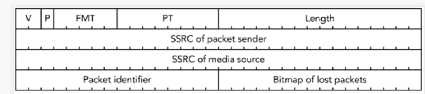  

前12字节固定，后面紧跟至少一个nackItem，每个item结构包含16为Packet identifier，和16位Bitmap of lost packets。Packet identifier表示当前item下第一个重传包的序列号，Bitmap of lost packets表示当前item下携带的序列号map，一个item最多携带16个。  

计算方法如下：  

如果重传队列中有s1,s2,s3,s4,s5,s6,s7,s8…，从第一个seq往后的每一个系列号与第一个seq相减再-1,  即s2包的bitmap偏移量shift=s2-s1-1;  

s3包的bitmap偏移量shift=s3-s1-1;  

s5包的bitmap偏移量shift=s5-s1-1;  

只要shit<=15，对应是seq包就在当前item下，否则放在下一个item。  

如：nack队列中序列号有100 102 103 106 119 122 126 130 150 152 153 154 180则第一个item的Packet identifier=100，seq=102的包shit=102-100-1=1，此时Bitmap of lost packets=0x0002；  

seq=103的包shit=103-100-1=2，此时Bitmap of lost packets=0x0006；  

seq=106的包shit=106-100-1=5，此时Bitmap of lost packets=0x0026；  

seq=119的包shit=119-100-1=18，由于18超过15，无法在16位的Bitmap of lost

packets中进行偏移，因此第一个item结束，Bitmap of lost packets=0x0026，seq=119的包放在第二个item中，且第二个item的Packet identifier=119，计算同上，以此类推；代码如下：

```cpp
inline void RtpStreamRecv::OnNackGeneratorNackRequired(const std::vector<uint16_t>& seqNumbers)
{
	MS_TRACE();
	MS_ASSERT(this->params.useNack, "NACK required but not supported");
	MS_DEBUG_TAG(
		rtx,
		"triggering NACK [ssrc:%" PRIu32 ", first seq:%" PRIu16 ", num packets:%zu]",
		this->params.ssrc,
		seqNumbers[0],
		seqNumbers.size());
	RTC::RTCP::FeedbackRtpNackPacket packet(0, GetSsrc());
	auto it        = seqNumbers.begin();
	const auto end = seqNumbers.end();
	size_t numPacketsRequested{ 0 };
	while (it != end)
	{
		uint16_t seq;
		uint16_t bitmask{ 0 };
		seq = *it;
		++it;
		while (it != end)
		{
			uint16_t shift = *it - seq - 1;
			if (shift > 15)
				break;
			bitmask |= (1 << shift);
			++it;
		}
		auto* nackItem = new RTC::RTCP::FeedbackRtpNackItem(seq, bitmask);
		packet.AddItem(nackItem);
		numPacketsRequested += nackItem->CountRequestedPackets();
	}
	// Ensure that the RTCP packet fits into the RTCP buffer.
	if (packet.GetSize() > RTC::RTCP::BufferSize)
	{
		MS_WARN_TAG(rtx, "cannot send RTCP NACK packet, size too big (%zu bytes)", packet.GetSize());
		return;
	}
	this->nackCount++;
	this->nackPacketCount += numPacketsRequested;
	packet.Serialize(RTC::RTCP::Buffer);
	// Notify the listener.
	static_cast<RTC::RtpStreamRecv::Listener*>(this->listener)->OnRtpStreamSendRtcpPacket(this, &packet);
}
```

发送第一次请求重传后，如果nack队列还不为空则启动定时器(mediasoup设置40ms发送一次)，定时发送请求重传，如果nack机制不设置重传定时器，则每个丢失包最多只会发送以此请求重传，定时器启动后最多可以发送10次，确保收到重传包，如果10次还没有收到重传包，则忽略，没办法了，只能丢了。

<hr>

 
#### <p>原文出处：<a href='https://blog.csdn.net/qq_22658119/article/details/118611861' target='blank'>mediasoup服务器转发流媒体数据及发送拥塞控制</a></p>

webrtc服务器mediasoup即是媒体流的接收方也是媒体流的发送方，还是控制消息的转发方。  

作为接收方要接收音视频数据，码率统计，接收发送方发来的RTCP(SR,SDES等)包等等，给发送方发送RTPFB包及时反馈接收情况；  

作为发送方，要给接其他消费者发送媒体数据，发送RTCP报告SR，处理接收方发来的RTPFB包及其他RTCP包，发送拥塞控制等等；  

作为控制拥塞消息转发方，需要流媒体数据的接收方发来的消息请求（如PSFB反馈请求关键帧）然后处理转发给流媒体数据的发送方。  

这里讨论mediasoup作为发送方如何处理。  

## 一、转发音视频数据

mediasoup接收到媒体数据后，需要转发给所有comsumer，过程简单，流程如下：  
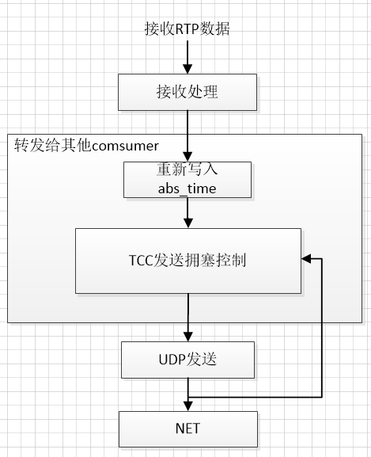  

接收到媒体数据后，经过接收处理(在[mediasoup服务器接收流媒体数据及接收拥塞控制](https://blog.csdn.net/qq_22658119/article/details/118611843)文中介绍)后。转发给其他参会者，即其他consumers，在转发到网络之前，会重新在rtp扩展头中写入abs-send-time，如果基于延迟的拥塞控制在接收端处理，那么这个时间一定要带上。  

**abs-send-time：** 是6+18固定24位浮点数，高6位单位为秒(最大26=64s)，低18位单位为1/(218)秒(约3.8us)，左移8位得到32位时间戳，也就是乘以256。那么原本1 / 218秒的精度换成时间戳后精度变成了1/218+6秒=1000/226毫秒，这个是**到达时间滤波器**需要的数据类型。  

最新的版本GCC是在发送端处理基于延时的拥塞控制，因此，还需要将发送的数据包构造PacketFeedback一份，保存到GCC的反馈适配器模块TransportFeedbackAdapter的发送历史队列，PacketFeedback结构信息info：

```cpp
PacketFeedback{
	int64_t creation_time_ms;//发送端创建该结构体时的时间
	int64_t arrival_time_ms;//反馈包到达时间，针对解析后的RTPFB包，对于发送的包为无效值kNotReceived
	int64_t send_time_ms;//包发送时间，发送端设置
	uint16_t sequence_number;//包序列号，+1增长，发送端设置
	int64_t long_sequence_number;//会话唯一的包标识符，每个包递增1，由发送端生成
	size_t payload_size;//包净荷大小
	size_t unacknowledged_data;//不属于反馈部分的上述数据包的大小。
	uint16_t local_net_id;//网络路由标识与此数据包相关联的网络路由。
	uint16_t remote_net_id;
	PacedPacketInfo pacing_info;包的pace信息
	absl::optional<uint32_t> ssrc;//此反馈包所指向的报文的SSRC和RTP序列号。
	uint16_t rtp_sequence_number;//包的rtp序列号
}
```

webrtc及webrtc服务器中还用到了一个模块：应用限制区域检测器(AlrDetector)，原理是利用某段时间(协议设定500ms)，以及这段时间发送的字节数判断当前输出网络流量是否受限。举例说明下  

如果带宽预测输出目标码率为`target_bitrate_bps`，则pacer按此码率发送数据，但有些原因使得输出的码率低于`target_bitrate_bps`，会引起带宽利用率不足，相应的，AlrDetector会做出对码率调整有一定影响的动作。AlrDetector实体中有一个IntervalBudget，表示时间间隔内的预算，主要统计在目标码率下已发送字节数、剩余发送字节数，发送比率等，其最大预算计算如下：

```cpp
void IntervalBudget::set_target_rate_kbps(int target_rate_kbps) {
	target_rate_kbps_ = target_rate_kbps;//由拥塞控制输出后的最终目标码率
	max_bytes_in_budget_ = (kWindowMs * target_rate_kbps_) / 8;//kWindowMs=500毫秒内最大预算，
	bytes_remaining_ = std::min(std::max(-max_bytes_in_budget_, bytes_remaining_),
								max_bytes_in_budget_);
}
```

每发送一个数据包，都会通过AlrDetector来监测，满足以下两个条件都会激活`AlrDetector(state_changed = true)`：

1. 剩余发送码率占比(剩余字节/最大预算字节)大于一个阈值，且AlrDetector处于休眠状态(`state_changed = false`);
2. 剩余发送码率占比(剩余字节/最大预算字节)小于一个阈值，且AlrDetector处于激活状态(`state_changed = true`);

```cpp
void AlrDetector::OnBytesSent(size_t bytes_sent, int64_t send_time_ms) {
   if (!last_send_time_ms_.has_value()) {
     last_send_time_ms_ = send_time_ms;
     // Since the duration for sending the bytes is unknwon, return without
     // updating alr state.
     return;
   }
   int64_t delta_time_ms = send_time_ms - *last_send_time_ms_;
   last_send_time_ms_ = send_time_ms;
   alr_budget_.UseBudget(bytes_sent);
   alr_budget_.IncreaseBudget(delta_time_ms);//发送了一个包bytes_sent，更新剩余发送字节数bytes_remaining_ =bytes_remaining_ - 
   //static_cast<int>(bytes)
   bool state_changed = false;
   if (alr_budget_.budget_ratio() > start_budget_level_ratio_ &&
       !alr_started_time_ms_) {//剩余发送码率占比(剩余字节/最大预算字节)大于一个阈值start_budget_level_ratio_ =0.8，且AlrDetector处于
       //休眠状态
     alr_started_time_ms_.emplace(DepLibUV::GetTimeMsInt64());
     state_changed = true;
   } else if (alr_budget_.budget_ratio() < stop_budget_level_ratio_ &&
              alr_started_time_ms_) {//剩余发送码率占比(剩余字节/最大预算字节)小于一个阈值stop_budget_level_ratio_ =0.5，且AlrDetector
              //处于激活状态
     state_changed = true;
     alr_started_time_ms_.reset();
   }
   if (state_changed)
     MS_DEBUG_DEV("state changed");
}
```

那么，如果AlrDetector处于激活状态后，它会有什么动作呢？  

## 二、GCC拥塞控制

GCC采用了两种拥塞控制算法：  

基于延迟（delay-based）的拥塞控制算法：早期的实现是由数据的接收方实现，接收方需要记录每个数据包到达的时间和大小，并计算每个数据分组之间（inter-group）的延迟的变化，由此判断当前网络的拥塞情况，并将最终输出码率估计值通过RTCP feedback（TMMBR或 REMB）反馈给发送方；  

基于丢包（loss-based）的拥塞控制算法：由数据的发送方来实现，发送方通过从接收方周期性发来的RTCP RR（Receiver Report）包中获取丢包信息并计算RTT进行码率估计。  

### 2.1、基于丢包的码率控制

GCC算法在发送端基于丢包率控制发送码率，其基本思想是：丢包率反映网络拥塞状况。如果丢包率很小或者为0，说明网络状况良好，在不超过预设最大码率的情况下，可以增大发送端码率；反之如果丢包率变大，说明网络状况变差，此时应减少发送端码率。在其它情况下，发送端码率保持不变。  

基于丢包的码率控制实现原理是基于媒体接后端发送的RR反馈包计算RTT，以及获取丢包率和丢包数来控制，将这些信息应用到拥塞控制模块rtpTransportControllerSend来评估新的发送码率。RR包结构在[mediasoup服务器接收流媒体数据及接收拥塞控制](https://blog.csdn.net/qq_22658119/article/details/118611843)中有介绍，简易流程如下：  

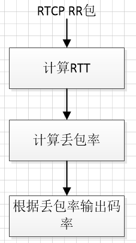  

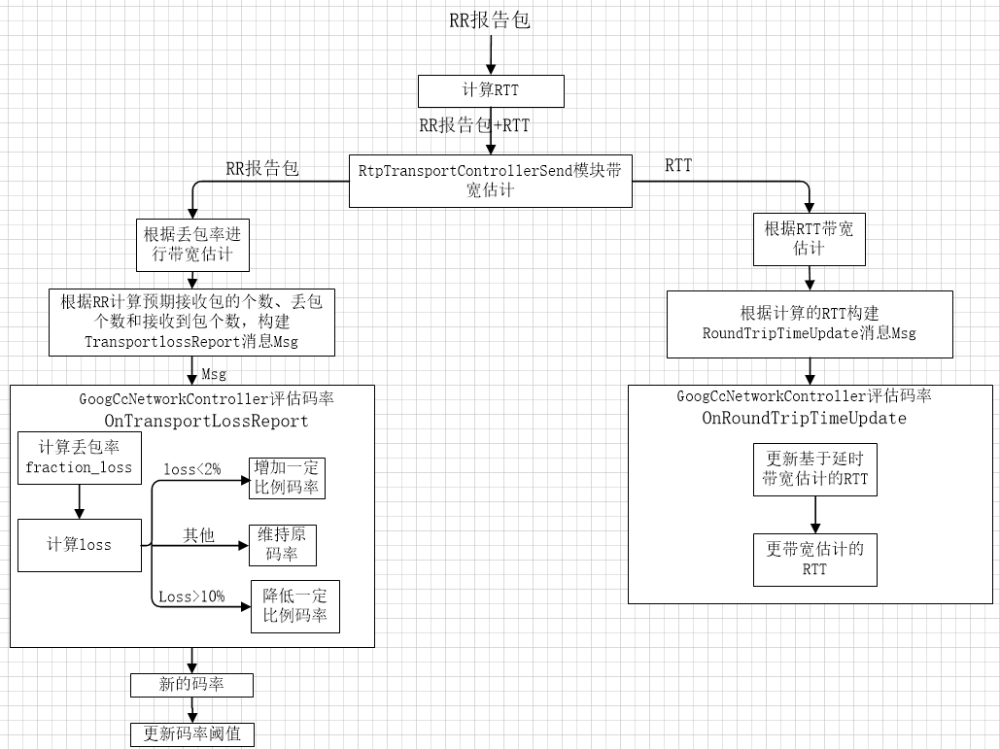

基于丢包的拥塞控制根据RR计算RTT(Round-Trip Time)：往返时延。在计算机网络中它是一个重要的性能指标，表示从发送端发送数据开始，到发送端收到来自接收端的确认（接收端收到数据后便立即发送确认），总共经历的时延，计算方法：

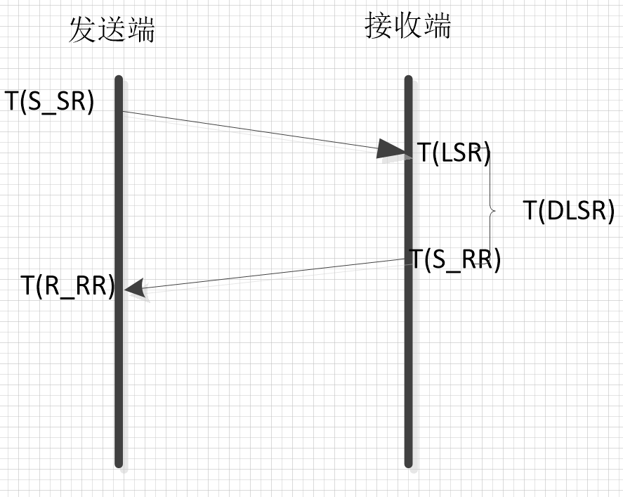

如上图所示：发送端发送SR的时间为`T(S_SR)`，接收端接收到SR的时间为`T(LSR)`，发送RR的时间为`T(S_RR)`，接收端接收到RR包的时间为`T(R_RR)`，RTT的时间计算：  

所以在理想情况下：  

`RTT=(T(LSR)-T(S_SR))+(T(R_RR)-T(S_RR))`

理想情况是`T(LSR)=T(S_RR)`，则

`RTT=T(R_RR)-T(S_SR)`

但实际`T(S_RR)`大于`T(LSR)`，`T(DLSR)=T(S_RR)-T(LSR)`，由此`RTT = T(R_RR)-T(S_SR)-DLSR`;

代码如下：

```cpp
void RtpStreamSend::ReceiveRtcpReceiverReport(RTC::RTCP::ReceiverReport* report)
{
    uint64_t nowMs = DepLibUV::GetTimeMs();
    auto ntp       = Utils::Time::TimeMs2Ntp(nowMs);//获取当前绝对时间NTP
    // Get the compact NTP representation of the current timestamp.
    uint32_t compactNtp = (ntp.seconds & 0x0000FFFF) << 16;
    compactNtp |= (ntp.fractions & 0xFFFF0000) >> 16;//获取当前绝对时间NTP对应的时间戳
    uint32_t lastSr = report->GetLastSenderReport();//接收端接收到最近的SR时的时间
    uint32_t dlsr   = report->GetDelaySinceLastSenderReport();//接收端接收到最近的SR到发送RR的时间间隔
    // RTT in 1/2^16 second fractions.
    uint32_t rtt{ 0 };
    // If no Sender Report was received by the remote endpoint yet, ignore lastSr
    // and dlsr values in the Receiver Report.
    if (lastSr && dlsr && (compactNtp > dlsr + lastSr))
    	rtt = compactNtp - dlsr - lastSr;//rtt表示发送端发送sr到接收端，接收端发送RR返回给发送端的时间，rtt不包含接收到最近的SR到
    	//发送RR的时间间隔
    // RTT in milliseconds.
    this->rtt = static_cast<float>(rtt >> 16) * 1000;
    this->rtt += (static_cast<float>(rtt & 0x0000FFFF) / 65536) * 1000;
    if (this->rtt > 0.0f)
    	this->hasRtt = true;
    this->packetsLost  = report->GetTotalLost();
    this->fractionLost = report->GetFractionLost();
}

根据RR计算丢包率：1.计算总包数和丢包数

```cpp
void RtpTransportControllerSend::OnReceivedRtcpReceiverReportBlocks(
     const ReportBlockList& report_blocks,
     int64_t now_ms) {
   if (report_blocks.empty())
     return;
   int total_packets_lost_delta = 0;
   int total_packets_delta = 0;
   // Compute the packet loss from all report blocks.
   for (const RTCPReportBlock& report_block : report_blocks) {
     auto it = last_report_blocks_.find(report_block.source_ssrc);
     if (it != last_report_blocks_.end()) {
       auto number_of_packets = report_block.extended_highest_sequence_number -
                         it->second.extended_highest_sequence_number;//根据RR包的基础序列号计算理论上在RR间隔内应该收到的包个数
       total_packets_delta += number_of_packets;
       auto lost_delta = report_block.packets_lost - it->second.packets_lost;//根据RR包计算在RR间隔内丢包个数
       total_packets_lost_delta += lost_delta;
     }
     last_report_blocks_[report_block.source_ssrc] = report_block;
   }
   // Can only compute delta if there has been previous blocks to compare to. If
   // not, total_packets_delta will be unchanged and there's nothing more to do.
   if (!total_packets_delta)
     return;
   int packets_received_delta = total_packets_delta - total_packets_lost_delta;
   // To detect lost packets, at least one packet has to be received. This check
   // is needed to avoid bandwith detection update in
   // VideoSendStreamTest.SuspendBelowMinBitrate
   if (packets_received_delta < 1)
     return;
   Timestamp now = Timestamp::ms(now_ms);
   TransportLossReport msg;//构造gcc结构信息，前面的计算就是为这个结构信息服务的
   msg.packets_lost_delta = total_packets_lost_delta;//丢包个数
   msg.packets_received_delta = packets_received_delta;//接收到包个数
   msg.receive_time = now;
   msg.start_time = last_report_block_time_;
   msg.end_time = now;
   PostUpdates(controller_->OnTransportLossReport(msg));
   last_report_block_time_ = now;
}
```

带宽估计模块 `bandwidth_estimation_`处理丢包信息

```cpp
NetworkControlUpdate GoogCcNetworkController::OnTransportLossReport(
     TransportLossReport msg) {
   if (packet_feedback_only_)
     return NetworkControlUpdate();
   int64_t total_packets_delta =
       msg.packets_received_delta + msg.packets_lost_delta;
   bandwidth_estimation_->UpdatePacketsLost(
       msg.packets_lost_delta, total_packets_delta, msg.receive_time);
   return NetworkControlUpdate();
}

void SendSideBandwidthEstimation::UpdatePacketsLost(int packets_lost,
                                                     int number_of_packets,
                                                     Timestamp at_time) {
   last_loss_feedback_ = at_time;
   if (first_report_time_.IsInfinite())
     first_report_time_ = at_time;
   // Check sequence number diff and weight loss report
   if (number_of_packets > 0) {
     // Accumulate reports.
     lost_packets_since_last_loss_update_ += packets_lost;
     expected_packets_since_last_loss_update_ += number_of_packets;
     // Don't generate a loss rate until it can be based on enough packets.
     if (expected_packets_since_last_loss_update_ < kLimitNumPackets)
       return;
     has_decreased_since_last_fraction_loss_ = false;
     int64_t lost_q8 = lost_packets_since_last_loss_update_ << 8;
     int64_t expected = expected_packets_since_last_loss_update_;
     last_fraction_loss_ = std::min<int>(lost_q8 / expected, 255);//计算后的丢包率
     // Reset accumulators.
     lost_packets_since_last_loss_update_ = 0;
     expected_packets_since_last_loss_update_ = 0;
     last_loss_packet_report_ = at_time;
     UpdateEstimate(at_time);//计算的丢包率更新到 bandwidth_estimation_，输出目标码率
   }
   UpdateUmaStatsPacketsLost(at_time, packets_lost);
}
```

计算的丢包率更新到 `bandwidth_estimation_`，输出目标码率 

丢失率loss=丢包率/265f  

如果loss < 2%，表明当前网络状态良好，适当增加发送码率，tartget_bitrate=原目标码率`pre_target_bitrate_`的1.08%  

如果2%<loss<10%，表明网络正处于适中状态，继续按原来码率发送给  

如果loss>10%，表明网络拥塞，适当降低码率，tartget_bitrate= 原目标码率pre_target_bitrate_ (1 - 0.5*loss);  

代码实现如下：

```cpp
void SendSideBandwidthEstimation::UpdateEstimate(Timestamp at_time) {
   DataRate new_bitrate = current_bitrate_;
   if (rtt_backoff_.CorrectedRtt(at_time) > rtt_backoff_.rtt_limit_) {//判断反馈到达时间与上一次反馈到达时间间隔太长超过rtt上限阈值rtt_limit_=max()
     if (at_time - time_last_decrease_ >= rtt_backoff_.drop_interval_ &&//距离上一次大幅度将码率时间超过drop_interval_=300毫秒，且当前码率超过bandwidth_floor_=5Kbps
         current_bitrate_ > rtt_backoff_.bandwidth_floor_) {
       time_last_decrease_ = at_time;
       new_bitrate = std::max(current_bitrate_ * rtt_backoff_.drop_fraction_,//将码率将为原来码率的一半
                              rtt_backoff_.bandwidth_floor_.Get());
       link_capacity_.OnRttBackoff(new_bitrate, at_time);
     }
     CapBitrateToThresholds(at_time, new_bitrate);//输出最终码率
     return;
   }

   // 如果没有任何丢包报告，我们将使用REMB和(或)基于时延的估计，以允许启动比特率探测。
   if (last_fraction_loss_ == 0 && IsInStartPhase(at_time)) {
     new_bitrate = std::max(bwe_incoming_, new_bitrate);//bwe_incoming为REMB从接收端带回的评估码率
     new_bitrate = std::max(delay_based_bitrate_, new_bitrate);//delay_based_bitrate_为基于延时的评估码率，目标码率基于三者最大
     if (loss_based_bandwidth_estimation_.Enabled()) {
       loss_based_bandwidth_estimation_.SetInitialBitrate(new_bitrate);
     }
     if (new_bitrate != current_bitrate_) {
       min_bitrate_history_.clear();
       if (loss_based_bandwidth_estimation_.Enabled()) {
         min_bitrate_history_.push_back(std::make_pair(at_time, new_bitrate));
       } else {
         min_bitrate_history_.push_back(//码率如果有更新，记录当前时间对应的目标码率
             std::make_pair(at_time, current_bitrate_));
       }
       CapBitrateToThresholds(at_time, new_bitrate);
       return;
     }
   }

   UpdateMinHistory(at_time);
   
   if (last_loss_packet_report_.IsInfinite()) {
     // No feedback received.
     CapBitrateToThresholds(at_time, current_bitrate_);//输出最终码率
     return;
   }

   if (loss_based_bandwidth_estimation_.Enabled()) {
     loss_based_bandwidth_estimation_.Update(
         at_time, min_bitrate_history_.front().second, last_round_trip_time_);
     new_bitrate = MaybeRampupOrBackoff(new_bitrate, at_time);
     CapBitrateToThresholds(at_time, new_bitrate);
     return;
   }

   TimeDelta time_since_loss_packet_report = at_time - last_loss_packet_report_;
   TimeDelta time_since_loss_feedback = at_time - last_loss_feedback_;

   if (time_since_loss_packet_report < 1.2 * kMaxRtcpFeedbackInterval) {
     float loss = last_fraction_loss_ / 256.0f;//丢失比例=丢包率/256
     if (current_bitrate_ < bitrate_threshold_ || loss <= low_loss_threshold_) {
       // 如果丢失率Loss < 2%或者码率超过码率阈值:带宽增加时间间隔内，在上一个目标码率基础上增加8%的码率，我们只在比特率超过阈值时才根据损失率Loss<2做出决定,这是一种处理与拥塞无关的损失的粗略方法
       new_bitrate =
           DataRate::bps(min_bitrate_history_.front().second.bps() * 1.08 + 0.5);
       new_bitrate += DataRate::bps(1000);//额外增加1kbps，只是为了确保码流不会卡住(在低速率下增加一点额外的速率，在高速率下可以忽略不计)。
     } else if (current_bitrate_ > bitrate_threshold_) {
       if (loss <= high_loss_threshold_) {
         // 如果丢失率2%<Loss < 10%,维持当前码率
       } else {
         //如果丢失率Loss >= 10%, Limit the rate decreases to once a kBweDecreaseInterval
         if (!has_decreased_since_last_fraction_loss_ &&
             (at_time - time_last_decrease_) >=
                 (kBweDecreaseInterval + last_round_trip_time_)) {
           time_last_decrease_ = at_time;
           new_bitrate =
               DataRate::bps((current_bitrate_.bps() *
                              static_cast<double>(512 - last_fraction_loss_)) /
                             512.0);
           has_decreased_since_last_fraction_loss_ = true;
         }
       }
     }
   } else if (time_since_loss_feedback >
                  kFeedbackTimeoutIntervals * kMaxRtcpFeedbackInterval &&//超过1500毫秒间隔内没有收到丢包反馈
              (last_timeout_.IsInfinite() ||
               at_time - last_timeout_ > kTimeoutInterval)) {//处理反馈超时，1000毫秒
     if (in_timeout_experiment_) {
       MS_WARN_TAG(bwe, "Feedback timed out (%s), reducint bitrate",
                           ToString(time_since_loss_feedback).c_str());
       new_bitrate = new_bitrate * 0.8;//降低码率到原来的80%
       //重新设置累加器，因为我们已经对丢失的反馈采取了行动，不应该再对这些丢失的旧数据包采取行动
       lost_packets_since_last_loss_update_ = 0;
       expected_packets_since_last_loss_update_ = 0;
       last_timeout_ = at_time;
     }
   }
   CapBitrateToThresholds(at_time, new_bitrate);//输出最终码率
}
```

输出最终的目标码率，需要根据接收端REMB反馈的码率(如果有的话)，基于延迟的估计码率，基于丢包的估计码率三者选择最小的码率作为目标码率，代码如下：

```cpp
void SendSideBandwidthEstimation::CapBitrateToThresholds(Timestamp at_time,
                                                         DataRate bitrate) {
   if (bwe_incoming_ > DataRate::Zero() && bitrate > bwe_incoming_) {//如果REMB带回了评估码率bwe_incoming_，取bwe_incoming_与基于丢包评估码率中小者。
     MS_DEBUG_DEV("bwe_incoming_:%lld", bwe_incoming_.bps());
     bitrate = bwe_incoming_;
   }

   if (delay_based_bitrate_ > DataRate::Zero() &&
       bitrate > delay_based_bitrate_) {//取基于延迟拥塞控制的评估码率与基于丢包拥塞控制评估码率中小者。
     MS_DEBUG_DEV("delay_based_bitrate_:%lld", delay_based_bitrate_.bps());
     bitrate = delay_based_bitrate_;
   }

   if (loss_based_bandwidth_estimation_.Enabled() &&
       loss_based_bandwidth_estimation_.GetEstimate() > DataRate::Zero()) {//取基于丢包码带宽评估的评估码率与基于丢包拥塞控制评估码率中小者。
     MS_DEBUG_DEV("loss_based_bandwidth_estimation_.GetEstimate():%lld", loss_based_bandwidth_estimation_.GetEstimate().bps());
     bitrate = std::min(bitrate, loss_based_bandwidth_estimation_.GetEstimate());
   }

   if (bitrate > max_bitrate_configured_) {//如果码率超出最大码率，取最大码率
     MS_DEBUG_DEV("bitrate > max_bitrate_configured_, setting bitrate to max_bitrate_configured_");
     bitrate = max_bitrate_configured_;
   }

   if (bitrate < min_bitrate_configured_) {//如果码率低于最小码率，取最小码率
     MS_DEBUG_DEV("bitrate < min_bitrate_configured_");
     if (last_low_bitrate_log_.IsInfinite() ||
         at_time - last_low_bitrate_log_ > kLowBitrateLogPeriod) {
       MS_WARN_TAG(bwe, "Estimated available bandwidth %s"
                         " is below configured min bitrate %s",
                         ToString(bitrate).c_str(),
                         ToString(min_bitrate_configured_).c_str());
       last_low_bitrate_log_ = at_time;
     }
     bitrate = min_bitrate_configured_;
   }

   if (bitrate != current_bitrate_ ||
       last_fraction_loss_ != last_logged_fraction_loss_ ||
       at_time - last_rtc_event_log_ > kRtcEventLogPeriod) {//如果码率和上一次目标码率不同，取最新码率
     last_logged_fraction_loss_ = last_fraction_loss_;
     last_rtc_event_log_ = at_time;
   }

   MS_DEBUG_DEV("current_bitrate_:%lld", current_bitrate_.bps());
   current_bitrate_ = bitrate;
   
   if (acknowledged_rate_) {
     link_capacity_.OnRateUpdate(std::min(current_bitrate_, *acknowledged_rate_),
                                 at_time);
   }
}
```

以上是通过丢包率来评估码率，需要将计算的RTT设置到基于延迟的拥塞控制中

```cpp
NetworkControlUpdate GoogCcNetworkController::OnRoundTripTimeUpdate(
     RoundTripTimeUpdate msg) {
   if (packet_feedback_only_ || msg.smoothed)
     return NetworkControlUpdate();
   //RTC_DCHECK(!msg.round_trip_time.IsZero());
   if (delay_based_bwe_)
     delay_based_bwe_->OnRttUpdate(msg.round_trip_time);//更新基于延迟的拥塞控制RTT
   bandwidth_estimation_->UpdateRtt(msg.round_trip_time, msg.receive_time);//更新带宽估计模块中的RTT
   return NetworkControlUpdate();
}
```

### 2.2、基于延迟的码率控制

最新webrtc或webrtc服务器中gcc拥塞控制中的基于延迟的拥塞控制在是接收到返回的RTPFB包时在发送端处理。有关理论参阅[GCC拥塞控制](https://blog.csdn.net/qq_22658119/article/details/118961608)一文，在这里只分析webrtc及webrtc服务器源码中对基于延迟拥塞控制的实现。代码实现总体流程如下图：  

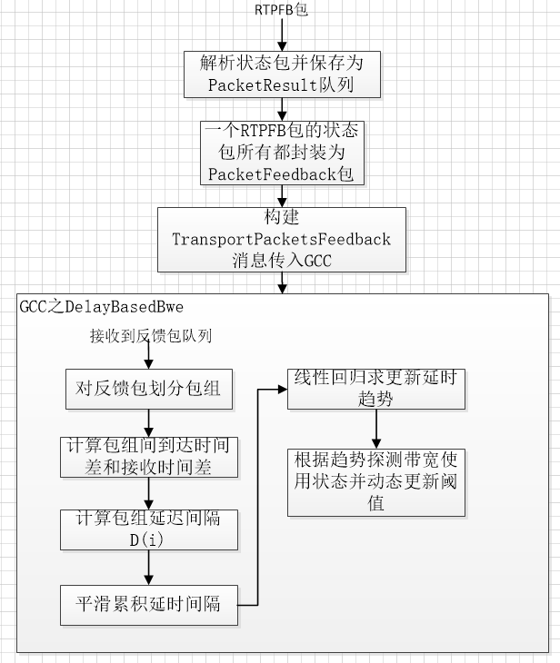

首先由反馈适配器模块类TransportFeedbackAdapter从RTPFB中解析状态包，状态包中记录了接收端接收到的和没接收到的所有包的状态，总结为两个状态：Received和UnReceived。

```cpp
const std::vector<webrtc::rtcp::ReceivedPacket> GetReceivedPackets(
    	const RTC::RTCP::FeedbackRtpTransportPacket* packet)//packet为RTPFB解析后的反馈包
{
 	std::vector<webrtc::rtcp::ReceivedPacket> receivedPackets;
 	for (auto& packetResult : packet->GetPacketResults())//GetPacketResults()函数从chunk包中提取每一个包，并标识状态
 	{
 	  if (packetResult.received)
 	    receivedPackets.emplace_back(packetResult.sequenceNumber, packetResult.delta);//筛选出接收端接收到的包
 	}
 	return receivedPackets;
};
```

RTPFB种chunk使用的有两种：runLengthChunk和twoBitVectorChunk。runLengthChunk表示chunk中记录的包都是同一个状态的包，都是接收到的或者都是没有接收到的。

```cpp
void FeedbackRtpTransportPacket::RunLengthChunk::FillResults(
      std::vector<struct FeedbackRtpTransportPacket::PacketResult>& packetResults,
      uint16_t& currentSequenceNumber) const
{
    MS_TRACE();
    bool received = (this->status == Status::SmallDelta || this->status == Status::LargeDelta);
    for (uint16_t count{ 1u }; count <= this->count; ++count)
    {
    	packetResults.emplace_back(++currentSequenceNumber, received);
    }
}
```

twoBitVectorChunk表示chunk中记录的包有两种状态，接收到的或没有接收到的。

```cpp
void FeedbackRtpTransportPacket::TwoBitVectorChunk::FillResults(
      std::vector<struct FeedbackRtpTransportPacket::PacketResult>& packetResults,
      uint16_t& currentSequenceNumber) const
{
 	MS_TRACE();
 	for (auto status : this->statuses)
 	{
    bool received = (status == Status::SmallDelta || status == Status::LargeDelta);
    packetResults.emplace_back(++currentSequenceNumber, received);
 	}
}
```

对于接收到的包，需要计算每个包到达接收端的时间，这就需要RTPFB包中携带的deta：deta表示与上一个接收到的包之间的时间差，因此知道上一个包的到达时间就可以通过deta计算本包的到达时间。

```cpp
for (size_t idx{ 0u }; idx < packetResults.size(); ++idx)
{
 	auto& packetResult = packetResults[idx];
 	if (!packetResult.received)
    continue;
 	currentReceivedAtMs += this->deltas.at(deltaIdx) / 4;//this->deltasRTPFB包中携带的deta
 	packetResult.delta        = this->deltas.at(deltaIdx);
 	packetResult.receivedAtMs = currentReceivedAtMs;
 	deltaIdx++;
}
```

因为属于反馈包，所以将状态包封装成PacketFeedback结构信息，信息内容上文已介绍。代码如下：

```cpp
std::vector<PacketFeedback> TransportFeedbackAdapter::GetPacketFeedbackVector(
     const RTC::RTCP::FeedbackRtpTransportPacket& feedback,
     Timestamp feedback_time) {
   // 将时间戳增量添加到第一个包到达时选定的本地时间基上。这不是真正的时间基数，但使手动检查时间戳变得更容易
   if (last_timestamp_us_ == kNoTimestamp) {
     current_offset_ms_ = feedback_time.ms();
   } else {
     current_offset_ms_ +=
       mediasoup_helpers::FeedbackRtpTransport::GetBaseDeltaUs(&feedback, last_timestamp_us_) / 1000;
   }
   last_timestamp_us_ =
     mediasoup_helpers::FeedbackRtpTransport::GetBaseTimeUs(&feedback);
   std::vector<PacketFeedback> packet_feedback_vector;
   if (feedback.GetPacketStatusCount() == 0) {
     MS_WARN_DEV("empty transport feedback packet received");
     return packet_feedback_vector;
   }

   packet_feedback_vector.reserve(feedback.GetPacketStatusCount());//构造PacketFeedback结构输出
   {
     size_t failed_lookups = 0;
     int64_t offset_us = 0;
     int64_t timestamp_ms = 0;
     uint16_t seq_num = feedback.GetBaseSequenceNumber();
     for (const auto& packet : mediasoup_helpers::FeedbackRtpTransport::GetReceivedPackets(&feedback)) {//GetReceivedPackets(&feedback)返回的是状态为Received的包
       //构造丢失包的PacketFeedback，插入到PacketFeedback队列
       for (; seq_num != packet.sequence_number(); ++seq_num) {
         PacketFeedback packet_feedback(PacketFeedback::kNotReceived, seq_num);
         if (!send_time_history_.GetFeedback(&packet_feedback, false))//不从发送历史队列中移除
           ++failed_lookups;
         if (packet_feedback.local_net_id == local_net_id_ &&
             packet_feedback.remote_net_id == remote_net_id_) {//包的本地网络id和远程网络id都对应，则插入队列
           packet_feedback_vector.push_back(packet_feedback);
         }
       }
       // 构造接收到包的PacketFeedback，插入到PacketFeedback队列
       offset_us += packet.delta_us();//根据RTPFB中的deta，往后累积计算每个包的到达时间
       timestamp_ms = current_offset_ms_ + (offset_us / 1000);//计算每个包的到达时间
       PacketFeedback packet_feedback(timestamp_ms, packet.sequence_number());
       if (!send_time_history_.GetFeedback(&packet_feedback, true))//从发送历史队列中移除
         ++failed_lookups;
       if (packet_feedback.local_net_id == local_net_id_ &&
           packet_feedback.remote_net_id == remote_net_id_) {
         packet_feedback_vector.push_back(packet_feedback);//包的本地网络id和远程网络id都对应，则插入队列
       }
       ++seq_num;
     }
     if (failed_lookups > 0) {
       MS_WARN_DEV("failed to lookup send time for %zu"
                   " packet%s, send time history too small?",
                   failed_lookups,
                   (failed_lookups > 1 ? "s" : ""));
     }
   }

   return packet_feedback_vector;
}
```

反馈包应与发送时保存在反馈适配器中的发送历史队列相对应，正常情况下，发送历史队列中保存的包一定是发送出去了，至于网络丢包，发送端不关心。收到的包和丢失的包在RTPFB中都会记录，如果收到了，则从发送历史队列中移除，否则保留在发送历史队列中。  

返回封装的std::vector后，需要封装成GCC支持的消息格式TransportPacketsFeedback结构信息：

```cpp
TransportPacketsFeedback msg;
for (const PacketFeedback& rtp_feedback : feedback_vector) {//feedback_vector为解析后返回的std::vector<PacketFeedback>
  if (rtp_feedback.send_time_ms != PacketFeedback::kNoSendTime) {//反馈包有发送时间信息的
    auto feedback = NetworkPacketFeedbackFromRtpPacketFeedback(rtp_feedback);
        feedback.sent_packet.sequence_number,
        feedback.sent_packet.send_time.ms(),
        feedback.sent_packet.size.bytes(),
        feedback.receive_time.ms());
    msg.packet_feedbacks.push_back(feedback);
  } else if (rtp_feedback.arrival_time_ms == PacketFeedback::kNotReceived) {//反馈包没有发送时间信息的，且没有到达时间信息
    MS_DEBUG_DEV("--- rtp_feedback.arrival_time_ms == PacketFeedback::kNotReceived ---");
    msg.sendless_arrival_times.push_back(Timestamp::PlusInfinity());
  } else {//反馈包没有发送时间信息的，但有到达时间信息
    msg.sendless_arrival_times.push_back(
        Timestamp::ms(rtp_feedback.arrival_time_ms));
  }
}
{
  absl::optional<int64_t> first_unacked_send_time_ms =//记录第一个没有确认的包的发送时间信息，即丢失的包发送信息
      send_time_history_.GetFirstUnackedSendTime();
  if (first_unacked_send_time_ms)
    msg.first_unacked_send_time = Timestamp::ms(*first_unacked_send_time_ms);
}
msg.feedback_time = feedback_receive_time;//发聩包RTPFB的接收时间
msg.prior_in_flight = prior_in_flight;//对应通道的发送字节，如本地网络id=0，远程网络id=1的这一通道上发送的包的字节数，
msg.data_in_flight = GetOutstandingData();//对应通道的丢失的字节数，如本地网络id=0，远程网络id=1的这一通道上丢失的包的字节数，
```

将封装TransportPacketsFeedback的信息发送到GCC模块中的基于延迟的拥塞控制中处理：包组划分，在包组中，除第一个包外，后面的包距离当前包组中国第一个包的发送时间差小于5ms。假设每个包都有一个发送时间t，第一个包的发送时间为t0，如果后续的包发送时间与t0时间差△t = t - to <= 5ms，那么这些包都可以与t0发送时间的包归为一组，如果某个包得到的△t > 5ms，那么该包就作为下一个包组的第一个包，接着后面的包就跟该包继续比较时间差，判断能否归为一组。用一张图距离说明下。  

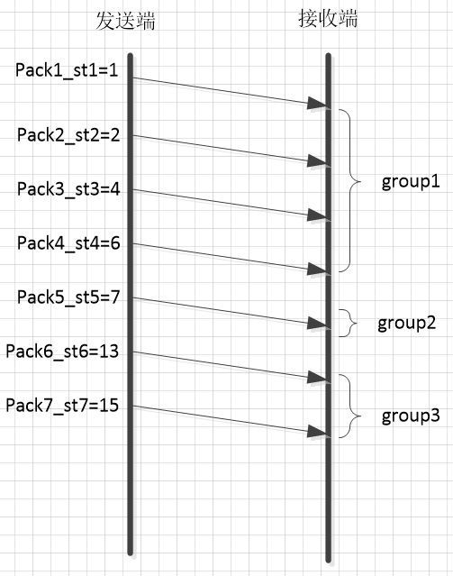  

如果RTPFB中有pack1——pack7七个反馈包，发送时间为st1——st6，其中pack1的包到pack4的时间差小于5毫秒，pack5与pack1的时间差大于5毫秒，则pack1——pack4属于同一个包组group1，pack5属于下一个包组的第一个包，由于pack6与pack5时间差大于5毫秒，因此group2只有一个pack5包，以此次类推。代码实现如下：

```cpp
void DelayBasedBwe::IncomingPacketFeedback(const PacketResult& packet_feedback,
                                            Timestamp at_time) {
   // 初始化时创建inter_arrival_和delay_detector_趋势预测估计实例
   if (last_seen_packet_.IsInfinite() ||
       at_time - last_seen_packet_ > kStreamTimeOut) {
     inter_arrival_.reset(
         new InterArrival((kTimestampGroupLengthMs << kInterArrivalShift) / 1000,
                          kTimestampToMs, true));
     delay_detector_.reset(
         new TrendlineEstimator(key_value_config_, network_state_predictor_));
   }
   
   last_seen_packet_ = at_time;
   uint32_t send_time_24bits =
       static_cast<uint32_t>(
           ((static_cast<uint64_t>(packet_feedback.sent_packet.send_time.ms())
             << kAbsSendTimeFraction) +
            1)   /
           1)    &
       0x00FFFFFF;//计算包的发送时间，算法与abs_send_time一样，单位毫秒，与0x00FFFFFF表示取前24位时间戳

   // Shift up send time to use the full 32 bits that inter_arrival works with,
   // so wrapping works properly.
   uint32_t timestamp = send_time_24bits << kAbsSendTimeInterArrivalUpshift;//凑满32位
   uint32_t ts_delta = 0;
   int64_t t_delta = 0;
   int size_delta = 0;
   bool calculated_deltas = inter_arrival_->ComputeDeltas(//计算包组的发送时间差和接收时间差ts_delta=包发送时间差，t_delta=接收时间差
       timestamp, packet_feedback.receive_time.ms(), at_time.ms(),
       packet_feedback.sent_packet.size.bytes(), &ts_delta, &t_delta,
       &size_delta);
   double ts_delta_ms = (1000.0 * ts_delta) / (1 << kInterArrivalShift);
   delay_detector_->Update(t_delta, ts_delta_ms,//通过计算的发送时间差和接收时间差，计算包组延迟时间时间差，并更新趋势预测估计
                           packet_feedback.sent_packet.send_time.ms(),
                           packet_feedback.receive_time.ms(), calculated_deltas);
}
```

ComputeDeltas函数主要完成包组划分，以及计算相邻包组时间的发送时间差和接收时间差，延时检测实例(趋势预测)的Update函数功能是计算组件延迟，并累积采集样本数后通过最小二乘线性回归预测延迟趋势，根据趋势判断网络使用率。  

ComputeDeltas函数实现流程如下：  

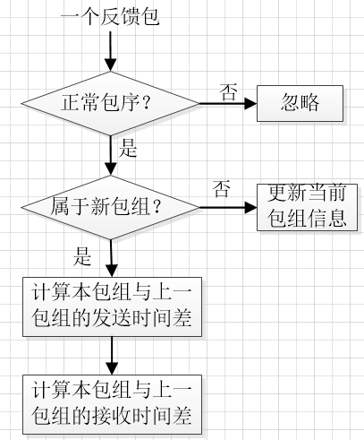  

包组的发送时间差，是指两个包组中最后一个包的发送时间差，接收时间差。是指两个包组中最后一个包的接收时间差，代码如下：

```cpp
 bool InterArrival::ComputeDeltas(uint32_t timestamp,
                                  int64_t arrival_time_ms,
                                  int64_t system_time_ms,
                                  size_t packet_size,
                                  uint32_t* timestamp_delta, // 待计算的发送时间差.
                                  int64_t* arrival_time_delta_ms, // 待计算的接收时间差.
                                  int* packet_size_delta) {
   MS_ASSERT(timestamp_delta != nullptr, "timestamp_delta is null");
   MS_ASSERT(arrival_time_delta_ms != nullptr, "arrival_time_delta_ms is null");
   MS_ASSERT(packet_size_delta != nullptr, "packet_size_delta is null");
   
   bool calculated_deltas = false;

   if (current_timestamp_group_.IsFirstPacket()) {//初始化捕获第一个包组的第一个包
   //赋予新包组的第一个包发送时间和到达时间信息
     current_timestamp_group_.timestamp = timestamp;
     current_timestamp_group_.first_timestamp = timestamp;
     current_timestamp_group_.first_arrival_ms = arrival_time_ms;
   } else if (!PacketInOrder(timestamp, arrival_time_ms)) {//判断包是否是乱序
     return false;//乱序忽略
   } else if (NewTimestampGroup(arrival_time_ms, timestamp)) {//判断包是否属于新包组
     // First packet of a later frame, the previous frame sample is ready.
     if (prev_timestamp_group_.complete_time_ms >= 0) {//判断是否存在前一个包组，因为要计算包组间延时，需要两个相邻包组
       *timestamp_delta =
           current_timestamp_group_.timestamp - prev_timestamp_group_.timestamp;//计算当前包组和前一包组的发送时间差
       *arrival_time_delta_ms = current_timestamp_group_.complete_time_ms -
                                prev_timestamp_group_.complete_time_ms;//计算当前包组和前一包组的到达时间差
       MS_DEBUG_DEV("timestamp previous/current [%" PRIu32 "/%" PRIu32"] complete time previous/current [%" PRIi64 "/%" PRIi64 "]",
           prev_timestamp_group_.timestamp, current_timestamp_group_.timestamp,
           prev_timestamp_group_.complete_time_ms, current_timestamp_group_.complete_time_ms);

       // Check system time differences to see if we have an unproportional jump
       // in arrival time. In that case reset the inter-arrival computations.
       int64_t system_time_delta_ms =
           current_timestamp_group_.last_system_time_ms -
           prev_timestamp_group_.last_system_time_ms;//计算处理时间差

       if (*arrival_time_delta_ms - system_time_delta_ms >=
           kArrivalTimeOffsetThresholdMs) {
         MS_WARN_TAG(bwe,
             "the arrival time clock offset has changed (diff = %" PRIi64 "ms, resetting",
             *arrival_time_delta_ms - system_time_delta_ms);
         Reset();
         return false;
       }

       if (*arrival_time_delta_ms < 0) {
         // The group of packets has been reordered since receiving its local
         // arrival timestamp.
         ++num_consecutive_reordered_packets_;
         if (num_consecutive_reordered_packets_ >= kReorderedResetThreshold) {
           MS_WARN_TAG(bwe,
                  "packets are being reordered on the path from the "
                  "socket to the bandwidth estimator. Ignoring this "
                  "packet for bandwidth estimation, resetting");
           Reset();
         }
         return false;
       } else {
         num_consecutive_reordered_packets_ = 0;
       }

       MS_ASSERT(*arrival_time_delta_ms >= 0, "arrival_time_delta_ms is < 0");
       *packet_size_delta = static_cast<int>(current_timestamp_group_.size) -
                            static_cast<int>(prev_timestamp_group_.size);
       calculated_deltas = true;
     }

     prev_timestamp_group_ = current_timestamp_group_;//当前包组所有包结束，赋予新包组信息
     // The new timestamp is now the current frame.
     current_timestamp_group_.first_timestamp = timestamp;
     current_timestamp_group_.timestamp = timestamp;
     current_timestamp_group_.first_arrival_ms = arrival_time_ms;
     current_timestamp_group_.size = 0;

     MS_DEBUG_DEV("new timestamp group: first_timestamp:%" PRIu32 ", first_arrival_ms:%" PRIi64,
         current_timestamp_group_.first_timestamp, current_timestamp_group_.first_arrival_ms);
   } else {
     current_timestamp_group_.timestamp =
         LatestTimestamp(current_timestamp_group_.timestamp, timestamp);
   }

   // Accumulate the frame size.
   current_timestamp_group_.size += packet_size;
   current_timestamp_group_.complete_time_ms = arrival_time_ms;
   current_timestamp_group_.last_system_time_ms = system_time_ms;

   return calculated_deltas;
}
```

计算的包组发送时间差和接收时间差，传入到延时检测(趋势预测)的Update函数，处理流程如下：  

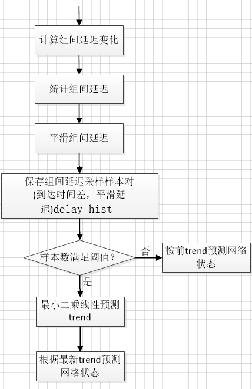  

代码实现如下：

```cpp
void TrendlineEstimator::Update(double recv_delta_ms,
                                 double send_delta_ms,
                                 int64_t send_time_ms,
                                 int64_t arrival_time_ms,
                                 bool calculated_deltas) {
   if (calculated_deltas) {
     const double delta_ms = recv_delta_ms - send_delta_ms;//计算组间延迟变化
     ++num_of_deltas_;
     num_of_deltas_ = std::min(num_of_deltas_, kDeltaCounterMax);
     
	 if (first_arrival_time_ms_ == -1)
       first_arrival_time_ms_ = arrival_time_ms;//第一个包的到达时间
     
	 // Exponential backoff filter.
     accumulated_delay_ += delta_ms;//累积组间延迟变化
     // smoothed_delay_ = smoothing_coef_ * smoothed_delay_ +
                       // (1 - smoothing_coef_) * accumulated_delay_;
     smoothed_delay_ = smoothing_coef_ * delta_ms +
                       (1 - smoothing_coef_) * smoothed_delay_;//平滑当前组间延迟变化smoothing_coef_ =0.6
     
	 // Simple linear regression.
     delay_hist_.push_back(std::make_pair(
         static_cast<double>(arrival_time_ms - first_arrival_time_ms_),//保存组间延迟变化样本，样本对（到达时间差，平滑组间延迟变化值）
         smoothed_delay_));
     
	 if (delay_hist_.size() > window_size_)
       delay_hist_.pop_front();
     
	 double trend = prev_trend_;
     
	 if (delay_hist_.size() == window_size_) {//满足样本数时，对样本最小二乘线性预测趋势
       // 延迟趋势可以看作是(send_rate - capacity)/capacity的估计算
       // 0 < trend < 1   ->  延迟增加，队列被填满
       //   trend == 0    ->  延迟无变化
       //   trend < 0     ->  延迟减少，队列被清空
       trend = LinearFitSlope(delay_hist_).value_or(trend);//线性回归算法——时延梯度趋势预测
     }
     
	 Detect(trend, send_delta_ms, arrival_time_ms);//根据trend探测网络状态
   } else {
     MS_DEBUG_DEV("no calculated deltas");
   }

   if (network_state_predictor_) {
     hypothesis_predicted_ = network_state_predictor_->Update(
         send_time_ms, arrival_time_ms, hypothesis_);
   }
 }
```

通过trend预测网络状态，在WebRTC中，定义了三种网络状态：normal，overuse，underuse，用于表示当前带宽的使用情况。网络处于overuse状态表示带宽使用过载了，由此判断网络发生拥塞，网络处于underuse状态表示当前带宽未充分利用，理论知识参考[GCC拥塞控制](https://blog.csdn.net/qq_22658119/article/details/118961608)中的over-use检测器一节。根据时延梯度增长趋势得到当前的网络状态流程如下。  

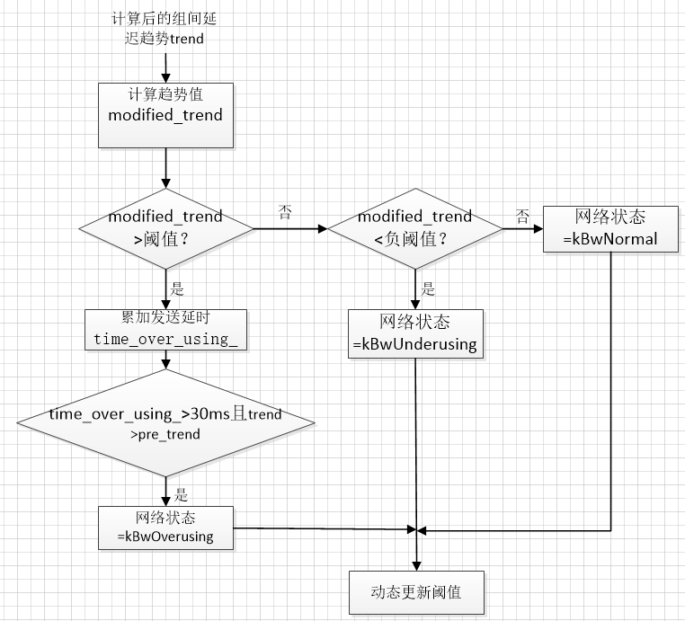  

代码如下：

```cpp
void TrendlineEstimator::Detect(double trend, double ts_delta, int64_t now_ms) {
   if (num_of_deltas_ < 2) {//样本数量小于两个，不判断网络状态，网络默认处于正常
     hypothesis_ = BandwidthUsage::kBwNormal;
     return;
   }
   const double modified_trend =
       std::min(num_of_deltas_, kMinNumDeltas) * trend * threshold_gain_;//对组间延迟线性趋势trend的计算，算法有待研究
   prev_modified_trend_ = modified_trend;
   // BWE_TEST_LOGGING_PLOT(1, "T", now_ms, modified_trend);
   // BWE_TEST_LOGGING_PLOT(1, "threshold", now_ms, threshold_);
   if (modified_trend > threshold_) {//大于阈值
     if (time_over_using_ == -1) {
       // Initialize the timer. Assume that we've been
       // over-using half of the time since the previous
       // sample.
       time_over_using_ = ts_delta / 2;
     } else {
       // Increment timer
       time_over_using_ += ts_delta;//累积的发送时间差
     }
     overuse_counter_++;
     if (time_over_using_ > overusing_time_threshold_ && overuse_counter_ > 1) {//检测一次过载无法说明网络处于过载，只有连续处于过载
     //且累积到overusing_time_threshold_=30毫秒的过载才算真正处于过载。
       if (trend >= prev_trend_) {//当前预测趋势比前一个趋势有增长才表示过载情况，不然也不会判定是过载
         time_over_using_ = 0;
         overuse_counter_ = 0;
         MS_DEBUG_DEV("hypothesis_: BandwidthUsage::kBwOverusing");
 #if MS_LOG_DEV_LEVEL == 3
         for (auto& kv : delay_hist_) {
           MS_DEBUG_DEV("arrival_time_ms - first_arrival_time_ms_:%f, smoothed_delay_:%f", kv.first, kv.second);
         }
 #endif
         hypothesis_ = BandwidthUsage::kBwOverusing;
       }
     }
   } else if (modified_trend < -threshold_) {//小于负阈值，表示
     time_over_using_ = -1;
     overuse_counter_ = 0;
     hypothesis_ = BandwidthUsage::kBwUnderusing;
     MS_DEBUG_DEV("---- BandwidthUsage::kBwUnderusing ---");
   } else {//其他情况
     time_over_using_ = -1;
     overuse_counter_ = 0;
     MS_DEBUG_DEV("---- BandwidthUsage::kBwNormal ---");
     hypothesis_ = BandwidthUsage::kBwNormal;
   }
   prev_trend_ = trend;
   UpdateThreshold(modified_trend, now_ms);//动态更新阈值threshold_
}
```

动态更新阈值threshold_代码如下，计算阈值的算法等式可以参考[GCC拥塞控制](https://blog.csdn.net/qq_22658119/article/details/118961608)中的over-use检测器一节：

```cpp
void TrendlineEstimator::UpdateThreshold(double modified_trend,
                                          int64_t now_ms) {
   if (last_update_ms_ == -1)
     last_update_ms_ = now_ms;
   if (fabs(modified_trend) > threshold_ + kMaxAdaptOffsetMs) {
     // Avoid adapting the threshold to big latency spikes, caused e.g.,
     // by a sudden capacity drop.
     last_update_ms_ = now_ms;
     return;
   }
   const double k = fabs(modified_trend) < threshold_ ? k_down_ : k_up_;
   const int64_t kMaxTimeDeltaMs = 100;
   int64_t time_delta_ms = std::min(now_ms - last_update_ms_, kMaxTimeDeltaMs);
   threshold_ += k * (fabs(modified_trend) - threshold_) * time_delta_ms;
   threshold_ = rtc::SafeClamp(threshold_, 6.f, 600.f);
   last_update_ms_ = now_ms;
}
```

最后根据网络状态进行码率更新，码率更新会涉及到到一个模块————码率控制器AimdRateControl，码率控制器最终码率输出基于延迟的码率，具体参考[webrtc中GCC拥塞控制模块之码率控制器AimdRateControl](https://blog.csdn.net/qq_22658119/article/details/119330688)
最后结合基于丢包的码率，ack码率，探测prober码率和基于延迟的码率做最后的综合评估。前面已有介绍

```cpp
void SendSideBandwidthEstimation::CapBitrateToThresholds(Timestamp at_time,
                                                          DataRate bitrate) {
   if (bwe_incoming_ > DataRate::Zero() && bitrate > bwe_incoming_) {
     MS_DEBUG_DEV("bwe_incoming_:%lld", bwe_incoming_.bps());
     bitrate = bwe_incoming_;
   }
   if (delay_based_bitrate_ > DataRate::Zero() &&
       bitrate > delay_based_bitrate_) {
     MS_DEBUG_DEV("delay_based_bitrate_:%lld", delay_based_bitrate_.bps());
     bitrate = delay_based_bitrate_;
   }
   if (loss_based_bandwidth_estimation_.Enabled() &&
       loss_based_bandwidth_estimation_.GetEstimate() > DataRate::Zero()) {
     MS_DEBUG_DEV("loss_based_bandwidth_estimation_.GetEstimate():%lld", loss_based_bandwidth_estimation_.GetEstimate().bps());
     bitrate = std::min(bitrate, loss_based_bandwidth_estimation_.GetEstimate());
   }
   if (bitrate > max_bitrate_configured_) {
     MS_DEBUG_DEV("bitrate > max_bitrate_configured_, setting bitrate to max_bitrate_configured_");
     bitrate = max_bitrate_configured_;
   }
   if (bitrate < min_bitrate_configured_) {
     MS_DEBUG_DEV("bitrate < min_bitrate_configured_");
     if (last_low_bitrate_log_.IsInfinite() ||
         at_time - last_low_bitrate_log_ > kLowBitrateLogPeriod) {
       MS_WARN_TAG(bwe, "Estimated available bandwidth %s"
                         " is below configured min bitrate %s",
                         ToString(bitrate).c_str(),
                         ToString(min_bitrate_configured_).c_str());
       last_low_bitrate_log_ = at_time;
     }
     bitrate = min_bitrate_configured_;
   }
   if (bitrate != current_bitrate_ ||
       last_fraction_loss_ != last_logged_fraction_loss_ ||
       at_time - last_rtc_event_log_ > kRtcEventLogPeriod) {
     last_logged_fraction_loss_ = last_fraction_loss_;
     last_rtc_event_log_ = at_time;
   }
   MS_DEBUG_DEV("current_bitrate_:%lld", current_bitrate_.bps());
   current_bitrate_ = bitrate;
   if (acknowledged_rate_) {
     link_capacity_.OnRateUpdate(std::min(current_bitrate_, *acknowledged_rate_),
                                 at_time);
   }
}
```

## 三、决策输出最终的传输码率

最终输出码率后作用于编码器和webrtc pacer控制编码速率和发送速率，以达到根据网络状态动态码率调整。
