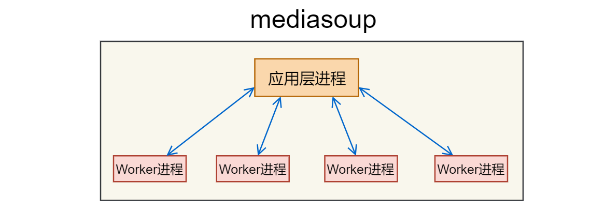
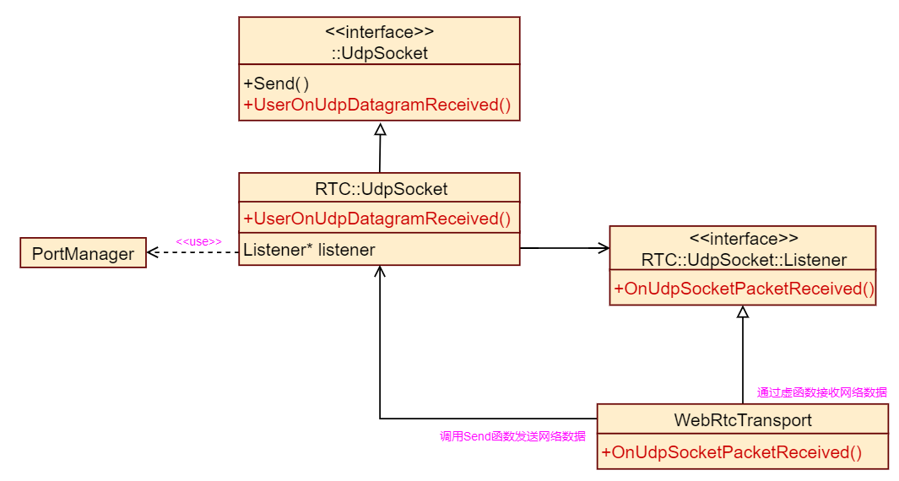

 
<!--BEGIN_DATA
{
    "create_date": "2022-03-02 20:40", 
    "modify_date": "2022-03-02 20:40", 
    "is_top": "0", 
    "summary": "", 
    "tags": "", 
    "file_name": ""
}
END_DATA-->

#### <p>原文出处：<a href='https://blog.csdn.net/qiuguolu1108/article/details/115362653' target='blank'>mediasoup源码分析-初始化、建立连接及媒体数据的处理流程</a></p>

mediasoup中的Transport有多种类型，以下只分析WebRtcTransport，且只分析音频、视频的传输。

信令文件下载：链接: `https://pan.baidu.com/s/1IhSGl3k82nkJZl_QTbdOJw` 提取码: `jmkr`

### 线程模型

mediasoup使用的是多进程模型，服务器上有多个少CPU核，就启动多少个Worker进程。每个Worker进程采用单线程，运行一个事件循环，所有数据的处理，都是通过事件触发的。

MediaSoup的应用层和媒体处理层分别运行在不同的进程内，它们之间通过管道进行通信。

`注意`：应用进程和Worker进程之间可以使用普通的管道，也可以使用socketpair，这个部分的代码应该在JS部分。



两个客户端通过mediasoup进行视频通话时，此时的mediasoup内部结构如下图：


### Worker与libuv

每个Worker进程内，都会运行libuv，Worker进程对所有数据的处理，都是基于libuv的事件循环，当有数据到达时，会触发libuv中的事件，根据事件预先注册的回调函数，对数据进行相应的处理，最后再通过libuv将数据结果发送出去。


##### 使用libuv收发网络数据

mediasoup可以使用UDP收发数据，也可以使用TCP。对于音视频数据，更多的采用的是UDP。

下面分析mediasoup是如何对libuv的UDP功能进行封装的。



RTC::UdpSocket对象是对libuv的封装，需要通过libuv发送数据时，通过调用其父类::UdpSocket::Send(）函数，将要发送的数据交由libuv发送。

WebRtcTransport是RTC::UdpSocket::Listener的订阅者，WebRtcTransport类内覆写了OnUdpSocketPacketReceived()虚函数，当libuv收到数据时，会通过这个虚函数将收到的数据送至WebRtcTransport。

`接收数据流程如下：`

  

`注意`：mediasoup中有两个同名的类UdpSocket，但一个位于全局匿名空间::中，另一个位于RTC命名空间中，所以::UdpSocket和RTC::UdpSocket是两个不同的类。

`发送数据流程如下：`


##### 使用libuv收发应用层信令

Worker进程是应用层进程的子进程，它们通过管道进行通信。在传递信令时，使用了json进行序列化和反序列。


Channel::UnixStreamSocket类是libuv对管道的封装，可以通过Channel::UnixStreamSocket::Send()函数向管道中写入数据，调用Send()函数时，写入的数据是Json对象。

Worker作为Channel::UnixStreamSocket的订阅者，通过覆写OnChannelRequest()虚函数。libuv从管道收到数据后，会将数据解析生成Request对象，然后通过这个虚函数发送给Worker类。

`接收数据流程如下：`


管道中的数据是流式的，需要处理粘包。处理粘包后的数据是字符串，需要解析为json对象。最后还需要将Channel::UnixStreamSocket和json对象封装为Requst对象，通过Request对象可以方便的发送处理后的结果。

应用层进程发送过来的request，Worker进程处理后，需要对应的回复一个response。这个response可以携带有效的数据，也可以仅仅回复"accepted"表示request处理成功。为了将request和response一一对应，它们内部都会有一个id字段，用于它们之间的一一对应。

`发送数据流程如下：`


应用层发送的request最后被封装在Requst对象中，其中包含着"id"，因为Request对象中包含着Channel::UnixStreamSocket对象，所以可以直接调用Request::Accept()将处理后的结果告诉应用层进程。

Worker进程也可以主动给应用层进程发送消息，通过Notifier::Emit()即可以给应用进程发送消息，Notifier类中有Channel::UnixStreamSocket，所以直接调用Channel::UnixStreamSocket::Send()就可以发送消息。Notifier类内部的数据成员和函数成员都是静态的，所以在任意位置可以直接通过Channel::Notifier::Emit()函数发送消息。

### mediasoup初始化过程

在运行mediasoup demo的时候，我将JS进程与Worker进程之间的信令保存了下来，现在根据JS进程与Worker进程之间的信令，分析一下mediasoup与客户端建立连接的流程。

完整的request和response，在这里下载：

在demo中，音视频是相互的，为了方便分析，现在假设只有一端在发送音视频，另一端只接收音视频。

简化后的结构如下图：


#### 创建Router

在以下的分析中，我会给出我运行mediasoup demo时的信令。

`注意`：以下给出的信令，都是有删减的，完整的信令可以在上面给出的链接中下载。

**request**

```
method:worker.createRouter ,id:1    #id:信令的编号是1
data : {}
internal : {
    "routerId": "ab8baa18-e002-44d7-a6e2-dc298587dd8b"   #指定Router的id
}
```

**response**

```
{
    "accepted": true,
    "id": 1     #指明是对哪条信令的回复
}
```

从上面的分析，我们可以知道应用层发送过来的信令，经过libuv的处理，会被送至Worker::OnChannelRequest()函数。其实应用层发送的所有信令，都会被送至这里。如果这个函数无法处理发送过来的信令，则会将信令转发给Router，若Router也无法识别信令，则将信令继续往下转发。

```cpp
void Worker::OnChannelRequest(Channel::UnixStreamSocket* /*channel*/, Channel::Request* request)
{
    ...
        switch (request->methodId){
            ...
            /*创建一个router*/
        case Channel::Request::MethodId::WORKER_CREATE_ROUTER:{
            std::string routerId;
            // This may throw.     获取router的id
            SetNewRouterIdFromRequest(request, routerId);
            /*创建Router*/
            auto* router = new RTC::Router(routerId);
            /*将新创建的router保存下来*/
            this->mapRouters[routerId] = router;
            /*发送消息告诉nodejs，request已经成功处理。*/
            request->Accept();
            break;
        }
            ...
        }
}
```

`method:worker.createRouter`会指明信令是做什么的，`id`是这条指令的编号，在回复这条指令时，也需要指明`id`，这样应用层才知道这是哪条信令的应答。

这里的Router相当于Room，也就是一个房间。Worker进程首先收到的信令是，创建一个房间，同时指定了Router的id是`ab8baa18-e002-44d7-a6e2-dc298587dd8b`，用于唯一的标识这个房间。

一个Worker中可以有多个Router，Worker内部使用map保存router id和Router实例对象之间的映射关系。

```cpp
Router::Router(const std::string& id) 
    : id(id)   /*保存Router的id*/
{
        MS_TRACE();
}
```

创建Router时，仅仅是保存了自己对应的id。

##### 创建AudioLevelObserver

**request**

```
method:router.createAudioLevelObserver ,id:2
data : {
    "interval": 800,  #用于检查音频音量的时间间隔（单位：毫秒）
    "maxEntries": 1,  #音量事件中最大的条目数 
    "threshold": -80  #音量事件中条目的最小平均音量（从-127 到 0，单位：dBvo）
}
internal : {
    "routerId": "ab8baa18-e002-44d7-a6e2-dc298587dd8b",
    "rtpObserverId": "079b1620-3865-4c0b-8c0a-e6acba5af7c2"
}
```

**response**

```
{
    "accepted": true,
    "id": 2
}
```

```cpp
void Worker::OnChannelRequest(Channel::UnixStreamSocket* /*channel*/, Channel::Request* request)
{
    ...
        switch (request->methodId){
    ...
        default:
        {
            //通过请求中的routerId解析出Router id
            RTC::Router* router = GetRouterFromRequest(request);
            /*将消息传递至相应的Router*/
            router->HandleRequest(request);
            break;
        }
        }
    ...
}       
```

当Worker无法识别给定的指令时，它会解析处指令的router id，并将这条指令送至对应的Router。

```cpp
void Router::HandleRequest(Channel::Request* request)
{
...
        switch (request->methodId){
            ...      
            case Channel::Request::MethodId::ROUTER_CREATE_AUDIO_LEVEL_OBSERVER:
            {
                std::string rtpObserverId;
                //获取rtpObserver的id
                SetNewRtpObserverIdFromRequest(request, rtpObserverId);
                /*创建AudioLevelObserver对象*/
                auto* audioLevelObserver = new RTC::AudioLevelObserver(rtpObserverId, request->data);
                /*建立AudioLevelObserver id到AudioLevelObserver的映射*/
                this->mapRtpObservers[rtpObserverId] = audioLevelObserver;
                    /*回复处理成功*/
                request->Accept();
                break;
            }
```


在Router中创建AudioLevelObserver，同时保存AudioLevelObserverid到AudioLevelObserver对象的映射。


```cpp
AudioLevelObserver::AudioLevelObserver(const std::string& id, json& data) 
        : RTC::RtpObserver(id)
{
    /* 解析应用层传入的参数
        * interval   : 定时器的定时周期
        * maxEntries : 监控的audio producer的最大条目数
        * threshold  : 静音的阈值，音量小于此值则为静音。
        */
    ...
    /*创建定时器，用于定期向应用层汇报统计的音量信息。*/
    this->periodicTimer = new Timer(this);
    this->periodicTimer->Start(this->interval, this->interval);
}
```

AudioLevelObserver用于检查 producer 收到音频的音量，并定期向应用层汇报producer的音量。

```cpp
void AudioLevelObserver::ReceiveRtpPacket(RTC::Producer* producer, RTC::RtpPacket* packet)
{
    ...
    /*从rtp包中读取volume*/
    if (!packet->ReadSsrcAudioLevel(volume, voice))
        return;
    /*获取该prodcuer的dBovs*/
    auto& dBovs = this->mapProducerDBovs.at(producer);
    /*统计所有的音量，并记录统计的次数。*/
    dBovs.totalSum += volume;
    dBovs.count++;
}
```

当audio producer收到RTP数据包时，会将数据包通过这个函数送至AudioLevelObserver。它会从RTP包中取出音量，记录音量值并增加计数。

```cpp
void AudioLevelObserver::Update()
{
    ...
    /*计算每个producer在这个时间段的平均音量*/
    for (auto& kv : this->mapProducerDBovs){
        ... 
    }
    // DBovs全部重置为0，以便下次重新统计。
    ResetMapProducerDBovs();
    /*有高于阈值的producer，说明没有静音。*/
    if (!mapDBovsProducer.empty()){
        ...	
        /*通知应用层，对应producer的音量是多少。*/
        Channel::Notifier::Emit(this->id, "volumes", data);
    }
    else if (!this->silence)    
    {
        ...
        /*通知应用层，所有的producer都处于静音状态。*/
        Channel::Notifier::Emit(this->id, "silence");
    }
}
```

定时器会定期的执行这个函数，在这个函数中，会将这段时间内的统计信息，生成统计结果，然后上报应用层。

##### 创建接收端WebRtcTransport

**request**

```
method:router.createWebRtcTransport ,id:5
data : {
    "enableTcp": false,       #不使用TCP
    "enableUdp": true,        #使用UDP
    #仅当consumer连接的接收端支持REMB或TCC时，才使用。
    "initialAvailableOutgoingBitrate": 1000000,   #可用的输出码率
    "listenIps": [
        {
            "ip": "192.168.10.12"    #WebRtcTransport监听的ip地址
        }
    ],
    "preferTcp": false,   #穿墙时是否优先使用TCP
    "preferUdp": false    #穿墙时是否优先使用UDP
}
internal : {
    #WebRtcTransport对应router的id
    "routerId": "ab8baa18-e002-44d7-a6e2-dc298587dd8b",    
    #WebRtcTransport的id
    "transportId": "253c0380-359c-4102-9dce-c6db3a625944"
}
```

**response**

```
{
    "accepted": true,
    "data": {
        "consumerIds": [],
        "direct": false,
        "dtlsParameters": {     #dtls相关的信息
            "fingerprints": [   #服务器证书的哈希值
                ...
                {
                    "algorithm": "sha-256",   #使用的哈希算法
                    "value": "42:F5:D7:5D:F0:96:68:66:B4:F7:B9:0F:13:DA:7F:CE:26:48:94:0E:55:03:C2:B7:FA:1D:0D:ED:EB:10:7D:29"        #证书的哈希值
                },
                ...
            ],
            "role": "auto"     #DTLS中的角色
        },
        "dtlsState": "new",    #DTLS的状态
        "iceCandidates": [     #WebRtcTransport生成的candidate
            {
                "foundation": "udpcandidate",
                "ip": "192.168.10.12",
                "port": 43439,
                "priority": 1076302079,
                "protocol": "udp",
                "type": "host"
            }
        ],
        "iceParameters": {    #Ice Server的相关参数
            "iceLite": true,  #是否使用lite ice，与之对应的是Full ice。
            #以下两个参数用于ICE阶段，验证身份。
            "password": "apfkmkqlij8brze8zqohrd7e3kl0wwj9",  #ice-pwd
            "usernameFragment": "1ga7pj9kdinmeqxb"           #ice-ufrag
        },
        "iceRole": "controlled",    #ice的角色
        "iceState": "new",          #ice的状态
        "id": "253c0380-359c-4102-9dce-c6db3a625944", #WebRtcTransport的id
        "mapRtxSsrcConsumerId": {},
        "mapSsrcConsumerId": {},
        "producerIds": [],
        "recvRtpHeaderExtensions": {},
        "rtpListener": {
            "midTable": {},
            "ridTable": {},
            "ssrcTable": {}
        },
    },
    "id": 5
}
```

```cpp
void Router::HandleRequest(Channel::Request* request)
{
    ...
    case Channel::Request::MethodId::ROUTER_CREATE_WEBRTC_TRANSPORT:
    {
        std::string transportId;
        /*获取transportId*/
        SetNewTransportIdFromRequest(request, transportId);
        /*创建WebRtcTransport*/
        auto* webRtcTransport = new RTC::WebRtcTransport(transportId, this, request->data);
        /*保存id到WebRtcTransport对象的映射*/
        this->mapTransports[transportId] = webRtcTransport;
        /*获取webRtcTransport的状态信息，将其发送给上层的Node.js应用程序。*/
        json data = json::object();
        webRtcTransport->FillJson(data);
        /*将生成的WebRtcTransport的相关信息，上报给应用进程。*/ 
        request->Accept(data);
        break;
    }
    ...
```

应用层发出创建WebRtcTransport的信令，最终这个信令在Router中被处理。Router会创建WebRtcTransport对象，同时保存id到WebRtcTransport对象的映射。生成WebRtcTransport对象后，Router会将其状态信息生成Response信令汇报给应用进程。  

  


##### 创建Transport

```cpp
Transport::Transport(const std::string& id, Listener* listener, json& data)
{
    ...
    /*Sctp相关的设置*/
    ...
    /*创建rtcp计时器*/
    this->rtcpTimer = new Timer(this);
}
```

Transport是WebRtcTransport的父类，所以在创建WebRtcTransport的时候，需要先创建Transport。

在Transport的构造器中，大部分都是对Sctp的设置。Sctp主要用于传输文本数据，所以这里暂不分析。除了Sctp的设置，最重要的是创建了一定定时器，这个定时器用于定期发送Rtcp报文。

##### 设置Transport定时器，定时发送RTCP报文。

```cpp
inline void Transport::OnTimer(Timer* timer)
{
    if (timer == this->rtcpTimer){
        auto interval  = static_cast<uint64_t>(RTC::RTCP::MaxVideoIntervalMs);
        uint64_t nowMs = DepLibUV::GetTimeMs();
        /*发送SR和RR报文*/
        SendRtcp(nowMs);
        /*计算下一次的RTCP发送间隔*/
        if (!this->mapConsumers.empty()){
            ...
        }
        interval *= static_cast<float>(Utils::Crypto::GetRandomUInt(5, 15)) / 10;
        /*设置下次的定时时间*/
        this->rtcpTimer->Start(interval);
    }
}
```

这是定时器触发时执行的虚函数，定时器触发后，先是发送RTCP报文，报文发送后，再计算下次的发送间隔时间，重新设置定时器。

```cpp
void Transport::SendRtcp(uint64_t nowMs)
{
    std::unique_ptr<RTC::RTCP::CompoundPacket> packet{ nullptr };
    /*遍历所有的Consumer，向Consumer发送SR报文。*/
    for (auto& kv : this->mapConsumers){
        auto* consumer = kv.second;
        for (auto* rtpStream : consumer->GetRtpStreams()){
            packet.reset(new RTC::RTCP::CompoundPacket());
            /*生成consumer的SR报文*/
            consumer->GetRtcp(packet.get(), rtpStream, nowMs);
            if (packet->HasSenderReport()){
                packet->Serialize(RTC::RTCP::Buffer);
                    /*发送SR报文*/
                SendRtcpCompoundPacket(packet.get());
            }
        }
    }
    ...
    /*遍历所有的Producer，向Producer发送SR报文。*/
    for (auto& kv : this->mapProducers){
        auto* producer = kv.second;
        /*生成Producer的RR报文*/
        producer->GetRtcp(packet.get(), nowMs);
        if (packet->GetSize() + sizeof(RTCP::ReceiverReport::Header) > RTC::MtuSize)
        {
            packet->Serialize(RTC::RTCP::Buffer);
                /*发送RR报文*/
            SendRtcpCompoundPacket(packet.get());
            packet.reset(new RTC::RTCP::CompoundPacket());
        }
    }
    ...
}
```

Consumer连接的是接收客户端，所以mediasoup需要定期向其发送SR报文。Producer连接的是发送客户端，所以mediasoup需要定期向其发送RR报文。

```cpp
void WebRtcTransport::SendRtcpCompoundPacket(RTC::RTCP::CompoundPacket* packet)
{
    /*如果处于未连接状态，则直接返回。*/
    if (!IsConnected())
        return;
    const uint8_t* data = packet->GetData();
    size_t len = packet->GetSize();
    /*如果SRTCP未开启，则向日志打印警告信息。*/
    if (!this->srtpSendSession){
        ...
    }
    /*对RTCP报文进行加密*/
    if (!this->srtpSendSession->EncryptRtcp(&data, &len))
        return;
    /*通过ice server发送数据*/
    this->iceServer->GetSelectedTuple()->Send(data, len);
    /*Transport统计发送数据相关信息*/
    RTC::Transport::DataSent(len);
}
```

SendRtcpCompoundPacket是虚函数，所以在Transport中调用的实际是WebRtcTransport中覆写的虚函数。

WebRtcTransport会将接收到的RTCP报文，使用libsrtp库进行加密，然后通过IceServer将RTCP报文发送至相应的客户端。


##### WebRtcTransport构造器

```cpp
WebRtcTransport::WebRtcTransport(const std::string& id, RTC::Transport::Listener* listener, json& data)
{
    ...
    /*先解析应用进程传入信令中的参数*/
    /*传输默认使用的是udp*/
    bool enableUdp{ true };
    ...
    /*在穿墙的时候，udp的优先级高。*/
    bool preferUdp{ false };
    ...
    /*在穿墙的时候，tcp的优先级高。*/
    bool preferTcp{ false };
    ...
    /*WebRtcTransport可以使用的监听ip地址*/
    std::vector<ListenIp> listenIps(jsonListenIpsIt->size());
    ...
    /*为每个可以监听的ip地址，生成candidate。*/
    for (auto& listenIp : listenIps)
    {
        if (enableUdp){
            /*设置udp的优先级*/
            uint16_t iceLocalPreference = IceCandidateDefaultLocalPriority - iceLocalPreferenceDecrement;
            if (preferUdp)   /*如果优先考虑udp，则udp的candidate优先级高一点。*/
                iceLocalPreference += 1000;
            /*计算candidate的优先级*/
            uint32_t icePriority = generateIceCandidatePriority(iceLocalPreference);
            /*生成UdpSocket对象，建立监听socket。*/
            auto* udpSocket = new RTC::UdpSocket(this, listenIp.ip);
            /*建立UdpSocket到announce ip的映射*/
            this->udpSockets[udpSocket] = listenIp.announcedIp;
            /*生成candidate，并保存。*/
            if (listenIp.announcedIp.empty())
                this->iceCandidates.emplace_back(udpSocket, icePriority);
            else
                this->iceCandidates.emplace_back(udpSocket, icePriority, listenIp.announcedIp);
        }
        /*按照ip给出的顺序，优先级依次递减。*/
        iceLocalPreferenceDecrement += 100;
    }
    /*创建IceServer    通过GetRandomString生成ice-ufrag和ice-pwd*/
    this->iceServer = new RTC::IceServer(this, Utils::Crypto::GetRandomString(16), Utils::Crypto::GetRandomString(32));
    /*创建DtlsTransport*/
    this->dtlsTransport = new RTC::DtlsTransport(this);
}
```

在WebRtcTransport的构造器中，先解析应用层信令中的参数，根据应用层设置的监听ip地址，创建对应的socket，同时生成对应的candidate，以用于之后的ICE。

最后创建了用于之后ICE的IceServer对象，和DtlsTransport对象。在创建IceServer对象时，使用GetRandomString生成ice-ufrag和ice-pwd。这个两个参数主要用于在ICE时进行身份验证。

此时WebRtcTransport已经创建了对应的socket，并且处于监听状态了（LISTEN状态），ip为应用层指定的ip，而port是指定范围内的随机值端口。这个port的范围可以在应用层配置。

##### IceServer的创建

```cpp
IceServer::IceServer(Listener* listener, const std::string& usernameFragment, const std::string& password)
        : listener(listener), usernameFragment(usernameFragment), password(password)
{
        MS_TRACE();
}
```

IceServer主要用于ICE，建立与客户端的连接。在一般的WebRTC中，端与端的建立是通过`Full ICE`建立连接的。而mediasoup使用的是`lite
ICE`，所以在ICE中，mediasoup角色为`controlled`，而客户端角色为`controlling`。


ICE的模式：

`Full ice`：双方都要进行连通性检查，完整的走一遍流程。

`Lite ice`：在FULL ice和lite ICE互通时，只需需要FULL ice一方进行连通性检查，Lite一方只需要回应reponse消息。这种模式对于部署在公网到的设备比较常用。

`Lite ice`只接收binding request请求并回复，不会主动发送binding reque请求给对方。

`Full ice`既可以接收bindingrequest，也可以发送binding request。

在创建IceServer时，需要生成ice-ufrag和ice-pwd，这两个参数将被应用层进程通过信令传给客户端，客户端在与mediasoup的ICE过程中，用于客户端的身份是否合法。

##### DTLSTransport的创建

```cpp
DtlsTransport::DtlsTransport(Listener* listener)
    : listener(listener)
{
    /*基于ctx产生一个新的SSL*/
    this->ssl = SSL_new(DtlsTransport::sslCtx);
    /*在ssl中设置用户的私有数据，即this指针。*/
    SSL_set_ex_data(this->ssl, 0, static_cast<void*>(this));
    /*给read生成一个BIO mem*/
    this->sslBioFromNetwork = BIO_new(BIO_s_mem());
    /*给write生成一个BIO mem*/
    this->sslBioToNetwork = BIO_new(BIO_s_mem());
    /*将生成的read和write的Bio mem关联到ssl上*/
    SSL_set_bio(this->ssl, this->sslBioFromNetwork, this->sslBioToNetwork);
    /*每次发包大小小于MTU，这样IP就不用分片了。*/
    SSL_set_mtu(this->ssl, DtlsMtu);
    DTLS_set_link_mtu(this->ssl, DtlsMtu);
    /*设置超时处理回调函数*/
    DTLS_set_timer_cb(this->ssl, onSslDtlsTimer);
    /*设置定时器*/
    this->timer = new Timer(this);
    return;
}
```

在socket层与客户端建立连接后，DTLSTransport可以用于获取libsrtp使用的密钥套件信息。在数据传输过程中，Sctp data的加密和解密都由DTLSTransport负责。

```cpp
int main(int argc, char* argv[])
{
    ...
    RTC::DtlsTransport::ClassInit(); 
    ...
}
```

在Woker进程的main函数中，这个函数会调用DtlsTransport::ClassInit()用于初始化dtls相关的信息。

```cpp
void DtlsTransport::ClassInit()
{
    /*如果没有提供证书和私钥，则自己生成私钥和证书。*/
    if (Settings::configuration.dtlsCertificateFile.empty() || Settings::configuration.dtlsPrivateKeyFile.empty()){
        GenerateCertificateAndPrivateKey();        /*自己生成证书和私钥*/
    }else{
        ReadCertificateAndPrivateKeyFromFiles();   /*根据位置信息，读取证书和私钥*/
    }
    /*创建全局的SSL_CTX*/
    CreateSslCtx();
    /*生成certificate的fingerprint*/
    GenerateFingerprints();
}
```

如果在mediasoup的配置文件中，没有配置了证书和私钥，则会通过算法给mediasoup生成证书和私钥。

有了证书后，需要给证书使用多种哈希算法生成指纹，生成的这些指纹会通过信令传送给客户端。在客户端和服务端Dtls握手过程中，用于客户端验证服务端的证书是否合法。信令是使用ssl进行加密的，所以传送服务端证书指纹是安全的，客户端有了服务端证书的指纹，就可以验证服务端证书是否有效了。

##### 生成WebRtcTransport后，向应用汇报信息。

WebRtcTransport创建完毕后，需要将相关的信息汇报给应用层。

在Router中，先是通过WebRtcTransport::FillJson()生成相应的信息，之后通过管道发送给应用进程。

```cpp
void WebRtcTransport::FillJson(json& jsonObject) const
{
    ...
    /*设置ice的角色为 controlled*/
    jsonObject["iceRole"] = "controlled";
    /*设置本端的ice-ufrag和ice-pwd*/
    (*jsonIceParametersIt)["usernameFragment"] = this->iceServer->GetUsernameFragment();
    (*jsonIceParametersIt)["password"] = this->iceServer->GetPassword();
    /*ice的模式为lite*/
    (*jsonIceParametersIt)["iceLite"] = true;
    /*填写candidate的信息，若设置了多个监听ip，则有多个candidate。*/
    for (size_t i{ 0 }; i < this->iceCandidates.size(); ++i){
        jsonIceCandidatesIt->emplace_back(json::value_t::object);
        ...
        iceCandidate.FillJson(jsonEntry);    /*获取candidate信息*/
    }
    /*获取ice的状态*/
    switch (this->iceServer->GetState()){
    case RTC::IceServer::IceState::NEW:
        jsonObject["iceState"] = "new";
    ...
    }
    /*计算服务端证书的哈希值，因为使用不同的算法，所以fingerprint是一组。*/
    (*jsonDtlsParametersIt)["fingerprints"] = json::array();
    /*获取本地证书的fingerprint*/
    auto& fingerprints = this->dtlsTransport->GetLocalFingerprints();    
    /*将相应的哈希算法和对应的哈希值，填入到json中。*/
    for (size_t i{ 0 }; i < fingerprints.size(); ++i){
        ...
        jsonEntry["algorithm"] =
            RTC::DtlsTransport::GetFingerprintAlgorithmString(fingerprint.algorithm);
        jsonEntry["value"] = fingerprint.value;
    }
    /*添加dtls的角色*/
    switch (this->dtlsRole){
    case RTC::DtlsTransport::Role::AUTO:
        (*jsonDtlsParametersIt)["role"] = "auto";
        break;
    ...
    }
    /*添加dtls的状态*/
    switch (this->dtlsTransport->GetState()){
    case RTC::DtlsTransport::DtlsState::NEW:
        jsonObject["dtlsState"] = "new";
        break;
    ...
    }
}
```

以上生成的信息会发送给应用层进程，应用进程将上述信息整理后生成SDP，通过信令将服务端的SDP发送给客户端。

`IceState`：

new：尚未收到 ICE 绑定请求

connected：收到有效的 ICE 绑定请求，当没有 USE-CANDIDATE 属性，允许发出媒体。

completed：收到具有 USE_CANDIDATE 属性的 ICE 绑定请求，现在允许双向收发媒体。

disconnected：ICE 是“connected”或“completed”，但突然失败。

closed：transport 处于关闭状态时的 ICE 状态

`DtlsRole`：

auto：DTLS 角色是根据已解析的 ICE 角色确定的（“controlled”角色充当 DTLS 客户端，“controlling”角色充当 DTLS 服务器），由于 mediasoup 是 ICE lite 的实现，因为它始终表现为 ICE “controlled”。

client：DTLS 客户端

server：DTLS 服务端

`DtlsState`：

new：DTLS 程序尚未启动

connecting：DTLS 正在连接中

connected：DTLS 已成功连接（SRTP 密钥已被提取）

failed：DTLS 连接失败

closed：当 transport 已关闭时，DTLS 的状态。

##### 小结


#### 设置发送端的最大接收码率

**request**

```
method:transport.setMaxIncomingBitrate ,id:7
data : {
    "bitrate": 1500000
}
internal : {
    "routerId": "ab8baa18-e002-44d7-a6e2-dc298587dd8b",
    "transportId": "253c0380-359c-4102-9dce-c6db3a625944"
}
```

**response**

```
{
    "accepted": true,
    "id": 7
}

```cpp
void Transport::HandleRequest(Channel::Request* request)
{
    ...
    case Channel::Request::MethodId::TRANSPORT_SET_MAX_INCOMING_BITRATE:
    {
        /*从request中获取最大接收码率*/
        auto jsonBitrateIt = request->data.find("bitrate");
        if (jsonBitrateIt == request->data.end() || !Utils::Json::IsPositiveInteger(*jsonBitrateIt))
        {
            MS_THROW_TYPE_ERROR("missing bitrate");
        }
        /*设置最大接收码率*/
        this->maxIncomingBitrate = jsonBitrateIt->get<uint32_t>();
        MS_DEBUG_TAG(bwe, "maximum incoming bitrate set to %" PRIu32, this->maxIncomingBitrate);
        request->Accept();
        /*如果使用tcc，则给tccServer设置最大接收码率。*/
        if (this->tccServer)
            this->tccServer->SetMaxIncomingBitrate(this->maxIncomingBitrate);
        break;
    }
    ...
}
```


mediasoup从WebRTC中移植了remb和TCC相关的处理代码，所以如果客户端支持TCC则设置最大的接收码率。

#### 与发送端建立连接

**request**

```
method:transport.connect ,id:13
data : {
    "dtlsParameters": {
        "fingerprints": [ #客户端证书的指纹  用于服务端验证客户端证书的有效性
            {
                "algorithm": "sha-256",   #使用的哈希算法
                "value": "AE:20:E5:FD:92:15:DD:0A:9B:D0:D4:9F:3B:5A:18:73:C2:B6:C5:2E:AD:77:51:1E:8E:36:A3:8A:87:87:99:DD"     #客户端证书的哈希值
            }
        ],
        "role": "server"  #客户端在DTLS中的角色
    }
}
internal : {
    "routerId": "ab8baa18-e002-44d7-a6e2-dc298587dd8b",
    "transportId": "253c0380-359c-4102-9dce-c6db3a625944"
}
```

**response**

```
{
    "accepted": true,
    "data": {
        "dtlsLocalRole": "client"   #服务端在DTLS中的角色
    },
    "id": 13
}
```

```cpp
void WebRtcTransport::HandleRequest(Channel::Request* request)
{
    ...
    case Channel::Request::MethodId::TRANSPORT_CONNECT:
{
    /*确保这个过程进处理一次*/
    if (this->connectCalled)
        MS_THROW_ERROR("connect() already called");
    ...
        /*获取客户端证书的fingerprint*/
        auto jsonFingerprintsIt = jsonDtlsParametersIt->find("fingerprints");
        ...
        /* 获取客户端DTLS的角色*/
        auto jsonRoleIt = jsonDtlsParametersIt->find("role");
        /*设置mediasoup服务端DTLS的角色*/
        switch (dtlsRemoteRole)
        {
        /*客户端角色为server，则mediasoup服务端的角色为client。*/
        case RTC::DtlsTransport::Role::SERVER:{
            this->dtlsRole = RTC::DtlsTransport::Role::CLIENT;
            break;
        }
        }
        /*标识已被处理过，防止多次处理。*/
        this->connectCalled = true;
        /*将客户端的fingerprint传递至DTLS*/
        if (this->dtlsTransport->SetRemoteFingerprint(dtlsRemoteFingerprint)){
            /*如果可以，则运行DTLSTransport。*/
            MayRunDtlsTransport();
        }
        /*向nodejs报告DTLS的角色*/
        json data = json::object();
        switch (this->dtlsRole){
        case RTC::DtlsTransport::Role::CLIENT:
            data["dtlsLocalRole"] = "client";
            break;
        ...
        }
        request->Accept(data);
        break;
    }
    ...   
}
```


#### 在发送端创建音频producer

**request**

```
method:transport.produce ,id:14
data : {
    "kind": "audio",  #用于接收音频的producer
    "paused": false,  #是否以暂停模式启动
    "rtpMapping": {   #producer中的rtp流到consumer之间的映射信息
        "codecs": [   #payload的映射
            {
                "mappedPayloadType": 100,    #producer rtp流中payload type
                "payloadType": 111           #映射后的payload type
            }
        ],
        "encodings": [ #ssrc的映射
            {
                "mappedSsrc": 323744560,   #映射后的ssrc
                "ssrc": 3536928023         #producer rtp流的ssrc
                #consumer可以根据mappedSsrc识别rtp流
            }
        ]
    },
    "rtpParameters": {
        "codecs": [    #producer接收到rtp的编码信息
            {
                "channels": 2,             #双声道
                "clockRate": 48000,        #采样率为48KHz
                "mimeType": "audio/opus",  #使用opus编码器
                "parameters": {
                    "minptime": 10,
                    "sprop-stereo": 1,
                    "usedtx": 1,
                    "useinbandfec": 1
                },
                "payloadType": 111,  #发送端发送的RTP流中payload type为111
                "rtcpFeedback": [
                    {
                        "parameter": "",
                        "type": "transport-cc" #使用google的TCC拥塞控制算法
                    }
                ]
            }
        ],
        "encodings": [
            {
                "dtx": false,        #是否使用不连续传输
                "ssrc": 3536928023   #发送端发送的RTP流的ssrc
            }
        ],
        "headerExtensions": [
            {
                "encrypt": false,   #是否加密RTP扩展头
                "id": 9,
                "parameters": {},
                "uri": "urn:ietf:params:rtp-hdrext:sdes:mid"#扩展头中的内容
            },
            ...
        ],
        "mid": "0",   #用于标识媒体流id
        "rtcp": {
            "cname": "tAPOZzhquxMA1QjR",   #RTP流的cname
            "reducedSize": true   
        }
    }
}
internal : {
    "producerId": "52fd0ef8-1cf8-4580-aa08-9ae33414a714",   #producer id
    "routerId": "ab8baa18-e002-44d7-a6e2-dc298587dd8b",
    "transportId": "253c0380-359c-4102-9dce-c6db3a625944"
}
```

**response**

```
{
    "accepted": true,
    "data": {
        "type": "simple"   #对应Consumer的类型，音频使用SimpleConsumer。
    },
    "id": 14
}
```

```cpp
void Transport::HandleRequest(Channel::Request* request)
{
    ...
    case Channel::Request::MethodId::TRANSPORT_PRODUCE:
    {
        std::string producerId;
        /*获取producer的id*/
        SetNewProducerIdFromRequest(request, producerId);
        /*创建producer*/
        auto* producer = new RTC::Producer(producerId, this, request->data);
        /*通知rtpListener有新的producer产生，添加ssrc、mid、rid到producer的映射。*/
        this->rtpListener.AddProducer(producer);  
        /*通知router有新的producer产生*/
        this->listener->OnTransportNewProducer(this, producer);
        /*id到producer的映射*/
        this->mapProducers[producerId] = producer;
        /*通知应用层，producer对应的Consumer的类型。*/
        json data = json::object();
        data["type"] = RTC::RtpParameters::GetTypeString(producer->GetType());
        request->Accept(data);
    }
    ...
}
```

创建Producer对象后，通过OnTransportNewProducer()函数告诉Router有Producer创建。


```cpp
inline void Router::OnTransportNewProducer(RTC::Transport* /*transport*/, RTC::Producer* producer)
{
    /*判断这个producer是否已经存在*/
    if (this->mapProducers.find(producer->id) != this->mapProducers.end()){
        ...
    }
    /*producer id到producer的映射*/
    this->mapProducers[producer->id] = producer;   
    /*producer到consumer的映射，占位。现在还没有映射*/
    this->mapProducerConsumers[producer];
    /*producer到rtpObserver的映射，占位。现在还没有映射*/
    this->mapProducerRtpObservers[producer];           
}
```

当transport创建新的producer时，会通知router。

#### 建立producer到AudioLevelObserver映射

**request**

```
method:rtpObserver.addProducer ,id:15
data : {}
internal : {
    "producerId": "52fd0ef8-1cf8-4580-aa08-9ae33414a714",   
    "routerId": "ab8baa18-e002-44d7-a6e2-dc298587dd8b",
    "rtpObserverId": "079b1620-3865-4c0b-8c0a-e6acba5af7c2"
}
```

**response**

```
{
    "accepted": true,
    "id": 15
}
```

```cpp
void Router::HandleRequest(Channel::Request* request)
{
    ...
    case Channel::Request::MethodId::RTP_OBSERVER_ADD_PRODUCER:
    {
        /*根据id分别获取rtpObserver和producer*/
        RTC::RtpObserver* rtpObserver = GetRtpObserverFromRequest(request);
        RTC::Producer* producer = GetProducerFromRequest(request);
        /*将producer添加到rtpObserver中*/
        rtpObserver->AddProducer(producer);
        /*建立producer到RtpObserver对象的映射*/
        this->mapProducerRtpObservers[producer].insert(rtpObserver);
        request->Accept();
        break;
    }
    ...
}
```

当producer收到rtp packet时，将rtp packet发送至rtpObserver。


#### 创建发送端的视频producer

**request**

```
method:transport.produce ,id:19
data : {
    "kind": "video",    #用于接收视频的producer
    "paused": false,    #是否以暂停模式启动
    "rtpMapping": {     #producer中的rtp流到consumer之间的映射
        "codecs":       #payload type的映射
            {
                "mappedPayloadType": 101,  #映射后的payload type
                "payloadType": 96          #producer rtp流中的payload type
            },
            {
                "mappedPayloadType": 102,
                "payloadType": 97
            }
        ],
        "encodings": [   #ssrc的映射
            {
                "mappedSsrc": 214799301,      #映射后的ssrc
                "scalabilityMode": "S1T3",
                "ssrc": 448203859             #producer rtp流的ssrc
            },
            {
                "mappedSsrc": 214799302,
                "scalabilityMode": "S1T3",
                "ssrc": 448203860
            },
            {
                "mappedSsrc": 214799303,
                "scalabilityMode": "S1T3",
                "ssrc": 448203861
            }
        ]
    },
    "rtpParameters": {
        "codecs": [            #producer接收到rtp的编码信息
            {                  #主rtp流的信息
                "clockRate": 90000,       #视频采样率90000，一般都为这个值。
                "mimeType": "video/VP8",  #使用vp8编码器
                "parameters": {},
                "payloadType": 96,        #rtp流中的payload type为96
                "rtcpFeedback": [
                    {
                        "parameter": "",
                        "type": "goog-remb"  #使用google的remb拥塞控制算法
                    },
                    ...
                ]
            },
            {                  #重传流的信息
                "clockRate": 90000,         #重传流的采样率
                "mimeType": "video/rtx",    #标识这是重传流
                "parameters": {
                    "apt": 96               #表明是上面流的重传流
                },
                "payloadType": 97,          #重传流的payload type
                "rtcpFeedback": []
            }
        ],
        "encodings": [    #每条rtp流的rtp信息    simulcast中有三条rtp流
            {
                "active": true,
                "dtx": false,
                "maxBitrate": 500000,      #最大码率
                "rtx": {
                    "ssrc": 3051205391     #对应重传流的ssrc
                },
                "scalabilityMode": "S1T3", #RTP流中空间和时间层的数量
                "scaleResolutionDownBy": 4,
                "ssrc": 448203859   #rtp流的ssrc   由webrtc客户端决定 
            },
            {
                ...
            },
            {
                ...
            }
        ],
        "headerExtensions": [    #rtp头部扩展中的信息
            {
                "encrypt": false,
                "id": 9,
                "parameters": {},
                "uri": "urn:ietf:params:rtp-hdrext:sdes:mid"
            },
            ...
        ],
        "mid": "2",
        "rtcp": {
            "cname": "tAPOZzhquxMA1QjR",
            "reducedSize": true
        }
    }
}
internal : {
    "producerId": "fca32301-23e9-4d48-bd4a-01af50695541",
    "routerId": "ab8baa18-e002-44d7-a6e2-dc298587dd8b",
    "transportId": "253c0380-359c-4102-9dce-c6db3a625944"
}
```

**response**

```
{
    "accepted": true,
    "data": {
        "type": "simulcast"   #对应的consumer的类型为SimulcastConsumer。
    },
    "id": 19
}
```

和上面创建音频producer类似

#### 创建接收端的createWebRtcTransport

**request**

```
method:router.createWebRtcTransport ,id:20
data : {
...
}
internal : {
...
}
```

**response**

```
{
    "accepted": true,
    "data": {
        ...
    },
    "id": 20
}
```

和上面创建发送端WebRtctransport类似。

#### 设置接收端的最大接收码率

**request**

```
method:transport.setMaxIncomingBitrate ,id:22
data : {
    "bitrate": 1500000
}
internal : {
    "routerId": "ab8baa18-e002-44d7-a6e2-dc298587dd8b",
    "transportId": "870bb417-2843-483e-9919-6ae249ead2e9"
}
```

**response**

```
{
    "accepted": true,
    "id": 22
}
```

和上面设置发送端最大接收码率类似

#### 创建接收端的音频consumer

**request**

```cpp
method:transport.consume ,id:26
data : {
    "consumableRtpEncodings": [   #consumer可以消费的流信息
        {
            "dtx": false,
            "ssrc": 323744560   #producer中映射后的ssrc,consumer消费这条流。
        }
    ],
    "kind": "audio",     #用于发送音频
    "paused": true,      #是否以暂停模式启动
    "rtpParameters": {   #consumer发送流的信息     需要和producer中信息相匹配
        "codecs": [      #编码信息
            {
                "channels": 2,                #双声道
                "clockRate": 48000,           #采样率为48KHz
                "mimeType": "audio/opus",     #使用opus编码
                "parameters": {
                    "minptime": 10,      
                    "sprop-stereo": 1,
                    "usedtx": 1,
                    "useinbandfec": 1
                },
                "payloadType": 100,           #rtp流的payload type为100
                "rtcpFeedback": []
            }
        ],
        "encodings": [   #rtp流的信息
            {
                "ssrc": 762429432    #consumer发送RTP流的ssrc
            }
        ],
        "headerExtensions": [    #consumer发送rtp头部扩展的信息
            {
                "encrypt": false,  #扩展部分不加密
                "id": 1,
                "parameters": {},
                "uri": "urn:ietf:params:rtp-hdrext:sdes:mid"  #扩展的内容
            },
            ...
        ],
        "mid": "0",
        "rtcp": {
            "cname": "tAPOZzhquxMA1QjR",
            "mux": true,
            "reducedSize": true
        }
    },
    "type": "simple"
}
internal : {
    "consumerId": "545db098-3705-472a-bd21-27d6a5272c7c",
    "producerId": "52fd0ef8-1cf8-4580-aa08-9ae33414a714",
    "routerId": "ab8baa18-e002-44d7-a6e2-dc298587dd8b",
    "transportId": "376998e4-908a-419a-aa58-d420992ce2e9"
}
```

**response**

```
{
    "accepted": true,
    "data": {
        "paused": true,
        "producerPaused": false,
        "score": {
            "producerScore": 10,
            "producerScores": [
                10
            ],
            "score": 10
        }
    },
    "id": 26
}
```

```cpp
void Transport::HandleRequest(Channel::Request* request)
{
    ...
    case Channel::Request::MethodId::TRANSPORT_CONSUME:
    {
        /*consumer对应producer的id*/
        auto jsonProducerIdIt = request->internal.find("producerId");
        std::string producerId = jsonProducerIdIt->get<std::string>();
        std::string consumerId;
        /*获取consumer的id*/
        SetNewConsumerIdFromRequest(request, consumerId);
        /*获取consumer的类型*/
        auto jsonTypeIt = request->data.find("type");
        auto type = RTC::RtpParameters::GetType(jsonTypeIt->get<std::string>());
        RTC::Consumer* consumer{ nullptr };
        /*根据consumer类型，创建consumer对象。*/
        switch (type)
        {
        case RTC::RtpParameters::Type::SIMPLE:
        {
            // This may throw.    
            consumer = new RTC::SimpleConsumer(consumerId, this, request->data);
            break;
        }
        }
        /*创建consumer后，通知router。告诉consumer需要关联producer的id*/
        this->listener->OnTransportNewConsumer(this, consumer, producerId);
        /*id到consumer的映射，保存创建的consumer对象。*/
        this->mapConsumers[consumerId] = consumer;
        /*建立ssrc到consumer的映射*/
        for (auto ssrc : consumer->GetMediaSsrcs())
        {
            this->mapSsrcConsumer[ssrc] = consumer;
        }
        /*建立rtx ssrc到consumer的映射*/
        for (auto ssrc : consumer->GetRtxSsrcs())
        {
            this->mapRtxSsrcConsumer[ssrc] = consumer;
        }
        ...
        request->Accept(data);
        ...
    } 
    ...
}
```


```cpp
inline void Router::OnTransportNewConsumer(RTC::Transport* /*transport*/, RTC::Consumer* consumer, std::string& producerId)
{
    /*根据producer的id查找consumer关联的producer*/
    auto mapProducersIt = this->mapProducers.find(producerId);
    /*获取producerId对应的producer*/
    auto* producer = mapProducersIt->second;
    /*找到producer对应的consumer组*/
    auto mapProducerConsumersIt = this->mapProducerConsumers.find(producer);
    /*根据producer的状态更新consumer的状态*/
    if (producer->IsPaused())
        consumer->ProducerPaused();    /*若producer是暂停，状态，则consumer也设置为暂停状态。*/
    /*获取producer映射的consumers组*/
    auto& consumers = mapProducerConsumersIt->second;
    /*将consumer加入到producer映射的consumer组   producer ----> consumer*/
    consumers.insert(consumer);
    /*保存consumer到producer的映射              consumer ----> producer*/
    this->mapConsumerProducer[consumer] = producer;
    /*producer中的所有rtp流都提供给consumer*/
    for (auto& kv : producer->GetRtpStreams())      
    {
        auto* rtpStream = kv.first;
        uint32_t mappedSsrc = kv.second;
        /*让consumer保存producer中的rtpStream。*/
        consumer->ProducerRtpStream(rtpStream, mappedSsrc);
    }
}
```

建立各种映射关系

#### 创建接收端的视频consumer

**request**

```
method:transport.consume ,id:27
data : {
    "consumableRtpEncodings": [  #consumer可以消费的流信息，也就是producer提供的流信息。
        {
            "active": true,
            "dtx": false,
            "maxBitrate": 500000,
            "scalabilityMode": "S1T3",
            "scaleResolutionDownBy": 4,
            "ssrc": 214799301      #producer映射后的ssrc
        },
        {
            ...
        },
        {
            ...
        }
    ],
    "kind": "video",
    "paused": true,
    "rtpParameters": {   #consumer发送流的信息
        "codecs": [      #编解码信息
            {
                "clockRate": 90000,
                "mimeType": "video/VP8",
                "parameters": {},
                "payloadType": 101,
                "rtcpFeedback": [
                    {
                        "parameter": "",
                        "type": "transport-cc"
                    },
                    ...
                ]
            },
            {
                "clockRate": 90000,
                "mimeType": "video/rtx",
                "parameters": {
                    "apt": 101
                },
                "payloadType": 102,
                "rtcpFeedback": []
            }
        ],
        "encodings": [    #rtp流的信息
            {
                "maxBitrate": 5000000,
                "rtx": {
                    "ssrc": 344149589       #重传流的ssrc
                },
                "scalabilityMode": "S3T3",
                "ssrc": 919050306           #consumer发送rtp流的ssrc
            }
        ],
        "headerExtensions": [       #rtp头部扩展的信息
            {
                "encrypt": false,
                "id": 1,
                "parameters": {},
                "uri": "urn:ietf:params:rtp-hdrext:sdes:mid"
            },
            ...
        ],
        "mid": "1",
        "rtcp": {
            "cname": "tAPOZzhquxMA1QjR",
            "mux": true,
            "reducedSize": true
        }
    },
    "type": "simulcast"
}
internal : {
    "consumerId": "de8613b0-4f4e-441f-9417-fecad78d1a4b",
    "producerId": "fca32301-23e9-4d48-bd4a-01af50695541",
    "routerId": "ab8baa18-e002-44d7-a6e2-dc298587dd8b",
    "transportId": "376998e4-908a-419a-aa58-d420992ce2e9"
}
```

**response**

```
{
    "accepted": true,
    "data": {
        "paused": true,
        "preferredLayers": {
            "spatialLayer": 2,
            "temporalLayer": 2
        },
        "producerPaused": false,
        "score": {
            "producerScore": 0,
            "producerScores": [
                10,
                10,
                10
            ],
            "score": 10
        }
    },
    "id": 27
}
```

分析过程，同上。

#### 与接收端建立连接

**request**

```
method:transport.connect ,id:30
data : {
    "dtlsParameters": {
    ...
    }
}
internal : {
    ...
}
```

**response**

```
{
    "accepted": true,
    ...
}
```

分析过程，同上。

#### 启动音频流

**request**

```
method:consumer.resume ,id:32
data : {}
internal : {
    "consumerId": "545db098-3705-472a-bd21-27d6a5272c7c",
    "producerId": "52fd0ef8-1cf8-4580-aa08-9ae33414a714",
    "routerId": "ab8baa18-e002-44d7-a6e2-dc298587dd8b",
    "transportId": "376998e4-908a-419a-aa58-d420992ce2e9"
}
```

**response**

```
{
    "accepted": true,
    "id": 32
}
```

```cpp
void Consumer::HandleRequest(Channel::Request* request){
    ...
    case Channel::Request::MethodId::CONSUMER_RESUME:
    {   
        /*处于非暂停状态，直接返回。*/
        if (!this->paused){ 
            request->Accept();
            return;
        }
        /*标记为暂停状态*/
        this->paused = false;
        if (IsActive())
            UserOnResumed();    /*通知子类，状态变为恢复，并请求关键帧。*/
        request->Accept();
        break;
    }
    ...
}
```


```cpp
void SimpleConsumer::UserOnResumed()
{
    this->syncRequired = true;
    if (IsActive())
        RequestKeyFrame();     /*请求关键帧。*/
}

/*向关联的producer请求关键帧。*/
void SimpleConsumer::RequestKeyFrame()
{
    if (this->kind != RTC::Media::Kind::VIDEO)
        return;
    /*根据配置信息，找到consumer对应producer的映射ssrc。*/
    auto mappedSsrc = this->consumableRtpEncodings[0].ssrc;
    /*通知其订阅者transport，请求发送关键帧。*/
    this->listener->OnConsumerKeyFrameRequested(this, mappedSsrc);
}
```

#### 启动视频流

**request**

```
method:consumer.resume ,id:36
data : {}
internal : {
    "consumerId": "de8613b0-4f4e-441f-9417-fecad78d1a4b",
    "producerId": "fca32301-23e9-4d48-bd4a-01af50695541",
    "routerId": "ab8baa18-e002-44d7-a6e2-dc298587dd8b",
    "transportId": "376998e4-908a-419a-aa58-d420992ce2e9"
}
```

**response**

```
{
    "accepted": true,
    "id": 36
}
```

同上

### 媒体数据的处理流程

mediasoup底层基于libuv，数据的收发都是基于事件的。当libuv接收到一个数据包时，根据数据包的类型，会激活一个事件，导致相关一系列函数的执行，直到数据处理完毕。处理完毕后会继续回到libuv的loop，继续监听新的事件。

在创建WebRTCTransport的时候，会创建RTC::UdpSocket对象，这个对象就是对libuv的封装，WebRTCTransport的所有数据的收发都由这个对象负责。

RTP、RTCP、STUN、DTLS的数据，的收发都需要经过WebRTCTransport。WebRTCTransport接收数据后会进行分类处理。


#### WebRtcTransport接收数据过程

```cpp
inline void WebRtcTransport::OnUdpSocketPacketReceived(RTC::UdpSocket* socket, const uint8_t* data, size_t len, const struct sockaddr* remoteAddr)
{
    /*记录收到数据包的远端地址，并组成TransportTuple。*/
    RTC::TransportTuple tuple(socket, remoteAddr);
    /*继续处理接收到的数据*/
    OnPacketReceived(&tuple, data, len);
}
```

OnUdpSocketPacketReceived是虚函数，当libuv收到数据时，会调用这个虚函数，将数据送至WebRtcTransport。

```cpp
inline void WebRtcTransport::OnPacketReceived(RTC::TransportTuple* tuple, const uint8_t* data, size_t len)
{
    /*送至Transport，用于统计接收数据的信息。*/
    RTC::Transport::DataReceived(len);
    if (RTC::StunPacket::IsStun(data, len)){            /*STUN packet*/
        OnStunDataReceived(tuple, data, len);
    }else if (RTC::RTCP::Packet::IsRtcp(data, len)){    /*RTC packet*/
        OnRtcpDataReceived(tuple, data, len);
    }else if (RTC::RtpPacket::IsRtp(data, len)) {       /*RTP packet*/
        OnRtpDataReceived(tuple, data, len);
    }else if (RTC::DtlsTransport::IsDtls(data, len)){   /*DTLS packet*/
        OnDtlsDataReceived(tuple, data, len);         
    }else{
        MS_WARN_DEV("ignoring received packet of unknown type");
    }
}
```

针对不同的数据包，送至不同的函数处理。


#### WebRtcTransport发送数据过程


如果在创建WebRtcTransport的时候，传入了多个监听ip地址，则服务端就会创建多个UdpSocket对象。

在ICE的过程中，WebRtcTransport中的UdpSocket对象被保存到IceServer中，在和客户端进行通信的过程中，由IceServer选择使用哪个UdpSocket对象。所以WebRtcTransport在发送数据时，需要通过IceServer::GetSelectedTuple()返回正在使用的TransportTuple，其中TransportTuple是UdpSocket对象的进一步封装。

#### RTP数据的处理

音频传输使用SimpleConsumer，数据的处理流程如下：


```cpp
void WebRtcTransport::OnRtpDataReceived(RTC::TransportTuple* tuple, const uint8_t* data, size_t len)
{
    ...
    /*解密rtp packet*/
    if (!this->srtpRecvSession->DecryptSrtp(const_cast<uint8_t*>(data), &len)){
        RTC::RtpPacket* packet = RTC::RtpPacket::Parse(data, len);
        ...
        return;
    }
    /*将收到的rtp packet解析成RtpPacket对象*/
    RTC::RtpPacket* packet = RTC::RtpPacket::Parse(data, len);
    ...
    /*把RtpPacket送至其父类Transport*/
    RTC::Transport::ReceiveRtpPacket(packet);
}
```

将收到的RTP packet，先使用libsrtp解密，然后将数据包解析为RtpPacket对象。

```cpp
void Transport::ReceiveRtpPacket(RTC::RtpPacket* packet)
{
    ...
    /*根据收到的packet，查找关联的producer。*/
    RTC::Producer* producer = this->rtpListener.GetProducer(packet);
    ...
    /*将packet传给指定的producer，进行下一步处理。*/
    auto result = producer->ReceiveRtpPacket(packet);
    switch (result)     /*根据packet包类型不同，进行不同通道的码率统计。*/
    {
    case RTC::Producer::ReceiveRtpPacketResult::MEDIA:
        this->recvRtpTransmission.Update(packet);  /*媒体通道的码率统计*/               
        break;
    case RTC::Producer::ReceiveRtpPacketResult::RETRANSMISSION:
        this->recvRtxTransmission.Update(packet);  /*重传通道的码率统计*/               
        break;
    default:;
    }
    /*释放rtp包*/
    delete packet; 
}
```

Transport接收到RtpPacket后，将其送至对应的Producer内。

```cpp
/*接收到transport传入的packet，对packet进行指定的处理。*/
Producer::ReceiveRtpPacketResult Producer::ReceiveRtpPacket(RTC::RtpPacket* packet)
{
    /*重置当前正在处理的packet*/
    this->currentRtpPacket = nullptr;
    // Count number of RTP streams.    统计当前接收流的数目
    auto numRtpStreamsBefore = this->mapSsrcRtpStream.size();
    /*通过packet，获取对应的接收流。*/
    auto* rtpStream = GetRtpStream(packet);
    if (rtpStream == nullptr){  /*没有查找到对应的rtp接收流*/
        return ReceiveRtpPacketResult::DISCARDED;    /*将packet丢弃*/
    }
    /*对packet进行预处理：如果是视频，则添加头部扩展id。*/
    PreProcessRtpPacket(packet);
    ReceiveRtpPacketResult result;
    bool isRtx{ false };      /*packet是否是rtx流中的packet*/
    /*是主流中的rtp包*/
    if (packet->GetSsrc() == rtpStream->GetSsrc())
    {
        /*设置返回结果，表示是媒体流，视频流或音频流。*/
        result = ReceiveRtpPacketResult::MEDIA;
        /*rtp接收流处理接收到的packet*/
        if (!rtpStream->ReceivePacket(packet))
        {
            /*如果添加了新的rtp接收流，则通知其订阅者。*/
            if (this->mapSsrcRtpStream.size() > numRtpStreamsBefore)
                NotifyNewRtpStream(rtpStream);  /*最终通知到的是与producer相关的consumer*/
            return result;
        }
    }
    /*重传流中的rtp包*/
    else if (packet->GetSsrc() == rtpStream->GetRtxSsrc())
    {
        ...
        /*rtp接收流处理重传流中的packet*/
        if (!rtpStream->ReceiveRtxPacket(packet))
            return result;
    } else{  // Should not happen.
        MS_ABORT("found stream does not match received packet");
    }
    /*判断packet是否是关键帧中的包*/
    if (packet->IsKeyFrame()){
        if (this->keyFrameRequestManager)
            this->keyFrameRequestManager->KeyFrameReceived(packet->GetSsrc()); /*更新关键帧*/
    }
    ...
    /*在将packet发布至其订阅者之前，对其进行倾轧。主要进行payload type，ssrc，header extension的处理*/
    if (!MangleRtpPacket(packet, rtpStream))
        return ReceiveRtpPacketResult::DISCARDED;
    /*最后再对packet进行一次处理*/
    PostProcessRtpPacket(packet);
    /*将处理后的packet，发送到其订阅者transport中。*/
    this->listener->OnProducerRtpPacketReceived(this, packet);
    return result;
}
```

在Producer中会将RtpPacket送至RtpStreamRecv处理，用于接收流相应信息的管理。最后将RtpPacket通过Transport送至相应的Consumer。

```cpp
inline void Transport::OnProducerRtpPacketReceived(RTC::Producer* producer, RTC::RtpPacket* packet)
{
    /*transport将收到的packet传递给router，由router转发至相应的consumer。*/
    this->listener->OnTransportProducerRtpPacketReceived(this, producer, packet);
}
```

Transport会将RtpPacket送至Router。

```cpp
void Router::OnTransportProducerRtpPacketReceived(RTC::Transport*, RTC::Producer* producer, RTC::RtpPacket* packet)
{
    /*通过producer找到其对应的consumer组*/
    auto& consumers = this->mapProducerConsumers.at(producer);
    /*遍历每个consumer，将producer中的packet传递至每个consumer中。*/
    for (auto* consumer : consumers){
        ...
        /*将packet发送至consumer*/
        consumer->SendRtpPacket(packet);
    }
    /*通过producer找到对应的rtpObserver，对接收到的packet进行音量的统计。*/
    auto it = this->mapProducerRtpObservers.find(producer);
    if (it != this->mapProducerRtpObservers.end()){
        /*找到producer对应的rtpObserver的集合*/
        auto& rtpObservers = it->second;
        /*更新每个rtpObserver中音量的统计值*/
        for (auto* rtpObserver : rtpObservers){
            rtpObserver->ReceiveRtpPacket(producer, packet);
        }
    }
}
```

接收端Producer收到的RtpPacket送至Router后，Router会将RtpPacket送至对应的Consumer中，同时也会把RtpPacket送至AudioLevelObserver中，用于统计发送端音频数据的音量，以便定期向应用进程汇报。

```cpp
void SimpleConsumer::SendRtpPacket(RTC::RtpPacket* packet)
{
    ...
    /*如果正在进行同步，并且支持关键帧，则不是关键帧就将其丢弃。*/
    if (this->syncRequired && this->keyFrameSupported && !packet->IsKeyFrame())
        return;   
    ...
    /*通过consumer的sequence manager获取rtp packet的seq*/
    this->rtpSeqManager.Input(packet->GetSequenceNumber(), seq);
    auto origSsrc = packet->GetSsrc();
    auto origSeq = packet->GetSequenceNumber();
    /*将ssrc改为consumer rtp流的ssrc*/
    packet->SetSsrc(this->rtpParameters.encodings[0].ssrc);
    /*设置为consumer的序列号*/
    packet->SetSequenceNumber(seq);                           
    /*将rtp packet送至consumer的rtpStream中去处理，将收到的rtp packet缓存下来。*/
    if (this->rtpStream->ReceivePacket(packet)){
        /*将packet发送至transport中，通过transport使用libuv将packet发送至对端。*/
        this->listener->OnConsumerSendRtpPacket(this, packet);
    }
    /* 将packet的ssrc和sequence重置为原来的值，以便送至下一个consumer中。*/
    packet->SetSsrc(origSsrc);
    packet->SetSequenceNumber(origSeq);
}
```

在Consumer中，重新设置RtpPacket的ssrc和序列号。然后将RtpPacket送至Transport。

```cpp
inline void Transport::OnConsumerSendRtpPacket(RTC::Consumer*, RTC::RtpPacket* packet)
{
    SendRtpPacket(packet);      /*虚函数，调用子类的具体实现。*/
}
```

调用子类的具体实现

```cpp
void WebRtcTransport::SendRtpPacket(RTC::RtpPacket* packet, RTC::Transport::onSendCallback* cb)
{
    ...
    const uint8_t* data = packet->GetData();
    size_t len = packet->GetSize();
    /*对数据进行加密*/
    if (!this->srtpSendSession->EncryptRtp(&data, &len)){
        ...
        return;
    }
    /*通过IceServer将数据发送出去*/
    this->iceServer->GetSelectedTuple()->Send(data, len, cb);
    ...
}
```

对待发送的RtpPacket，使用libsrtp进行加密，将加密后的数据通过IceServer发送至接收客户端。

视频使用SimulcastConsumer，数据的处理流程如下：

待写…

#### RTCP数据的处理

##### RTCP数据的发送

```cpp
void WebRtcTransport::SendRtcpPacket(RTC::RTCP::Packet* packet)
{
    ...
    const uint8_t* data = packet->GetData();
    size_t len = packet->GetSize();
    ...
    /*对数据进行加密*/
    if (!this->srtpSendSession->EncryptRtcp(&data, &len))
        return;
    /*通过ice server发送数据*/
    this->iceServer->GetSelectedTuple()->Send(data, len);
    ...
}

/*发送rtcp compound packet*/
void WebRtcTransport::SendRtcpCompoundPacket(RTC::RTCP::CompoundPacket* packet)
{
    ...
    /*对数据进行加密*/
    if (!this->srtpSendSession->EncryptRtcp(&data, &len))
        return;
    /*通过ice server发送数据*/
    this->iceServer->GetSelectedTuple()->Send(data, len);
    ...
}
```


##### RTCP数据的接收

```cpp
inline void WebRtcTransport::OnRtcpDataReceived(RTC::TransportTuple* tuple, const uint8_t* data, size_t len)
{
    ...
    /*解密rtcp packet*/
    if (!this->srtpRecvSession->DecryptSrtcp(const_cast<uint8_t*>(data), &len))
        return;
    RTC::RTCP::Packet* packet = RTC::RTCP::Packet::Parse(data, len);
    ...
    /*将rtcp对象发送至其父类Transport*/
    RTC::Transport::ReceiveRtcpPacket(packet);
}

void Transport::ReceiveRtcpPacket(RTC::RTCP::Packet* packet)
{
    /*有可能是一个rtcp复合包，所以需要循环的处理。*/
    while (packet)
    {
        HandleRtcpPacket(packet);       /*处理rtcp packet*/
        auto* previousPacket = packet;
        /*指向下一个rtcp packet*/
        packet = packet->GetNext();
        delete previousPacket;
    }
}

void Transport::HandleRtcpPacket(RTC::RTCP::Packet* packet)
{
    switch (packet->GetType())
    {
    case RTC::RTCP::Type::RR:
        ...
    case RTC::RTCP::Type::PSFB:
        ...
    case RTC::RTCP::Type::RTPFB:
        ...
    case RTC::RTCP::Type::SR:
        ...
    case RTC::RTCP::Type::SDES:
        ...
    case RTC::RTCP::Type::BYE:
        ...
    case RTC::RTCP::Type::XR:
        ...
    default:
    {}
    }
}
```

针对不同的RTCP包，进行不同方式的处理。

由此看出mediasoup支持的RTCP报文有：`RR`、`SR`、`SDES`、`BYE`、`XR`、`PSFB`、`RTPFB`，其中PSFB包括`PLI`、`FIR`、`AFB`，其中AFB报文是WebRTC自己扩展的报文，用于remb算法；RTPFB又包括`NACK`和`TCC`，其中TCC报文是WebRTC自己扩展的报文，用于google TCC算法。


##### RR报文的处理

```cpp
void Transport::HandleRtcpPacket(RTC::RTCP::Packet* packet)
{
    ...
    case RTC::RTCP::Type::RR:
    {
        /*将RTCP对象转成RR对象*/
        auto* rr = static_cast<RTC::RTCP::ReceiverReportPacket*>(packet);
        for (auto it = rr->Begin(); it != rr->End(); ++it){
            auto& report = *it;
            /*根据report block中的ssrc查找对应的consumer*/
            auto* consumer = GetConsumerByMediaSsrc(report->GetSsrc());
            if (!consumer){   /*没有找到对应的Consumer*/
                if (report->GetSsrc() == RTC::RtpProbationSsrc){
                    continue;
                }
                MS_DEBUG_TAG(rtcp, "no Consumer found for received Receiver Report [ssrc:%" PRIu32 "]", report->GetSsrc());
                continue;
            }
            /*consumer关联的端点发送过来RR报文，consumer需要对其处理。*/
            consumer->ReceiveRtcpReceiverReport(report);
        }
        break;
    }
    ...
}
```

在mediasoup中，只有Consumer连接的客户端，才会向mediasoup发送RR报文，而Producer连接的客户端是不会发送RR报文，只会发送SR报文。所以收到RR报文后，需要找到对应的Consumer，并将这个RR报文交由其处理。

每个RR报文中，可能存在多个report block，所以要依次遍历。处理report block时，先根据其内部的ssrc找到对应的Consumer，将这个report block送至对应的Consumer进行处理。

```cpp
void SimpleConsumer::ReceiveRtcpReceiverReport(RTC::RTCP::ReceiverReport* report)
{
    MS_TRACE();
    /*将RR报文送至rtp发送流中处理*/
    this->rtpStream->ReceiveRtcpReceiverReport(report);
}

void RtpStreamSend::ReceiveRtcpReceiverReport(RTC::RTCP::ReceiverReport* report)
{
    ...
    uint64_t nowMs = DepLibUV::GetTimeMs();
    auto ntp = Utils::Time::TimeMs2Ntp(nowMs);    /*获取此刻的NTP时间*/
    /*取NTP时间的中间32位*/     
    uint32_t compactNtp = (ntp.seconds & 0x0000FFFF) << 16;
    compactNtp |= (ntp.fractions & 0xFFFF0000) >> 16;
    uint32_t lastSr = report->GetLastSenderReport();
    uint32_t dlsr = report->GetDelaySinceLastSenderReport();
    uint32_t rtt{ 0 };
    if (!lastSr || !dlsr)
        rtt = 0;
    else if (compactNtp > dlsr + lastSr)
        rtt = compactNtp - dlsr - lastSr;    /*计算RTT*/
    else
        rtt = 0;
    this->rtt = (rtt >> 16) * 1000;   
    this->rtt += (static_cast<float>(rtt & 0x0000FFFF) / 65536) * 1000;  
    if (this->rtt > 0.0f)
        this->hasRtt = true;  /*设置rtt有效*/
    /*RR的累计丢包总数*/
    this->packetsLost = report->GetTotalLost();
    /*丢包率*/
    this->fractionLost = report->GetFractionLost();
    ...
}
```

RtpStreamSend对RR报文的处理

其中的一些信息会用于生成Consumer发送给接收客户端的SR报文

##### SR报文的处理

```cpp
void Transport::HandleRtcpPacket(RTC::RTCP::Packet* packet)
{
    ...
    case RTC::RTCP::Type::SR:
    {
        auto* sr = static_cast<RTC::RTCP::SenderReportPacket*>(packet);
        for (auto it = sr->Begin(); it != sr->End(); ++it){
            auto& report = *it;
            /*查找SR中ssrc对应的producer*/
            auto* producer = this->rtpListener.GetProducer(report->GetSsrc());
            if (!producer){
                MS_DEBUG_TAG(rtcp, "no Producer found for received Sender Report [ssrc:%" PRIu32 "]", report->GetSsrc());
                continue;
            }
            /*将SR报文送至对应的Producer处理*/
            producer->ReceiveRtcpSenderReport(report);
        }
        break;
    }
    ...
}
```

mediasoup中只有Producer连接的客户端，才会向mediasoup发送SR报文，所以收到SR报文后，交由对应的Producer进行处理。

```cpp
void Producer::ReceiveRtcpSenderReport(RTC::RTCP::SenderReport* report)
{
    /*通过packet的ssrc，获取其对应的接收流。*/
    auto it = this->mapSsrcRtpStream.find(report->GetSsrc());
    if (it != this->mapSsrcRtpStream.end()){
        auto* rtpStream = it->second;
        bool first = rtpStream->GetSenderReportNtpMs() == 0;
        /*将SR报文送至接收流中处理*/
        rtpStream->ReceiveRtcpSenderReport(report);
        /*通知其订阅者，这个流收到了SR报文。会送至对应的Consumer。*/
        this->listener->OnProducerRtcpSenderReport(this, rtpStream, first);
        return;
    }
    /*如果在主流中没有找到，则在重传流中找。*/
    auto it2 = this->mapRtxSsrcRtpStream.find(report->GetSsrc());
    if (it2 != this->mapRtxSsrcRtpStream.end()){
        auto* rtpStream = it2->second;
        /*交由对应的rtx流处理SR报文*/
        rtpStream->ReceiveRtxRtcpSenderReport(report);
        return;
    }
}
```

Producer中有重传RTP包的时候，使用的是单独的RTP流，所以Producer有两种接收流，一种是RTP流，另一种是RTX流，也就是重传流。注意这两个流的SSRC是不同的。

接收到SR报文后，需要判断是否RTP流的SR还是RTX流的SR。接着将SR送至对应的`RTC::RtpStreamRecv`进行处理。与Consumer中的`RTC::RtpStreamSend`类似。

在Producer中对SR的处理分成两部分，一方面会将SR报文送至RtpStreamRecv进行处理，另一方面需要将收到的SR报告给Producer对应的Consumer。

```cpp
void RtpStreamRecv::ReceiveRtcpSenderReport(RTC::RTCP::SenderReport* report)
{
    this->lastSrReceived = DepLibUV::GetTimeMs();
    this->lastSrTimestamp = report->GetNtpSec() << 16;
    this->lastSrTimestamp += report->GetNtpFrac() >> 16;
    Utils::Time::Ntp ntp; 
    ntp.seconds = report->GetNtpSec();
    ntp.fractions = report->GetNtpFrac();
    this->lastSenderReportNtpMs = Utils::Time::Ntp2TimeMs(ntp);
    this->lastSenderReporTs = report->GetRtpTs();
}
```

将SR送至RtpStreamRecv处理，RtpStreamRecv主要记录发送端的一些信息，这些信息主要用于之后RR报文的生成。生成RR报文将发送给producer连接的发送客户端。


##### PLI报文的处理

```cpp
void Transport::HandleRtcpPacket(RTC::RTCP::Packet* packet)
{
    ...
    case RTC::RTCP::FeedbackPs::MessageType::PLI:
    {
        /*通过PLI报文携带的ssrc，找到对应的consumer。*/
        auto* consumer = GetConsumerByMediaSsrc(feedback->GetMediaSsrc());
        if (!consumer){
            MS_DEBUG_TAG(rtcp, "no Consumer found for received PLI Feedback packet ""[sender ssrc:%" PRIu32 ", media ssrc:%" PRIu32 "]", feedback->GetMediaSsrc(), feedback->GetMediaSsrc());
            break;
        }
        MS_DEBUG_TAG(rtcp, "PLI received, requesting key frame for Consumer ""[sender ssrc:%" PRIu32 ", media ssrc:%" PRIu32 "]", feedback->GetMediaSsrc(), feedback->GetMediaSsrc());
        /*让consumer重传关键帧*/
        consumer->ReceiveKeyFrameRequest(RTC::RTCP::FeedbackPs::MessageType::PLI, feedback->GetMediaSsrc());
        break;
    }
    ...
}
```

只有consumer连接的客户端才会发送PLI报文，所以当mediasoup收到PLI报文后，会交由consumer进行处理。

```cpp
void SimpleConsumer::ReceiveKeyFrameRequest(RTC::RTCP::FeedbackPs::MessageType messageType, uint32_t ssrc)
{
    MS_TRACE();
    switch (messageType){
    case RTC::RTCP::FeedbackPs::MessageType::PLI:{
        EmitTraceEventPliType(ssrc);
        break;
    }
    case RTC::RTCP::FeedbackPs::MessageType::FIR:{
        EmitTraceEventFirType(ssrc);
        break;
    }
    default:;
    }
    /*将关键帧请求报文发送至rtp发送流，仅记录关键帧重传的次数，并不会重传关键帧。*/
    this->rtpStream->ReceiveKeyFrameRequest(messageType);
    if (IsActive())
        RequestKeyFrame(); /*consumer并不记录关键帧，需要向其关联的producer请求关键帧。让其重发关键帧。*/
}
```

consumer收到PLI报文后，一方面送至RtpStreamSend处理，另一方面consumer需要向其对应的producer请求关键帧。

```cpp
void RtpStreamSend::ReceiveKeyFrameRequest(RTC::RTCP::FeedbackPs::MessageType messageType)
{
    MS_TRACE();
    /*记录PLI和FIR请求的数量*/
    switch (messageType)
    {
    case RTC::RTCP::FeedbackPs::MessageType::PLI:
        this->pliCount++;
        break;
    case RTC::RTCP::FeedbackPs::MessageType::FIR:
        this->firCount++;
        break;
    default:;
    }
}
```

consumer将收到的PLI报文送至RtpStreamSend，RtpStreamSend对PLI报文的处理很简单，只是统计收到PLI的次数。这里统计的次数，仅用于向应用（nodejs层）报告当前收到PLI的次数。

```cpp
void SimpleConsumer::RequestKeyFrame()
{
    if (this->kind != RTC::Media::Kind::VIDEO)
        return;
    /*根据配置信息，找到consumer对应的mappedSsrc。*/
    auto mappedSsrc = this->consumableRtpEncodings[0].ssrc;
    /*通知其订阅者transport，请求发送关键帧。*/
    this->listener->OnConsumerKeyFrameRequested(this, mappedSsrc);
}
```

Consumer通过transport，通知关联的Producer发送关键帧。

```cpp
inline void Transport::OnConsumerKeyFrameRequested(RTC::Consumer* consumer, uint32_t mappedSsrc)
{
    if (!IsConnected()){
        MS_WARN_TAG(rtcp, "ignoring key rame request (transport not connected)");
        return;
    }
    /*通知其订阅者router，consumer请求关键帧。*/
    this->listener->OnTransportConsumerKeyFrameRequested(this, consumer, mappedSsrc);
}

/*transport发送过来consumer的关键帧请求*/
inline void Router::OnTransportConsumerKeyFrameRequested(RTC::Transport* /*transport*/, RTC::Consumer* consumer, uint32_t mappedSsrc)
{
    /*找到consumer对应的producer*/
    auto* producer = this->mapConsumerProducer.at(consumer);
    /*让对应的producer发送关键帧请求报文*/
    producer->RequestKeyFrame(mappedSsrc);
}

void Producer::RequestKeyFrame(uint32_t mappedSsrc)
{
    /*通过conusmer的mappedSsrc找到对应的producer的ssrc，即producer的rtp流中comsumer消费的rtp流的ssrc。*/
    auto it = this->mapMappedSsrcSsrc.find(mappedSsrc);
    /*找到producer中rtp流的ssrc*/
    uint32_t ssrc = it->second;
    if (this->currentRtpPacket && this->currentRtpPacket->GetSsrc() == ssrc && this->currentRtpPacket->IsKeyFrame())
    {
        return;  /*如果当前rtp packet的ssrc匹配，且也是一个关键帧，则直接返回。*/
    }
    /*通过keyFrameRequestManager制作关键帧请求报文，向producer连接的远端，请求关键帧。*/
    this->keyFrameRequestManager->KeyFrameNeeded(ssrc);
}
```

##### FIR报文的处理

在mediasoup中`FIR`和`PLI`的处理很相似，所以对`FIR`的分析可以参考`PLI`的处理过程。

##### NACK报文的处理

```cpp
void Transport::HandleRtcpPacket(RTC::RTCP::Packet* packet)
{
    ...
    case RTC::RTCP::FeedbackRtp::MessageType::NACK:
    {
        auto* nackPacket = static_cast<RTC::RTCP::FeedbackRtpNackPacket*>(packet);
        /*将收到的nack报文送至consumer，进行进一步的处理。*/
        consumer->ReceiveNack(nackPacket);
        break;
    }
    ...
}

void SimpleConsumer::ReceiveNack(RTC::RTCP::FeedbackRtpNackPacket* nackPacket)
{
    ...
    /*通知consumer的rtp发送流，处理nack packet。*/
    this->rtpStream->ReceiveNack(nackPacket);
}
```

Consumer会将收到的NACK报文送至`RTC::RtpStreamSend`处理

```cpp
void RtpStreamSend::ReceiveNack(RTC::RTCP::FeedbackRtpNackPacket* nackPacket)
{
    /*统计收到nack包的次数*/
    this->nackCount++;
    for (auto it = nackPacket->Begin(); it != nackPacket->End(); ++it)
    {
        RTC::RTCP::FeedbackRtpNackItem* item = *it;
        /*统计重传包总数  NACK包中的每一项都可以包含多个重传包序号，统计这一项重传包的个数。*/
        this->nackPacketCount += item->CountRequestedPackets();
        /* 将重传的包，放入vector中。*/
        FillRetransmissionContainer(item->GetPacketId(), item->GetLostPacketBitmask());
            /*遍历所有重传的包*/
        for (auto* storageItem : RetransmissionContainer)
        {
            /*到最后了，没有重传包需要处理了。*/
            if (storageItem == nullptr)
                break;
            /*获取重传包的包数据，准备重传。*/
            auto* packet = storageItem->packet;
            /*通知订阅者consumer重传该包*/
            static_cast<RTC::RtpStreamSend::Listener*>(this->listener)->OnRtpStreamRetransmitRtpPacket(this, packet);
            RTC::RtpStream::PacketRetransmitted(packet);
            if (storageItem->sentTimes == 1)  
                RTC::RtpStream::PacketRepaired(packet);
        }
    }
}
```

先解析出NACK请求中的RTP序号，然后从缓存中找出所有需要重传的RTP包。将找出的所有重传RTP包，通过consumer将这些RTP再次发送给客户端。

```cpp
inline void SimpleConsumer::OnRtpStreamRetransmitRtpPacket(RTC::RtpStreamSend* /*rtpStream*/, RTC::RtpPacket* packet)
{
    /*将待重传的packet，发送至transport。*/
    this->listener->OnConsumerRetransmitRtpPacket(this, packet);
}

inline void Transport::OnConsumerRetransmitRtpPacket(RTC::Consumer* /*consumer*/, RTC::RtpPacket* packet)
{
    ...
    /*调用子类实现的函数，重新发送要求重传的packet。*/
    SendRtpPacket(packet);
    ...
}

void WebRtcTransport::SendRtpPacket(RTC::RtpPacket* packet, RTC::Transport::onSendCallback* cb)
{
        ...
}
```

#### DTLS数据的处理

##### 接收DTLS数据

```cpp
inline void WebRtcTransport::OnDtlsDataReceived(const RTC::TransportTuple* tuple, const uint8_t* data, size_t len)
{
    ...	
    if (this->dtlsTransport->GetState() == RTC::DtlsTransport::DtlsState::CONNECTING ||
        this->dtlsTransport->GetState() == RTC::DtlsTransport::DtlsState::CONNECTED){
        MS_DEBUG_DEV("DTLS data received, passing it to the DTLS transport");
        /*将数据送至DtlsTransport，进行解密。*/
        this->dtlsTransport->ProcessDtlsData(data, len);
    }
    ...
}
```

将DTLS数据送至DtlsTransport处理

```cpp
void DtlsTransport::ProcessDtlsData(const uint8_t* data, size_t len)
{
    ...
    /*先将收到的数据存储到BIO中*/
    written = BIO_write(this->sslBioFromNetwork, static_cast<const void*>(data), static_cast<int>(len));
    /*然后调用openssl中SSL_read接口，获取解密后的数据。   读取的解密数据放在了sslReadBuffer中。*/
    read = SSL_read(this->ssl, static_cast<void*>(DtlsTransport::sslReadBuffer), SslReadBufferSize);
    /*握手阶段，用于发送握手信息。*/
    SendPendingOutgoingDtlsData();
    /*应用层数据*/
    if (read > 0){
        /*通知WebRtcTransport，数据已解密。*/
        this->listener->OnDtlsTransportApplicationDataReceived(this, (uint8_t*)DtlsTransport::sslReadBuffer, static_cast<size_t>(read));
    }
}
```

收到的DTLS数据包，可能是握手数据包，也可能是Sctp数据包。如果是后者，将数据写入BIO后，让dtls解密接收到的数据，然后通过SSL_read()获取解密后的数据，最后通过OnDtlsTransportApplicationDataReceived函数将解密后的数据送至WebRtcTransport。

```cpp
inline void WebRtcTransport::OnDtlsTransportApplicationDataReceived(const RTC::DtlsTransport* /*dtlsTransport*/, const uint8_t* data, size_t len)
{
        RTC::Transport::ReceiveSctpData(data, len);
}

void Transport::ReceiveSctpData(const uint8_t* data, size_t len)
{
    /*交由sctp association对象处理*/
    this->sctpAssociation->ProcessSctpData(data, len);
}
```

处理Sctp数据

mediasoup中的所有数据全部都需要加密，普通文本信息通过DTLS加密，而音视频数据通过libsrtp加密。  


##### 发送DTLS数据

```cpp
void SctpAssociation::OnUsrSctpSendSctpData(void* buffer, size_t len)
{
    const uint8_t* data = static_cast<uint8_t*>(buffer);
    this->listener->OnSctpAssociationSendData(this, data, len);
}
```

SctpAssociation发送数据

```cpp
inline void Transport::OnSctpAssociationSendData(RTC::SctpAssociation* /*sctpAssociation*/, const uint8_t* data, size_t len)
{
    ...
    if (this->sctpAssociation)
        SendSctpData(data, len);
}

void WebRtcTransport::SendSctpData(const uint8_t* data, size_t len)
{
    ...
    /*直接通过dtls发送数据，数据的解密和解密由DTLS做。*/
    this->dtlsTransport->SendApplicationData(data, len);
}
```

先将数据通过SSL_write加密后写入到BIO中，经过DTLS加密，再把加密后的数据通过libuv发送出去。

```cpp
void DtlsTransport::SendApplicationData(const uint8_t* data, size_t len)
{
    ...
    /*向SSL中写入数据*/
    written = SSL_write(this->ssl, static_cast<const void*>(data), static_cast<int>(len));
    /*加密后的数据被写入了BIO中，现在将BIO中的数据通过libuv发送出去。*/
    SendPendingOutgoingDtlsData();
}

inline void DtlsTransport::SendPendingOutgoingDtlsData()
{
    /*没有数据可发送，则直接返回。*/
    if (BIO_eof(this->sslBioToNetwork))
        return;
    ...
    /*从BIO中获取已经加密的数据*/
    read = BIO_get_mem_data(this->sslBioToNetwork, &data); // NOLINT
    /*没有数据可发送，直接返回。*/
    if (read <= 0)
        return;
    /*通知其订阅者，发送加密后的数据，加密数据放在data中，长度为read。*/
    this->listener->OnDtlsTransportSendData(this, reinterpret_cast<uint8_t*>(data), static_cast<size_t>(read));
    ...
}
```

从BIO中获取解密后的数据，并将其发送出去。调用这个函数的时候，可能发送的是Sctp数据，也可能发送的是握手数据。

```cpp
inline void WebRtcTransport::OnDtlsTransportSendData(const RTC::DtlsTransport* /*dtlsTransport*/, const uint8_t* data, size_t len)
{
    ...
    /*使用ice建立的数据通道发送数据*/
    this->iceServer->GetSelectedTuple()->Send(data, len);
    ...
}
```


#### STUN数据的处理

```cpp
inline void WebRtcTransport::OnStunDataReceived(RTC::TransportTuple* tuple, const uint8_t* data, size_t len)
{
    MS_TRACE();
    /*将收到的STUN packet解析成StunPacket对象*/
    RTC::StunPacket* packet = RTC::StunPacket::Parse(data, len);
    /*将这个StunPacket对象传递至iceServer处理*/
    this->iceServer->ProcessStunPacket(packet, tuple);
    delete packet;
}
```

